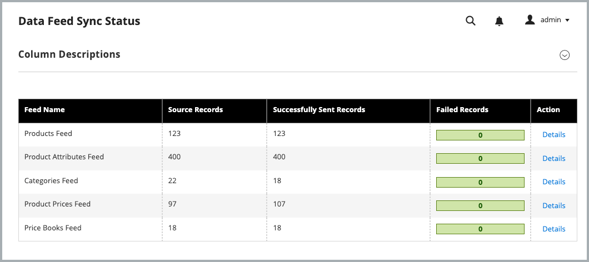

# 시작하기

Commerce Optimizer Connector를 설치하고 구성하여 Adobe Commerce 카탈로그 데이터를 [!DNL Adobe Commerce Optimizer]과(와) 동기화한 다음 데이터 동기화 상태를 모니터링하여 상점이 최신 상태인지 확인하세요.

## 통합 사용 요구 사항

* Adobe Commerce 2.4.7+

   * PHP 8.2, 8.3 또는 8.4
   * Composer 2.x

* 프로비저닝된 샌드박스 인스턴스가 있는 [!DNL Adobe Commerce Optimizer] 라이선스.

* 작성기를 사용하여 Commerce Connector 메타패키지를 다운로드할 수 있는 [인증 키](https://experienceleague.adobe.com/ko/docs/commerce-operations/installation-guide/prerequisites/authentication-keys).

* [Adobe Commerce Optimizer 샌드박스 인스턴스](../optimizer/get-started.md)에 대한 관리자 액세스 권한.

통합을 구성하는 Adobe Commerce 사용자에게는 다음이 있어야 합니다.

* Adobe Commerce 관리자에 대한 관리자 액세스 권한.

* [Adobe Commerce 응용 프로그램 서버에 대한 명령줄 액세스](https://experienceleague.adobe.com/ko/docs/commerce-on-cloud/user-guide/project/user-access).

* [&#x200B; 프로젝트가 프로비저닝된 &#x200B;](https://experienceleague.adobe.com/ko/docs/core-services/interface/administration/organizations?)IMS 조직[!DNL Adobe Commerce Optimizer]에 대한 개발자 액세스 권한.

>[!BEGINSHADEBOX]

## 사전 요구 사항

다음 확장 중 하나가 설치되어 있는 경우 Commerce Optimizer 커넥터를 설치하기 전에 해당 확장을 제거하십시오.

* Adobe Commerce Live Search(`magento/live-search`)
* Adobe Commerce 제품 권장 사항(`magento/product-recommendations`)
* Adobe Commerce 카탈로그 서비스(`magento/catalog-service`, `magento/catalog-service-installer`)
* 데이터 관리 대시보드(`magento-catalog-sync-admin`)

이러한 확장과 연결된 데이터는 여전히 Commerce 데이터베이스에서 사용할 수 있습니다. 그러나 커넥터가 활성화된 경우 [!DNL Adobe Commerce Optimizer]&#x200B;(으)로 내보내지 않습니다. 커넥터를 사용하도록 설정한 후 이러한 확장에서 제공하는 검색 및 머천다이징 기능을 구현하려면 [[!DNL Adobe Commerce Optimizer] 관리 UI](https://experienceleague.adobe.com/ko/docs/commerce/optimizer/overview#quick-tour)에서 구성하십시오.

>[!IMPORTANT]
>
>커넥터를 사용하기 전에 이러한 확장을 제거하지 않으면 커넥터와 기존 확장 모두에서 동일한 데이터를 내보냈기 때문에 구성 화면이 손상되고 [!DNL Adobe Commerce Optimizer]에 데이터가 중복되며, 확장 및 커넥터가 연결된 서비스를 인증하는 방식의 충돌로 인해 로그에 401 또는 403 오류가 표시될 수 있습니다.

>[!ENDSHADEBOX]

## 구성 단계

커넥터를 활성화하고 Commerce의 데이터를 Adobe Commerce Optimizer 인스턴스와 동기화하려면 다음 단계를 따르십시오.

1. 작성기를 사용하여 **[Commerce Optimizer 커넥터 패키지를 설치](#install-the-commerce-optimizer-connector-package)**&#x200B;하여 Commerce 인스턴스를 [!DNL Adobe Commerce Optimizer]에 연결합니다.

1. 관리자의 **[데이터 내보내기 구성을 검토하고 사용자 지정](#customize-the-commerce-data-export-configuration)**&#x200B;합니다.

1. **[Commerce과 Commerce Optimizer 간의 연결을 설정하는 데 필요한 API 자격 증명을 가져옵니다](#get-required-connection-details)**.

1. **[통합을 사용하도록 설정 [!DNL Adobe Commerce Optimizer] 통합](#enable-the-adobe-commerce-optimizer-integration)**.

1. **[데이터 동기화가 작동하는지 확인](#verify-that-the-data-sync-is-working)**.


## Commerce Optimizer 커넥터 패키지 설치

Adobe Commerce Optimizer 커넥터는 [!DNL Adobe Commerce Optimizer]에 대한 활성 라이선스를 가진 모든 Commerce 판매자가 사용할 수 있는 작성기 메타패키지로 제공됩니다.

### 설치 단계

1. 작성기를 사용하여 `adobe-commerce/commerce-data-export-aco-adapter` 모듈 추가:

   ```shell
   composer require adobe-commerce/commerce-data-export-aco-adapter
   ```

1. Adobe Commerce 스테이징 환경에 변경 사항을 배포합니다.

배포가 완료되면 Commerce 관리 메뉴에서 Commerce Optimizer 옵션을 사용할 수 있습니다. Commerce 관리자로부터 직접 Commerce Optimizer 인스턴스를 열려면 **[!UICONTROL Commerce Optimizer]**&#x200B;을(를) 클릭하십시오.

>[!NOTE]
>
>자세한 확장 설치 지침은 다음 안내서를 참조하십시오.
>
>[클라우드 인프라에서 Adobe Commerce에 확장 설치](https://experienceleague.adobe.com/ko/docs/commerce-on-cloud/user-guide/configure-store/extensions)
>
>[Adobe Commerce 온-프레미스에 확장 설치](https://experienceleague.adobe.com/ko/docs/commerce-operations/installation-guide/tutorials/extensions)

### 필수 연결 세부 정보 가져오기

Adobe Developer Console에서 [!DNL Adobe Commerce Optimizer] 수집 서비스에 대해 활성화된 개발자 프로젝트를 만들고 OAuth 서버 간 자격 증명을 생성합니다. 자세한 지침은 [머천다이징 개발자 안내서](https://developer.adobe.com/commerce/services/optimizer/data-ingestion/authentication/#obtain-ims-credentials)의 *IMS 자격 증명 가져오기*&#x200B;를 참조하십시오.

>[!TIP]
>
>Commerce Optimizer 인스턴스와 동일한 IMS 조직에 데이터 수집 API로 구성된 개발자 프로젝트가 이미 있는 경우 기존 OAuth 서버 간 자격 증명을 재사용할 수 있습니다.

자격 증명 페이지에서 다음 값을 저장합니다.

* **조직 ID**(`org_id`)
* **클라이언트 ID**(`client_id`)
* **클라이언트 암호**(`client_secret`)

### [!DNL Adobe Commerce Optimizer] 인스턴스 세부 정보 가져오기

[!DNL Adobe Commerce Optimizer] 인스턴스의 인스턴스 ID(테넌트 ID라고도 함)를 저장합니다. 인스턴스에 액세스하는 데 사용되는 URL에서 찾을 수 있습니다. 예를 들어 `https://experience.adobe.com/#/@<project-id>/in:TToyu73daQRn66KAYaq8YZ/commerce-optimizer-studio/home`에서 인스턴스 ID는 `TToyu73daQRn66KAYaq8YZ`입니다.

## Commerce 데이터 내보내기 구성 사용자 지정

기본적으로 모든 Commerce 범위(웹 사이트 및 스토어 보기)에 대해 카탈로그 데이터 동기화가 활성화됩니다. 비즈니스 요구 사항에 따라 특정 범위의 데이터만 동기화하도록 내보내기 설정을 사용자 지정할 수 있습니다. 예를 들어 여러 스토어 보기가 있지만 이 중 하나에 대한 데이터만 내보내려는 경우 다른 스토어 보기에 대해 내보내기 기능을 비활성화할 수 있습니다.

>[!IMPORTANT]
>
>내보내기 설정을 변경하면 전체 색인 재지정이 트리거되며, 이는 카탈로그 크기에 따라 상당한 시간이 걸릴 수 있습니다. 트래픽이 적은 기간 동안 이러한 변경 사항을 계획하여 성능 영향을 최소화합니다.

### 범위별 데이터 내보내기

다음 표에서는 각 범위 수준에서 내보내는 데이터에 대해 설명합니다.

| 범위 | 데이터 내보냄 | 메모 |
| ------- | --------------- | ------- |
| 웹 사이트 | 가격 및 가격 장부 | 명명 규칙 [을(를) 사용하여 각 가격 집합을 &#x200B;](../optimizer/setup/pricebooks.md)가격 장부`website::customergroupcode`(으)로 내보냅니다. 웹 사이트의 모든 고객 그룹이 포함됩니다. |
| 스토어 보기 | 제품 및 제품 속성 | 각 저장소 보기는 [!DNL Adobe Commerce Optimizer]에 별도의 카탈로그 원본을 만듭니다. |

### 비헤이비어 활성화 및 비활성화

| 액션 | 결과 |
| -------- | -------- |
| 스토어 보기 비활성화 | 카탈로그 원본이 [!DNL Adobe Commerce Optimizer]에 남아 있지만 모든 데이터가 제거되었습니다. |
| 스토어 조회수 비활성화 후 재활성화 | 동일한 카탈로그 소스가 전체 데이터 재동기화로 다시 채워집니다. |

### 내보내기 구성 업데이트

Connector 패키지를 설치하면 이제 관리자의 스토어 그리드에 Commerce Optimizer에 대한 내보내기 구성 설정이 표시됩니다.

{width="600" zoomable="yes"}

**웹 사이트 또는 스토어 보기에 대한 설정을 변경하려면:**

1. Commerce 관리에서 **[!UICONTROL Stores]** > [!UICONTROL Settings] > **[!UICONTROL All Stores]**(으)로 이동합니다.

1. 구성할 웹 사이트 또는 스토어 보기를 선택합니다.

1. **[!DNL Adobe Commerce Optimizer]내보내기 설정**&#x200B;에서 확인란을 사용하여 필요에 따라 데이터 동기화를 활성화하거나 비활성화합니다.

   {width="500" zoomable="yes"}

1. 변경 사항을 저장합니다.

## [!DNL Adobe Commerce Optimizer] 통합 사용

>[!IMPORTANT]
>
>구성 명령을 실행하면 데이터 동기화 처리가 시작됩니다. 기본적으로 모든 Commerce 범위(웹 사이트 및 스토어 보기)에 대해 카탈로그 데이터 동기화가 활성화됩니다. 카탈로그 크기에 따라 데이터 동기화 프로세스는 몇 분에서 몇 시간 정도 걸릴 수 있습니다.

이제 [이전 단계에서 수집한 &#x200B;](#get-required-connection-details)OAuth 서버 간 자격 증명과 인스턴스 세부 정보를 사용하여 Commerce과 [!DNL Adobe Commerce Optimizer] 인스턴스 간의 통합을 구성할 수 있습니다.

1. Commerce 관리자에서 **[!UICONTROL Adobe Commerce Optimizer]**&#x200B;을(를) 선택하여 지침이 포함된 구성 페이지를 표시합니다.

   ![[!DNL Adobe Commerce Optimizer] 구성 페이지](/help/aco-connector/assets/aco-connector-admin-installation.png){width="500" zoomable="yes"}

1. 명령줄에서 [SSH를 사용](https://experienceleague.adobe.com/ko/docs/commerce-on-cloud/user-guide/develop/secure-connections)하여 Commerce 스테이징 환경에 연결합니다.

1. 다음 Commerce CLI 명령을 실행하여 통합을 구성하고 자리 표시자 값을 Commerce Optimizer 프로젝트에 대한 값으로 바꿉니다.

```terminal
bin/magento aco:config:init --org_id=your-org --tenant_id=your-tenant --client_id=your-client-id --client_secret=your-secret
```

1. Commerce 관리자로 돌아가 [!UICONTROL Adobe Commerce Optimizer] 옵션을 선택하여 연결을 확인합니다.

   옵션을 클릭하면 새 탭에서 [!DNL Adobe Commerce Optimizer] UI가 열립니다.

## 데이터 동기화가 작동하는지 확인

통합을 활성화하면 데이터 동기화가 자동으로 시작됩니다. 카탈로그 크기에 따라 초기 동기화는 몇 분에서 몇 시간 정도 걸릴 수 있습니다.
관리자가 사용할 수 있는 [데이터 피드 동기화 상태](https://experienceleague.adobe.com/ko/docs/commerce-admin/systems/data-transfer/data-sync/data-feed-sync-status) 페이지에서 동기화가 작동하는지 모니터링하고 확인할 수 있습니다.

1. **Commerce 관리자의 동기화 상태 확인:**

   **[!UICONTROL System]** > [!UICONTROL Data Transfer] > **[!UICONTROL Data Feed Sync Status]**(으)로 이동합니다.

   {width="500" zoomable="yes"}

   동기화가 실행 중일 때 피드 데이터에 성공적으로 전송된 레코드가 표시됩니다. 세부 정보를 보거나 동기화 문제를 해결하려면 피드를 선택하십시오.

1. **데이터가 Commerce Optimizer에 도착했는지 확인:**

   [!DNL Adobe Commerce Optimizer] 메뉴에서 **[!UICONTROL Data Sync]**&#x200B;을(를) 선택합니다.

   {width="500" zoomable="yes"}

   예상 제품, 가격 및 속성이 표시되는지 확인합니다.

>[!TIP]
>
>데이터 동기화에 문제가 있는 경우 [SaaS 데이터 내보내기](/help/data-export/troubleshooting-logging.md) 설명서의 *문제 해결* 섹션을 참조하십시오.

## 다음 단계

1. **카탈로그 보기 및 정책 [!DNL Adobe Commerce Optimizer]개 구성**

   [!DNL Adobe Commerce Optimizer] UI에 카탈로그 보기 및 정책을 만듭니다. 가격 장부는 Adobe Commerce 고객 그룹에서 자동으로 생성됩니다. 지침은 [Commerce Optimizer 사용 안내서](../optimizer/setup/catalog-view.md)의 [카탈로그 보기](../optimizer/setup/catalog-view.md) 및 *정책* 설명서를 참조하십시오.

1. **Edge Delivery Services에서 Commerce 상점 설정**

   [Storefront 설정 설명서](https://experienceleague.adobe.com/developer/commerce/storefront/setup/?lang=ko)에 따라 Storefront를 [!DNL Adobe Commerce Optimizer] 인스턴스에 연결하고 개인화된 상거래 경험을 제공하기 시작합니다.


