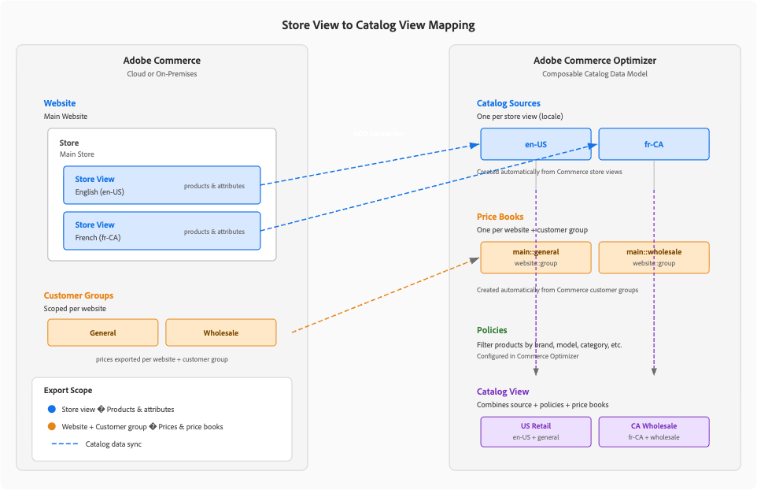

# [!DNL Adobe Commerce Optimizer Connector]

[!DNL Adobe Commerce Optimizer Connector]은(는) [!DNL Adobe Commerce]&#x200B;(클라우드 또는 온-프레미스)와 [!DNL Adobe Commerce Optimizer] 간의 기본 자사 통합입니다. [!DNL Adobe Commerce] 저장소의 카탈로그 및 가격 책정 데이터를 [!DNL Adobe Commerce Optimizer]&#x200B;(으)로 동기화하여 다음과 같은 작업을 수행할 수 있습니다.

- **AI 기반 제품 검색 및 권장 사항 강화**
- **고성능 헤드리스 상점** 실행([!DNL Edge Delivery Services]에서 제공하는 Commerce 상점 포함)
- 한 곳에서 **이전 및 이후**&#x200B;개의 KPI와 데이터 동기화 상태 분석

[!DNL Adobe Commerce]은(는) 제품, 가격 및 카탈로그 구조에 대한 기록 시스템으로 남아 있습니다. [!DNL Adobe Commerce Optimizer]은(는) 귀하의 경험 및 머천다이징 계층이 되어 연결된 모든 상점 또는 채널에 신속하고 적절한 결과를 제공합니다.

## 주요 이점 {#key-benefits}

| 이익 | 어떤 의미입니까? |
| --- | --- |
| **빌드할 사용자 지정 커넥터가 없습니다** | 맞춤형 피드 및 스크립트를 작성 및 유지 관리하는 대신 지원되는 자사 통합을 사용하십시오. |
| [!DNL Adobe Commerce Optimizer]**을(를) 사용하여 값을 계산하는 데 걸리는 시간** | 기존 [!DNL Adobe Commerce] 배포 위에 AI 검색, 권장 사항 및 Headless 상점 전면을 켭니다. |
| **Commerce 범위와 일치함** | 웹 사이트, 스토어 보기 및 고객 그룹을 [!DNL Adobe Commerce Optimizer]개의 카탈로그 구문(카탈로그 원본 및 가격 책)에 자동으로 매핑합니다. |
| **작동 가시성** | 전용 [!UICONTROL Data Feed Sync Status] 보기에서 피드 상태, 마지막 동기화 시간 및 SKU당 상태를 모니터링합니다. |
| **SaaS를 위한 향후 준비 경로** | 다시 플랫폼을 구성하지 않고 클라우드 또는 온-프레미스의 Commerce에서 [!DNL Adobe Commerce as a Cloud Service] + [!DNL Adobe Commerce Optimizer]&#x200B;(으)로의 단계별 마이그레이션 경로를 제공합니다. |

## 커넥터 아키텍처 {#connector-architecture}

다음 다이어그램은 [!DNL Adobe Commerce]부터 [!DNL Adobe Commerce Optimizer]까지 그리고 상점 및 체크아웃 시스템까지 커넥터에 대한 엔드 투 엔드 아키텍처를 보여 줍니다.

{width="700" zoomable="yes"}

이 아키텍처에서는

- [!DNL Adobe Commerce]&#x200B;(클라우드 또는 온프레미스)은 레코드 및 피드 제작자 시스템입니다.
- 커넥터가 카탈로그, 가격 및 범주 피드를 내보냅니다.
- [!DNL Adobe Commerce Optimizer]에서 피드 데이터를 수집하여 카탈로그 원본, 가격 장부 및 카탈로그 보기로 정규화합니다.
- 상점([!DNL Edge Delivery Services]의 Commerce 상점 또는 사용자 지정 Headless 빌드)에서 검색 및 권장 사항을 위해 [!DNL Adobe Commerce Optimizer] GraphQL API를 호출하고 장바구니 및 체크아웃 작업을 위해 [!DNL Adobe Commerce] 또는 연결된 다른 타사 플랫폼을 호출합니다.

[[!DNL SaaS Data Export]](/help/data-export/overview.md)을(를) 기반으로 빌드된 커넥터는 수집된 피드를 [!DNL Catalog Data Ingestion API] 형식으로 매핑하고 인증 및 제출을 처리합니다. 동기화 동작, 범위 제어 및 오류 처리에 대해서는 [커넥터 동기화 파이프라인](/help/aco-connector/connector-sync-pipeline.md)을 참조하십시오.

## 커넥터가 [!DNL Adobe Commerce]에서 작동하는 방식 {#how-the-connector-works-with-adobe-commerce}

[!DNL Adobe Commerce Optimizer Connector]은(는) 기존 Commerce 범위(웹 사이트 및 스토어 보기) 및 고객 세분화를 사용하여 [!DNL Adobe Commerce Optimizer] 카탈로그 모델을 채우는 방식으로 작동합니다.

{width="750" zoomable="yes"}

- **카탈로그 원본→ 저장소 보기** — 각 저장소 보기는 [!DNL Adobe Commerce Optimizer]에서 별도의 카탈로그 Source이 됩니다. 해당 소스에는 현지화된 제품 속성 및 스토어-뷰별 데이터가 포함됩니다
- **웹 사이트 → 가격 장부** — 각 [!DNL Adobe Commerce] 웹 사이트가 [!DNL Adobe Commerce Optimizer]에 있는 하나 이상의 가격 장부에 매핑됩니다. 가격 장부 및 가격 입력사항으로 웹 사이트 가격 책정 및 고객 그룹 가격 책정 내보내기
- **고객 그룹 → 가격 변동** — [!DNL Adobe Commerce] 고객 그룹 가격이 관련 가격 장부에 추가 항목으로 나타납니다.

[!DNL Adobe Commerce Optimizer]에서 데이터를 수집한 후 다음을 구성할 수 있습니다.

- [!DNL Adobe Commerce Optimizer] Studio의 **카탈로그 보기 및 정책**(지역별, 브랜드 또는 고객별 하위 집합 작성)
- **제품 검색**(검색, 패싯, 머천다이징 규칙)
- **[!DNL Product Recommendations]**

커넥터를 사용하면 [!DNL Adobe Commerce] 인스턴스는 카탈로그 및 가격 데이터의 기록 시스템으로 유지됩니다. [!DNL Adobe Commerce]에서 데이터를 업데이트하면 커넥터가 해당 업데이트를 [!DNL Adobe Commerce Optimizer] 인스턴스와 동기화합니다.

>[!NOTE]
>
>[!DNL Adobe Commerce Optimizer] 구성에 대한 자세한 내용은 [[!DNL Adobe Commerce Optimizer] 머천다이징 도구](/help/optimizer/overview.md#quick-tour)를 참조하십시오.

## 일반 워크플로우 {#typical-workflows}

이 워크플로에서는 팀이 [!DNL Adobe Commerce Optimizer Connector]을(를) 설정하고 사용하는 방법을 설명합니다. 통합을 설정하고 이러한 워크플로를 활성화하는 방법에 대한 자세한 내용은 [시작하기](/help/aco-connector/get-started.md)를 참조하십시오.

### 초기 설정 및 구성 {#initial-setup}

_시작_ 안내서에서 [구성 단계](/help/aco-connector/get-started.md#configuration-steps)를 참조하십시오.

### 지속적인 데이터 동기화 {#ongoing-sync}

초기 구성 후 커넥터는 다음을 지원합니다.

- 초기 마이그레이션 또는 대규모 구조적 변경에 대한 **전체 카탈로그 동기화**
- 제품 또는 가격이 변경될 때 지속적인 업데이트에 대한 **델타 동기화**
- 타깃팅된 피드에 대해 **명령 재동기화**

자동 동기화 동작, cron 일정 및 오류 처리에 대해서는 [커넥터 동기화 파이프라인](/help/aco-connector/connector-sync-pipeline.md)을 참조하십시오. 전체 카탈로그 동기화 또는 대규모 업데이트 전에 [데이터 볼륨 및 동기화 시간 예상](/help/aco-connector/reference/estimate-data-volume-sync-time.md)을 사용하여 타이밍을 계획하고 사이트 중단을 방지하십시오.

[!DNL Adobe Commerce Optimizer Connector]에 다음 피드를 사용할 수 있습니다.

- `products` - 제품 데이터
- `productAttributes` - 제품 특성에 대한 메타데이터
- `priceBooks` - 가격 장부
- `prices` - 제품 가격
- `categories` - 범주 데이터

자세한 내용은 다음 주제를 참조하십시오.

- 카탈로그 데이터 동기화를 확인하고 커넥터 피드를 수동으로 다시 동기화합니다. [동기화 관리](/help/aco-connector/data-sync-manage.md)
- [!DNL Adobe Commerce] CLI 재동기화 작업의 경우 [Commerce CLI를 사용하여 피드 동기화](/help/data-export/data-export-cli-commands.md)를 참조하십시오.
- [[!DNL Adobe Commerce Optimizer Connector]개의 모듈 및 피드 끝점](/help/aco-connector/reference/connector-reference.md)
- [커넥터 피드에 대한 필드 매핑](/help/aco-connector/reference/field-mapping.md)

### 머천다이징 및 상점 전선 구성 {#merchandising-storefronts}

[!DNL Adobe Commerce Optimizer]에서 [!DNL Adobe Commerce]개의 데이터를 사용할 수 있게 되면 [[!DNL Adobe Commerce Optimizer] Studio](/help/optimizer/overview.md#quick-tour)을(를) 사용하여 머천다이징 및 상점 경험을 동기화된 카탈로그에 연결합니다. 일반적인 다음 단계는 다음과 같습니다.

- **카탈로그 보기 및 정책** - [!UICONTROL Store setup] 메뉴에서 지역, 브랜드 또는 고객별 하위 집합 및 액세스 규칙을 정의합니다.
- **제품 검색 및 권장 사항** - [!UICONTROL Merchandising] 메뉴에서 검색, 패싯, 머천다이징 규칙, 동의어 및 권장 사항 단위를 구성합니다. 검색 및 권장 사항 동작은 [!DNL Adobe Commerce Optimizer]에서 관리됩니다. [!DNL Adobe Commerce] 관리자의 [!DNL Live Search] 및 [!DNL Product Recommendations] 설정은 더 이상 이러한 흐름에 적용되지 않습니다
- **상점 연결** — 올바른 [!DNL Adobe Commerce Optimizer] 테넌트, 카탈로그 보기 및 머천다이징 API 끝점에서 [!DNL Edge Delivery Services] 또는 타사 Headless 빌드의 Commerce 상점 전면을 가리킵니다. 사용자 지정 Headless 통합에 대해서는 [Headless 상점 통합](/help/aco-connector/headless-storefront.md)을 참조하십시오. 타사 통합의 예를 보려면 [Salesforce Commerce 커넥터 for [!DNL Adobe Commerce Optimizer]](/help/optimizer/developer/salesforce-connector.md)를 참조하십시오.
- **체크아웃** — 장바구니, 체크아웃, 주문 관리 및 고객 계정을 [!DNL Adobe Commerce] 또는 연결된 타사 플랫폼에 보관합니다. 필요한 경우 장바구니 핸드오프에 [!DNL App Builder] 및 [!DNL API Mesh] 사용

단계별 구성 지침은 [시작하기](/help/aco-connector/get-started.md) 및 [[!DNL Adobe Commerce Optimizer] 머천다이징 도구](/help/optimizer/overview.md#quick-tour)를 참조하십시오.

## 지원되는 시나리오 {#supported-scenarios}

이 커넥터는 [!DNL Adobe Commerce]이(가) 클라우드 및 온-프레미스 배포에 있고 백엔드를 다시 빌드하지 않고 [!DNL Adobe Commerce Optimizer]을(를) 채택하려는 B2C 가맹점을 위해 설계되었습니다.

**일반적인 사용 사례:**

- Edge Delivery으로 **Storefront 마이그레이션**
기존 [!DNL Adobe Commerce] 백엔드를 유지하고 PLP/Search/PDP를 [!DNL Adobe Commerce Optimizer]에서 제공하는 [!DNL Edge Delivery Services] 상점으로 이동합니다.

- **카탈로그 및 검색 성능 크기 조정**
[!DNL Adobe Commerce]에서 제품 및 가격 소유권을 유지하면서 대량 카탈로그 색인 지정 및 검색을 [!DNL Adobe Commerce Optimizer]의 SaaS 서비스로 오프로드합니다.

- **증분 SaaS 채택**
호환 가능한 [!DNL Adobe Commerce] 카탈로그와 함께 커넥터를 [!DNL Adobe Commerce as a Cloud Service] + [!DNL Adobe Commerce Optimizer]을(를) 위한 디딤돌로 사용하십시오.

## 책임 및 구현 사전 요구 사항 {#responsibilities-prerequisites}

[!DNL Adobe Commerce]은(는) 제품, 가격 및 고객 그룹에 대한 신뢰할 수 있는 소스입니다. [!DNL Adobe Commerce]을(를) 변경하면 커넥터가 이를 [!DNL Adobe Commerce Optimizer]에 동기화합니다.

**[!DNL Adobe Commerce Optimizer]은(는)**&#x200B;에 대한 책임이 있습니다.

- 카탈로그 모델링(카탈로그 소스, 가격 장부, 카탈로그 뷰, 정책)
- 제품 검색 및 권장 사항
- Storefront 지표, 데이터 동기화 대시보드 및 성공 지표 보고서

**커넥터가 없습니다.**

- [!DNL Adobe Commerce] 장바구니, 체크아웃 또는 주문 흐름 수정
- Storefront 프로젝트 자동 프로비저닝(Commerce Storefront / [!DNL Edge Delivery Services]개 도구 핸들)

**시작하기 전:**

- [!DNL Adobe Commerce]이(가) 최소 버전 및 [!DNL Adobe Commerce Optimizer Connector] 요구 사항을 충족하는지 확인하십시오. 자세한 내용은 [시작하기](/help/aco-connector/get-started.md#requirements-to-use-the-integration)를 참조하십시오.
- IMS 조직 액세스 권한, [!DNL Adobe Commerce Optimizer] 인스턴스, 필요한 자격 증명과 지역 세부 정보가 있는지 확인하십시오.

>[!MORELIKETHIS]
>
> - [시작하기 [!DNL Adobe Commerce Optimizer Connector]](/help/aco-connector/get-started.md) - 통합을 설정하고 주요 워크플로를 사용하도록 설정합니다.
> - [커넥터 동기화 파이프라인](/help/aco-connector/connector-sync-pipeline.md) - 동기화 메커니즘, 초기화 및 오류 처리를 이해합니다.
> - [동기화 관리](/help/aco-connector/data-sync-manage.md) — 카탈로그 데이터 동기화를 확인하고 피드를 수동으로 다시 동기화하십시오.
> - [커넥터 피드에 대한 필드 매핑](/help/aco-connector/reference/field-mapping.md) - 모든 피드에 대한 필드 수준의 데이터 매핑을 검토합니다.
> - [시나리오 문제 해결](/help/aco-connector/troubleshooting/troubleshooting-scenarios.md) - 잘못된 구성 또는 예기치 않은 동기화 결과를 해결합니다.
> - [릴리스 정보](/help/aco-connector/release-notes.md) - 커넥터 업데이트 및 알려진 문제를 검토합니다.
