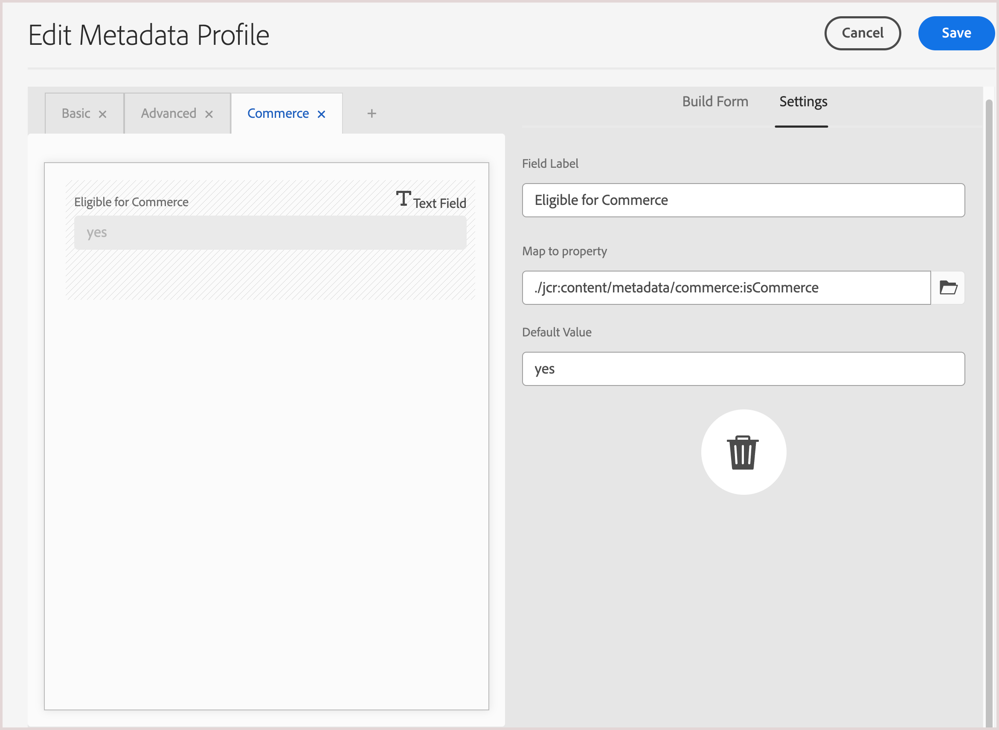

# Commerce 메타데이터를 지원하도록 AEM Assets 프로젝트 구성

AEM Assets에서 Commerce 에셋 파일을 관리하려면 다음 단계를 완료하여 AEM 작성 환경에서 Commerce 에셋을 관리하는 데 필요한 자산 코드 및 메타데이터로 AEM Assets 프로젝트를 구성합니다.

* **1단계:** 표준 코드가 있는 AEM 프로젝트 템플릿을 설치하여 Commerce 네임스페이스 및 메타데이터 스키마 리소스를 Experience Manager Assets as a Cloud Service 환경 구성에 추가합니다.
* **2단계:** Commerce 자산 파일에 적용할 메타데이터 프로필을 설정합니다

## AEM 프로젝트에 상용구 코드 추가

Adobe은 AEM as a Cloud Service 환경 구성에 Commerce 네임스페이스 및 메타데이터 스키마 리소스를 추가하기 위해 Experience Manager Assets Commerce 보일러 플레이트 `assets-commerce`을(를) 제공합니다. 이 코드를 **Maven** 패키지로 환경에 배포합니다. 그런 다음 AEM Assets 작성 환경에서 Commerce 메타데이터를 구성하여 설정을 완료합니다.

보일러판은 AEM Assets 작성 환경에 다음 리소스를 추가합니다.

* Commerce 관련 속성을 식별하기 위한 [사용자 지정 네임스페이스](https://github.com/ankumalh/assets-commerce/blob/main/ui.config/jcr_root/apps/commerce/config/org.apache.sling.jcr.repoinit.RepositoryInitializer~commerce-namespaces.cfg.json), `Commerce`입니다.

   * Adobe Commerce 프로젝트와 연결된 Commerce 자산에 태그를 지정하는 레이블이 `commerce:isCommerce`인 사용자 지정 메타데이터 형식 `Eligible for Commerce`입니다.

   * `commerce:skus` 속성을 추가할 사용자 지정 메타데이터 형식 **[!UICONTROL Product Data]** 및 해당 UI 구성 요소입니다. 제품 데이터에는 Commerce 에셋을 제품 SKU와 연결하는 메타데이터 속성이 포함됩니다.

     {width="600" zoomable="yes"}

   * Commerce에서 자산이 시각화되는 방식을 보여 주는 사용자 지정 메타데이터 형식 `commerce:roles` 및 `commerce:positions` 특성입니다.

* Commerce 자산에 태그를 지정할 `Eligible for Commerce` 및 `Product Data` 필드가 포함된 Commerce 탭이 있는 메타데이터 스키마 양식입니다. 이 양식은 AEM Assets UI에서 `roles` 및 `position` 필드를 표시하거나 숨기는 옵션도 제공합니다.

  AEM Assets 메타데이터 스키마 양식에 대한 {width="600" zoomable="yes"}

* 초기 에셋 동기화를 지원하기 위해 [샘플 Commerce 에셋이 태그되고 승인되었습니다](https://github.com/ankumalh/assets-commerce/blob/main/ui.content/src/main/content/jcr_root/content/dam/wknd/en/activities/hiking/equipment_6.jpg/.content.xml) `equipment_6.jpg`. 승인된 Commerce 자산만 AEM Assets에서 Adobe Commerce으로 동기화할 수 있습니다.

>[!NOTE]
>
> [AEM Commerce boilerplate](https://github.com/ankumalh/assets-commerce)에 대한 자세한 내용은 **readme** 페이지를 참조하십시오.

### 사전 요구 사항

`commerce-assets` 패키지를 AEM Assets as a Cloud Service AEM 환경에 배포하려면 다음 리소스와 권한이 필요합니다.

* 프로그램 및 배포 관리자 역할을 사용하여 [AEM Assets Cloud Manager 프로그램 및 환경에 액세스](https://experienceleague.adobe.com/en/docs/experience-manager-cloud-service/content/onboarding/journey/cloud-manager#access-sysadmin-bo).

* [로컬 AEM 개발 환경](https://experienceleague.adobe.com/en/docs/experience-manager-learn/cloud-service/local-development-environment-set-up/overview) 및 AEM 로컬 개발 프로세스에 익숙합니다.

* [AEM 프로젝트 구조](https://experienceleague.adobe.com/ko/docs/experience-manager-cloud-service/content/implementing/developing/aem-project-content-package-structure) 및 Cloud Manager을 사용하여 사용자 지정 콘텐츠 패키지를 배포하는 방법을 이해합니다.

### `commerce-assets` 패키지 설치

1. 필요한 경우 AEM Cloud Manager에서 AEM Assets 프로젝트에 대한 프로덕션 및 스테이징 환경을 만듭니다.

1. 필요한 경우 배포 파이프라인을 구성합니다.

1. GitHub에서 [AEM Commerce 상용구](https://github.com/ankumalh/assets-commerce)에서 코드를 다운로드합니다.

1. [로컬 AEM 개발 환경](https://experienceleague.adobe.com/en/docs/experience-manager-learn/cloud-service/local-development-environment-set-up/overview)에서 사용자 지정 코드를 AEM Assets 환경 구성에 Maven 패키지로 설치하거나 코드를 기존 프로젝트 구성에 수동으로 복사합니다.

1. 변경 사항을 커밋하고 로컬 개발 분기를 Cloud Manager Git 저장소로 푸시합니다.

1. AEM Cloud Manager에서 [코드를 배포하여 AEM 환경을 업데이트합니다](https://experienceleague.adobe.com/en/docs/experience-manager-cloud-service/content/implementing/using-cloud-manager/deploy-code#deploying-code-with-cloud-manager).

## 선택 사항입니다. 메타데이터 프로필 구성

AEM Assets 작성 환경에서 메타데이터 프로필을 만들어 Commerce 에셋 메타데이터에 대한 기본값을 설정합니다. 그런 다음 AEM 자산 폴더에 새 프로필을 적용하여 이러한 기본값을 자동으로 사용합니다. 이 구성은 수동 단계를 줄여 자산 처리를 간소화합니다.

메타데이터 프로필을 구성할 때는 다음 구성 요소만 구성해야 합니다.

* Commerce 탭을 추가합니다. 이 탭에서는 템플릿에서 추가한 Commerce 관련 구성 설정을 사용할 수 있습니다
* Commerce 탭에 `Eligible for Commerce` 필드를 추가합니다.

제품 데이터 UI 구성 요소는 템플릿을 기반으로 자동으로 추가됩니다.

### 메타데이터 프로필 정의

1. Adobe Experience Manager 작성자 환경에 로그인합니다.

1. Adobe Experience Manager 작업 영역에서 Adobe Experience Manager 아이콘을 클릭하여 AEM Assets용 작성자 컨텐츠 관리 작업 영역으로 이동합니다.

   {width="600" zoomable="yes"}

1. 망치 아이콘을 선택하여 관리자 도구를 엽니다.

   {width="600" zoomable="yes"}

1. **[!UICONTROL Metadata Profiles]**&#x200B;을(를) 클릭하여 프로필 구성 페이지를 엽니다.

1. Commerce 통합을 위한 메타데이터 프로필을 **[!UICONTROL Create]**&#x200B;합니다.

   {width="600" zoomable="yes"}

1. Commerce 메타데이터에 대한 탭을 추가합니다.

   1. 왼쪽에서 **[!UICONTROL Settings]**&#x200B;을(를) 클릭합니다.

   1. 탭 섹션에서 **[!UICONTROL +]**&#x200B;을(를) 클릭한 다음 **[!UICONTROL Tab Name]**, `Commerce`을(를) 지정합니다.

1. 양식에 `Eligible for Commerce` 필드를 추가합니다.

   {width="600" zoomable="yes"}

   * **[!UICONTROL Build form]**&#x200B;을(를) 클릭합니다.

   * `Single Line text` 필드를 양식으로 끕니다.

   * `Eligible for Commerce`을(를) 클릭하여 레이블에 대한 **[!UICONTROL Field Label]** 텍스트를 추가합니다.

   * 설정 탭에서 레이블 텍스트를 **필드 레이블**&#x200B;에 추가합니다.

   * 자리 표시자 텍스트를 `yes`(으)로 설정하십시오.

   * **[!UICONTROL Map to Property]** 필드에서 다음 값을 복사하여 붙여 넣습니다.

     ```terminal
     ./jcr:content/metadata/commerce:isCommerce
     ```

1. 선택 사항입니다. 승인된 Commerce 자산이 AEM Assets 환경에 업로드될 때 자동으로 동기화하려면 _[!UICONTROL Review Status]_탭의 `Basic` 필드에 대한 기본값을 `approved`(으)로 설정합니다.

1. 업데이트를 저장합니다.

#### Commerce 에셋 소스 폴더에 메타데이터 프로필 적용

1. [!UICONTROL  Metadata Profiles] 페이지에서 Commerce 통합 프로필을 선택합니다.

1. 작업 메뉴에서 **[!UICONTROL Apply Metadata Profiles to Folders]**&#x200B;을(를) 선택합니다.

1. Commerce 자산이 포함된 폴더를 선택합니다.

   Commerce 폴더가 없는 경우 만듭니다.

1. **[!UICONTROL Apply]**&#x200B;을(를) 클릭합니다.

## 다음 단계

[!BADGE Paa만]{type=Informative tooltip="Adobe Commerce on Cloud 프로젝트에만 적용됩니다(Adobe 관리 PaaS 인프라)."} [Adobe Commerce 패키지 설치](configure-commerce.md)

**Commerce Storefront 구성**—Edge Delivery Services에서 제공하는 Commerce Storefront와 함께 AEM Assets을 사용하려면 [EDS AEM Assets 구성](https://experienceleague.adobe.com/developer/commerce/storefront/setup/configuration/aem-assets-configuration/) 주제에 설명된 storefront 구성을 완료하십시오.
