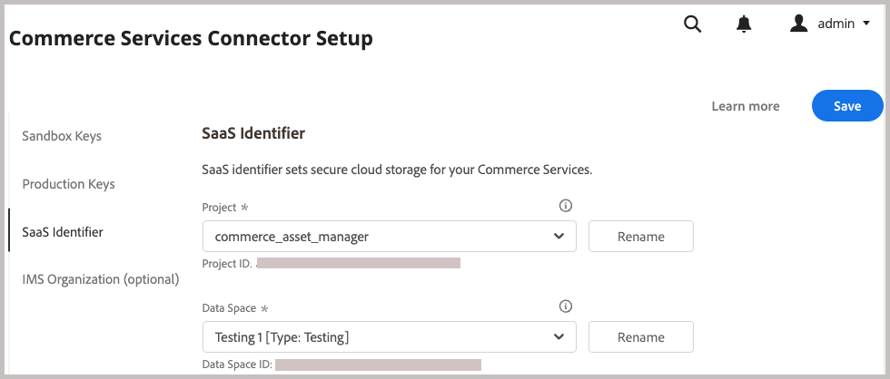
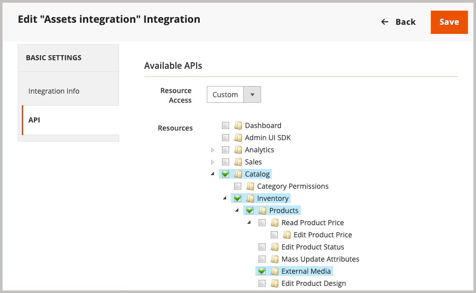

# Adobe Commerce 패키지 설치

이 Commerce 통합을 통해 Adobe Commerce과 Adobe Experience Manager Assets(AEM Assets) 간에 에셋을 동기화할 수 있습니다. 확장은 두 플랫폼 모두에서 제품 이미지, 비디오 및 기타 미디어 에셋을 관리하는 도구 및 서비스 세트를 제공합니다.

`aem-assets-integration` PHP 확장을 설치하여 Commerce 환경에 이 확장을 추가합니다. 또한 Commerce용 Adobe I/O Events을 활성화하고 Adobe Commerce과 Adobe Experience Manager Assets 간의 통신 및 워크플로에 필요한 자격 증명을 생성해야 합니다.

**액세스 요구 사항**

AEM Assets과 Commerce 통합을 활성화하려면 다음 역할과 권한이 필요합니다.

- [Commerce 클라우드 프로젝트 관리자](https://experienceleague.adobe.com/ko/docs/commerce-cloud-service/user-guide/project/user-access) - 필요한 확장을 설치하고 관리자 또는 명령줄에서 Commerce 응용 프로그램 서버를 구성합니다.

   - 확장을 설치하려면 [repo.magento.com](https://repo.magento.com/admin/dashboard)에 액세스하십시오.

     키를 생성하고 필요한 권한을 얻으려면 [인증 키 가져오기](https://experienceleague.adobe.com/ko/docs/commerce-operations/installation-guide/prerequisites/authentication-keys)를 참조하십시오. 클라우드 설치의 경우 [클라우드 인프라의 Commerce 안내서](https://experienceleague.adobe.com/ko/docs/commerce-cloud-service/user-guide/develop/authentication-keys)를 참조하십시오.

- [Commerce 관리자](https://experienceleague.adobe.com/ko/docs/commerce-admin/start/guide-overview) - 저장소 구성을 업데이트하고 Commerce 사용자 계정을 관리합니다.

>[!TIP]
>
> Adobe Commerce은 [Adobe IMS 인증](https://experienceleague.adobe.com/ko/docs/commerce-admin/start/admin/ims/adobe-ims-config)을 사용하도록 구성할 수 있습니다.

## 설치 및 구성 워크플로

Adobe Commerce 패키지를 설치하고 다음 작업을 완료하여 Commerce 환경을 준비합니다.

1. [Commerce용 AEM Assets 통합 확장 설치(`aem-assets-integration`)](#install-the-aem-assets-integration-extension).

1. [Commerce 서비스 커넥터를 구성](#configure-the-commerce-services-connector)하여 Adobe Commerce 인스턴스와 Adobe Commerce 및 AEM Assets 간에 데이터를 전송할 수 있는 서비스에 연결합니다.

1. [Commerce용 Adobe I/O Events 구성](#configure-adobe-io-events-for-commerce)

1. [API 액세스에 대한 인증 자격 증명 가져오기](#get-authentication-credentials-for-api-access)

## `aem-assets-integration` 확장 설치

Adobe Commerce 2.4.5 이상 버전의 Adobe Commerce 인스턴스에 최신 버전의 AEM Assets 통합 확장(`aem-assets-integration`)을 설치합니다. 확장은 [repo.magento.com](https://repo.magento.com/admin/dashboard) 리포지토리에서 작성기 메타패키지로 전달됩니다.

>[!BEGINTABS]

>[!TAB 클라우드 인프라]

이 메서드를 사용하여 Commerce Cloud 인스턴스에 [!DNL AEM Assets Integration] 확장을 설치합니다.

1. 로컬 워크스테이션에서 Adobe Commerce on cloud infrastructure 프로젝트의 프로젝트 디렉터리로 변경합니다.

   >[!NOTE]
   >
   >Commerce 프로젝트 환경을 로컬로 관리하는 방법에 대한 자세한 내용은 [Adobe Commerce on Cloud Infrastructure 사용 안내서](https://experienceleague.adobe.com/ko/docs/commerce-cloud-service/user-guide/develop/cli-branches)의 _CLI로 분기 관리_&#x200B;를 참조하십시오.

1. Adobe Commerce Cloud CLI를 사용하여 업데이트할 환경 분기를 확인하십시오.

   ```shell
   magento-cloud environment:checkout <environment-id>
   ```

1. Commerce용 AEM Assets 통합 확장 추가.

   ```shell
   composer require "magento/aem-assets-integration" "<version-tbd>" --no-update
   ```

1. 패키지 종속성을 업데이트합니다.

   ```shell
   composer update "magento/aem-assets-integration"
   ```

1. `composer.json` 및 `composer.lock` 파일에 대한 코드 변경 내용을 커밋하고 푸시합니다.

1. `composer.json` 및 `composer.lock` 파일에 대한 코드 변경 내용을 클라우드 환경에 추가, 커밋 및 푸시합니다.

   ```shell
   git add -A
   git commit -m "Install AEM Assets Integration extension for Adobe Commerce"
   git push origin <branch-name>
   ```

   업데이트를 푸시하면 [Commerce 클라우드 배포 프로세스](https://experienceleague.adobe.com/ko/docs/commerce-cloud-service/user-guide/develop/deploy/process)가 시작되어 변경 내용을 적용합니다. [배포 로그](https://experienceleague.adobe.com/ko/docs/commerce-cloud-service/user-guide/develop/test/log-locations#deploy-log)에서 배포 상태를 확인하십시오.

>[!TAB 온-프레미스]

이 메서드를 사용하여 온-프레미스 인스턴스에 대한 [!DNL AEM Assets Integration] 확장을 설치합니다.

1. 작성기를 사용하여 Commerce용 AEM Assets 통합 확장 기능을 프로젝트에 추가합니다.

   ```shell
   composer require "magento/aem-assets-integration" --no-update
   ```

1. 종속성을 업데이트하고 확장을 설치합니다.

   ```shell
   composer update  "magento/aem-assets-integration"
   ```

1. Adobe Commerce 업그레이드:

   ```shell
   bin/magento setup:upgrade
   ```

1. 캐시를 지웁니다.

   ```shell
   bin/magento cache:clean
   ```

>[!TIP]
>
>프로덕션에 배포 시 시간을 절약하기 위해 컴파일된 코드를 지우지 않는 것이 좋습니다. 변경하기 전에 항상 시스템을 백업하십시오.

>[!ENDTABS]

## Commerce 서비스 커넥터 구성

>[!NOTE]
>
>Commerce 서비스 커넥터 설정은 [Adobe Commerce SaaS 서비스](https://experienceleague.adobe.com/ko/docs/commerce/user-guides/integration-services/saas#availableservices)를 사용하는 데 필요한 일회성 프로세스입니다. 다른 서비스에 대한 커넥터를 이미 구성한 경우 **[!UICONTROL Systems]** > [!UICONTROL Services] > **[!UICONTROL Commerce Services Connector]**&#x200B;을(를) 선택하여 Commerce 관리에서 기존 구성을 볼 수 있습니다.

Adobe Commerce 인스턴스와 AEM Assets 통합을 사용하는 서비스 간에 데이터를 전송하려면 관리자로부터 Commerce 서비스 커넥터를 구성하십시오(**[!UICONTROL System]** > [!UICONTROL Services] > **[!UICONTROL Commerce Services Connector]**).

AEM Assets 통합을 위한 {width="600" zoomable="yes"}

구성에 다음 값을 제공합니다

- 인증을 위한 프로덕션 및 샌드박스 API 키
- 보안 클라우드 스토리지를 위한 데이터 공간 이름(SaaS 식별자)
- Commerce 및 AEM Assets 환경이 프로비저닝된 IMS 조직 ID

자세한 지침은 [Commerce 서비스 커넥터 구성 비디오](https://experienceleague.adobe.com/ko/docs/commerce-learn/tutorials/admin/adobe-commerce-services/configure-adobe-commerce-services-connector#configuration-faqs)를 시청하십시오. [Commerce 서비스 커넥터](../../landing/saas.md#organizationid) 설명서를 참조하십시오.

구성을 저장하면 시스템에서 환경에 대한 SaaS 프로젝트 및 데이터베이스 ID를 생성합니다. Adobe Commerce과 AEM Assets 간에 에셋 동기화를 활성화하는 데 이러한 값이 필요합니다.

## Commerce용 Adobe I/O Events 구성

AEM Assets 통합은 Adobe I/O Events 서비스를 사용하여 Commerce 인스턴스와 Experience Cloud 간에 사용자 지정 이벤트 데이터를 보냅니다. 이벤트 데이터는 AEM Assets 통합을 위한 워크플로를 조정하는 데 사용됩니다.

Adobe I/O Events을 구성하기 전에 Commerce 프로젝트에 대한 RabbitMQ 및 cron 작업 구성을 확인하십시오.

- RabbitMQ가 활성화되어 있고 이벤트를 수신하는지 확인합니다.
   - [Adobe Commerce 온-프레미스에 대한 RabbitMQ 설정](https://experienceleague.adobe.com/ko/docs/commerce-cloud-service/user-guide/configure/service/rabbitmq)
   - [클라우드 인프라에서 Adobe Commerce에 대한 RabbitMQ 설정](https://experienceleague.adobe.com/ko/docs/commerce-cloud-service/user-guide/configure/service/rabbitmq)
   - [cron 작업이 활성화되었는지 확인](https://developer.adobe.com/commerce/extensibility/events/configure-commerce/#check-cron-and-message-queue-configuration). AEM Assets 통합을 위한 통신 및 워크플로에 Cron 작업이 필요합니다.

>[!NOTE]
>
> Commerce 버전 2.4.5의 프로젝트의 경우 [Adobe I/O 모듈을 설치](https://developer.adobe.com/commerce/extensibility/events/installation/#install-adobe-io-modules-on-commerce)해야 합니다. Commerce 버전 2.4.6 이상에서는 이러한 모듈이 자동으로 로드됩니다. Commerce용 AEM Assets 통합의 경우 모듈만 설치하면 됩니다. App Builder 설정은 필요하지 않습니다.


### Commerce 이벤트 프레임워크 활성화

Commerce 관리에서 이벤트 프레임워크를 활성화합니다.

>[!NOTE]
>
>App Builder 설정은 사용자 지정 일치 전략을 사용하여 Commerce과 AEM Assets 간에 자산을 동기화하려는 경우에만 필요합니다.

1. 책임자에서 **[!UICONTROL Stores]** > [!UICONTROL Settings] > **[!UICONTROL Configuration]** > **[!UICONTROL Adobe Services]** > **Adobe I/O Events**(으)로 이동합니다.

1. **[!UICONTROL Commerce events]** 확장.

1. **[!UICONTROL Enabled]**&#x200B;을(를) `Yes`(으)로 설정합니다.

   {width="600" zoomable="yes"}

1. **[!UICONTROL Merchant ID]**&#x200B;에 판매자 회사 이름을 입력하고 **[!UICONTROL Environment ID]** 필드에 환경 이름을 입력하십시오. 이러한 값을 설정할 때는 영숫자와 밑줄만 사용하십시오.

>[!BEGINSHADEBOX]

**차단 요청에 대한 사용자 지정 VCL 구성**

사용자 지정 VCL 코드 조각을 사용하여 알 수 없는 들어오는 요청을 차단하는 경우 Commerce 서비스용 AEM Assets 통합에서 들어오는 연결을 허용하도록 HTTP 헤더 `X-Ims-Org-Idheader`을(를) 포함해야 할 수 있습니다.

>[!TIP]
>
> Fastly CDN 모듈을 사용하여 차단하려는 IP 주소 목록과 함께 Edge ACL을 만들 수 있습니다.

다음 사용자 지정 VCL 코드 조각 코드(JSON 형식)는 `X-Ims-Org-Id` 요청 헤더가 있는 예를 보여 줍니다.

```json
{
  "name": "blockbyuseragent",
  "dynamic": "0",
  "type": "recv",
  "priority": "5",
  "content": "if ( req.http.X-ims-org ~ \"<YOUR-IMS-ORG>\" ) {error 405 \"Not allowed\";}"
}
```

이 예제를 기반으로 코드 조각을 만들기 전에 값을 검토하여 변경해야 하는지 여부를 결정합니다.

- `name`: VCL 코드 조각의 이름입니다. 이 예제에서는 `blockbyuseragent` 이름을 사용합니다.

- `dynamic`: 코드 조각 버전을 설정합니다. 이 예제에서는 `0`을(를) 사용합니다. 자세한 데이터 모델 정보는 [Fastly VCL 코드 조각](https://www.fastly.com/documentation/reference/api/vcl-services/snippet/)을 참조하십시오.

- `type`: 생성된 VCL 코드에서 코드 조각의 위치를 결정하는 VCL 코드 조각의 형식을 지정합니다. 이 예제에서는 `recv`을(를) 사용합니다. 코드 조각 형식 목록은 [Fastly VCL 코드 조각 참조](https://www.fastly.com/documentation/reference/api/#api-section-snippet)를 참조하십시오.

- `priority`: VCL 코드 조각이 실행되는 시기를 결정합니다. 이 예제에서는 우선 순위 `5`을(를) 사용하여 즉시 실행하고 허용된 IP 주소에서 관리자 요청이 오고 있는지 확인합니다.

- `content`: 실행할 VCL 코드 조각으로, 클라이언트 IP 주소를 확인합니다. IP가 Edge ACL에 있으면 전체 웹 사이트에 대해 `405 Not allowed` 오류로 인해 액세스가 차단됩니다. 다른 모든 클라이언트 IP 주소는 액세스가 허용됩니다.

VCL 코드 조각을 사용하여 수신 요청을 차단하는 방법에 대한 자세한 내용은 [Commerce on Cloud Infrastructure Guide](https://experienceleague.adobe.com/ko/docs/commerce-cloud-service/user-guide/cdn/custom-vcl-snippets/fastly-vcl-blocking)의 _차단 요청에 대한 사용자 지정 VCL_&#x200B;을(를) 참조하십시오.

>[!ENDSHADEBOX]

## API 액세스에 대한 인증 자격 증명 가져오기

Commerce용 AEM Assets 통합에는 Commerce 인스턴스에 대한 API 액세스를 허용하기 위한 OAuth 인증 자격 증명이 필요합니다. AEM Assets 통합을 사용하여 에셋을 관리할 때 API 요청을 인증하는 데 이러한 자격 증명이 필요합니다.

Commerce 인스턴스에 통합을 추가하고 활성화하여 자격 증명을 생성합니다.

### Commerce 환경에 통합 추가

1. 책임자에서 **시스템** > 확장 > **통합**(으)로 이동한 다음 **새 통합 추가**&#x200B;를 클릭합니다.

1. 통합에 대한 정보를 입력합니다.

   **일반** 섹션에서 통합 **이름** 및 **전자 메일**&#x200B;만 지정하십시오. Commerce 및 Experience Manager Assets이 배포된 조직에 액세스할 수 있는 Adobe IMS 계정용 이메일을 사용합니다.

   {width="600" zoomable="yes"}

1. **ID 확인**&#x200B;을 클릭하여 ID를 확인하세요.

   시스템은 Adobe ID로 Experience Cloud에 인증하여 ID를 확인합니다.

1. API 리소스를 구성합니다.

   1. 왼쪽 패널에서 **[!UICONTROL API]**&#x200B;을(를) 클릭합니다.

   1. 외부 미디어 리소스 **[!UICONTROL Catalog > Inventory > Products > External Media]**&#x200B;을(를) 선택하십시오.

      {width="600" zoomable="yes"}

1. **[!UICONTROL Save]**&#x200B;을(를) 클릭합니다.

### OAuth 자격 증명 생성

통합 페이지에서 Assets 통합을 위해 **활성화**&#x200B;를 클릭하여 OAuth 인증 자격 증명을 생성합니다. Commerce 프로젝트를 Assets 규칙 엔진 서비스에 등록하고 API 요청을 제출하여 Adobe Commerce과 AEM Assets 간에 에셋을 관리하려면 이러한 자격 증명이 필요합니다.

1. 통합 페이지에서 **[!UICONTROL Activate]**&#x200B;을(를) 클릭하여 자격 증명을 생성합니다.

   {width="600" zoomable="yes"}

1. API를 사용하려는 경우 소비자 키 및 액세스 토큰에 대한 자격 증명을 저장하여 API 클라이언트에서 인증을 구성합니다.

   API 요청을 인증하기 위한 {width="600" zoomable="yes"}

1. **[!UICONTROL Done]**&#x200B;을(를) 클릭합니다.

>[!NOTE]
>
>Adobe Commerce API를 사용하여 인증 자격 증명을 생성할 수도 있습니다. 이 프로세스에 대한 자세한 내용과 Adobe Commerce의 OAuth 기반 인증에 대한 자세한 내용은 Adobe Developer 설명서의 [OAuth 기반 인증](https://developer.adobe.com/commerce/webapi/get-started/authentication/gs-authentication-oauth/)을 참조하십시오.

## 다음 단계

- [Commerce 관리에서 통합 구성](setup-synchronization.md)
