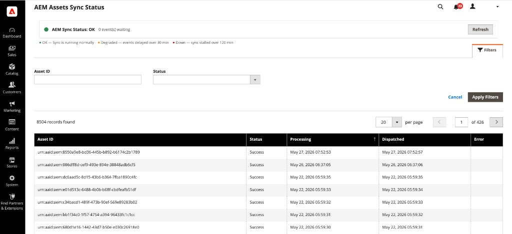

# AEM Assets 동기화 상태 보기

**[!UICONTROL Sync Status]** 보기는 AEM Assets 통합을 통해 동기화된 에셋의 에셋 중심 목록을 제공합니다. 카탈로그에서 제품별로 탐색하는 대신 자체 특성별로 자산을 찾고, 검토하고, 문제를 해결하는 데 사용합니다.

{width="700" zoomable="yes"}

>[!NOTE]
>
> [!UICONTROL Sync Status]은(는) [!DNL Adobe Commerce Optimizer]에 사용할 수 없습니다.

## 동기화 상태 열기

_관리자_ 사이드바에서 **[!UICONTROL System]** > **[!UICONTROL AEM Assets]** > **[!UICONTROL Sync Status]**(으)로 이동합니다.

{width="600" zoomable="yes"}

## 통합 동기화 상태

페이지 맨 위에서 **AEM 동기화 상태** 배너는 파이프라인 상태와 처리되기를 기다리는 이벤트 수를 요약합니다. 동기화 상태 배너를 업데이트하려면 **[!UICONTROL Refresh]**&#x200B;을(를) 선택하십시오.

## 자산 목록

격자에 AEM Assets 동기화 파이프라인에서 처리된 에셋과 현재 동기화 상태가 나열됩니다. 각 행은 Commerce의 한 에셋과 동기화 상태를 나타냅니다. 제품 레코드를 나타내지 않습니다.

| 열 | 설명 |
|--------|-------------|
| **자산 ID** | AEM 자산 식별자(예: `urn:aaid:aem:…`). |
| **상태** | 에셋에 대한 최신 동기화 시도 결과. 가능한 값은 **성공**, **실패** 또는 **대기 중**&#x200B;입니다. |
| **처리 중** | 에셋에 대한 처리가 시작된 날짜 및 시간입니다. |
| **디스패치됨** | 동기화 이벤트가 발송된 날짜 및 시간입니다. |
| **오류** | **Status**&#x200B;이(가) 실패를 나타내는 경우 오류 메시지가 표시됩니다. 동기화가 성공하면 비어 있습니다. |

### 자산 필터링

1. **[!UICONTROL Filters]**&#x200B;을(를) 선택하여 필터 패널을 확장합니다.

1. **자산 ID**&#x200B;를 입력하거나 **상태** 값을 선택하세요.

1. **[!UICONTROL Apply Filters]**&#x200B;을(를) 선택하여 격자를 업데이트하거나 **[!UICONTROL Cancel]**&#x200B;을(를) 선택하여 변경 내용을 적용하지 않고 패널을 닫습니다.

필터가 자산 수준 데이터에 적용되므로 실패한 동기화를 격리하거나 개별 제품을 열지 않고 특정 자산을 추적할 수 있습니다.

## 동기화 실패

**상태**&#x200B;에 오류가 표시되면 그리드의 **오류** 열에서 동기화 파이프라인에서 반환된 메시지를 검토하십시오.

전체 오류 메시지와 마지막 동기화 시도 세부 사항을 검토하여 오류를 진단하십시오.

[!BADGE PaaS만 해당]{type=Informative tooltip="Adobe Commerce on Cloud 프로젝트에만 적용됩니다(Adobe 관리 PaaS 인프라)."} 추가 문제 해결 방법은 [기본 자동 일치](../synchronize/default-match.md)를 참조하십시오. 통합 로그 파일은 Commerce 인스턴스의 `/var/log/aem-assets-integration.log` 및 `/var/log/aem-assets-integration-errors.log`에서 사용할 수 있습니다.
