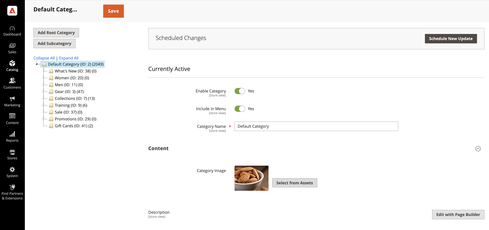

# Commerce 미디어 자산 관리

<!--In ACAP-844, this topic was linked to from the Commerce Admin products images and videos when the Assets integration is enabled. If the URL to the topic changes, be sure to add a redirect.-->

Commerce용 AEM Assets 통합이 활성화된 후 다음 미디어 유형을 관리할 수 있습니다.

* 제품 이미지
* 컨텐츠 이미지
* 제품 비디오
* 카테고리 이미지

## 제품 이미지

통합이 활성화되면 이미지 관리가 DAM(디지털 에셋 관리 시스템) 내에서 중앙 집중화됩니다. 그런 다음 Adobe Commerce은 주요 참여 채널로 작동하여 여러 상점 간에 승인된 고품질 이미지만 사용하도록 합니다. 이 설정은 브랜드 일관성을 강화하고, 수작업을 최소화하며, 콘텐츠 업데이트를 간소화하므로 판매자가 Adobe Commerce 내에서 이미지를 수동으로 업로드하거나 관리할 필요가 없습니다.

### Adobe Commerce에서 제품 이미지 보기

제품 이미지는 사전 구성된 일치 규칙에 따라 AEM Assets에서 자동으로 가져옵니다.

1. _관리자_ 사이드바에서 **[!UICONTROL Catalog]** > **[!UICONTROL Products]**(으)로 이동합니다.

1. 제품을 선택합니다.

1. **이미지 및 비디오** 섹션을 엽니다.

   {width="600" zoomable="yes"}

   >[!NOTE]
   >
   > 통합이 활성화되었음을 나타내는 메시지가 표시되면 DAM에서 이미지 관리가 중앙 집중화되기 때문에 이 섹션이 **읽기 전용** 섹션으로 설정됩니다.

### AEM Assets에서 제품 이미지 관리

제품 관련 이미지를 관리하려면 **AEM Assets**&#x200B;에서 직접 모든 내용을 변경해야 합니다. 이 프로세스는 완전히 자동화되어 수동 개입 없이 모든 변경 사항이 Adobe Commerce에 동기화됩니다.

### 동기화 SLA

이 항목에 대한 자세한 내용은 [SLA 동기화](get-started/setup-synchronization.md#synchronization-sla)를 확인하십시오.

## 컨텐츠 이미지

Adobe Commerce은 Adobe Experience Manager(AEM) 도구 세트를 사용하지 않는 판매자를 위해 페이지 빌더를 **컨텐츠 관리 시스템(CMS)**(으)로 제공합니다. 콘텐츠 생성을 향상시키기 위해 [AEM 자산 선택기](synchronize/asset-selector-integration.md)를 활용하므로 마케터가 **DAM**&#x200B;에서 직접 이미지에 원활하게 액세스하고 포함할 수 있습니다. 이를 통해 컨텐츠 작성에 승인된 고품질 이미지만 사용할 수 있으므로 Adobe Commerce에서 중복 스토리지를 사용할 필요가 없습니다.

### 페이지 빌더에서 AEM 자산 선택기 사용

[!BADGE Paa만]{type=Informative tooltip="Adobe Commerce on Cloud 프로젝트에만 적용됩니다(Adobe 관리 PaaS 인프라)."} 포함 이미지에 **AEM 자산 선택기**&#x200B;를 사용하려면:

1. **페이지 빌더**&#x200B;를 사용하여 `content enrichment`을(를) 지원하는 **Adobe Commerce 관리자**&#x200B;의 섹션으로 이동합니다.

1. [페이지 빌더](https://developer.adobe.com/commerce/frontend-core/page-builder/){target=_blank}를 엽니다.

   **AEM 자산**&#x200B;이라는 새 미디어 유형을 사용할 수 있습니다.

1. AEM Asset 미디어 유형을 콘텐츠 블록으로 드래그하여 놓습니다.

1. 메시지가 표시되면 DAM에 액세스할 수 있는 자격 증명을 제공합니다.

1. DAM에서 이미지를 선택하여 콘텐츠에 직접 삽입합니다.

선택한 이미지에 대한 연결은 **Dynamic Media**&#x200B;를 가리키는 직접 URL로 Adobe Commerce에 저장되며, 이를 통해 다음을 확인할 수 있습니다.

* 이미지 파일은 Adobe Commerce에 저장할 필요가 없습니다.

* 마케터는 DAM에서 승인된 자산으로만 작업합니다.

* 콘텐츠는 모든 고객 접점에서 일관되고 최신 상태로 유지됩니다.

>[!TIP]
>
> [DA.live(문서 작성)](https://experienceleague.adobe.com/developer/commerce/storefront/merchants/storefront-builder/#dalive-document-authoring){target=_blank}에서는 데이터를 보강하는 자산 선택기도 제공합니다.

## 제품 비디오

Adobe Commerce은 디지털 에셋의 주요 참여 채널 역할을 합니다. AEM Assets 통합이 활성화되면 비디오 관리가 **DAM** 내에서 중앙 집중화되어 상거래 상점 전반에서 일관성, 규정 준수 및 최적화된 배달을 보장합니다.

### 제품 비디오 관리

1. _관리자_ 사이드바에서 **[!UICONTROL Catalog]** > **[!UICONTROL Products]**(으)로 이동합니다.

1. 제품을 선택합니다.

1. **이미지 및 비디오** 섹션을 엽니다.

   {width="600" zoomable="yes"}

   >[!NOTE]
   >
   > AEM Assets에서 비디오가 제어되므로 통합이 활성화되어 이 섹션이 **읽기 전용**&#x200B;이 됩니다.

### AEM Assets에서 비디오 연결

1. AEM Assets에서 제품과 연결할 비디오로 이동합니다.

1. 비디오를 Adobe Commerce에 있는 하나 이상의 제품에 연결합니다.

1. 통합은 연결을 자동으로 동기화하여 Dynamic Media 비디오 플레이어를 상점 정면에 바로 표시합니다. 따라서 판매자가 비디오 재생 구성을 관리할 필요가 없습니다.

### API-First 비디오 지원만

현재 통합은 API를 통해 비디오를 지원하므로 파트너가 프로그래밍 방식으로 비디오를 검색할 수 있습니다.

>[!WARNING]
>
> 비디오는 기본적으로 기존 Adobe Commerce 상점 솔루션에 아직 통합되지 않았습니다.

이 통합을 통해 판매자는 원활한 전달을 위해 AEM Assets 및 Dynamic Media를 활용하여 확장 가능하고 최적화된 방식으로 제품 비디오를 손쉽게 관리할 수 있습니다.

### 동기화 SLA

이 항목에 대한 자세한 내용은 [SLA 동기화](get-started/setup-synchronization.md#synchronization-sla)를 확인하십시오.

## 카테고리 이미지

Adobe Commerce을 통해 판매자는 이미지를 제품 카테고리와 연결하여 시각적으로 매력적인 상점을 만들 수 있습니다. AEM Assets 통합은 AEM 자산 선택기를 활용하므로 마케터가 **DAM(디지털 자산 관리 시스템)**&#x200B;에서 직접 자산을 원활하게 선택할 수 있습니다. 이렇게 하면 승인된 이미지만 사용할 수 있으며 Adobe Commerce에 저장할 필요가 없어 모든 참여 채널에서 일관성과 효율성을 유지할 수 있습니다.

### 카테고리 이미지에 AEM 자산 선택기 사용

[AEM 자산 선택기](synchronize/asset-selector-integration.md)를 구성한 후 자산을 사용하여 카탈로그 범주 콘텐츠에 추가할 수 있습니다.

1. _관리자_ 사이드바에서 **[!UICONTROL Catalog]** > **[!UICONTROL Categories]**(으)로 이동합니다.

1. 업데이트할 범주를 선택합니다.

1. 확장 선택기&#x200B;**[!UICONTROL Content]**&#x200B;을 확장합니다.

1. **[!UICONTROL Content]** 섹션에서 범주와 연결된 *이미지 필드*&#x200B;를 찾습니다.

   {width="600" zoomable="yes"}

1. 범주 이미지를 변경하려면 **[!UICONTROL Select from Assets]**&#x200B;을(를) 클릭하십시오.

   {width="600" zoomable="yes"}

1. AEM 자산 선택기에서 이미지를 선택합니다.

   {width="600" zoomable="yes"}

1. **[!UICONTROL Save]**&#x200B;을(를) 클릭하고 계속합니다.

   범주 만들기에 대한 자세한 내용은 [Commerce 카탈로그 관리 안내서](https://experienceleague.adobe.com/en/docs/commerce-admin/catalog/categories/create/category-create#step-3-complete-the-category-content)에서 **범주 콘텐츠 완료**&#x200B;를 참조하십시오.

## 에셋 업데이트

AEM Assets에서 에셋을 업데이트하고 승인하면 자동 일치 기능을 사용하여 업데이트가 자동으로 Adobe Commerce으로 전송됩니다. 이 프로세스는 자산 승인 시 트리거됩니다. 모든 최종 변경 사항 및 메타데이터 업데이트가 포함되도록 하려면 에셋을 승인하기 전에 재처리해야 합니다.

자세한 내용은 다음 AEM Assets 설명서를 참조하십시오.

* [디지털 자산 재처리](https://experienceleague.adobe.com/en/docs/experience-manager-cloud-service/content/assets/manage/reprocessing)

* [자산 승인](https://experienceleague.adobe.com/en/docs/experience-manager-cloud-service/content/assets/dynamicmedia/dynamic-media-open-apis/approve-assets)
