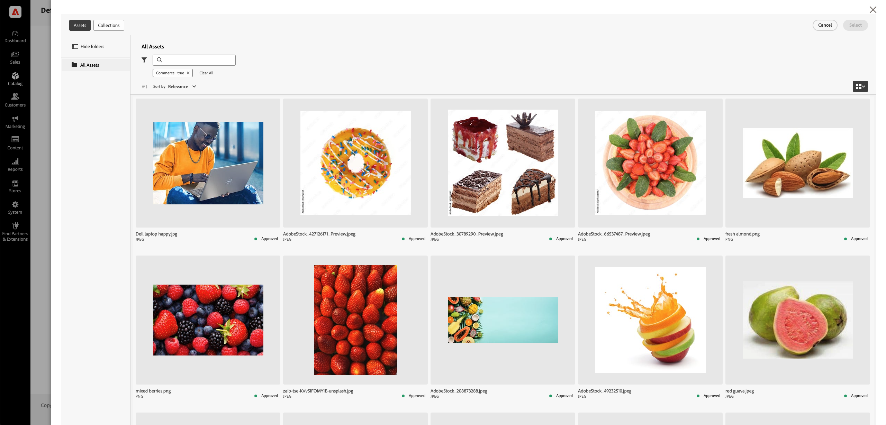

# 수동 자산 선택

**AEM 자산 선택기**&#x200B;를 사용하면 마케터와 머천다이저가 AEM Assets에서 Adobe Commerce으로 이미지를 쉽게 추가하여 자산 관리 프로세스를 간소화할 수 있습니다. 이 방법을 사용하면 자산 선택을 [!DNL DAM (Digital Asset Management system)]에서 검토 및 승인된 것으로 제한하여 브랜드 일관성과 규정 준수를 보장할 수 있습니다.

AEM Admin에서 AEM Assets 프로젝트에 대한 IMS 클라이언트 ID를 구성한 경우 **Commerce 자산 선택기**&#x200B;를 사용할 수 있습니다. [AEM 자산 선택기 구성](#configure-the-aem-asset-selector-in-adobe-commerce)을 참조하십시오.

**AEM 자산 선택기** 통합이 구성되면 마케터와 머천다이저는 다음을 수행할 수 있습니다.

* 브랜드 및 캠페인 지침에 맞게 범주 이미지를 간편하게 관리할 수 있습니다.
* [!BADGE Paa만 해당]{type=Informative tooltip="Adobe Commerce on Cloud 프로젝트에만 적용됩니다(Adobe 관리 PaaS 인프라)."} 시각적으로 풍부한 콘텐츠를 위해 페이지 빌더에서 직접 자산을 할당합니다.
* [!BADGE SaaS만 해당]{type=Positive url="https://experienceleague.adobe.com/en/docs/commerce/user-guides/product-solutions" tooltip="Adobe Commerce as a Cloud Service 및 Adobe Commerce Optimizer 프로젝트에만 적용됩니다(Adobe 관리 SaaS 인프라)."} 시각적으로 풍부한 콘텐츠를 제공하기 위해 Edge Delivery Services에서 제공하는 Commerce Storefront에서 직접 Assets을 할당합니다.

>[!NOTE]
>
> AEM 자산 선택기는 AEM Assets과 작성 애플리케이션을 통합하기 위한 AEM 자산 프론트엔드 구성 요소입니다. 이 구성 요소에 대한 자세한 내용은 [AEM as a Cloud Service 사용 안내서](https://experienceleague.adobe.com/en/docs/experience-manager-cloud-service/content/assets/manage/asset-selector/overview-asset-selector){target=_blank}의 *Micro-Frontend 자산 선택기*&#x200B;를 참조하십시오.

## 주요 이점

AEM Asset Selector를 Adobe Commerce 관리 패널에 포함하면 다음과 같은 몇 가지 주요 이점이 있습니다.

* **브랜드 일관성** - 승인된 자산만 표시하므로 상점 전면에서 오래되거나 호환되지 않는 이미지의 위험을 최소화합니다.

* **효율성** - 마케터와 머천다이저가 다른 플랫폼 간에 전환하지 않고도 자산을 빠르게 할당할 수 있습니다.

* **간소화된 Collaboration**-DAM에서 직접 이미지를 선택하여 원활한 팀워크를 구현하고 수동 다운로드와 업로드를 제거합니다.

* **향상된 콘텐츠 품질** - 제품 페이지, 카테고리 및 Page Builder에서 고해상도의 최적화된 이미지를 사용할 수 있습니다.

{width="600" zoomable="yes"}

## Adobe Commerce에서 AEM 자산 선택기 구성

1. Commerce 관리자에서 **[!UICONTROL Store]** > 구성 > **[!UICONTROL ADOBE SERVICES]** > **[!UICONTROL AEM Assets Integration]**(으)로 이동합니다.

1. **[!UICONTROL IMS Client ID]** 필드를 입력합니다.

1. 구성을 **저장**&#x200B;합니다.

## 다음 단계

* [자산 선택기를 사용하여 범주 이미지 관리](../manage-assets.md#category-images)
* [Page Builder 콘텐츠에서 이미지 관리](../manage-assets.md#using-aem-asset-selector-in-page-builder)
