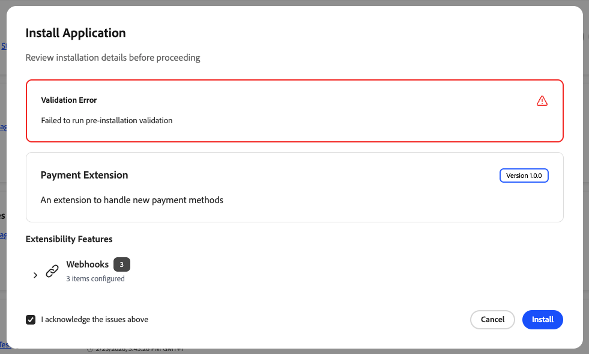

# [!DNL App Management] 설치 및 액세스

[!DNL App Management]은(는) 적격한 Commerce 인스턴스에 대해 Commerce 관리자에서 사용할 수 있습니다. 사용 가능 여부는 배포 유형에 따라 다릅니다.

## 가용성

다음 요구 사항을 충족한 후 아래에서 배포 유형에 해당하는 탭을 선택하여 [!DNL App Management]을(를) 설치해야 하는지 또는 인스턴스에서 이미 사용할 수 있는지 확인합니다.

## 사전 요구 사항

앱을 연결하기 전에 다음을 확인하십시오.

| 요구 사항 | 설명 |
|-------------|-------------|
| **관리자 액세스** | [!DNL App Management] 권한이 있는 Commerce 관리자 |
| **배포된 앱** | 조직에 배포되고 연결할 준비가 된 App Builder 애플리케이션 |
| **조직 액세스** | 앱이 배포된 Adobe 조직에 대한 액세스 |

>[!BEGINTABS]

>[!TAB Adobe Commerce as a Cloud Service]

[!DNL App Management]은(는) [!DNL Adobe Commerce as a Cloud Service]에서 자동으로 사용할 수 있습니다. 설치할 필요가 없습니다. [Admin에서 사용](#access-app-management)하고 앱 연결을 시작합니다.

>[!TAB PaaS(클라우드 상의 Adobe Commerce) 및 온-프레미스]

* **Adobe Commerce 2.4.8 이상**—[!DNL App Management]이(가) 자동으로 포함됩니다. 설치할 필요가 없습니다.

* **Adobe Commerce 2.4.5에서 2.4.7로**—작성기를 사용하여 [!DNL Admin UI SDK]&#x200B;([!DNL App Management] 포함)을(를) 설치합니다.

  ```bash
  composer require "magento/commerce-backend-sdk": ">=3.3"
  ```

  그런 다음 를 실행합니다.

  ```bash
  composer update
  bin/magento setup:upgrade
  bin/magento indexer:reindex
  bin/magento cache:clean
  ```

자세한 내용은 [Adobe Commerce 관리 UI SDK 설치 또는 업데이트](https://developer.adobe.com/commerce/extensibility/admin-ui-sdk/installation/){target="_blank"}를 참조하십시오.

>[!ENDTABS]

## [!DNL App Management] 액세스

1. Commerce 관리자에 로그인합니다.

1. **[!UICONTROL Apps]** > **[!UICONTROL App Management]**(으)로 이동합니다.

[!DNL App Management] 보기가 표시됩니다. 여기에서 App Builder 애플리케이션을 연결, 구성 및 관리할 수 있습니다. 해당 화면에서 검색, 필터 및 **[!UICONTROL Acquire App]** 작업을 보려면 [앱 관리](manage-app.md)에서 [관리에서 응용 프로그램 찾기](manage-app.md#find-an-application-in-the-admin)를 참조하십시오.

## App Builder 앱 설치

Adobe Exchange에서 App Builder 앱(예: 미리 빌드된 통합 또는 마켓플레이스 앱)을 설치해야 하는 경우 [Adobe Exchange에서 App Builder 앱 설치](https://experienceleague.adobe.com/en/docs/commerce-learn/tutorials/adobe-developer-app-builder/install-app-builder-app){target="_blank"}를 참조하여 단계별 지침을 확인하십시오.

앱을 설치하고 배포한 후 [!DNL App Management]을(를) 사용하여 [Commerce 인스턴스와 연결](manage-app.md#associate-an-app)하고 설정을 구성하십시오.

## Commerce 웹후크 및 앱

일부 App Builder 애플리케이션은 [Adobe Commerce webhooks](https://developer.adobe.com/commerce/extensibility/webhooks/)을(를) 사용하므로 특정 이벤트가 발생할 때(예: 제품이 저장된 후) Commerce에서 HTTP를 통해 앱을 호출할 수 있습니다. 응용 프로그램을 빌드하고 배포할 때 **앱 개발자**&#x200B;에 의해 웹후크 끝점 및 구독 논리가 정의됩니다. 저장소 관리자는 앱 관리에서 웹후크를 별도로 구성하지 않습니다.

[앱을 Commerce 인스턴스와 연결](https://experienceleague.adobe.com/en/docs/commerce/app-management/manage-app/manage-app)하고 앱의 설정 지침을 완료하면 웹후크 동작이 앱의 구현을 따릅니다.

[!DNL App Management]이(가) 앱의 유효성 검사 끝점을 트리거할 수 없는 경우(예: URL에 연결할 수 없거나 응답이 요구 사항을 충족하지 않는 경우) [!DNL App Management] 대시보드에 다음과 유사한 오류가 표시될 수 있습니다.

{width="600" zoomable="yes"}

유효성 검사가 성공하도록 **앱 개발자**&#x200B;와(과) 협력하여 웹후크 구성 또는 배포를 수정하십시오.

**앱 개발자**. App Builder의 웹후크 구독 및 핸들러 응답을 구현하려면 Commerce Extensibility 개발자 설명서의 [웹후크](https://developer.adobe.com/commerce/extensibility/app-management/installation/webhooks/) 및 GitHub의 [`@adobe/aio-commerce-lib-webhooks`](https://github.com/adobe/aio-commerce-sdk/tree/main/packages/aio-commerce-lib-webhooks) 패키지를 참조하십시오.
