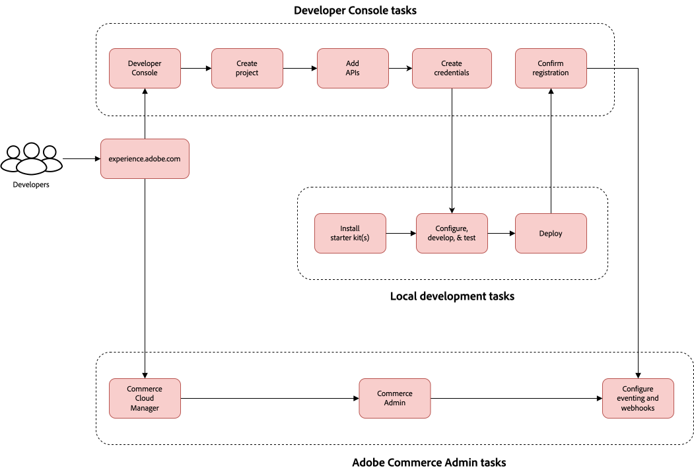

# 시작

[!DNL Adobe Commerce as a Cloud Service]에서는 대부분의 구성을 즉시 제공합니다. 몇 가지 기본 설정 프로세스를 완료하면 스토어가 즉시 실행되고 작동합니다. 이 안내서는 인스턴스 만들기 및 작업을 안내하고 성공을 위해 조직을 설정하는 데 도움이 됩니다. 이를 통해 팀이 [!DNL Adobe Commerce as a Cloud Service] 및 시작하는 데 필요한 도구에 적절하게 액세스할 수 있습니다.

[!DNL Adobe Commerce as a Cloud Service]은(는) 디지털 상거래 경험을 제공하기 위한 유연성, 확장성 및 효율성을 제공하는 클라우드 기반의 상거래 플랫폼입니다. 이 SaaS 서비스는 완전히 관리되고 버전이 없는 플랫폼으로, 수작업 없이 원활한 업그레이드 환경을 제공합니다.

## 주요 구성 요소

[!DNL Adobe Commerce as a Cloud Service]은(는) 다음 구성 요소로 구성됩니다.

* **[[!DNL Adobe Experience Cloud]](https://experience.adobe.com/)** - [!DNL Adobe Commerce]experience.adobe.com[의 모든 ](https://experience.adobe.com/) 제품에 대한 중앙 진입점
   * [!UICONTROL **빠른 액세스**]&#x200B;에서 [!UICONTROL **Commerce**]&#x200B;을 클릭하여 Commerce Cloud 관리자를 엽니다.
* **[[!DNL Commerce Cloud Manager]](https://experience.adobe.com/#/commerce/cloud-service)** - 인스턴스 만들기 및 관리, API URL 액세스 및 Commerce 관리자
* **[[!DNL Adobe Admin Console]](https://adminconsole.adobe.com/)** - 사용자 및 역할 관리
* **Commerce 관리자** - 제품, 주문, 고객 및 스토어 구성 관리
* **[Storefront powered by [!DNL Edge Delivery Services]](./storefront.md)** - 판매자와 개발자를 위한 탁월한 속도, SEO 및 사용자 경험을 제공하는 구성 가능한 고성능 시스템을 사용하여 고객 중심의 Storefront를 만들고 사용자 지정합니다.
* **[[!DNL Adobe Developer App Builder]](https://developer.adobe.com/app-builder/)** - [!DNL App Builder]통합 스타터 키트[ 및 ](https://developer.adobe.com/commerce/extensibility/starter-kit/integration/)[[!DNL API Mesh]와 같은 다른 확장성 도구와 함께 ](https://developer.adobe.com/graphql-mesh-gateway/)을(를) 사용하여 사용자 지정 통합을 빌드합니다.

## 설정 및 관리

[!DNL Adobe Commerce as a Cloud Service] 설정 프로세스의 일부로 시스템 관리자, 판매자 및 개발자는 클라우드 리소스를 프로비저닝하고 책임에 따라 사용자를 적절한 역할에 할당하는 등 조직에 대한 액세스 및 리소스를 구성합니다.

### 설정 및 관리 워크플로우

결합된 그룹으로서, 시스템 관리자, 판매자 및 개발자는 다음과 같은 필수 단계를 따라 Commerce 인스턴스를 시작하고 실행해야 합니다.

1. **모든 사용자**: [인스턴스 만들기](#create-an-instance)
1. **시스템 관리자**: [사용자 추가 및 역할 할당](user-management.md#add-users-and-admins)
1. **판매자**: [Commerce 관리자에 액세스](#access-an-instance) 및 [카탈로그 가져오기](#import-your-catalog)
1. **개발자**: [상점 설정](storefront.md) 및 [개발자 플랫폼](overview.md#developer-platform) 탐색

#### AEM Assets 및 제품 시각화 워크플로

[!DNL Adobe Experience Manager Assets] 또는 [!DNL Product Visuals powered by AEM Assets]을(를) [!DNL Adobe Commerce as a Cloud Service]과(와) 통합하려면 다음 단계가 필요합니다.

1. **시스템 관리자**: [사용자를  [!DNL AEM Assets] 및 [!DNL Product Visuals] 제품 프로필에 추가](user-management.md#add-a-user-to-aem-assets-or-product-visuals)
1. **개발자**: [통합 [!DNL AEM Assets] 및 [!DNL Product Visuals]](../aem-assets-integration/overview.md)
1. **판매자**: [액세스 [!DNL AEM Assets] 및 [!DNL Product Visuals]](./user-management.md#access-the-experience-manager-interface)

### 역할 기반 설정 및 관리 작업

해당 역할에 대한 높은 수준의 워크플로 그래픽을 보려면 아래 탭을 선택하십시오.

>[!BEGINTABS]

>[!TAB 시스템 관리자 및 판매자 워크플로]

이 다이어그램은 시스템 관리자와 판매자가 [!DNL Adobe Commerce as a Cloud Service]개의 인스턴스에 액세스하고 관리하는 방법에 대한 높은 수준의 개요를 제공합니다. 관리자 워크플로에 대한 자세한 내용은 [Adobe Admin Console 안내서](https://helpx.adobe.com/enterprise/admin-guide.html)를 참조하십시오.

{zoomable="yes"}

>[!TAB 개발자 워크플로]

이 다이어그램은 개발자가 App Builder을 사용하여 [!DNL Adobe Commerce as a Cloud Service]에 대한 통합을 만드는 방법에 대한 높은 수준의 개요를 제공합니다. 자세한 내용은 [API 설명서](https://developer.adobe.com/commerce/webapi/rest/)를 참조하세요.

Adobe Commerce as a Cloud Service과의 통합을 만들기 위한 {zoomable="yes"}

>[!ENDTABS]

역할을 선택하여 설정 프로세스를 시작할 리소스를 찾습니다.

>[!BEGINTABS]

>[!TAB 시스템 관리자]

시스템 관리자는 조직 설정 및 사용자 액세스 관리를 담당합니다.

| 작업 | 설명 | 리소스 |
|------|-------------|----------|
| 플랫폼 이해 | Adobe Commerce as a Cloud Service 아키텍처 및 이점에 대해 알아보기 | [개요](overview.md) |
| 기능 비교 | Cloud Service과 기타 Adobe Commerce 서비스의 차이점 이해 | [기능 비교](feature-comparison.md) |
| 인스턴스 만들기 | 샌드박스 및 프로덕션 환경 프로비저닝 | [인스턴스 만들기](#create-an-instance) |
| 사용자 관리 설정 | 사용자 추가, 역할 할당 및 권한 관리 | [사용자 관리](user-management.md) |
| [!DNL AEM Assets] 및 [!DNL Product Visuals] 설정(선택 사항) | 사용자 추가, 역할 할당 및 권한 관리 | [사용자 관리](user-management.md#add-a-user-to-aem-assets-or-product-visuals) |

>[!TAB 판매자]

판매자의 경우 제품, 주문 및 상점 컨텐츠를 관리하는 데 주력하게 됩니다.

| 작업 | 설명 | 리소스 |
|------|-------------|----------|
| 인스턴스 액세스 | Commerce 관리자에 로그인하여 스토어를 관리합니다 | [인스턴스에 액세스](#access-an-instance) |
| 사용 사례 살펴보기 | 실용적인 비즈니스 시나리오 및 워크플로 알아보기 | [사용 사례](./use-cases.md) |
| 카탈로그 가져오기 | 제품 데이터를 플랫폼으로 가져오는 방법에 대해 알아봅니다 | [카탈로그 가져오기](#import-your-catalog) |
| [!DNL AEM Assets] 및 [!DNL Product Visuals] 액세스(선택 사항) | [!DNL AEM Assets] 및 [!DNL Product Visuals]을(를) 사용하려면 Experience Manager에 액세스하십시오. | [Experience Manager 인터페이스에 액세스](./user-management.md#access-the-experience-manager-interface) |

>[!TAB 개발자]

개발자로서 사용자 정의 통합을 구축하고 플랫폼 기능을 확장하는 방법을 알고 있어야 합니다.

| 작업 | 설명 | 리소스 |
|------|-------------|----------|
| 아키텍처 이해 | 플랫폼의 확장성 및 API에 대해 알아봅니다 | [개요 - 개발자 플랫폼](overview.md#developer-platform) |
| 개발 환경 설정 | 개발 및 테스트를 위한 샌드박스 인스턴스 만들기 | [인스턴스 만들기](#create-an-instance) |
| 상점 만들기 | Commerce Storefront를 설정하고 맞춤화하는 방법에 대해 알아봅니다. | [Storefront 설정](./storefront.md) |
| 상점 구성 | 상점을 설정하는 방법에 대해 알아보기 | [Storefront 설정](./storefront.md) |
| 통합 옵션 살펴보기 | 액세스 권한이 있는 App Builder, API Mesh 및 기타 확장성 도구에 대해 알아봅니다 | [개요 - 개발자 플랫폼](overview.md#developer-platform) |
| [!DNL AEM Assets] 및 [!DNL Product Visuals] 통합(선택 사항) | [!DNL AEM Assets] 및 [!DNL Product Visuals]을(를) [!DNL Adobe Commerce]과(와) 통합하는 방법을 알아봅니다. | [AEM Assets 통합](../aem-assets-integration/overview.md) |

>[!ENDTABS]

### 다음 단계

역할별 설정 작업을 완료한 후:

* **시스템 관리자**: [공유 권한](shared-responsibility.md) 지침 검토
* **판매자**: 일반적인 비즈니스 시나리오에 대해 [사용 사례](use-cases.md) 살펴보기
* **개발자**: [Adobe Commerce 개발자 설명서](https://developer.adobe.com/commerce/docs) 확인

## Adobe Commerce as a Cloud Service 기본 사항

다음 섹션에서는 Commerce 인스턴스를 시작하고 실행하기 위해 완료해야 하는 기본 프로세스에 대해 설명합니다.

### 인스턴스 만들기

>[!NOTE]
>
>인스턴스를 만들려면 먼저 조직의 제품 관리자 또는 시스템 관리자가 사용자를 [!DNL Adobe Commerce as a Cloud Service] 제품의 사용자로 추가해야 합니다. 자세한 내용은 [사용자 및 관리자 추가](./user-management.md#add-users-and-admins)를 참조하십시오.

[!DNL Adobe Commerce as a Cloud Service]개의 인스턴스가 신용 기반 시스템을 사용합니다. 여러 인스턴스를 만들 수 있지만 각 인스턴스에는 사용 가능한 크레딧이 필요합니다. 처음 보유한 크레딧 수는 구독에 따라 다릅니다.

1. [[!DNL Adobe Experience Cloud]](https://experience.adobe.com/) 계정에 로그인합니다.

1. [!UICONTROL Quick access]에서 [!UICONTROL **Commerce**]&#x200B;을(를) 클릭하여 [!UICONTROL Commerce Cloud Manager]을(를) 엽니다.

   [!UICONTROL Commerce Cloud Manager]에는 Adobe IMS 조직에서 사용할 수 있는 [!DNL Adobe Commerce as a Cloud Service] 인스턴스 목록이 표시됩니다.

1. 화면 오른쪽 상단에서 [!UICONTROL **인스턴스 추가**]&#x200B;를 클릭합니다.

   {width="50%" align="center" zoomable="yes"}

1. [!UICONTROL **Commerce as a Cloud Service**]&#x200B;을(를) 선택합니다.

1. 인스턴스의 **이름** 및 **설명**&#x200B;을 입력하십시오.

1. 인스턴스의 [!UICONTROL **환경 유형**]&#x200B;을(를) 선택하십시오. 다음 옵션 중에서 선택할 수 있습니다.

   * [!UICONTROL **샌드박스**] - 디자인 및 테스트 목적으로만 사용됩니다. 샌드박스 환경을 사용하여 [!DNL Adobe Commerce as a Cloud Service] 여정을 시작해야 합니다.

   >[!NOTE]
   >
   > 샌드박스 인스턴스는 디자인 및 테스트 목적으로만 사용됩니다. 샌드박스 환경에서는 프로덕션 데이터를 사용하지 않아야 합니다.
   >
   >샌드박스 인스턴스는 북미 지역으로 제한됩니다.

   * [!UICONTROL **프로덕션**] - 라이브 스토어 및 고객 응대 사이트용.

   >[!NOTE]
   >
   >Adobe Commerce as a Cloud Service의 인프라는 전 세계에서 사용할 수 있습니다. 지역의 프로덕션 환경에 대한 자세한 내용은 고객 서비스 담당자에게 문의하십시오.

1. 인스턴스를 호스팅할 지역을 선택합니다.

   >[!NOTE]
   >
   >인스턴스를 생성하면 영역을 수정할 수 없습니다.

1. [!UICONTROL **인스턴스 추가**]&#x200B;를 클릭합니다.

{{aem-assets-instance-mapping}}

### 인스턴스 액세스

인스턴스를 만든 후에는 [!UICONTROL Commerce Cloud Manager]에서 액세스할 수 있습니다.

1. [Adobe Experience Cloud](https://experience.adobe.com/) 계정에 로그인합니다.

1. [!UICONTROL Quick access]에서 [!UICONTROL **Commerce**]&#x200B;을(를) 클릭하여 [!UICONTROL Commerce Cloud Manager]을(를) 엽니다.

   [!UICONTROL Commerce Cloud Manager]에는 Adobe IMS 조직에서 사용할 수 있는 인스턴스 목록이 표시됩니다.

1. 인스턴스에 대한 [!UICONTROL Commerce Admin]을(를) 열려면 인스턴스 이름을 클릭합니다.

>[!TIP]
>
>REST 및 GraphQL 엔드포인트와 관리 URL을 포함하여 인스턴스에 대한 정보를 보려면 인스턴스 이름 옆에 있는 정보 아이콘을 클릭합니다.

관리자 및 엔드포인트의 기본 URL은 지역 및 환경에 따라 다르며, 다음 패턴을 사용합니다.

* 관리자
   * 북미 프로덕션 관리자: `https://na1.admin.commerce.adobe.com`
   * 북미 샌드박스 관리자: `https://na1-sandbox.admin.commerce.adobe.com`
   * 유럽 프로덕션 관리자: `https://eu1.admin.commerce.adobe.com`
* REST 및 GraphQL
   * 북미 생산 GraphQL: `https://na1.api.commerce.adobe.com`
   * 북미 샌드박스 GraphQL: `https://na1-sandbox.api.commerce.adobe.com`
   * 유럽 프로덕션 GraphQL: `https://eu1.api.commerce.adobe.com`

### 카탈로그 가져오기

기본적으로 [!DNL Adobe Commerce as a Cloud Service] 인스턴스에는 제품 데이터가 포함되지 않습니다. 자체 카탈로그를 가져오기 전에 테스트 및 학습 목적으로 인스턴스를 만들 때 샘플 제품 데이터를 포함할 수 있는 옵션이 있습니다.

카탈로그를 [!DNL Adobe Commerce as a Cloud Service]&#x200B;(으)로 가져오는 방법에는 두 가지가 있습니다.

* [**Commerce 관리자**](https://experienceleague.adobe.com/en/docs/commerce-admin/systems/data-transfer/import/data-import) - 몇 번의 클릭만으로 카탈로그 데이터를 가져올 수 있는 사용자 친화적인 인터페이스입니다.
* [**JSON API 가져오기**](https://developer.adobe.com/commerce/webapi/rest/modules/import/#import-json-api) - 카탈로그 데이터를 프로그래밍 방식으로 가져올 수 있는 REST API입니다.

### 상점 배치

인스턴스를 만들었으므로 [에서 제공하는 ](storefront.md)상점 설치[!DNL Edge Delivery Services]를 준비했습니다.

## 추가 리소스

* [릴리스 정보](release-notes.md)
* [마이그레이션 안내서](migration/overview.md)
* [Commerce 상점 첫 화면 설명서](https://experienceleague.adobe.com/developer/commerce/storefront/)
