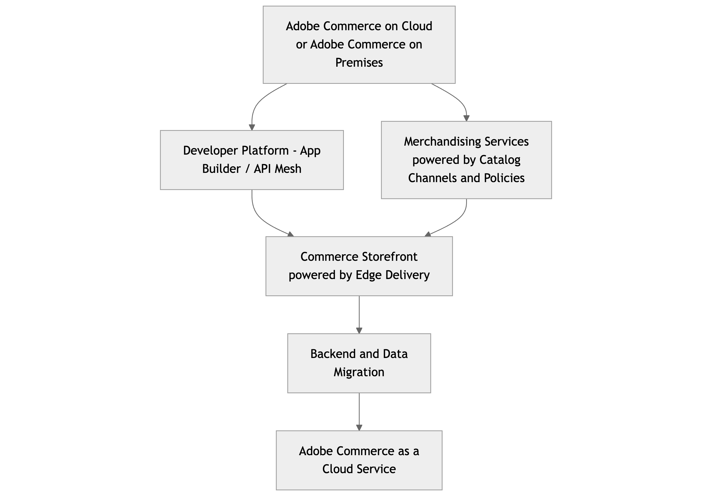

# [!DNL Adobe Commerce as a Cloud Service]&#x200B;(으)로 마이그레이션

[!DNL Adobe Commerce as a Cloud Service]은(는) 기존 Adobe Commerce PaaS 구현에서 새로운 Adobe Commerce as a Cloud Service(SaaS) 서비스로 전환하는 개발자를 위한 포괄적인 안내서를 제공합니다. Adobe Commerce as a Cloud Service은 향상된 성능, 확장성, 간소화된 운영 및 더 광범위한 Adobe Experience Cloud과의 긴밀한 통합을 제공하는 완벽한 관리 버전 없는 SaaS 모델로의 상당한 전환을 나타냅니다.

>[!NOTE]
>
>마이그레이션 도구에 대한 자세한 내용은 [대량 데이터 마이그레이션 도구](./bulk-data.md)를 참조하십시오.

## 전환 이해 - PaaS 및 SaaS 비교

**주요 차이점**

* [!BADGE PaaS만 해당]{type=Informative url="https://experienceleague.adobe.com/en/docs/commerce/user-guides/product-solutions" tooltip="Adobe Commerce 온 클라우드 프로젝트(Adobe 관리 PaaS 인프라) 및 온프레미스 프로젝트에만 적용됩니다."} **PaaS(현재)**: 판매자가 Adobe의 호스팅 환경 내에서 애플리케이션 코드, 업그레이드, 패치, 인프라 구성을 관리합니다. 서비스(MySQL, Elasticsearch 등)에 대한 [공유 권한 모델](https://experienceleague.adobe.com/en/docs/commerce-operations/security-and-compliance/shared-responsibility).
* [!BADGE SaaS만 해당]{type=Positive url="https://experienceleague.adobe.com/en/docs/commerce/user-guides/product-solutions" tooltip="Adobe Commerce as a Cloud Service 및 Adobe Commerce Optimizer 프로젝트에만 적용됩니다(Adobe 관리 SaaS 인프라)."} **SaaS(신규 - [!DNL Adobe Commerce as a Cloud Service])**: Adobe에서 핵심 응용 프로그램, 인프라 및 업데이트를 완전히 관리합니다. 판매자는 확장성 지점(API, App Builder, UI SDK)을 통한 사용자 지정에 중점을 둡니다. 핵심 응용 프로그램 코드가 잠겨 있습니다.

**아키텍처 의미**

* **버전이 없는 플랫폼**: 지속적인 업데이트로 인해 core에 대한 주요 버전이 더 이상 업그레이드되지 않습니다.
* **마이크로서비스 및 API 우선**: 확장성 및 통합을 위해 API에 더 많이 의존합니다.
* **기본적으로 헤드리스(선택 사항)**: 분리된 상점(예: Edge Delivery Services에서 제공하는 Commerce 상점)에 대한 강력한 지원
* **Edge Delivery Services**: 프론트엔드 성능 및 배포에 영향을 줍니다.

**새로운 도구 및 개념**

* [Adobe Developer App Builder](https://developer.adobe.com/app-builder/) 및 [Adobe Developer App Builder용 API Mesh](https://developer.adobe.com/graphql-mesh-gateway)
* [Commerce Optimizer](../../optimizer/overview.md)
* [Edge Delivery Services](https://experienceleague.adobe.com/developer/commerce/storefront/)
* [Commerce Cloud 관리자](../getting-started.md#create-an-instance)를 사용한 셀프서비스 프로비저닝

## 마이그레이션 경로

[!DNL Adobe Commerce as a Cloud Service]은(는) 타임라인, 상점 및 사용자 지정에 따라 여러 마이그레이션 경로를 지원합니다.

전체 마이그레이션에 대한 대안으로 [!DNL Adobe Commerce as a Cloud Service]은(는) Commerce Optimizer 또는 증분 접근 방식을 사용하여 단계적 마이그레이션을 지원합니다.

* **증분 마이그레이션** - 이 방법에는 데이터, 사용자 지정 및 통합을 단계적으로 마이그레이션하는 작업이 포함됩니다. 이 방법은 복잡한 사용자 지정 및 데이터를 점차적으로 자신의 속도에 맞게 [!DNL Adobe Commerce as a Cloud Service]&#x200B;(으)로 전환하려는 많은 사용자 지정 기능을 가진 대형 가맹점에 이상적입니다.

{width="600" zoomable="yes"}

* **Commerce Optimizer**—이 방법을 사용하면 Commerce Optimizer을 전환 단계로 사용하여 복잡한 사용자 지정 및 데이터를 원하는 속도로 [!DNL Adobe Commerce as a Cloud Service]&#x200B;(으)로 이동하여 반복적으로 마이그레이션할 수 있습니다. Commerce Optimizer은 카탈로그 보기 및 정책으로 구동되는 머천다이징 서비스, Edge Delivery으로 구동되는 Commerce Storefront 및 AEM Assets으로 구동되는 제품 비주얼에 대한 액세스를 제공합니다.

{width="600" zoomable="yes"}

* **전체 마이그레이션**—이 방법에는 모든 데이터, 사용자 지정 및 통합을 한 번에 마이그레이션하는 작업이 포함됩니다. 이 방법은 [!DNL Adobe Commerce as a Cloud Service]&#x200B;(으)로 빠르게 전환하려는 사용자 지정이 거의 없는 소규모 가맹점에 이상적입니다.

다음 표에서는 다양한 상점 및 구성의 마이그레이션 프로세스에 대한 개요를 제공합니다.

|                    | LUMA Storefront | PWA 상점 첫 화면 | Edge Delivery 기반 Commerce Storefront | Headless |
|--------------------|----------------------------------------|----------------------------------------|------------------------------------------------------|----------------------------------------|
| 데이터 마이그레이션 | 필수 | 필수 | 필수 | 필수 |
| 상점 첫 화면 | Edge Delivery 기반의 Commerce Storefront로 마이그레이션 | Edge Delivery 기반의 Commerce Storefront로 마이그레이션 또는 유지 관리 | 영향 없음 | 영향 없음 |
| API 메쉬 | 새 메시 작성 | 새 메쉬 구축 또는 기존 메쉬 재구성 | 새 메쉬 구축 또는 기존 메쉬 재구성 | 새 메쉬 구축 또는 기존 메쉬 재구성 |
| 통합 | 통합 시작 키트 활용 | 통합 시작 키트 활용 | 통합 시작 키트 활용 | 통합 시작 키트 활용 |
| 사용자 정의 | App Builder 및 API Mesh로 이동 | App Builder 및 API Mesh로 이동 | App Builder 및 API Mesh로 이동 | App Builder 및 API Mesh로 이동 |
| Assets 관리 | OOTB를 사용하는 경우 마이그레이션 필요 | OOTB를 사용하는 경우 마이그레이션 필요 | OOTB를 사용하는 경우 마이그레이션 필요 | OOTB를 사용하는 경우 마이그레이션 필요 |
| 확장 | App Builder으로 마이그레이션 | App Builder으로 마이그레이션 | App Builder으로 마이그레이션 | App Builder으로 마이그레이션 |

표에서 알 수 있듯이 각 마이그레이션에 대한 완화 기능은 다음과 같이 구성됩니다.

* **데이터 마이그레이션**—기존 인스턴스에서 [(으)로 데이터를 마이그레이션하기 위해 제공된 ](./bulk-data.md)마이그레이션 도구[!DNL Adobe Commerce as a Cloud Service]를 사용합니다.
* **Storefront** - Edge Delivery에서 제공하는 기존 Commerce Storefront 및 Headless Storefront는 완화가 필요하지 않지만 Luma Storefront는 Edge Delivery에서 제공하는 Commerce Storefront로 마이그레이션해야 합니다. PWA Studio 스토어프론트를 Edge Delivery에서 제공하는 Commerce 스토어프론트로 마이그레이션하거나 현재 상태로 유지할 수 있습니다. Adobe은 storefront 마이그레이션을 지원하는 가속기를 제공합니다.
* **[API Mesh](https://developer.adobe.com/graphql-mesh-gateway)**—새 Mesh를 만들거나 기존 Mesh를 수정합니다. Adobe은 이 프로세스를 지원하기 위해 사전 구성된 메쉬를 제공합니다.
* **통합**—모든 통합은 [통합 시작 키트](https://developer.adobe.com/commerce/extensibility/starter-kit/integration/) 또는 [[!DNL Adobe Commerce as a Cloud Service] REST API](https://developer.adobe.com/commerce/webapi/reference/rest/saas/)를 활용해야 합니다.
* **사용자 지정** - 모든 사용자 지정은 App Builder 및 API Mesh로 이동해야 합니다.
* **Assets 관리**—모든 에셋 관리에 마이그레이션이 필요합니다. 이미 AEM Assets을 사용 중인 경우 마이그레이션할 필요가 없습니다.
* **확장**—모든 In-Process 확장을 Out-of-Process 확장으로 다시 만들어야 합니다. 2025년 말까지 Adobe은 빌드 시간을 최소화하기 위해 가장 인기 있는 확장에 대한 액세스를 제공합니다.

## 마이그레이션 단계

다음 단계에서는 [!DNL Adobe Commerce as a Cloud Service]&#x200B;(으)로 마이그레이션하는 데 필요한 단계 및 고려 사항을 설명합니다.

### 마이그레이션 전 평가 및 계획

이 단계는 위험 요소를 최소화하고 명확한 마이그레이션 경로를 수립하며 문제가 발생하기 전에 문제를 파악하는 데 매우 중요합니다.

**현재 환경의 검색 및 감사**

**코드베이스 분석:**

* 모든 사용자 지정 모듈, 테마 및 재정의를 식별합니다.
* 핵심 코드 수정 사항을 분석하고 마이그레이션의 일부로 리팩터링이 필요한 항목을 결정합니다.
* 타사 확장을 평가하고 [!DNL Adobe Commerce as a Cloud Service]과의 호환성을 확인합니다. SaaS 호환 대체 요소가 있습니까, 아니면 사용자 지정 API 통합 또는 App Builder 애플리케이션을 만들어야 합니까?
* 더 이상 사용되지 않는 코드 또는 마이그레이션되지 않는 기능을 식별합니다.

**데이터 감사:**

* 데이터베이스 크기와 복잡성을 평가합니다.
* 정리할 사용되지 않은 데이터 또는 테이블을 식별합니다.
* 기존 데이터 가져오기/내보내기 프로세스를 검토합니다.

**통합 검토:**

* Adobe Commerce과 통합된 모든 외부 시스템(ERP, CRM, PIM, 결제 게이트웨이, 배송 공급업체, OMS 및 기타 시스템)을 나열합니다.
* 통합 방법(API, 사용자 지정 스크립트 및 기타 방법)을 평가합니다.
* [!DNL Adobe Commerce as a Cloud Service]의 API 우선 접근 방식 및 App Builder과의 호환성을 평가합니다.

**성능 벤치마크:**

* 현재 Lighthouse 점수, 페이지 로드 시간 및 주요 성능 지표(KPI)를 문서화하여 마이그레이션 후 개선 사항을 측정하는 기준을 제공합니다.

**보안 구성 검토:**

* 사용자 지정 WAF 규칙, IP 허용 목록 및 기타 보안 구성을 평가합니다.

**마이그레이션 범위 및 전략 정의:**

* **단계별 마이그레이션 및 한꺼번에 마이그레이션:** 각 접근 방식의 장단점을 평가합니다.
* **핵심 비즈니스 프로세스 식별:** 다음과 같이 먼저 마이그레이션해야 하는 기능의 우선 순위를 지정합니다.
   * 복잡한 가격 규칙
   * 주문이 공식적으로 배치되거나 처리되기 전에 적용되는 사용자 정의 비즈니스 규칙
   * 복잡한 세금 계산
   * 주소 유효성 검사
   * 주문이 배치된 후 트리거된 사용자 지정 논리
* **헤드리스와 모놀리식 상점 비교:** 새로운 상점 개발 또는 기존 상점 적응에 대한 결정 지점.
* **통합 전략:** 기존 통합이 다시 플랫폼되는 방법을 결정합니다(API Mesh, App Builder, 직접 API).
* **데이터 마이그레이션 전략:** 전체 이전 데이터를 사용하여 마이그레이션할지, 부분 데이터를 사용하여 마이그레이션할지 또는 마이그레이션된 데이터를 사용하지 않을지 결정합니다.

**팀 준비 및 교육:**

* [!DNL Adobe Commerce as a Cloud Service] 개념, 개발 워크플로 및 새로운 도구에 대해 숙지하십시오.
* Adobe App Builder, Edge Delivery Services 및 [!DNL Adobe Commerce as a Cloud Service] 배포 파이프라인을 사용하여 실습 교육에 참석하십시오.

**환경 설정 및 프로비저닝:**

* Commerce Cloud Manager를 사용하여 [!DNL Adobe Commerce as a Cloud Service] 샌드박스 및 개발 환경을 프로비저닝합니다.

### 증분 마이그레이션 단계

**전략적 리팩터링 및 외부화**

이 단계는 코드베이스를 [!DNL Adobe Commerce as a Cloud Service] 클라우드 네이티브 패러다임에 맞게 조정하는 데 중점을 두고 마이그레이션의 핵심으로 구성됩니다. 여기에는 새로운 Adobe 서비스를 전략적으로 채택하고 사용자 정의 논리를 핵심 Commerce 플랫폼 외부로 이동하는 작업이 포함됩니다.

#### &#x200B;1. &quot;처리 중&quot; 사용자 지정 및 확장을 App Builder으로 마이그레이션

이는 [!DNL Adobe Commerce as a Cloud Service] 아키텍처 철학의 핵심인 &quot;잠긴 코어&quot;와 향후 솔루션을 완성하기 위한 중요한 단계입니다.

* **복잡한 논리를 App Builder에 외부화**: PaaS 코드베이스 내에서 기존 사용자 지정 모듈 및 타사 확장을 분석합니다. 복잡한 비즈니스 논리의 경우, 핵심 Commerce 데이터 모델의 처리 중인 직접 조작이 필요하지 않은 맞춤형 통합 또는 마이크로 서비스를 Adobe Developer App Builder 내에서 서버를 사용하지 않는 애플리케이션으로 리팩터링 및 다시 플랫폼합니다.
* **API Mesh 활용**: 여러 백엔드 시스템(예: PaaS Commerce 백엔드, ERP, CRM 및 사용자 지정 App Builder 마이크로서비스)의 데이터가 필요한 시나리오의 경우 App Builder 내에서 API Mesh 레이어를 구현합니다. 이렇게 하면 서로 다른 API가 새 상점 또는 다른 서비스에서 사용하는 성능이 좋은 단일 GraphQL 엔드포인트로 통합되어 복잡한 데이터 가져오기를 단순화할 수 있습니다.
* **이벤트 기반 아키텍처**: Adobe I/O Events을 사용하여 PaaS 인스턴스(예: 제품 업데이트, 고객 등록, 주문 상태 변경) 또는 기타 연결된 시스템에서 발생하는 이벤트에 따라 App Builder 작업을 트리거합니다. 이는 비동기식 통신을 촉진하고, 긴밀한 결합을 감소시키며, 시스템 복원력을 향상시킨다.

**이점**: 이 단계는 깊이 포함된 사용자 지정과 관련된 기술적 부담을 크게 줄이고, Commerce 인스턴스를 [!DNL Adobe Commerce as a Cloud Service]&#x200B;(으)로 전환하는 속도를 크게 높이며, 사용자 지정 논리의 확장성과 독립적인 배포 능력을 향상하고, 확장에 대한 개발 주기를 단축합니다.

#### &#x200B;2. SaaS 기반 Adobe Commerce 머천다이징 서비스 채택 및 카탈로그 데이터 통합

이는 카탈로그 데이터 관리와 관련된 두 가지 옵션을 갖춘 중요한 초기 통합 시점입니다.

>[!BEGINTABS]

>[!TAB 옵션 1 - 기존 카탈로그 SaaS 서비스]

**PaaS 백엔드와 통합된 기존 카탈로그 SaaS 서비스 활용**

이 옵션은 과도적 단계로, PaaS 백엔드가 [카탈로그 서비스](../../catalog-service/guide-overview.md), [실시간 검색](../../live-search/overview.md) 및 [제품 권장 사항](../../product-recommendations/overview.md)의 데이터로 Adobe Commerce SaaS 서비스의 기존 인스턴스를 채우는 기존 통합을 기반으로 구축됩니다.

* **카탈로그 데이터 동기화**: Adobe Commerce PaaS 인스턴스가 제품 및 카탈로그 데이터를 기존 Adobe Commerce 카탈로그 SaaS 서비스에 계속 동기화하는지 확인하십시오. 일반적으로 PaaS 인스턴스 내에서 설정된 커넥터 또는 모듈을 사용합니다. 카탈로그 SaaS 서비스는 검색 및 머천다이징 기능에 대한 신뢰할 수 있는 소스로 유지되며, PaaS 백엔드에서 데이터를 가져옵니다.
* **최적화를 위한 API Mesh**: Headless 상점(Edge Delivery Services의) 및 기타 서비스가 카탈로그 SaaS 서비스의 데이터를 직접 사용할 수 있지만 Adobe에서는 API Mesh(App Builder 내)를 사용하는 것이 좋습니다. GraphQL API Mesh는 카탈로그 SaaS 서비스의 API를 PaaS 백엔드의 다른 필요한 API와 통합할 수 있습니다(예: 카탈로그 SaaS 서비스에 완전히 복제되지 않은 트랜잭션 데이터베이스 또는 사용자 지정 제품 속성의 실시간 인벤토리 확인). 또한 중앙 집중식 캐싱, 인증 및 응답 변환이 가능합니다.
* **라이브 검색 및 제품 권장 사항 통합**: 라이브 검색 및 제품 권장 사항 SaaS 서비스를 구성하여 기존 Adobe Commerce 카탈로그 SaaS 서비스에서 직접 [카탈로그 데이터 수집](https://experienceleague.adobe.com/en/docs/commerce/live-search/install#configure-the-data)하고, PaaS 백엔드에서 다시 채웁니다.

**이점**: 기존 및 운영 카탈로그 SaaS 서비스와 PaaS 백엔드와의 통합 파이프라인을 활용하여 헤드리스 상점 및 고급 SaaS 머천다이징 기능에 대한 더 빠른 경로를 제공합니다. 하지만 기본 카탈로그 데이터 소스에 대한 PaaS 백엔드에 대한 종속성을 유지하며 새로운 구성 가능한 카탈로그 데이터 모델에 내재된 다중 소스 집계 기능을 제공하지 않습니다. 이 옵션은 더 완전한 구성 가능한 아키텍처를 향한 유효한 디딤돌입니다.

>[!TAB 옵션 2 - 구성 가능한 카탈로그 데이터 모델]

**새 CCDM(합성 가능한 카탈로그 데이터 모델) 채택**

이는 Adobe Commerce Optimizer을 활용하기 위한 전략적이고 미래 지향적인 접근 방식입니다. CCDM은 다중 소스 데이터 수집 및 동적 머천다이징을 위해 설계된 유연하고 확장 가능한 통합 카탈로그 서비스를 제공합니다.

* **데이터 수집 및 통합**
   * 먼저 기존 Adobe Commerce PaaS 인스턴스(및/또는 기타 PIM/ERP 시스템)의 제품 및 카탈로그 데이터를 새로운 구성 가능한 카탈로그 데이터 모델(CCDM)로 수집합니다.
   * 기존 제품 속성을 CCDM의 유연한 스키마에 매핑합니다. 초기 수집을 위해 중요한 제품 데이터의 우선 순위를 지정합니다.
   * 지속적인 동기화를 위한 강력한 데이터 파이프라인을 구축합니다. 여기에는 다음이 포함될 수 있습니다.
      * **이벤트 기반**(App Builder 사용): PaaS 인스턴스의 Adobe I/O Events을 활용하여 공개적으로 사용 가능한 또는 사용자 지정 Adobe App Builder 애플리케이션을 트리거합니다. 이러한 애플리케이션은 해당 API를 통해 데이터 변경 사항(만들기, 업데이트 및 삭제)을 CCDM으로 변환 및 푸시합니다.
      * **일괄 처리 수집**: 대규모 초기 로드 또는 주기적 대량 업데이트의 경우 Adobe Experience Platform(AEP) 수집 서비스에서 CCDM으로 처리하는 스테이징 영역으로의 보안 파일 전송(예: CSV 또는 JSON)을 사용합니다.
      * **직접 API 통합**(App Builder orchestration 포함): 보다 복잡한 시나리오에서는 App Builder이 오케스트레이션 레이어로 작동하여 PaaS 백엔드에 직접 API를 호출하고, 데이터를 변환하고, CCDM으로 푸시할 수 있습니다.
* **카탈로그 보기 및 정책 정의**: 카탈로그 보기(스토어 보기, 지역 및 B2B/B2C 세그먼트와 같은 고유한 카탈로그 프레젠테이션에 대한 논리 그룹)를 구성하고 CCDM 내에서 정책(제품 프레젠테이션, 필터링 및 머천다이징에 대한 규칙 집합)을 정의합니다. 이렇게 하면 카탈로그 보기별로 제품 구성 및 표시 논리를 동적으로 제어할 수 있습니다.
* **라이브 검색 및 제품 추천 통합**: 카탈로그 데이터가 CCDM에 있으면 Adobe의 SaaS 기반 라이브 검색 및 제품 추천 서비스를 통합하십시오. Adobe Sensei AI 및 머신 러닝 모델을 활용하여 검색 관련성이 뛰어나고 개인화된 추천을 제공하며 CCDM에서 직접 데이터를 소비합니다.

**이점**: 카탈로그 관리 및 검색을 CCDM 및 관련 SaaS 서비스에 추상화하면 성능이 향상되고, AI 기반 머천다이징 기능을 활용할 수 있으며, 기존 백엔드에서 읽기 작업을 상당히 오프로드하고, funnel에서 제공하는 최고 수준의 경험에 대한 강력한 &quot;제거&quot;를 사용할 수 있습니다.

>[!ENDTABS]

#### &#x200B;3. Edge Delivery Services에서 상점 구축

머천다이징 데이터 파이프라인이 설정되고 맞춤화가 외부화되면서 포커스는 고성능 프론트엔드 구축으로 이동합니다.

* **초기 설정**: Edge Delivery Services용 Adobe Commerce Storefront 보일러플레이트를 사용하여 프로젝트를 설정합니다. 이는 최신 웹 기술을 기반으로 구축된 기본 헤드리스 프론트엔드를 제공합니다.
* **카탈로그 서비스 및 API Mesh에 연결**: Commerce Storefront는 주로 GraphQL API를 통해 데이터를 사용합니다.
   * **옵션 1**: 기존 카탈로그 SaaS 서비스(API Mesh 사용)에서 제품 정보 및 머천다이징 규칙을 찾을 수 있습니다.
   * **옵션 2**: CCDM에서 제품 정보 및 머천다이징 규칙을 가져오는 중입니다.
   * 기존 백엔드(PaaS 인스턴스) 또는 사용자 정의 App Builder 서비스(예: 실시간 인벤토리, 사용자 정의 제품 속성 및 로열티 포인트 표시)의 오케스트레이션된 데이터에 대한 API Mesh에서.
* **컨텐츠 마이그레이션(AEM 서비스)**: 기존 정적 컨텐츠(예: &quot;About Us&quot; 페이지, 블로그 게시물 및 마케팅 배너)를 AEM 서비스로 마이그레이션하여 Commerce Storefront를 지원합니다. AEM의 컨텐츠 작성 기능을 활용하고 자산이 Edge Delivery Services에 맞게 최적화되도록 합니다.
* **핵심 UI 구성 요소 개발**: Edge Delivery Services 드롭인 구성 요소와 사용자 지정 React/Vue 구성 요소를 사용하여 PDP(제품 세부 사항 페이지), PLP(제품 목록 페이지) 및 일반 컨텐츠 페이지에 대한 중요한 사용자 인터페이스 구성 요소를 빌드합니다. 핵심 상거래 흐름의 우선 순위를 지정합니다.
* **기존 장바구니/체크아웃과 통합**: 처음에는 Edge Delivery Services 상점 측에서 장바구니 관리 및 체크아웃을 위해 기존 Adobe Commerce PaaS(또는 다른 타사 플랫폼)에 대한 핸드오프를 조정합니다. 이 작업에는 일반적으로 다음이 포함됩니다.
   * **리디렉션**: 기존 플랫폼의 기본 장바구니 및 체크아웃 URL로 사용자를 리디렉션하여 필요한 세션 및 장바구니 식별자를 전달합니다.
   * **직접 API 상호 작용**(App Builder orchestration 포함): PaaS 백엔드의 장바구니 및 체크아웃 API와 직접 상호 작용하는 Edge Delivery Services 내 사용자 지정 장바구니 및 체크아웃 UI 구성 요소를 빌드합니다. 여기에는 여러 백엔드 서비스(예: PaaS 장바구니, 결제 게이트웨이 및 배송 계산기)에 대한 호출을 오케스트레이션하기 위한 App Builder as a Backend-for-Frontend(BFF)가 종종 포함됩니다.

**이점**: 매우 빠르고 SEO에 최적화되었으며 매우 유연한 상점 경험을 제공합니다. 이 단계는 우수한 고객 경험에 직접적으로 기여하며 향후 프론트엔드 혁신을 위한 토대를 마련합니다.

#### &#x200B;4. 데이터 마이그레이션(단계별 프로세스)

데이터 마이그레이션은 리팩터링 및 상점 개발 과 동시에 실행되는 중요하고 다각적인 프로세스로, 데이터의 일관성과 무결성을 보장합니다.

* **기존 데이터 정리 및 최적화**: 대규모 마이그레이션 전에 기존 PaaS 데이터베이스에서 포괄적인 데이터 정리, 중복 제거 및 유효성 검사를 수행하십시오. 이 사전 예방 단계는 기존 데이터 문제의 전송을 최소화하고 새 환경에서 데이터의 품질을 보장하는 데 중요합니다.

**대량 데이터 마이그레이션**

대량 데이터 마이그레이션에는 Adobe Commerce PaaS 인스턴스에서 전체 데이터 덤프를 가져와서 해당 전체 데이터 세트를 변환하고 한 번에 모두 Adobe Commerce as a Cloud Service으로 가져오는 작업이 포함됩니다. 이 방법은 일반적으로 데이터의 초기 모집단에 사용됩니다.

* **도구 가용성**: 자사 Commerce 대량 데이터 마이그레이션에 고객이 사용할 전용 [대량 데이터 마이그레이션 도구](./bulk-data.md)는 2025년 7월 중순에 요청하여 사용할 수 있습니다. 고객이 미리 대량 데이터 마이그레이션에 대한 지원이 필요한 경우 Adobe에서 요청에 의해 고객을 대신하여 데이터를 쉽게 전송할 수 있습니다.

* **프로세스**:
   * **전체 데이터 내보내기**: Adobe Commerce PaaS 인스턴스에서 전체 데이터 집합(예: 제품, 카테고리, 고객 계정, 이전 주문 데이터, 정적 블록 및 페이지 컨텐츠)을 추출합니다.
   * **데이터 변환**: 필요한 변환을 적용하여 추출된 데이터를 구성 가능한 카탈로그 데이터 모델(CCDM) 및 기타 모든 관련 Adobe 서비스 또는 데이터베이스를 포함하여 새 Adobe Commerce as a Cloud Service 구성 요소의 스키마 요구 사항에 맞춥니다. 여기에는 사용자 지정 스크립트 또는 특수 데이터 매핑 도구가 포함될 수 있습니다.
   * **초기 가져오기**: 변환된 전체 데이터 세트를 Adobe Commerce as a Cloud Service의 각 구성 요소로 가져옵니다. 제품 및 카테고리 데이터의 경우 선택한 카탈로그 서비스(CCDM 또는 기존 카탈로그 SaaS)가 채워집니다. 고객 및 주문 데이터의 경우 이렇게 하면 트랜잭션 백엔드 또는 관련 서비스가 채워집니다.
   * **유효성 검사**: 가져온 데이터의 유효성을 엄격하게 검사하여 모든 새 시스템에서 완전성, 정확성 및 일관성을 보장합니다.

**반복적인 데이터 마이그레이션**

반복적인 데이터 마이그레이션은 소스 PaaS 인스턴스에서 새로운 Cloud Service 구성 요소로 증분 변경 사항 및 델타를 동기화하는 데 중점을 두며, 이를 통해 이전 및 이후에 데이터가 최신으로 유지되도록 합니다.

* **도구 가용성**: 반복적인 데이터 마이그레이션을 위해 특별히 고안된 도구는 2025년 하반기에 사용할 수 있습니다.

* **프로세스**:
   * **델타 식별**: 마지막 동기화 이후 PaaS 환경의 중요한 데이터 집합에서 변경 사항(만들기, 업데이트 및 삭제)을 식별하는 메커니즘을 설정합니다. 여기에는 변경 데이터 캡처(CDC), 타임스탬프 비교 또는 이벤트 기반 트리거가 포함될 수 있습니다.
   * **연속 동기화**: PaaS 환경에서 새 Cloud Service 구성 요소(예: CCDM 및 트랜잭션 백 엔드)로의 연속 증분 데이터 동기화를 위한 강력한 메커니즘을 구현합니다. 이는 전환 중 데이터의 최신 상태를 유지하고 다운타임을 최소화하는 데 중요합니다.
   * **이벤트 활용**: 가능한 경우 Adobe I/O Events을 활용하여 PaaS 인스턴스에서 새 서비스로 실시간 또는 거의 실시간으로 업데이트하기 위해 App Builder 작업을 트리거합니다. 예를 들어 PaaS의 제품 업데이트는 CCDM에서 해당 항목을 업데이트하는 이벤트를 트리거할 수 있습니다.
   * **API 기반 업데이트**: 이벤트 기반이 아닌 데이터의 경우 예약된 API 호출(App Builder 또는 다른 통합 플랫폼을 통해)을 사용하여 PaaS에서 변경 사항을 가져와 새 시스템으로 푸시합니다.
   * **오류 처리 및 모니터링**: 모든 반복적인 데이터 파이프라인에 대해 강력한 오류 처리, 로깅 및 모니터링을 구현하여 프로세스 전체에서 데이터 무결성을 유지합니다.

### 마이그레이션 후 및 지속적인 운영

**DNS 전환 및 Go-Live:**

* 다운타임을 최소화하면서 DNS 전환 계획을 신중히 수립하십시오.
* 출시 후 즉시 사이트 상태 및 성능을 모니터링합니다.

**실행 후 작업:**

**PaaS 환경 제거:**

* 유효성 검사 기간 후 이전 PaaS 인스턴스 및 데이터를 안전하게 보관하거나 삭제합니다.

**진행 중인 개발 워크플로:**

* 대규모 업그레이드가 아닌 소규모 배포가 지속적으로 이루어지는 [!DNL Adobe Commerce as a Cloud Service]의 버전 없는 특성을 수용합니다.
* 환경 및 배포 관리에 Cloud Manager을 활용하십시오.
* App Builder을 활용하여 코어에 영향을 주지 않고 기능을 확장할 수 있습니다.

**모니터링, 성능 및 보안:**

* 사이트 성능, 오류 및 보안 로그를 지속적으로 모니터링합니다.
* Adobe의 내장된 보안 기능을 활용하고 모범 사례를 준수합니다.

**교육 및 설명서:**

* [!DNL Adobe Commerce as a Cloud Service] 플랫폼 및 워크플로에서 새로운 개발자 및 비즈니스 사용자를 교육합니다.
* 사용자 정의 통합 및 프로세스에 대한 최신 내부 설명서를 유지 관리합니다.
