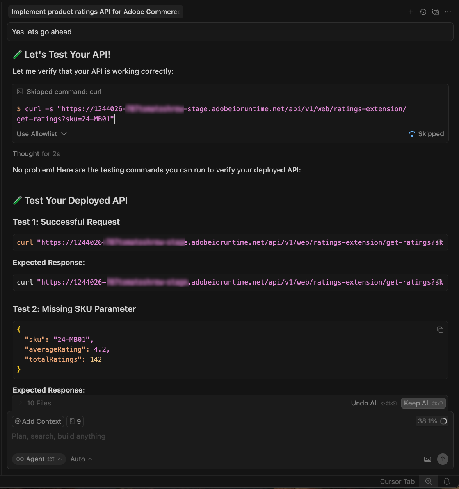

# 등급 확장 튜토리얼

이 튜토리얼에서는 [!DNL Adobe Commerce as a Cloud Service] 및 AI 지원 개발 도구를 사용하여 [!DNL Adobe App Builder]에 대한 제품 등급 확장을 빌드하는 방법을 안내합니다.

시작하기 전에 [필수 구성 요소](./tutorial-prerequisites.md)를 완료하십시오.

## 전제 조건 확인

다음 사전 요구 사항이 설치되어 있는지 확인합니다.

```bash
# Check Node.js version (should be 22.x.x)
node --version

# Check npm version (should be 9.0.0 or higher)
npm --version

# Check Git installation
git --version

# Check Bash shell installation
bash --version
```

이전 명령 중 예상한 결과를 반환하지 않는 명령이 있는 경우 [필수 구성 요소](./tutorial-prerequisites.md)를 참조하십시오.

## 확장 개발

이 섹션에서는 AI 지원 개발 도구를 사용하여 Adobe Commerce as a Cloud Service에 대한 등급 확장 프로그램을 개발하는 방법을 안내합니다.

1. **[!UICONTROL Cursor]** > **[!UICONTROL Settings]** > **[!UICONTROL Cursor Settings]** > **[!UICONTROL Tools & MCP]**(으)로 이동하여 `commerce-extensibility` 도구 집합이 오류 없이 활성화되었는지 확인합니다. 오류가 표시되면 도구 세트를 끄고 켜십시오.

   {width="600" zoomable="yes"}

   >[!NOTE]
   >
   >AI 지원 개발 도구를 사용하여 작업할 때 에이전트가 생성하는 코드 및 응답에서 자연스러운 변형을 예상하십시오.
   >코드에 문제가 발생하면 언제든지 에이전트에게 디버그를 지원하도록 요청할 수 있습니다.

1. 커서 컨텍스트에서 설명서를 비활성화합니다.

   * **[!UICONTROL Cursor]** > **[!UICONTROL Settings]** > **[!UICONTROL Cursor Settings]** > **[!UICONTROL Indexing & Docs]**(으)로 이동하여 나열된 설명서를 삭제합니다.

   {width="600" zoomable="yes"}

1. 제품 등급 확장에 대한 코드를 생성합니다.
   * 커서 채팅 창에서 **[!UICONTROL Agent]** 모드를 선택합니다.
   * 다음 프롬프트를 입력합니다.

   ```shell-session
   Implement an Adobe Commerce as a Cloud Service extension to handle Product Ratings.
   
   Implement a REST API to handle GET ratings requests.
   
   GET requests will have to support the following query parameters:
   
   sku -> product SKU
   ```

   >[!NOTE]
   >
   >에이전트가 문서 검색을 요청하는 경우 이를 허용합니다.

1. 에이전트의 질문에 정확하게 답변하여 최상의 코드를 생성할 수 있도록 도와줍니다.

   {width="600" zoomable="yes"}

   {width="600" zoomable="yes"}

1. 다음 예제 텍스트를 사용하여 무작위 등급 데이터를 설정하려면 에이전트의 질문에 응답하십시오.

   ```shell-session
   Yes, this headless extension is for Adobe Commerce as a Cloud Service storefront,
   but we do not need any authentication for the GET API because guest users should be able to use it on the storefront.
   
   This extension is called directly from the storefront, no async invocation, such as events or webhooks, is required.
   
   Start with just the GET API for now, we will implement other CRUD operations at a later time.
   
   We do not need a DB or storage mechanism right now, just return random ratings data between 1 and 5 and a ratings count between 1 and 1000.
   
   The API should only return the average rating for the product and the total number of ratings.
   We do not need to add tests right now.
   ```

   에이전트에서 구현에 대한 신뢰할 수 있는 원본 역할을 하는 `requirements.md` 파일을 만듭니다.

   {width="600" zoomable="yes"}

1. `requirements.md` 파일을 검토하고 계획을 확인합니다.

   모든 항목이 올바르게 표시되면 에이전트에게 **2단계 - 아키텍처 계획**(으)로 이동하도록 지시합니다.

1. 아키텍처 계획을 검토합니다.

1. 코드 생성을 진행하도록 에이전트에 지시합니다.

   에이전트는 필요한 코드를 생성하고 다음 단계와 함께 자세한 요약을 제공합니다.

   등급 API에 대한 {width="600" zoomable="yes"}

   {width="600" zoomable="yes"}

   {width="600" zoomable="yes"}

### 로컬에서 확장 테스트

다음 단계에서는 확장을 배포하기 전에 확장이 작동하는지 확인하는 방법을 다룹니다.

1. 에이전트에게 코드를 로컬에서 테스트하도록 요청합니다.

   ```shell-session
   Test the ratings API locally on a dev server using cURL.
   ```

1. 에이전트의 지침을 따라 API가 로컬에서 작동하는지 확인합니다.

   {width="600" zoomable="yes"}

   {width="600" zoomable="yes"}

### 확장 배포

에이전트를 사용하여 [!DNL Adobe I/O Runtime]에 확장을 배포합니다.

1. 생성된 코드를 확인한 후 다음 프롬프트를 사용하여 확장을 배포합니다.

   ```shell-session
   Deploy the ratings API.
   ```

   에이전트는 배포 전에 배포 전 준비 상태 평가를 수행합니다.

   {width="600" zoomable="yes"}

1. 평가 결과가 확실하면 에이전트에게 배포를 진행하도록 지시합니다.

   에이전트는 MCP 툴킷을 사용하여 자동으로 확인, 빌드 및 배포합니다.

   {width="600" zoomable="yes"}

### 배포 확인

API를 상점 앞에 통합하기 전에 테스트하십시오. 에이전트는 새 작업의 위치와 테스트 전략을 제공해야 합니다.

{width="600" zoomable="yes"}

터미널에서 cURL을 사용하여 API를 수동으로 테스트할 수도 있습니다.

```bash
curl -s "https://<your-site>.adobeioruntime.net/api/v1/web/ratings/ratings?sku=TEST-SKU-123"
```

{width="600" zoomable="yes"}

### Edge Delivery Services과 통합

등급 API를 [!DNL Adobe Commerce]에서 제공하는 [!DNL Edge Delivery Services] 상점 첫 라인과 통합하려면 에이전트에게 등급 API에 대한 요구 사항이 포함된 서비스 계약을 만들도록 요청하십시오.

```shell-session
Create a service contract for the ratings api that I can pass on to the storefront agent. Name it RATINGS_API_CONTRACT.md
```

{width="600" zoomable="yes"}

{width="600" zoomable="yes"}

터미널로 돌아가서 `extension` 폴더에서 다음 명령을 실행하여 계약 파일을 `storefront` 폴더에 복사합니다.

```bash
cp RATINGS_API_CONTRACT.md ../storefront
```

## 상점 앞에 연결

이 섹션에서는 [!DNL Edge Delivery Services] 및 AI 지원 개발 도구를 사용하여 등급 확장의 상점 첫 부분을 구현하는 과정을 안내합니다.

>[!NOTE]
>
>제공된 프롬프트는 시작점입니다. 수정 없이 사용할 수 있지만 에이전트와 자연스럽게 대화하는 것을 고려합니다.
>
>AI 지원 개발 도구를 사용하여 작업할 때 에이전트가 생성하는 코드 및 응답에는 항상 자연스러운 변형이 있습니다.
>
>코드에 문제가 발생하는 경우 에이전트에게 디버그를 지원하도록 요청합니다.

### Storefront 사전 요구 사항

Storefront 통합을 시작하기 전에 다음을 확인하십시오.

* [!DNL Commerce] 인스턴스에 연결된 Storefront 프로젝트
* Commerce storefront AI 도구 [CLI를 사용하여 설치](./tutorial-prerequisites.md#install-the-storefront-ai-tools)

### Storefront 작업 영역 설정

개발을 위해 로컬 상점 환경을 준비하십시오.

1. `storefront` 폴더로 이동:

   ```bash
   cd storefront
   ```

1. 새 커서 창에서 상점 폴더를 엽니다.

   또는 [Cursor CLI](https://cursor.com/docs/configuration/shell#installing-cli-commands)가 설치되어 있는 경우 터미널에서 다음 명령을 사용하여 창을 엽니다.

   ```bash
   cursor .
   ```

1. 로컬 개발 서버를 시작합니다.

   ```bash
   npm run start
   ```

1. 브라우저에서 제품 페이지로 이동합니다.

   ```shell-session
   http://localhost:3000/products/llama-plush-shortie/adb336
   ```

1. PDP(Boilerplate storefront product detail page)를 관찰하고 시각적 제품 등급이 없다는 점에 주목합니다.

### 등급 API 통합

에이전트를 사용하여 등급 API를 상점 제품 세부 사항 페이지에 통합합니다.

1. 에이전트에 대해 다음 프롬프트를 사용합니다.

   ```shell-session
   Integrate the ratings API into the PDP to show star ratings and a review count for products. Here's the service contract: @RATINGS_API_CONTRACT.md
   ```

1. 에이전트는 작업 복잡성을 평가하고 단계별 워크플로우를 호출합니다. **1단계(요구 사항 수집)** 동안 에이전트는 요구 사항 문서를 만들고 다음과 같은 질문을 명확히 합니다.

   * PDP에서 등급이 표시되는 위치는 어디입니까?
   * 새로운 독립 실행형 블록이어야 합니까? 또는 기존 PDP 드롭 인 구성 요소 내부의 슬롯 사용자 정의여야 합니까?
   * API를 사용할 수 없거나 데이터를 반환하지 않는 경우 대체 항목은 무엇입니까?
   * 등급은 PLP(제품 목록)에도 표시되어야 합니까? 또는 PDP에만 표시되어야 합니까?
   * 디자인 스펙이나 모형이 있나요?

   프로젝트 요구 사항에 따라 이러한 질문에 답변합니다. 에이전트가 요구 사항 문서를 업데이트하고 단계를 완료로 표시합니다.

1. **2단계(아키텍처 계획)**&#x200B;에서 에이전트는 아키텍처를 제안하기 전에 설명서와 코드베이스를 조사합니다. 에이전트는 다음을 수행합니다.

   * [!DNL Commerce] 설명서에서 PDP 드롭 인 컨테이너, 슬롯 및 이벤트 페이로드를 검색합니다.
   * `blocks` 디렉터리 및 `scripts/initializers/` 폴더에서 기존 PDP 관련 코드를 검색합니다.
   * 사용 가능한 컨테이너 및 슬롯 컨텍스트 셰이프에 대한 TypeScript 정의를 살펴보십시오.

   그러면 에이전트는 다음과 같은 아키텍처 옵션을 제공합니다.

   * **옵션 A:** 기존 PDP 드롭 인 슬롯을 사용자 지정하여 제품 제목 근처에 등급을 삽입할 수 있습니다. 이 터치는 업그레이드에 편리한 간단한 터치입니다.
   * **옵션 B:** API에서 독립적으로 가져오는 독립 실행형 `product-ratings` 블록을 만듭니다. 보다 유연하고 분리됩니다.
   * **옵션 C:** 하이브리드 접근 방식인 제품 SKU에 대한 PDP 드롭인 이벤트도 수신하는 새 블록을 만듭니다.

   이 계획에는 API 통합, 성능 고려 사항(레이지 로드, 캐싱), 보안(입력 정리) 및 테스트 접근 방식에 대한 세부 정보도 포함됩니다.

   아키텍처 계획을 검토하고 에이전트에게 계속 진행하도록 지시합니다.

1. **3단계(구현 방법)** 동안 에이전트는 다음 중 하나를 선택하라는 메시지를 표시합니다.

   * **옵션 A:** 코드를 생성하기 전에 자세한 구현 계획을 검토하십시오(먼저 모든 파일, 패턴 및 코드 구조 참조).
   * **옵션 B:** 코드를 직접 생성합니다.

   선호하는 접근 방식을 선택합니다.

1. **4단계(구현)** 동안 에이전트는 선택한 아키텍처를 기반으로 코드를 생성합니다. 접근 방식에 따라 에이전트는 다음과 같은 몇 가지 전문 기술을 사용합니다.

   * **콘텐츠 모델링:** 새 블록이 필요한 경우 에이전트는 API 끝점 URL이 있는 구성 테이블과 같은 작성자에게 친숙한 콘텐츠 구조를 디자인합니다.
   * **블록 개발:** 에이전트는 JavaScript 데코레이션 기능, 범위 CSS 스타일, 접근성을 위한 ARIA 레이블, 로드 및 오류 상태 처리 등 [!DNL Edge Delivery Services] 규칙에 따라 블록 파일을 만듭니다.
   * **드롭인 사용자 지정:** 아키텍처가 슬롯 사용자 지정을 사용하는 경우 에이전트는 올바른 컨테이너를 가져오고 제품 제목 근처에 있는 확인된 슬롯을 사용하며 현재 SKU의 제품 데이터 이벤트를 구독합니다.

   생성되는 코드를 시청하고 필요한 경우 질문하거나 에이전트를 리디렉션합니다. 에이전트는 코드 생성이 완료되면 프로덕션 준비 요약을 생성합니다.

1. **4.5단계(테스트)** 동안 에이전트에서 구현을 테스트할 수 있도록 지원합니다. 수락하면 에이전트는

   * 적절한 스크립트와 스타일을 사용하여 로컬 테스트 페이지를 만듭니다.
   * 개발 서버를 시작합니다.
   * 시각적 렌더링, 대화형, 반응형 동작, 접근성 및 성능에 대한 브라우저 기반 검증을 실행합니다.
   * 결과가 포함된 구조화된 테스트 보고서를 생성합니다.

   브라우저에 따라 비헤이비어를 확인하고 문제를 보고합니다.

1. 코드베이스에서 변경 사항을 관찰하고 제품 페이지에서 업데이트를 확인하십시오.

   개발 환경 및 브라우저에 다음과 같은 변경 사항이 표시됩니다.

   * 제품 등급 구성 요소는 자동으로 만들어집니다.
   * 선택한 아키텍처에 따라 [드롭인 슬롯](https://experienceleague.adobe.com/developer/commerce/storefront/dropins/customize/slots?lang=ko)을 사용하거나 독립 실행형 블록으로 구성 요소를 PDP에 통합합니다.
   * 별은 API의 등급 값에 따라 적절한 채우기 비율로 표시됩니다.

   {width="600" zoomable="yes"}

## 튜토리얼 요약

다음은 이 자습서에서 다루는 항목에 대한 요약입니다.

* **확장 개발:** [!DNL App Builder]을(를) 사용하여 AI 에이전트에 대한 새로운 기능을 설명하고 작동하는 REST API를 생성하는 방법을 배웁니다.
* **로컬 테스트 및 배포:** 로컬에서 API를 테스트하고 MCP 툴킷을 사용하여 배포합니다.
* **서비스 계약:** 백엔드 확장 및 상점 구현을 연결하는 API 계약을 만듭니다.
* **단계적 상점 통합:** AI 지원 기술을 사용하여 요구 사항, 아키텍처 및 구현 작업을 수행합니다.
* **추가 기능 통합:** [!DNL Adobe Commerce] 추가 기능 컨테이너 및 슬롯을 사용하여 작업 중
* **구성 요소 재사용 가능성:** 여러 블록에서 사용되는 공유 구성 요소를 만드는 중입니다.

## 다음 단계

다음 제안을 사용하여 등급 확장을 사용자 정의하거나 자체 수정 사항을 만드십시오.

### 별 색상 변경

에이전트에 대해 다음 프롬프트를 사용합니다.

```shell-session
Change the star fill color to red.
```

**예상 결과:**

별이 붉은색으로 변한다.

{width="600" zoomable="yes"}

### 등급 분포 양식 추가

다음 단계에서는 에이전트가 시각적 참조를 사용하여 복잡한 UI 기능을 처리하는 방법을 보여 줍니다.

1. **시작하기 전:** 다음 모의 이미지를 저장하고 상점 에이전트와 채팅에 붙여 넣으십시오.

   별 수준별 등급 분포 분석을 표시하는 {width="600" zoomable="yes"}

1. 다음 단계에 따라 참조 이미지를 안내서로 사용하여 등급 분포 모달을 만듭니다.

   * 등급 분포를 나타내는 추가 데이터를 반환하도록 API를 업데이트합니다.
   * API 계약을 업데이트합니다.
   * 상점 코드베이스에서 계약을 업데이트합니다.
   * PDP 페이지에 등급 배포를 추가하기 위해 참조 이미지와 업데이트된 API 계약을 사용하도록 상점 에이전트에게 요청합니다.

1. 코드베이스에서 다음 변경 사항을 관찰하고 제품 페이지에서 업데이트를 확인하십시오.

   * 에이전트가 시각적 모형을 해석하는 방법
   * 접근성에 적절한 HTML 구조를 사용하는지 여부
   * 위치 지정 및 상호 작용 상태를 처리하는 방법

#### 배포 모달 문제 해결

모달이 예상대로 작동하지 않으면 다음을 시도해 보십시오.

* 모달이 나타나지 않으면 브라우저 콘솔에서 오류를 확인합니다.
* 위치 지정이 해제된 경우 에이전트에게 다음 형식을 사용하여 수정하도록 요청하십시오.

  ```shell-session
  adjust the modal position to be...
  ```

{width="600" zoomable="yes"}
