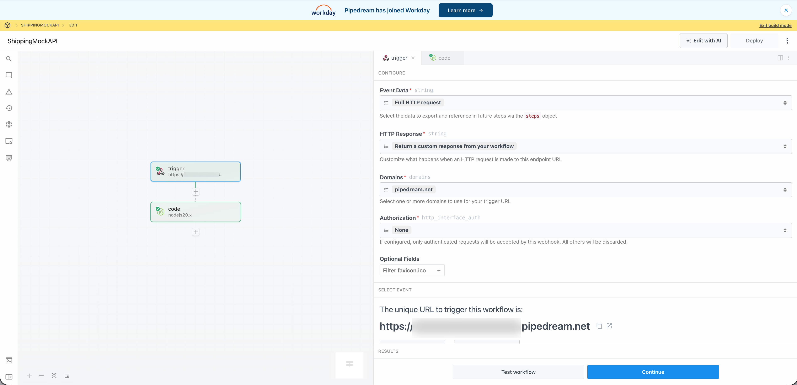
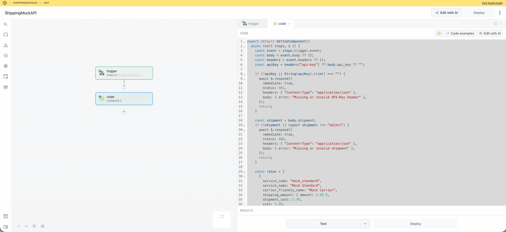

# 배송 방법 확장 튜토리얼

이 튜토리얼에서는 [!DNL Adobe Commerce as a Cloud Service], [!DNL Adobe App Builder]체크아웃 스타터 키트[&#x200B; 및 AI 지원 개발 도구를 사용하여 &#x200B;](https://developer.adobe.com/commerce/extensibility/starter-kit/checkout/){target="_blank"}에 대한 배송 방법 확장을 빌드하는 방법을 안내합니다.

확장 기능은 체크아웃 시 구성 가능한 배송 방법을 추가하여 외부 모의 배송 요금 서비스에서 요금을 가져옵니다. 판매자는 관리 UI에서 서비스 URL, API 키 및 웨어하우스(배송처) 주소를 구성하고 체크아웃 시 확장 기능이 해당 서비스의 요금을 요청하고 반환된 옵션을 고객에게 표시합니다.

시작하기 전에 [필수 구성 요소](./tutorial-prerequisites.md)를 완료하십시오.

## 전제 조건 확인 {#tutorial-verify-prerequisites}

다음 사전 요구 사항이 설치되어 있는지 확인합니다.

```bash
# Check Node.js version (should be 22.x.x)
node --version

# Check npm version (should be 9.0.0 or higher)
npm --version

# Check Git installation
git --version

# Check Bash shell installation
bash --version
```

이전 명령 중 예상한 결과를 반환하지 않는 명령이 있는 경우 [필수 구성 요소](./tutorial-prerequisites.md)를 참조하십시오.

## 모의 배송비 API 만들기

[필수 구성 요소](./tutorial-prerequisites.md)를 완료한 후 [!DNL Commerce Admin]에서 확장을 구성할 때 서비스 URL과 API 키를 사용할 수 있도록 모의 배송률 API를 만드십시오. 확장 프로그램이 외부 배송률 API를 호출합니다. 이 자습서에서는 실제 통신사 계정 없이 흐름을 실행할 수 있도록 하는 모의 API를 사용합니다. [Pipedream](https://pipedream.com)을(를) 사용하여 모의 API를 만듭니다(무료 계정 필요). 모의 API는 일반적인 실제 배송비 API와 유사한 요청/응답 계약을 사용하므로 이 확장을 나중에 실제 공급자에게 연결하는 것은 간단해야 합니다.

모의 API를 만들려면 [모의 비율 API 사양 파일](../assets/mock-rates-api-spec.zip)을(를) 다운로드하여 연 다음 프로젝트에 `.md` 파일을 추가하십시오(예: `docs/mock-rates-api-spec.md`).

**시간:** 모의 API를 만드는 데 약 **5~10분**&#x200B;이 소요됩니다.

### 워크플로우 및 HTTP 트리거 만들기

1. [pipedream.com](https://pipedream.com)&#x200B;(으)로 이동하여 등록하거나 로그인합니다.
1. **새 워크플로**(또는 **워크플로 추가**)를 클릭합니다.
1. 트리거를 사용하려면 **HTTP/Webhook**&#x200B;을(를) 선택하십시오.
1. 트리거 구성에서 **HTTP 응답**&#x200B;을(를) **워크플로에서 사용자 지정 응답을 반환**(으)로 설정합니다. 이렇게 하면 코드 단계에서 모의 JSON 응답을 보낼 수 있습니다.
1. Pipedream은 **과(와) 같은 고유한** HTTP 끝점 URL`https://123456.m.pipedream.net`을(를) 표시합니다.
1. **이 URL을 복사하여** Commerce 관리에서 확장을 구성할 때 **서비스 URL**(으)로 사용합니다.

   HTTP/Webhook 트리거와 끝점 URL이 표시되는 {width="600" zoomable="yes"}

트리거에서 **인증**&#x200B;을 구성할 필요가 없습니다. 모의 API는 코드 단계에서 `API-Key` 헤더의 유효성을 검사합니다.

### 코드 단계 추가

1. 단계를 추가하려면 **+** 아이콘을 클릭하십시오.
1. **Node.js 코드 실행**&#x200B;을 선택합니다(코드 단계).
1. 기본 코드를 다음 JavaScript으로 **바꾸기**&#x200B;합니다.

   ```javascript
   export default defineComponent({
   async run({ steps, $ }) {
      const event = steps.trigger.event;
      const body = event.body ?? {};
      const headers = event.headers ?? {};
      const apiKey = headers["api-key"] ?? body.api_key ?? "";
   
      if (!apiKey || String(apiKey).trim() === "") {
         await $.respond({
         immediate: true,
         status: 401,
         headers: { "Content-Type": "application/json" },
         body: { error: "Missing or invalid API-Key header" },
         });
         return;
      }
   
      const shipment = body.shipment;
      if (!shipment || typeof shipment !== "object") {
         await $.respond({
         immediate: true,
         status: 400,
         headers: { "Content-Type": "application/json" },
         body: { error: "Missing or invalid shipment" },
         });
         return;
      }
   
      const rates = [
         {
         service_code: "mock_standard",
         service_name: "Mock Standard",
         carrier_friendly_name: "Mock Carrier",
         shipping_amount: { amount: 5.99 },
         shipment_cost: 5.99,
         cost: 5.99,
         },
         {
         service_code: "mock_express",
         service_name: "Mock Express",
         carrier_friendly_name: "Mock Carrier",
         shipping_amount: { amount: 12.99 },
         shipment_cost: 12.99,
         cost: 12.99,
         },
      ];
   
      await $.respond({
         immediate: true,
         status: 200,
         headers: { "Content-Type": "application/json" },
         body: { rates },
      });
   },
   });
   ```

1. **배포**&#x200B;를 클릭합니다.

   {width="600" zoomable="yes"}

Mock은 비어 있지 않은 `API-Key` 헤더와 `shipment` 개체를 포함하는 유효한 요청에 대해 두 개의 비율 옵션(Mock Standard 및 Mock Express)을 반환합니다. 이 자습서의 뒷부분에서 [!DNL Commerce Admin]의 API 키를 구성합니다. 또한 동일한 구성 화면에 Pipedream 워크플로우 URL을 지정하므로 기록해 두십시오.

## 확장 개발

이 섹션에서는 [!DNL Adobe Commerce as a Cloud Service]체크아웃 스타터 키트[&#x200B; 및 AI 지원 개발 도구를 사용하여 &#x200B;](https://developer.adobe.com/commerce/extensibility/starter-kit/checkout/){target="_blank"}용 배송 방법 확장을 개발하는 방법을 안내합니다.

1. 코딩 에이전트의 MCP 설정으로 이동합니다. 예를 들어 커서에서 **[!UICONTROL Cursor]** > **[!UICONTROL Settings]** > **[!UICONTROL Cursor Settings]** > **[!UICONTROL Tools & MCP]**(으)로 이동합니다. `commerce-extensibility` 도구 집합이 오류 없이 사용하도록 설정되어 있는지 확인하십시오. 오류가 표시되면 도구 세트를 끄고 켜십시오.

   {width="600" zoomable="yes"}

   >[!NOTE]
   >
   >AI 지원 개발 도구를 사용하여 작업할 때 에이전트가 생성하는 코드 및 응답에서 자연스러운 변형을 예상하십시오.
   >
   >코드에 문제가 발생하면 언제든지 에이전트에게 디버그를 지원하도록 요청할 수 있습니다.

1. 커서 컨텍스트에 추가된 설명서가 있는 경우 비활성화합니다. [!UICONTROL **커서**] > [!UICONTROL **설정**] > [!UICONTROL **커서 설정**] > [!UICONTROL **색인화 및 문서**]&#x200B;(으)로 이동하여 나열된 문서를 삭제합니다.

   {width="600" zoomable="yes"}

1. 클라이언트를 올바르게 구현할 수 있도록 에이전트에게 모의 비율 API 사양에 대한 액세스 권한을 부여합니다. 아직 다운로드하지 않았다면 [mock rate API 사양 파일](../assets/mock-rates-api-spec.zip)을(를) 다운로드하여 연 다음 `.md` 파일을 프로젝트에 추가한 다음(예: `docs/mock-rates-api-spec.md`) 프롬프트에서 해당 파일을 참조하십시오.

1. 운송 방법 확장을 생성합니다.

   - 가능한 경우 에이전트의 채팅 창에서 **플랜** 모드를 선택하십시오. 이렇게 되면 에이전트가 계획 없이 진행할 수 없습니다.
   - 다음 프롬프트를 입력합니다.

   ```shell-session
   Build an Adobe Commerce extension that adds a shipping method at checkout. The rates come from an external mock shipping rates service: the merchant configures the service's URL and API key in Admin, and at checkout the extension asks that service for rates and shows the returned options to the customer.
   
   External service (mock shipping rates API):
   - The service endpoint URL is configurable by the merchant (for example https://123456.m.pipedream.net).
   - The API is specified in ./docs/mock-rates-api-spec.md.
   
   The merchant must be able to configure the following in the Adobe Commerce Admin UI. Use the Adobe Commerce Admin UI SDK (or equivalent App Builder extensibility options for the Admin) to add a configuration screen where the merchant can set:
   - The service URL (where the extension sends rate requests).
   - An API key the service expects (any non-empty value for the mock). The API key is sensitive data: it must be stored securely and must never appear in logs, error messages, or in the UI in full (e.g. mask in the UI).
   - The warehouse (ship-from) address: name, phone, street, city, state, postal code, country. This is the origin used when requesting rates.
   ```

   >[!NOTE]
   >
   >에이전트가 문서 검색을 요청하는 경우 이를 허용합니다.

   {width="600" zoomable="yes"}

1. 에이전트의 질문에 정확하게 답변하여 최상의 코드를 생성할 수 있도록 도와줍니다. 에이전트에서 사용할 키트 또는 템플릿을 묻는 경우 배송 도메인과 관리자 UI SDK 확장 기능이 있는 [체크아웃 스타터 키트](https://developer.adobe.com/commerce/extensibility/starter-kit/checkout/){target="_blank"}로 보내면 배송 웹후크와 판매자 구성 화면이 모두 구현됩니다.

   에이전트는 구현을 위한 신뢰할 수 있는 원본 역할을 하는 `requirements.md`(또는 이에 상응하는) 파일을 만들 수 있습니다.

1. `requirements.md`(또는 이에 상응하는) 파일을 검토하고 계획을 확인합니다. 모든 것이 올바르게 보이는 경우 에이전트에게 아키텍처 계획(또는 **단계 2**)으로 이동하도록 지시합니다. 다음을 확인합니다.

   - **shipping-methods** 작업(또는 이와 동등한 작업)은 Commerce 웹후크를 처리하고 외부 속도 API를 호출합니다.
   - **shipping-config**(또는 이와 동등한 작업)은 런타임 상태와 같이 구성이 안전하게 저장된 GET(읽기 구성, API 키 마스크) 및 SET(저장 서비스 URL, API 키, 웨어하우스 주소)를 지원합니다.
   - 관리 UI에는 서비스 URL, API 키(암호/마스크) 및 웨어하우스 주소 필드가 있는 **모의 배송**(또는 이와 유사한) 탭이 있습니다.

   {width="600" zoomable="yes"}

1. 에이전트가 제공할 때 아키텍처 계획을 검토합니다.

   {width="600" zoomable="yes"}

1. 코드 생성을 진행하도록 에이전트에 지시합니다. 에이전트는 Commerce에서 반환된 메서드를 수락하고 웹후크 메서드 **(웹후크 유형**&#x200B;후`plugin.magento.out_of_process_shipping_methods.api.shipping_rate_repository.get_rates`, 필수 **선택 사항**)를 사용할 수 있도록 하는 **mock** 캐리어를 배송 회사 구성에 추가해야 합니다.

   에이전트는 필요한 코드를 생성하고 다음 단계(종속성 설치, 모의 통신사 등록, Commerce 웹후크 구성 및 배포 등)와 함께 자세한 요약을 제공합니다.

   {width="600" zoomable="yes"}

   {width="600" zoomable="yes"}

### 배포 전 정리

배포하기 전에 응용 프로그램에 필요하지 않은 코드를 제거합니다. 체크아웃 시작 키트에는 사용하지 않는 도메인(예: 결제, 세금 또는 이벤트) 및 스캐폴딩이 포함될 수 있습니다. 다음 메시지를 사용하여 에이전트가 이를 제거하고 배송 및 [!DNL Admin UI] 부품만 보관하도록 합니다.

```shell-session
Proceed with Phase 5 cleanup.
```

에이전트는 정리 보고서를 생성하고, 사용하지 않은 작업, 구성 및 스크립트를 제거하고, 프로젝트를 업데이트합니다. 배포하기 전에 이 단계를 완료하십시오.

제거 및 유지된 구성 요소를 보여 주는 {width="600" zoomable="yes"}

### 확장 배포

1. 생성된 코드를 확인한 후 다음 프롬프트를 사용하여 확장을 배포합니다.

   ```shell-session
   Deploy the app.
   ```

   에이전트는 배포 전 준비 상태 평가를 수행합니다(예: 관리 UI 또는 Commerce API가 사용되는 경우 `.env`, `COMMERCE_WEBHOOKS_PUBLIC_KEY` 및 OAuth/IMS 변수에 대한 `COMMERCE_BASE_URL` 확인).

   {width="600" zoomable="yes"}

1. 평가 결과가 확실하면 에이전트에게 배포를 진행하도록 지시합니다. 에이전트는 MCP 툴킷을 사용하여 자동으로 확인, 빌드 및 배포합니다.

   {width="600" zoomable="yes"}

### 배포 후

배포 후 다음 단계를 완료하여 모의 캐리어를 등록하고, 웹후크 및 [!DNL Admin UI]을(를) 구성하고, 체크 아웃 시 확장을 확인합니다.

1. **Commerce에서 모의 통신사를 등록**(배포 후 한 번 실행):

   ```bash
   npm run create-shipping-carriers
   ```

   스크립트가 통신사를 등록할 수 있도록 `.env`에 `COMMERCE_BASE_URL`과(와) 유효한 OAuth/IMS 자격 증명이 있는지 확인하십시오.

1. **[!DNL Commerce Admin]에서 배송 웹후크 구성:**

   - **스토어** > 설정 > **구성** > **Adobe 서비스** > **Commerce 웹후크**&#x200B;로 이동합니다.
   - 웹후크 추가:
      - **Webhook 메서드:** `plugin.magento.out_of_process_shipping_methods.api.shipping_rate_repository.get_rates`
      - **Webhook 유형:** **이후**
      - **URL:** 배포된 **배송 방법** 웹 작업 URL(배포 출력 또는 [!DNL Adobe Developer Console])입니다.
      - **필수:** **선택 사항** - 외부 API에서 요금을 반환하지 않는 경우 체크아웃이 계속 작동합니다.

   {width="600" zoomable="yes"}

1. **[!DNL Admin UI SDK] 확장 구성:**

   - [!DNL Commerce Admin]에서 **스토어** > 설정 > **구성**(으)로 이동합니다.
   - **Adobe 서비스** > **관리자 UI SDK**&#x200B;을 엽니다.
   - **관리 UI SDK 사용**&#x200B;을(를) **예**(으)로 설정하고 아직 활성화되지 않은 경우 **구성 저장**&#x200B;을(를) 클릭합니다.
   - **확장 구성**&#x200B;을 클릭하고 앱을 배포할 작업 영역을 선택한 다음 **적용**&#x200B;을 클릭합니다. **사용자 지정** 옵션을 선택하고 작업 영역 이름을 입력할 수도 있습니다.
   - 목록에서 [!DNL App Builder] 앱을 선택하고 저장합니다. 앱이 나타나지 않으면 **등록 새로 고침**&#x200B;을 클릭하고 다시 시도하십시오.

   {width="600" zoomable="yes"}

1. **Adobe Commerce 관리 UI에서 모의 배송 방법을 구성합니다.**
   - **앱**&#x200B;을 열고 앱을 선택하세요.
   - **모의 배송** 탭을 엽니다(또는 이에 해당).
   - 다음 세부 정보를 입력합니다.
      - 복사한 Pipedream 워크플로 URL을 **서비스 URL:**(예: `https://123456.m.pipedream.net`).
      - **API 키:** 모음에 대해 비어 있지 않은 모든 값(예: `tutorial-key`).
      - **웨어하우스(배송처) 주소:** 이름, 전화, 거리, 도시, 주, 우편 번호, 국가.
   - **저장**&#x200B;을 클릭합니다. 구성은 런타임 상태로 저장되며 전달 방법 작업에 사용됩니다.

   서비스 URL, API 키 및 웨어하우스 주소가 있는 {width="600" zoomable="yes"}

1. **체크아웃 시 확인:** 장바구니에 제품을 추가하고 체크아웃으로 이동하여 배송 주소를 입력하십시오. 모의 배송 옵션이 표시됩니다(예: **Mock Standard** 및 **Mock Express**).

   {width="600" zoomable="yes"}

### 문제 해결

- **구성이 관리자 UI에 저장되지 않음:** &quot;응답이 올바른 &#39;message/http&#39;가 아님&quot;이 표시되거나 저장 후 값이 업데이트되지 않으면 다음과 유사한 명령을 사용하여 구성 작업에 대한 런타임 활성화 로그를 확인하십시오.

  ```bash
  aio app logs --action CustomMenu/shipping-config --limit 20
  ```

  일반적인 원인으로는 특정 응답 형식(예: 문자열 본문 및 `Content-Type: application/json`)이 필요한 게이트웨이 또는 문자열 값이 필요한 상태 라이브러리가 있습니다. 작업에서 config를 문자열로 저장하고 읽을 때 구문 분석하는지 확인하고, 전달 메서드 작업에서 동일한 구문 분석을 사용하는지 확인하십시오. 에이전트 채팅 또는 로그를 검토하여 정확한 원인과 수정 사항을 확인합니다.

- **&quot;응답이 하나 이상의 작업 &quot;**(Webhook 로그에 있음)을 포함해야 합니다. Commerce에서 배송 Webhook이 하나 이상의 작업을 반환해야 합니다. 에이전트에게 전달 방법 작업이 빈 작업 배열을 반환하지 않는지 확인하도록 요청합니다(예: 외부 API가 비율을 반환하지 않을 때 대체 비율을 반환).

- **체크아웃 시 배송비 없음:** 웹후크 URL 및 메서드가 올바른지 확인하고 모의 운송업체가 등록되었는지(`npm run create-shipping-carriers`), 모의 배송 구성이 [!DNL Admin UI]에 설정되어 있는지 확인합니다. 런타임 로그에서 API 또는 유효성 검사 오류에 대한 전달 메서드 작업을 확인하고 작업이 하나 이상의 작업을 반환하는지 확인하십시오. [!DNL Commerce]에 &quot;응답이 하나 이상의 작업을 포함해야 합니다&quot;라는 메시지가 표시되지 않습니다.

### 튜토리얼 요약

다음은 이 자습서에서 다루는 항목에 대한 요약입니다.

- **사전 요구 사항 및 설정:** 도구를 확인하고 모의 배송 요금 API를 만듭니다.
- **에이전트 기반 개발:** 상거래 확장성 도구 집합을 사용하여 배달 webhook 및 관리 UI에 대한 요구 사항, 구현 계획 및 코드를 생성합니다.
- **5단계 정리:** 배포하기 전에 사용하지 않은 체크아웃 스타터 키트 도메인 및 스캐폴딩이 제거되었습니다.
- **배포:** 배포 전 평가 및 MCP 도구 키트 배포.
- **배포 후 구성:** 모의 통신사 등록, [!DNL Commerce] 웹후크 구성, [!DNL Admin UI SDK] 확장 사용 및 [!DNL Admin UI]에서 모의 배송(서비스 URL, API 키, 웨어하우스)을 설정합니다.
- **확인:** 체크아웃 시 모의 배송 옵션을 확인하는 것이 나타납니다.

### 다음 단계

이 자습서를 사용하여 추가 실험하려면 다음 사항을 고려하십시오.

- [!DNL Commerce]에 모의 캐리어를 등록하고 각 배포 후 배송 웹후크를 구성하는 후크를 사용하여 배포 후 설정을 자동화합니다.
- [!DNL Admin UI]에서 서비스 URL 및 API 키를 변경하여 확장을 실제 전송 속도 API로 지정합니다.
- [!DNL Admin UI]을(를) 확장하여 통신사 상태를 표시하거나 요금 서비스에 대한 연결을 테스트하세요.
