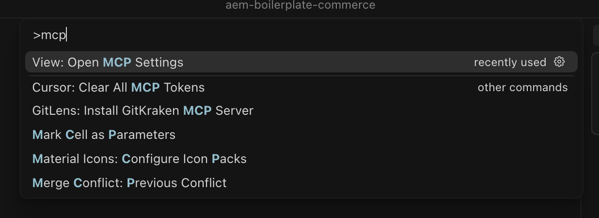
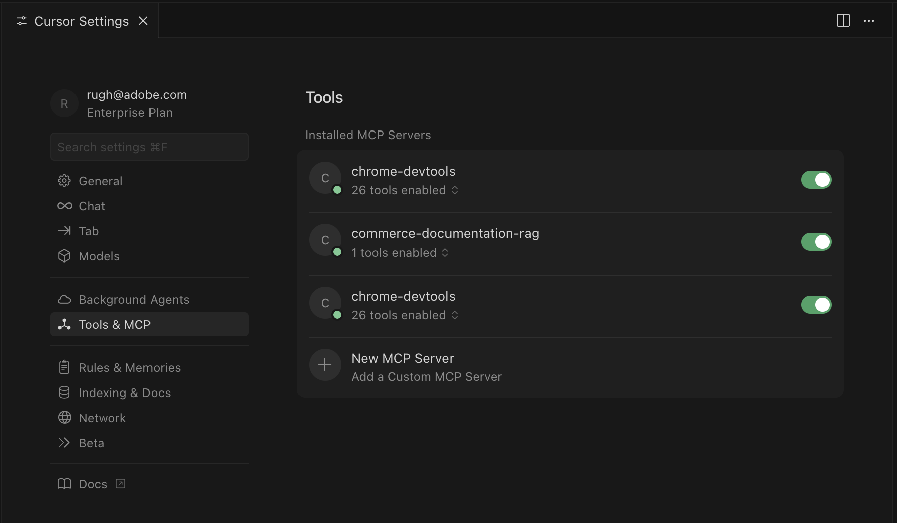
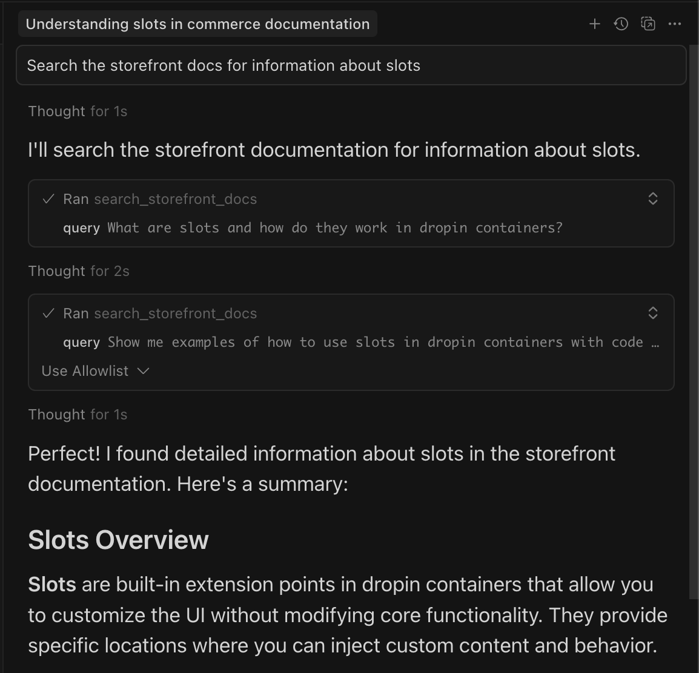

# 자습서 사전 요구 사항

이 페이지에는 [!DNL Adobe Commerce as a Cloud Service]등급 확장 튜토리얼[&#x200B; 및 &#x200B;](./ratings-extension.md)배송 방법 확장 튜토리얼[과 같은 &#x200B;](./shipping-method-extension.md) 튜토리얼의 필수 구성 요소와 설정 단계가 나열됩니다.

## Adobe Commerce as a Cloud Service 사전 요구 사항

* [!DNL Adobe I/O CLI] 설치

  ```bash
  npm install -g @adobe/aio-cli
  ```

* [Adobe I/O CLI Commerce](https://github.com/adobe-commerce/aio-cli-plugin-commerce), [Adobe I/O CLI 런타임](https://github.com/adobe/aio-cli-plugin-runtime) 및 [App Builder CLI](https://github.com/adobe/aio-cli-plugin-app-dev) 플러그인을 설치하십시오.

  ```bash
  aio plugins:install https://github.com/adobe-commerce/aio-cli-plugin-commerce @adobe/aio-cli-plugin-app-dev @adobe/aio-cli-plugin-runtime
  ```

* [Cursor](https://cursor.com/download)&#x200B;(권장)과 같은 AI 지원 IDE를 다운로드하거나, Claude Code, Gemini CLI 또는 Copilot과 같은 다른 IDE도 지원되지만 프롬프트와 자습서의 다른 단계를 수정해야 할 수 있습니다.

### Adobe Developer Console 사전 요구 사항

1. [Adobe Developer Console](https://developer.adobe.com/console){target="_blank"}(으)로 이동합니다.
1. 이메일 및 암호를 사용하여 로그인합니다.

#### 새 프로젝트 만들기

1. [Adobe Developer Console](https://developer.adobe.com/)&#x200B;(으)로 이동합니다.
1. [!UICONTROL **템플릿에서 프로젝트 만들기**]&#x200B;를 클릭합니다.
1. [!UICONTROL **App Builder**] 템플릿을 선택하십시오.
1. [!UICONTROL **프로젝트 제목**] 및 [!UICONTROL **앱 이름**]&#x200B;을 입력하십시오.
1. **[!UICONTROL Include Runtime]** 확인란이 표시되어 있는지 확인하십시오.

   {width="600" zoomable="yes"}

1. [!UICONTROL **저장**]&#x200B;을 클릭합니다.

#### 작업 공간에 API 추가

1. [!UICONTROL **단계**] 작업 영역을 클릭한 다음 각 API에 대해 다음 단계를 반복합니다.

   {width="600" zoomable="yes"}

1. [!UICONTROL **서비스 추가**]&#x200B;를 클릭하고 [!UICONTROL **API**]&#x200B;을(를) 선택합니다.

1. 다음 API 중 하나를 선택합니다. 아래 나열된 각 API에 대해 이 프로세스를 반복해야 합니다.

   * [!UICONTROL **Adobe 서비스**] 필터:
      * [!UICONTROL **I/O 관리 API**]
      * [!UICONTROL **I/O 이벤트**] API
   * [!UICONTROL **Experience Cloud**] 필터:
      * [!UICONTROL **Adobe Commerce용 Adobe I/O Events**] API

1. [!UICONTROL **다음**]&#x200B;을 클릭합니다.

1. [!UICONTROL **구성된 API 저장**]&#x200B;을 클릭합니다.

1. 모든 API가 작업 공간에 추가될 때까지 이전 단계를 반복합니다.

   {width="600" zoomable="yes"}

### Adobe I/O CLI 구성

1. 기존 구성을 지웁니다.

   ```bash
   aio config clear
   ```

   [!DNL Adobe I/O CLI]을(를) 사용하여 로그인:

   ```bash
   aio auth login -f
   ```

1. 다음 각 명령을 사용하여 조직, 프로젝트 및 작업 영역을 선택합니다.

   ```bash
   aio console org select
   ```

   ```bash
   aio console project select
   ```

   ```bash
   aio console workspace select
   ```

   {width="600" zoomable="yes"})

### 시작 키트 복제

빌드하고 있는 확장에 대해 다음 Commerce 스타터 키트 저장소 중 하나를 복제하고 프로젝트를 준비합니다.

통합 시작 키트:

```bash
git clone https://github.com/adobe/commerce-integration-starter-kit.git extension
cd extension
```

체크아웃 스타터 키트:

```bash
git clone https://github.com/adobe/commerce-checkout-starter-kit.git extension
cd extension
```

>[!BEGINTABS]

>[!TAB 통합 시작 키트]

### .env 파일 만들기

환경 구성 파일 만들기:

```bash
cp env.dist .env
```

텍스트 편집기에서 `.env` 파일을 열고 다음 OAuth 자격 증명을 추가합니다.

```shell-session
OAUTH_CLIENT_ID=
OAUTH_CLIENT_SECRET=
OAUTH_TECHNICAL_ACCOUNT_ID=
OAUTH_TECHNICAL_ACCOUNT_EMAIL=
OAUTH_ORG_ID=
```

작업 영역에서 **[!UICONTROL Credential details]** 탭을 클릭하여 [Developer Console](https://developer.adobe.com/)의 **[!UICONTROL OAuth Server-to-Server]** 페이지에서 이러한 값을 복사할 수 있습니다.

Adobe Developer Console의 {width="600" zoomable="yes"}

#### Commerce 구성 추가

`.env` 파일에 다음 Commerce 인스턴스 세부 정보를 추가합니다.

```shell-session
COMMERCE_BASE_URL=
COMMERCE_GRAPHQL_ENDPOINT=
```

다음 값을 찾으려면:

1. [Commerce Cloud 서비스 인스턴스](https://experience.adobe.com/#/@commerce/commerce/cloud-service/instances)&#x200B;(으)로 이동합니다.
1. 인스턴스 옆에 있는 정보 아이콘을 클릭합니다.
1. REST 끝점을 `COMMERCE_BASE_URL`(으)로 복사합니다.
1. GraphQL 끝점을 `COMMERCE_GRAPHQL_ENDPOINT`(으)로 복사합니다.

#### 이벤트 접두사 설정

이벤트 접두사에 대한 임시 값을 설정합니다.

```shell-session
EVENT_PREFIX=test
```

### 작업 공간 구성 다운로드

다음 명령을 실행하여 작업 영역 구성 파일을 다운로드합니다.

```bash
aio console workspace download workspace.json
```

작업 영역 구성 파일을 `scripts` 디렉터리에 복사합니다.

```bash
cp workspace.json scripts/
```

### 로컬 작업 영역을 원격 작업 영역에 연결

로컬 프로젝트를 원격 작업 영역에 연결합니다.

```bash
aio app use workspace.json -m
```

{width="600" zoomable="yes"}

>[!TAB 체크아웃 시작 키트]

### 로컬 작업 영역을 원격 작업 영역에 연결

로컬 프로젝트를 원격 작업 영역에 연결합니다. 프로젝트 루트(`extension` 폴더)에서 다음을 실행합니다.

```bash
aio app use --merge
```

메시지가 표시되면 Adobe I/O CLI를 구성할 때 선택한 조직, 프로젝트 및 작업 영역을 사용하는 옵션을 선택합니다. 이렇게 하면 앱에 작업 영역 구성이 기록되므로 배포 및 로컬 개발에서 해당 작업 영역을 사용할 수 있습니다.

{width="600" zoomable="yes"}

>[!ENDTABS]

### 확장성 AI 도구 설치

이 프로세스는 MCP 구성(`.<agent>/mcp.json`), 스킬 디렉터리(`.<agent>/skills/`)를 만들고 프로젝트 루트에 `AGENTS.md`을(를) 추가합니다. 스타터 키트, 코딩 에이전트 및 패키지 관리자를 선택하라는 메시지가 표시됩니다.


1. 다음 명령을 사용하여 `extension` 폴더에서 AI 지원 개발 도구를 설정합니다.

   ```bash
   cd extension
   ```

   ```bash
   aio commerce extensibility tools-setup
   ```

   {width="600" zoomable="yes"}

1. 설치가 완료되면 코딩 에이전트를 다시 시작하여 새 MCP 도구 및 기술을 로드할 수 있습니다. 이제 사용자 환경에서 Commerce App Builder 도구를 사용할 수 있습니다.

   >[!NOTE]
   >
   >Starter Kit에 대한 스킬이 없다는 경고가 표시되면 문제가 발생했습니다. Starter Kit가 복제된 위치가 아닌 폴더에서 설정이 실행되었기 때문일 수 있습니다. `aio commerce extensibility tools-setup` 폴더(시작 키트 프로젝트 루트)에서 `extension`을(를) 실행하고 메시지가 표시되면 적절한 시작 키트를 선택합니다.

   {width="600" zoomable="yes"}

<!--
## Storefront prerequisites

The following items are required to complete the [storefront](./ratings-extension.md#connect-to-the-storefront) section of [this tutorial](./ratings-extension.md) and see the product ratings in your store.

* Install [!DNL Node.js] (version `22.x.x`) and npm (`9.0.0` or higher). Verify your installation:

   ```bash
   node --version
   npm --version
   ```

* Install [Git](https://git-scm.com) (Optional) - Required only if [cloning the repository directly](#option-a-clone-the-repository-recommended)(recommended), not needed if you [download the zip file](#option-b-download-the-zip-file). Verify your installation:

  ```bash
  git --version
  ```

* Bash shell
  * macOS/Linux: No installation required
  * Windows: Use [Git Bash](https://git-scm.com/install) or [Windows Subsystem for Linux (WSL)](https://learn.microsoft.com/en-us/windows/wsl/install)

* [Google Chrome](https://www.google.com/chrome/) - Required for testing the storefront

### Get the project files

You can obtain the project files using one of the following methods:

#### Option A: Clone the repository (recommended)

If you have [!DNL Git] installed, open your terminal and clone the repository:

```bash
git clone --branch agentic-dev https://github.com/hlxsites/aem-boilerplate-commerce.git storefront
cd storefront
```

#### Option B: Download the zip file

If you do not have [!DNL Git] installed:

1. Download the project zip file from: [https://github.com/hlxsites/aem-boilerplate-commerce/archive/refs/heads/agentic-dev.zip](https://github.com/hlxsites/aem-boilerplate-commerce/archive/refs/heads/agentic-dev.zip)
1. Extract the zip file to a folder on your machine.
1. Open your terminal and navigate into the unzipped folder:

   ```bash
   cd path/to/aem-boilerplate-commerce-agentic-dev
   ```

### Install root dependencies

Install the main project dependencies:

```bash
npm install
```

This will install all the necessary packages for the storefront application.

### Install MCP server dependencies

Navigate to the MCP server directory and install its dependencies:

```bash
cd mcp-server
npm install
cd ..
```

### Configure environment variables

The MCP server requires certain environment variables to connect to the RAG service.

Create an `.env` file in the `mcp-server` directory:

```bash
cd mcp-server
cp env.example .env
```

Edit the `.env` file and add the following values:

```env
RAG_MODE=worker
WORKER_RAG_URL=
```

### Enable MCP in Cursor

The Model Context Protocol (MCP) server provides AI agents with access to [!DNL Adobe Commerce] Storefront documentation.

#### Open Cursor MCP settings

{width="600" zoomable="yes"}

1. Open [!DNL Cursor].
1. Navigate to **[!UICONTROL Cursor]** > **[!UICONTROL Settings]** > **[!UICONTROL Cursor Settings]** > **[!UICONTROL Tools & MCP]**.

#### Enable and configure MCP features

The project includes an MCP configuration file at `.cursor/mcp.json`. This file should already be configured to use the local MCP server.

Verify the MCP configuration:

1. Ensure the "commerce-documentation-rag" server is listed and enabled

The configuration should look similar to this:

{width="600" zoomable="yes"}

>[!NOTE]
>
>The `start-mcp.sh` script will automatically load the environment variables from your `.env` file in the `mcp-server` directory.

#### Restart Cursor

After enabling MCP and configuring the server:

1. Quit [!DNL Cursor] completely.
1. Reopen [!DNL Cursor] and open the `aem-boilerplate-commerce` project.

#### Verify MCP connection

Check that the MCP server is running correctly:

1. Open a new chat in [!DNL Cursor].
1. Look for an indicator showing the MCP server is connected. This indicator is typically located in the chat interface.
1. Try entering a prompt like the following:

   ```shell-session
   Search the storefront docs for information about slots
   ```

If the MCP server is working, you should see relevant documentation results.

{width="600" zoomable="yes"}

If this works, you are ready to continue with the [tutorial](./ratings-extension.md).
 -->
