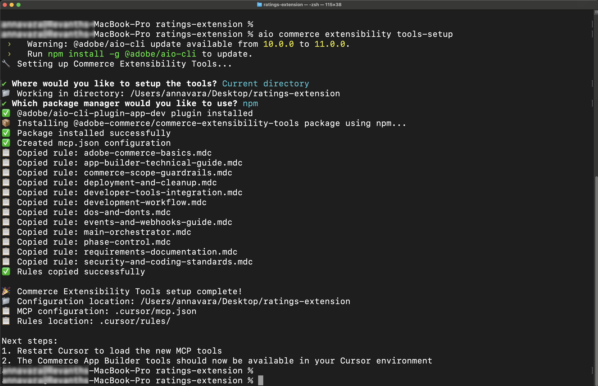

# 자습서 사전 요구 사항

이 페이지에는 [!DNL Adobe Commerce as a Cloud Service]등급 확장 튜토리얼[ 및 ](./ratings-extension.md)배송 방법 확장 튜토리얼[과 같은 ](./shipping-method-extension.md) 튜토리얼의 필수 구성 요소와 설정 단계가 나열됩니다.

## 일반 사전 요구 사항

이 자습서에서는 확장 및 상점 개발 모두에 다음 도구가 필요합니다.

* [!DNL Node.js]&#x200B;(버전 `22.x.x`) 및 npm(`9.0.0` 이상): 다음 명령을 사용하여 설치를 확인하십시오.

  ```bash
  node --version
  npm --version
  ```

* [Git](https://git-scm.com) 설치 - 설치 확인:

  ```bash
  git --version
  ```

* 배시껍질
   * macOS/Linux: 설치할 필요가 없음
   * Windows: [Git Bash](https://git-scm.com/install) 또는 [Linux(WSL)용 Windows 하위 시스템 사용](https://learn.microsoft.com/en-us/windows/wsl/install)

* [Cursor](https://cursor.com/download)&#x200B;(권장)와 같은 AI 지원 IDE를 다운로드합니다. Claude Code, Gemini CLI 또는 Copilot과 같은 다른 IDE도 지원되지만, 자습서에서 프롬프트 및 기타 단계를 수정해야 할 수 있습니다.

## [!DNL Adobe Commerce as a Cloud Service]개 필수 구성 요소

* [!DNL Adobe I/O CLI] 설치

  ```bash
  npm install -g @adobe/aio-cli
  ```

* [Adobe I/O CLI Commerce](https://github.com/adobe-commerce/aio-cli-plugin-commerce), [Adobe I/O CLI 런타임](https://github.com/adobe/aio-cli-plugin-runtime) 및 [App Builder CLI](https://github.com/adobe/aio-cli-plugin-app-dev) 플러그인을 설치하십시오.

  ```bash
  aio plugins:install https://github.com/adobe-commerce/aio-cli-plugin-commerce @adobe/aio-cli-plugin-app-dev @adobe/aio-cli-plugin-runtime
  ```

[!DNL Adobe I/O CLI] 및 필요한 플러그인을 설치한 후 확장성 작업 영역을 설정하십시오. Adobe에서는 가장 빠른 경험을 위해 자동화된 설정을 사용하는 것이 좋습니다.

* **[자동화된 설정](#automated-setup)(권장)** — 단일 명령을 실행하여 작업 영역을 자동으로 구성합니다.
* **[수동 설정](#manual-setup)** - 단계별 지침에 따라 각 구성 요소를 개별적으로 구성합니다.

### 자동화된 설정(권장) {#automated-setup}

>[!TIP]
>
>자동 설정에 문제가 발생하면 아래의 [수동 설정](#manual-setup) 단계를 따르십시오.

`app-setup` 명령은 [!DNL Adobe Developer Console] 프로젝트 만들기, 필수 API 추가, [!DNL Adobe I/O CLI] 구성, 스타터 키트 복제, 로컬 작업 영역 연결 및 확장성 AI 도구 설치를 포함한 작업 영역 설정 프로세스를 자동화합니다.

`app-setup` 명령은 다음 단계를 안내합니다.

* 필요한 API를 사용하여 [!DNL Adobe Developer Console] 프로젝트 선택 또는 만들기
* 조직, 프로젝트 및 작업 영역과 함께 [!DNL Adobe I/O CLI] 구성
* 적절한 시작 키트 복제 및 프로젝트 설정
* 환경 구성 및 로컬 작업 영역을 원격 작업 영역에 연결
* Commerce 확장성 도구 및 코딩 에이전트 기술 설치

다음 명령을 실행하고 대화식 프롬프트를 따릅니다.

```bash
aio commerce extensibility app-setup
```

명령이 완료된 후 프로젝트 디렉터리로 이동하고 코딩 에이전트를 다시 시작하여 새 MCP 도구 및 기술을 로드합니다. 자습서에 상점 첫 페이지가 필요한 경우 명령을 다시 실행하고 [!DNL AEM Boilerplate Commerce] 시작 키트를 선택하십시오.

다음 설치 예는 체크아웃 스타터 키트에 대한 대화식 프롬프트 및 출력을 보여줍니다.

+++설치 예(체크아웃 스타터 키트)

```shell-session
aio commerce extensibility app-setup

🚀 Adobe Commerce Extensibility App Setup

✔ Logged in
📁 Working directory: /Users/username/projects/my-commerce-project

✔ Which starter kit would you like to use? Checkout Starter Kit
✔ Enter a name for your project directory: my-extension
✔ Which coding agent would you like to install the skills for? Cursor

📦 Cloning Checkout Starter Kit...
   ✔ Repository cloned
   Using npm (package-lock.json found)
   ✔ Dependencies installed

📋 Current Adobe I/O Console configuration:
   Org: My Organization (1234567)
   Project: My Commerce Project (1234567890123456789)
   Workspace: Stage (9876543210987654321)
✔ Do you want to continue with this configuration? (Answer "No" to select a different org/project/workspace)
No

🔧 Selecting Adobe I/O Console org, project, and workspace...

? Select Org: My Organization
Org selected My Organization
You are currently in:
1. Org: My Organization
2. Project: <no project selected>
3. Workspace: <no workspace selected>

? Select Project: My Commerce Project
Project selected : My Commerce Project
You are currently in:
1. Org: My Organization
2. Project: My Commerce Project
3. Workspace: <no workspace selected>

? Select Workspace: Stage
Workspace selected Stage
You are currently in:
1. Org: My Organization
2. Project: My Commerce Project
3. Workspace: Stage

✅ Console configured:
   Org: My Organization
   Project: My Commerce Project
   Workspace: Stage

🔐 Configuring workspace credentials and services...
   ✔ Workspace configuration loaded
   ✔ OAuth server-to-server credentials already configured
   ✔ All required services available in organization
   ✔ Subscribed to: Adobe Commerce as a Cloud Service

📋 Configuring Checkout Starter Kit...
   Creating .env from env.dist...
✔ Select tenant (type to search) My Commerce Instance:
https://<region>.api.commerce.adobe.com/<tenant-id>/graphql
   ✔ Commerce instance configured
✔ Enter the event prefix for your workspace: my-prefix
   ✔ Workspace IDs configured
   ✔ OAuth credentials configured
   ✔ Checkout Starter Kit configured

🔧 Installing Commerce Extensibility tools and agent skills...
   ✔ Commerce Extensibility tools installed

🎉 App setup complete!

📁 Project directory: /Users/username/projects/my-commerce-project/my-extension

Next steps:
   1. cd into your project directory
   2. Restart your coding agent to load the Commerce Extensibility tools and skills
```

+++

### 수동 설정 {#manual-setup}

다음 섹션에서는 확장성 작업 영역의 각 구성 요소를 수동으로 설정하는 방법을 설명합니다. 수동 구성을 선호하거나 [자동화된 설정](#automated-setup)에 문제가 있는 경우 다음 단계를 따르십시오.

### Adobe Developer Console 사전 요구 사항

필요한 API 및 자격 증명을 사용하여 Adobe Developer Console에서 프로젝트를 설정합니다.

1. [Adobe Developer Console](https://developer.adobe.com/console){target="_blank"}(으)로 이동합니다.
1. 이메일 및 암호를 사용하여 로그인합니다.

#### 새 프로젝트 만들기

Adobe Developer Console에서 App Builder 프로젝트를 만들어 확장을 호스팅합니다.

1. [Adobe Developer Console](https://developer.adobe.com/)&#x200B;(으)로 이동합니다.
1. **[!UICONTROL Create project from a template]**&#x200B;을(를) 클릭합니다.
1. **[!UICONTROL App Builder]** 템플릿을 선택하십시오.
1. **[!UICONTROL Project Title]** 및 **[!UICONTROL App Name]**&#x200B;을(를) 입력하십시오.
1. **[!UICONTROL Include Runtime]** 확인란이 표시되어 있는지 확인하십시오.

   {width="600" zoomable="yes"}

1. **[!UICONTROL Save]**&#x200B;을(를) 클릭합니다.

#### 작업 공간에 API 추가

이벤트 관리 및 Commerce 통합을 위해 필요한 API를 단계 작업 영역에 추가합니다.

1. **[!UICONTROL Stage]** 작업 영역을 클릭한 다음 각 API에 대해 다음 단계를 반복합니다.

   {width="600" zoomable="yes"}

1. **[!UICONTROL Add Service]**&#x200B;을(를) 클릭하고 **[!UICONTROL API]**&#x200B;을(를) 선택합니다.

1. 다음 API 중 하나를 선택합니다. 아래 나열된 각 API에 대해 이 프로세스를 반복합니다.

   * **[!UICONTROL Adobe Services]** 필터:
      * **[!UICONTROL I/O Management API]**
      * **[!UICONTROL I/O Events]** API
   * **[!UICONTROL Experience Cloud]** 필터:
      * **[!UICONTROL Adobe I/O Events for Adobe Commerce]** API

1. **[!UICONTROL Next]**&#x200B;을(를) 클릭합니다.

1. **[!UICONTROL Save configured API]**&#x200B;을(를) 클릭합니다.

1. 모든 API를 작업 공간에 추가할 때까지 이전 단계를 반복합니다.

   {width="600" zoomable="yes"}

### Adobe I/O CLI 구성

[!DNL Adobe I/O CLI]을(를) 조직, 프로젝트 및 작업 영역에 연결합니다.

1. 기존 구성을 지웁니다.

   ```bash
   aio config clear
   ```

1. [!DNL Adobe I/O CLI]을(를) 사용하여 로그인:

   ```bash
   aio auth login -f
   ```

1. 다음 각 명령을 사용하여 조직, 프로젝트 및 작업 영역을 선택합니다.

   ```bash
   aio console org select
   ```

   ```bash
   aio console project select
   ```

   ```bash
   aio console workspace select
   ```

   {width="600" zoomable="yes"})

### 시작 키트 복제

빌드하고 있는 확장에 대해 다음 Commerce 스타터 키트 저장소 중 하나를 복제하고 프로젝트를 준비합니다.

통합 시작 키트:

```bash
git clone https://github.com/adobe/commerce-integration-starter-kit.git extension
cd extension
```

체크아웃 스타터 키트:

```bash
git clone https://github.com/adobe/commerce-checkout-starter-kit.git extension
cd extension
```

>[!BEGINTABS]

>[!TAB 통합 시작 키트]

### .env 파일 만들기

환경 구성 파일 만들기:

```bash
cp env.dist .env
```

텍스트 편집기에서 `.env` 파일을 열고 다음 OAuth 자격 증명을 추가합니다.

```bash
OAUTH_CLIENT_ID=
OAUTH_CLIENT_SECRET=
OAUTH_TECHNICAL_ACCOUNT_ID=
OAUTH_TECHNICAL_ACCOUNT_EMAIL=
OAUTH_ORG_ID=
```

작업 영역에서 **[!UICONTROL Credential details]** 탭을 클릭하여 [Developer Console](https://developer.adobe.com/)의 **[!UICONTROL OAuth Server-to-Server]** 페이지에서 이 값을 복사합니다.

Adobe Developer Console의 {width="600" zoomable="yes"}

#### Commerce 구성 추가

`.env` 파일에 다음 Commerce 인스턴스 세부 정보를 추가합니다.

```bash
COMMERCE_BASE_URL=
COMMERCE_GRAPHQL_ENDPOINT=
```

다음 값을 찾으려면:

1. [Commerce Cloud 서비스 인스턴스](https://experience.adobe.com/#/@commerce/commerce/cloud-service/instances)&#x200B;(으)로 이동합니다.
1. 인스턴스 옆에 있는 정보 아이콘을 클릭합니다.
1. REST 끝점을 `COMMERCE_BASE_URL`(으)로 복사합니다.
1. GraphQL 끝점을 `COMMERCE_GRAPHQL_ENDPOINT`(으)로 복사합니다.

#### 이벤트 접두사 설정

이벤트 접두사에 대한 임시 값을 설정합니다.

```bash
EVENT_PREFIX=test
```

### 작업 공간 구성 다운로드

다음 명령을 실행하여 작업 영역 구성 파일을 다운로드합니다.

```bash
aio console workspace download workspace.json
```

작업 영역 구성 파일을 `scripts` 디렉터리에 복사합니다.

```bash
cp workspace.json scripts/
```

### 로컬 작업 영역을 원격 작업 영역에 연결

로컬 프로젝트를 원격 작업 영역에 연결합니다.

```bash
aio app use workspace.json -m
```

{width="600" zoomable="yes"}

>[!TAB 체크아웃 시작 키트]

### 로컬 작업 영역을 원격 작업 영역에 연결

로컬 프로젝트를 원격 작업 영역에 연결합니다. 프로젝트 루트(`extension` 폴더)에서 다음을 실행합니다.

```bash
aio app use --merge
```

메시지가 표시되면 Adobe I/O CLI를 구성할 때 선택한 조직, 프로젝트 및 작업 영역을 사용하는 옵션을 선택합니다. 이렇게 하면 앱에 작업 영역 구성이 기록되므로 배포 및 로컬 개발에서 해당 작업 영역을 사용할 수 있습니다.

{width="600" zoomable="yes"}

>[!ENDTABS]

### 확장성 AI 도구 설치

이 프로세스는 MCP 구성(`.<agent>/mcp.json`), 스킬 디렉터리(`.<agent>/skills/`)를 만들고 프로젝트 루트에 `AGENTS.md`을(를) 추가합니다. 스타터 키트, 코딩 에이전트 및 패키지 관리자를 선택하라는 메시지가 표시됩니다.


1. 다음 명령을 사용하여 `extension` 폴더에서 AI 지원 개발 도구를 설정합니다.

   ```bash
   cd extension
   ```

   ```bash
   aio commerce extensibility tools-setup
   ```

   {width="600" zoomable="yes"}

1. 설치가 완료되면 코딩 에이전트를 다시 시작하여 새 MCP 도구 및 기술을 로드할 수 있습니다. 이제 사용자 환경에서 Commerce App Builder 도구를 사용할 수 있습니다.

   >[!NOTE]
   >
   >Starter Kit에 대한 스킬이 없다는 경고가 표시되면 문제가 발생했습니다. Starter Kit가 복제된 위치가 아닌 폴더에서 설정이 실행되었기 때문일 수 있습니다. `aio commerce extensibility tools-setup` 폴더(시작 키트 프로젝트 루트)에서 `extension`을(를) 실행하고 메시지가 표시되면 적절한 시작 키트를 선택합니다.

   {width="600" zoomable="yes"}

## Storefront 수동 설정

이 섹션에서는 [등급 확장 튜토리얼](./ratings-extension.md) 및 기타 storefront 튜토리얼을 위해 스토어프론트를 수동으로 구성하는 방법에 대해 설명합니다.

상점을 자동으로 구성하려면 `app-setup`자동 설정[ 섹션에 설명된 ](#automated-setup) 명령을 실행하고 [!DNL AEM Boilerplate Commerce] 시작 키트를 선택하십시오.

### 사전 요구 사항

다음 항목은 [등급 확장 자습서](./ratings-extension.md#connect-to-the-storefront)의 [storefront](./ratings-extension.md) 섹션을 완료하고 스토어에서 제품 등급을 표시하는 데 필요합니다.

* [Google Chrome](https://www.google.com/chrome/) - 상점 첫 화면 테스트에 필요

* [!DNL Commerce] 인스턴스에 연결된 Storefront 프로젝트. Storefront 프로젝트가 없는 경우 [상거래 데이터에 리포지토리 연결](https://experienceleague.adobe.com/developer/commerce/storefront/get-started/create-storefront/){target="_blank"} 섹션을 포함하여 [Storefront 만들기](https://experienceleague.adobe.com/developer/commerce/storefront/get-started/create-storefront/#link-repo-to-commerce-data){target="_blank"}의 단계를 따릅니다.

### Storefront 리포지토리 복제

터미널을 열고 저장소를 복제합니다.

```bash
git clone https://github.com/hlxsites/aem-boilerplate-commerce.git storefront
cd storefront
```

### 종속성 설치

프로젝트 종속성 설치:

```bash
npm install
```

### Storefront AI 도구 설치

`storefront` 폴더에서 AI 지원 개발 도구를 설정합니다.

보일러플레이트 프로젝트의 루트에서 다음 명령을 실행합니다. 이 명령은 `@adobe-commerce/commerce-extensibility-tools` 패키지를 개발 종속성으로 설치하고 기술 파일을 에이전트의 기술 디렉터리에 복사하고 에이전트가 Commerce 설명서 검색 도구에 액세스할 수 있도록 MCP(Model Context Protocol)를 구성합니다.

```bash
aio commerce extensibility tools-setup
```

이 명령은 다음 두 가지 프롬프트를 안내합니다.

1. **시작 키트 선택** — **AEM Boilerplate Commerce 선택**.

1. **코딩 에이전트 선택** - 지원되는 에이전트 목록에서 에이전트를 선택합니다.
