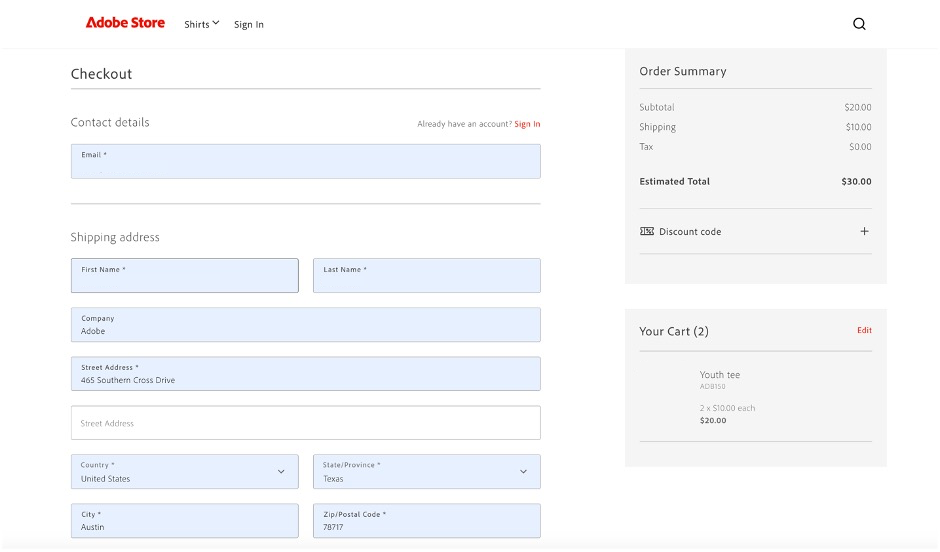
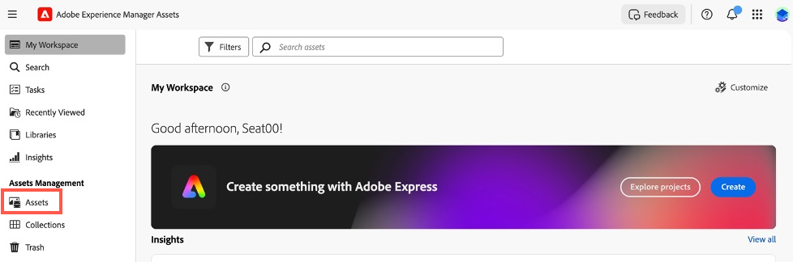

# 사용 사례

다음 사용 사례에서는 [!DNL Adobe Commerce as a Cloud Service]이(가) 지원하는 핵심 기능 및 비즈니스 시나리오를 보여 주므로 개발을 가속화하고 영향력이 큰 경험을 시작할 수 있습니다.

문제가 발생하면 [문제 해결](#troubleshooting) 섹션에서 지침을 확인하십시오.

## 사전 요구 사항

이러한 사용 사례를 시도하기 전에 다음 사전 요구 사항을 완료해야 합니다.

1. 다음 옵션을 사용하여 [Cloud Service 인스턴스 만들기](./getting-started.md#create-an-instance):
   1. [!UICONTROL **환경**] 드롭다운에서 [!UICONTROL **샌드박스**]&#x200B;를 선택합니다.
   1. [!UICONTROL **테스트 데이터**] 드롭다운에서 [!UICONTROL **Adobe 스토어**]&#x200B;를 선택합니다.
1. [Adobe Experience Cloud 계정에 로그인](https://experience.adobe.com)
1. 다음 옵션을 사용하여 [Cloud Service 상점 설정](./storefront.md):
   1. 템플릿에 대해 [!UICONTROL `adobe-commerce/adobe-demo-store`]을(를) 선택합니다.
   1. 연결 방법에 대해 [!UICONTROL **사용 가능한 인스턴스 선택(Mesh -> SaaS)**]&#x200B;을 선택합니다.

## 체크아웃 워크플로우

이 워크플로에서는 상점에서 제품을 구매하는 고객의 체크아웃 프로세스와 관리자가 주문을 확인하는 방법을 보여 줍니다.

### 결제 서비스 활성화

1. Commerce 관리에서 [!UICONTROL **스토어**] > [!UICONTROL Settings] > [!UICONTROL **구성**] > [!UICONTROL **결제 방법**]&#x200B;으로 이동합니다.

1. [!UICONTROL **일반 구성**] 섹션에서 `Payment Services Sandbox ID` 및 `Payment Services Sandbox Key`을(를) 입력하십시오. [샌드박스 온보딩](../payment-services/sandbox.md#sandbox-onboarding)에 설명된 단계를 따라 이러한 ID를 가져올 수 있습니다

1. [!UICONTROL **사용**] 드롭다운을 [!UICONTROL **예**]&#x200B;(으)로 설정합니다.

1. [!UICONTROL **구성 저장**]&#x200B;을 클릭합니다.

### 제품 구매

1. 필수 구성 요소에서 만든 [storefront](./storefront.md)(으)로 이동합니다.

1. 제품을 찾아 선택합니다. 필요한 사용자 지정을 선택합니다. [!UICONTROL **장바구니에 추가**]&#x200B;를 클릭합니다.

   {width="600" zoomable="yes"}

1. 장바구니 아이콘을 선택하여 장바구니를 확인합니다.

   {width="600" zoomable="yes"}

1. [!UICONTROL **체크아웃**]&#x200B;을 클릭합니다.

   {width="600" zoomable="yes"}

1. 필요한 담당자 상세내역 및 운송 정보를 입력합니다. 이 주문에 대해 허구의 정보를 사용할 수 있습니다.

1. 체크아웃하려면 [!UICONTROL **주문 확인/금액**]&#x200B;을 선택하세요. 신용 카드를 사용하려면 Paypal에서 제공하는 [테스트 카드 중 하나](https://developer.paypal.com/tools/sandbox/card-testing/#link-teststaticcardnumbers)를 사용하세요. 향후 만료일 및 CVC와 함께 사용할 수 있습니다.

   {width="600" zoomable="yes"}

   {width="600" zoomable="yes"}

1. [!UICONTROL **주문**]&#x200B;을 클릭하세요.

### 주문 확인

1. Commerce 관리자 `<your store URL>/admin`을(를) 엽니다.

1. Adobe ID을 사용하여 로그인합니다.

1. [!UICONTROL **판매**] > [!UICONTROL **주문**]&#x200B;(으)로 이동합니다.

   {width="600" zoomable="yes"}

1. 주문하신 상품을 찾아보시고 자세한 내용을 확인해주세요.

   {width="600" zoomable="yes"}

## Storefront 콘텐츠 업데이트

콘텐츠를 만들고 편집하고 상점 앞에 바로 게시할 수 있습니다.

1. 필수 구성 요소에서 만든 [storefront](./storefront.md)을(를) 엽니다.

1. 상점 빌더를 엽니다. `https://da.live/#/<GitHub User Name>/<Repository Name>/main/da/index.md`(으)로 이동

1. [!UICONTROL **인덱스**] 페이지를 엽니다.

1. 슬라이드 블록 아래에 &quot;Adobe 스토어 데모 시작&quot; 줄을 편집하여 새 제목을 입력합니다.

1. 보내기 아이콘을 클릭하고 [!UICONTROL **미리 보기**]&#x200B;를 클릭합니다.

1. 미리 보기 페이지를 검토하고 [!UICONTROL **게시**]&#x200B;를 클릭합니다.

1. 상점 첫 페이지를 새로 고치고 변경 사항이 이제 활성 상태인지 확인하십시오.

## 상황별 실험

Adobe Commerce의 컨텍스트 기반 실험 기능을 사용하면 상점 첫 화면에서 실험을 만들고 관리하여 다양한 콘텐츠 및 구성을 테스트할 수 있습니다.

### 사전 요구 사항

* [AEM Sidekick 확장 설치](https://www.aem.live/docs/sidekick)

1. Storefront Builder에서 인덱스 페이지를 선택하고 [!UICONTROL **복사**]&#x200B;를 클릭합니다.

1. [!UICONTROL **새로 만들기**] 단추를 클릭하고 [!UICONTROL **폴더**]&#x200B;를 선택하여 기본 폴더 아래에 [!UICONTROL **실험**] 폴더를 만듭니다.

1. **experiments** 폴더에 [!UICONTROL **1234**] 폴더를 만듭니다.

1. 인덱스 페이지의 두 복사본을 **1234** 폴더에 붙여 넣으십시오.

1. 각 페이지를 열고 이름을 &quot;homev1&quot; 및 &quot;homev2&quot;로 바꿉니다. [도전자](https://www.aem.live/docs/experimentation#create-your-challenger-page)입니다.

1. 다른 콘텐츠를 포함하도록 각 페이지를 수정합니다. 예를 들어, 영웅 이미지나 텍스트를 변경합니다. 각 페이지 간의 차이점을 식별할 수 있어야 합니다.

1. 각 챌린저 페이지를 게시합니다.

1. 컨트롤 페이지(원래 인덱스 페이지)를 엽니다.

1. 제목이 [!UICONTROL **메타데이터**]&#x200B;인 새 블록을 추가합니다.

1. 메타데이터 블록의 행에 다음 정보를 추가합니다

   * 제목 - Adobe Commerce
   * 설명 - 웹 스토어
   * 실험 - 1234
   * 실험 변형
      * `https://<your-site>.aem.live/experiments/1234/indexv1`
      * `https://<your-site>.aem.live/experiments/1234/indexv2`

   {width="600" zoomable="yes"}

1. 시크릿 또는 비공개 탐색 창을 열고 기본 페이지로 이동합니다.

1. 개인 탐색 창을 닫고 이전 단계를 반복합니다. 페이지를 열 때마다 만든 임의 변형이 표시됩니다.

## 상점 첫 화면 컨텐츠 향상

이제 AEM Assets, Adobe Express 및 Firefly을 사용하여 간단한 자체 주도 워크플로우로 상점 앞에 표시되는 이미지를 빠르게 변경할 수 있습니다.

### 사전 요구 사항

* AEM Assets, Adobe Express 및 Adobe Firefly에 대한 액세스 권한이 필요합니다.

### 이미지의 배경 사용자 지정

제품 이미지의 배경을 빠르게 수정하려는 시나리오를 생각해 보십시오. Adobe Commerce, AEM Assets 및 Adobe Express의 조합을 사용하면 몇 가지 간단한 단계로 이러한 변경 작업을 수행할 수 있습니다.

1. 필수 구성 요소에서 만든 [storefront](./storefront.md)을(를) 열고 변경할 항목으로 이동합니다. 항목 SKU 또는 제품 코드를 확인합니다.

1. [!UICONTROL AEM Assets]Adobe Experience Cloud[에서 선택하여 &#x200B;](https://experience.adobe.com/#/home)을(를) 엽니다.

   {width="600" zoomable="yes"}

1. [!UICONTROL Assets]을(를) 클릭합니다.

   {width="600" zoomable="yes"}

1. **SKU** 또는 **제품 코드**&#x200B;로 항목을 검색합니다.

1. 편집할 항목을 선택하고 [!UICONTROL **Adobe Express에서 열기**]&#x200B;를 클릭합니다.

   {width="600" zoomable="yes"}

1. [!UICONTROL **이미지**] 패널에서 [!UICONTROL **개체 삽입**]&#x200B;을 선택합니다.

   {width="600" zoomable="yes"}

1. 텍스트 상자에 추가할 이미지를 설명합니다. 예를 들어, &quot;눈송이 나무&quot;입니다.

   {width="600" zoomable="yes"}

1. [!UICONTROL Brush size]을(를) 조정하고 생성된 이미지를 추가할 위치를 그립니다. 이 예제에서는 기존 개체를 그려 배경을 선택합니다.

1. 결과를 보려면 [!UICONTROL **생성**]&#x200B;을 클릭하세요.

1. 원하는 옵션을 선택하고 [!UICONTROL **유지**]&#x200B;를 클릭하여 다른 결과에서 선택하십시오.

1. 이미지 편집기로 돌아가려면 [!UICONTROL **내 콘텐츠**]&#x200B;를 클릭하세요.

1. 이미지 형식을 지정하려면 [!UICONTROL **저장**]&#x200B;을 클릭하십시오.

1. 변경 내용을 저장하려면 [!UICONTROL **저장**]&#x200B;을 다시 클릭합니다.

1. [!UICONTROL **에셋 저장**] 대화 상자에서 Commerce [!UICONTROL **대상 폴더**]&#x200B;를 선택합니다.

   {width="600" zoomable="yes"}

1. 이미지를 저장하려면 [!UICONTROL **새 자산으로 저장**]&#x200B;을 클릭하세요.

#### Commerce AEM Assets에 이미지 추가

1. AEM as a Cloud Service의 [탐색 패널](https://experienceleague.adobe.com/ko/docs/experience-manager-cloud-service/content/sites/authoring/basic-handling#navigation-panel)에서 **Assets** > **파일** > **Commerce**&#x200B;을(를) 선택하고 이전 섹션에서 만든 에셋을 클릭합니다.

   {width="600" zoomable="yes"}

1. [!UICONTROL **속성**]&#x200B;을 클릭합니다.

   {width="600" zoomable="yes"}

1. [!UICONTROL **Commerce**] 탭을 선택합니다.

   {width="600" zoomable="yes"}

1. [!UICONTROL **이(가) Adobe Commerce에 있는지 확인하십시오.**] 필드가 [!UICONTROL **예**]&#x200B;(으)로 설정되었습니다.

1. [!UICONTROL **추가**]&#x200B;를 클릭하고 에셋을 추가할 제품 SKU를 입력합니다.

   {width="600" zoomable="yes"}

1. 에셋 위치 및 에셋 유형을 선택합니다.

1. [!UICONTROL **기본**] 탭을 선택하고 [!UICONTROL **검토 상태**] 탭을 [!UICONTROL **승인됨**]&#x200B;(으)로 변경합니다.

   {width="600" zoomable="yes"}

1. [!UICONTROL **저장 및 닫기**]&#x200B;를 클릭합니다.

#### Commerce에서 이미지 확인

1. Adobe Commerce [!UICONTROL **관리자**]&#x200B;에서 [!UICONTROL **카탈로그**] > [!UICONTROL **제품**]&#x200B;으로 이동합니다.

1. 이전 섹션에서 이미지를 추가한 제품을 선택합니다.

1. [!UICONTROL **이미지 및 비디오**] 섹션을 확장합니다.

   {width="600" zoomable="yes"}

1. 이제 이미지 목록에서 이미지를 사용할 수 있는지 확인합니다.

1. 상점으로 돌아가서 수정된 제품에 대한 페이지로 이동합니다.

1. 새 이미지가 표시되는지 확인합니다.

   {width="600" zoomable="yes"}

## 변형 생성

Adobe Commerce의 변형 생성 은 생성 AI를 활용하여 고품질 콘텐츠 생성을 자동화하고, 메시지를 미세 조정하고, 자산을 상점에 원활하게 게시합니다.

### 텍스트 생성

1. [유니버설 편집기](https://experienceleague.adobe.com/ko/docs/experience-manager-cloud-service/content/implementing/developing/universal-editor/introduction)를 사용하여 상점 사이트를 여십시오.

1. 편집할 텍스트 블록을 선택합니다.

1. [!UICONTROL **속성**] 패널에서 [!UICONTROL **변형 생성**]&#x200B;을 클릭합니다.

1. [!UICONTROL **생성**] 단추를 클릭합니다.

1. 생성된 텍스트를 선택하거나 사용자 정의합니다.

1. 상점을 업데이트하려면 [!UICONTROL **게시**]&#x200B;를 클릭하세요.

### 컨텐츠 및 이미지 생성

1. [변형 생성](https://experienceleague.adobe.com/ko/docs/experience-manager-cloud-service/content/generative-ai/generate-variations) 열기

1. [!UICONTROL **영웅 배너**] 템플릿을 선택하십시오.

1. [!UICONTROL **사용자 상호 작용 설명**] 텍스트 상자에 &quot;Adobe 직원 및 파트너가 Adobe 브랜드 장비를 구매할 수 있는 경험!&quot;을 입력하십시오.

1. [!UICONTROL **도메인 지식을 위한 URL**]&#x200B;에서 **www.adobestore.com**&#x200B;을(를) 입력하십시오.

1. [!UICONTROL **생성**]&#x200B;을 클릭합니다.

1. 콘텐츠 변형을 선택하고 [!UICONTROL **이미지 생성**]&#x200B;을 클릭합니다.

1. [!UICONTROL **이미지 크기**] 드롭다운에서 [!UICONTROL **와이드스크린(16:9)**]&#x200B;을 선택합니다.

1. [!UICONTROL **콘텐츠 형식**] 드롭다운에서 [!UICONTROL **사진**]&#x200B;을 선택합니다.

1. [!UICONTROL **Style**] 참조 이미지의 경우 기존 Adobe 스토어 배너를 선택하십시오.

1. 사용할 생성된 이미지를 선택하고 [!UICONTROL **저장**]&#x200B;을 클릭합니다.

1. 다른 참조 이미지와 이 프로세스를 반복하여 더 많은 변형을 생성합니다.

## 문제 해결

이러한 자습서를 시도할 때 직면하는 문제를 해결하려면 다음 제안을 사용하십시오.

* 명령 또는 플래그에 대한 지침이 필요한 경우:

   1. 사용 가능한 모든 명령과 플래그를 보려면 `aio --help`을(를) 실행하십시오.
   1. 특정 명령의 경우 `--help` 플래그를 사용하십시오. For example:
      * `aio console --help`
      * `aio commerce –help`

* 잘못된 로그인 문제가 발생하는 경우:

   1. `aio config clear` 실행.
   1. `aio auth login –-force` 실행.
   1. 브라우저에서 로그인합니다.
   1. 프로필을 선택합니다.
   1. 계속하려면 터미널로 다시 전환하십시오.

* `init` 명령이 실패한 경우:

   1. `aio api-mesh delete` 실행.
   1. `aio commerce init` 다시 실행

* `init` 명령을 실행하기 전에 잘못된 조직, 프로젝트 또는 작업 영역을 선택한 경우:

   1. `aio console org select` 실행.
   1. `aio console project select` 실행.
   1. `aio console workspace select` 실행.

* 잘못된 테넌트 선택이 있는 경우:

   1. **Ctrl-C**&#x200B;을 눌러 현재 CLI 실행을 취소합니다.
   1. `aio commerce init` 실행.

* 잘못된 API Mesh 설치가 발생하는 경우:

   * `aio api-mesh update mesh-config.json` 실행.
