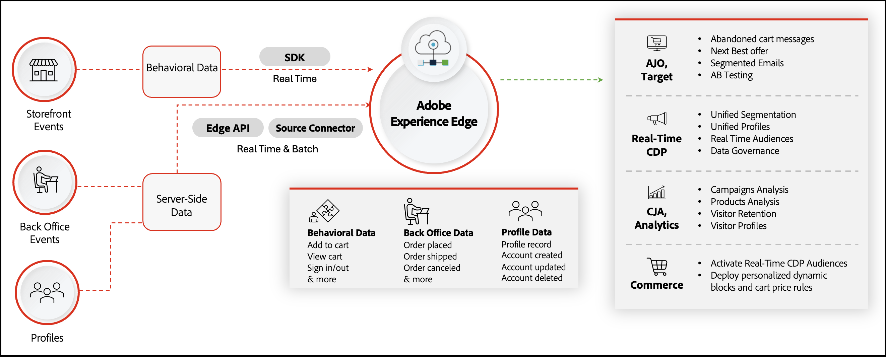

# [!DNL Data Connection] 소개

>[!IMPORTANT]
>
>Experience Platform 커넥터의 이름이 [!DNL Data Connection]&#x200B;(으)로 변경되었습니다.

[!DNL Data Connection] 확장은 Adobe Commerce 웹 인스턴스를 Adobe Experience Platform 및 Edge Network에 연결합니다. 모바일 앱 개발자의 경우 Adobe Experience Platform Mobile SDK과 Commerce을 함께 사용하여 Commerce 데이터를 캡처하고 Experience Platform으로 보냅니다. [자세히 알아보기](./mobile-sdk-epc.md)

Commerce 스토어에는 풍부한 데이터가 있습니다. 쇼핑객이 사이트에서 제품을 검색하고, 보고, 최종적으로 구매하는 방법에 대한 정보는 보다 개인화된 쇼핑 경험을 만들 수 있는 기회를 보여줄 수 있습니다. 해당 데이터는 장바구니 가격 규칙 및 동적 블록과 같은 기본 Commerce 기능을 알릴 수 있지만 데이터는 Commerce 인스턴스에 격리된 상태로 유지됩니다.

Adobe Experience Platform은 Commerce 스토어의 데이터로 하이드레이션될 때 해당 데이터를 Edge Network을 통해 다른 Adobe DX 제품에 배포하여 구매자의 구매 행동에 대한 통찰력을 확보할 수 있는 기술 제품군을 제공합니다. 이러한 심층적인 통찰력을 통해 모든 채널에서 보다 개인화된 쇼핑 경험을 만들 수 있습니다.

다음 이미지는 [!DNL Data Connection] 확장을 설치하고 구성할 때 Commerce 데이터가 저장소에서 다른 Adobe DX 제품으로 흐르는 방식을 보여 줍니다.

위의 이미지에서 행동, 백오피스 및 고객 프로필 데이터는 SDK, API 및 소스 커넥터를 사용하여 Experience Platform Edge로 전송됩니다. 확장이 데이터 공유 복잡성을 처리하므로 이러한 부분이 어떻게 작동하는지 완전히 이해할 필요는 없습니다. 이벤트 데이터가 에지에 있으면 해당 데이터를 다른 Experience Platform 애플리케이션으로 가져올 수 있습니다. For example:

| 애플리케이션 | 목적 | 사용 사례 |
|---|---|---|
| [Adobe [!DNL Real-Time CDP]](https://experienceleague.adobe.com/docs/experience-platform/rtcdp/intro/rtcdp-intro/overview.html) | 프로필 관리 및 세분화 서비스 | **구매 내역 세분화**: 판매자는 특정 기간(월별, 분기별, 연간 등)에 따라 품목을 구매하는 고객을 식별할 수 있습니다. 그런 다음 판매자는 이러한 고객을 위한 세그먼트를 만들고 프로모션, 캠페인 및 구독 서비스를 위한 리드에 대한 _funnel 상단_ 데이터로 타겟팅할 수 있습니다.  **범주 기반 세분화**: 판매자는 구매한 제품 범주를 볼 수 있습니다.  **제공 기반 세분화**: 판매자는 제품을 일관되게 반품하는 고객을 식별할 수 있습니다. 이제 고객에게 제공되는 오퍼와 할인이 보다 지능적일 수 있습니다. 예를 들어 항상 제품을 반품하는 고객에 대해 무료 배송을 제거할 수 있습니다.  **유사 대상 타기팅**: _유사 대상_&#x200B;은(는) 기존 고객과 유사한 특성을 공유하므로 비즈니스에 관심이 있는 새로운 사람에게 제공하기 위해 판매자가 프로모션을 위해 취하는 방법론입니다. 동작 및 트랜잭션 데이터를 기반으로 유사 세그먼트를 만들 수 있습니다.  **고객 성향**: 트랜잭션 데이터에서 만들 수 있는 고객 프로필의 깊이가 더 깊기 때문에 고객 동작이 변경되는 것을 확인할 수 있습니다. 제품 반환 및 제품 구성과 같은 계산에 유입되는 데이터가 많을수록 성향 점수에 대한 신뢰도가 높아집니다.  **교차 판매**: 판매자는 Commerce에서 캡처한 세분화된 정보에서 강력한 교차 판매 및 상향 판매 기회를 식별할 수 있습니다. |
| [고객 [!DNL Journey Analytics]](https://experienceleague.adobe.com/docs/analytics-platform/using/cja-overview/cja-overview.html) | 전체 Commerce 여정에 대한 심층 분석 | **계절별 트렌드**: 판매자는 계절별 트렌드를 식별하여 특정 제품에 대한 정기적인 수요 변화에 대비할 수 있습니다. 또한 상인은 수년에 걸쳐 모든 제품의 전반적인 인기도 변화를 확인할 수 있습니다.  **전환 분석**: 판매자는 제품을 구매한 시점을 알고 상점 노출 이벤트에 대한 액세스와 함께 고객의 풍부한 프로필을 생성하여 전환 분석을 수행할 수 있습니다. |
| [Adobe [!DNL Analytics]](https://experienceleague.adobe.com/docs/analytics/analyze/admin-overview/analytics-overview.html) | 고객 행동 및 캠페인 성과에 대한 심층적인 분석 | **주문 반품**: 판매자는 반품하는 상품 패턴을 가진 고객과 대규모 고객 세그먼트를 식별할 수 있습니다. 따라서 가맹점은 고객 기반 동작이 어떻게 보이는지 파악하여 상거래 전략을 개선하는 데 도움이 됩니다.  **주문 주소**: 배송 주소를 기반으로 판매자는 고객이 직접 주문을 했는지 또는 다른 개인 또는 엔터티를 위한 주문인지 파악할 수 있습니다.  **계절성 트렌드**: 판매자는 계절성 트렌드를 식별하여 특정 제품에 대한 정기적인 수요 변화에 대비할 수 있습니다. 또한 상인은 수년에 걸쳐 모든 제품의 전반적인 인기도 변화를 확인할 수 있습니다.  **전환 분석**: 판매자는 제품을 구매한 시점을 알고 상점 노출 이벤트에 대한 액세스와 함께 고객의 풍부한 프로필을 생성하여 전환 분석을 수행할 수 있습니다. **참고** Adobe Analytics은 동작(상점) 이벤트 데이터만 지원합니다. Adobe Analytics은 트랜잭션(백오피스) 이벤트 데이터를 지원하지 않습니다. |
| [Adobe [!DNL Journey Optimizer]](https://experienceleague.adobe.com/docs/journey-optimizer/using/get-started/get-started.html) | 채널 간 Campaign 오케스트레이션 | **동작 기반 여정**: 판매자는 새 모델을 구입하도록 제안하여 2년 전에 휴대폰을 구입한 고객을 타깃팅할 수 있습니다. 판매자는 이러한 고객을 위한 개인화된 캠페인과 프로모션을 만들고 이메일 및 SMS 기능을 사용하여 연락할 수 있습니다. 또한, 상인들은 과거 질서와 행동 데이터를 사용하여 동향을 파악할 수 있습니다. 예를 들어 과거에 특정 구성을 사용하여 제품을 구매했다가 이제 동일한 제품을 다시 구매하려는 고객은 동일한 제품 구성에 대한 가시성과 액세스 권한을 제공하여 구매 여정을 향상시킬 수 있습니다.  **Personalization**: 고객 프로필 정보에 대한 액세스 권한을 통해 [!DNL Journey Optimizer]은(는) 상인이 여러 다른 채널의 고객에게 연락할 수 있도록 높은 개인화 여정을 잠금 해제할 수 있습니다.  **새 프로필 생성됨**: 환영 전자 메일 및 홍보 활동이 새로운 고객의 쇼핑 여정을 격려하고 영향을 줄 수 있습니다.  **프로필이 삭제됨**: 가맹점은 계정을 닫은 고객에게 프로모션 이메일 전송을 중지할 수 있습니다. 또는 상인이 잃어버린 고객을 되찾기 위한 캠페인을 구축할 수도 있습니다. |

## Experience Platform 데이터를 다시 Commerce으로 가져오기

[!DNL Data Connection] 확장을 사용하여 Commerce 데이터를 Experience Platform에 보내는 것은 Commerce의 데이터 공유 기능의 한 부분입니다. 선택적 확장인 반대쪽은 [Audience Activation](https://experienceleague.adobe.com/docs/commerce-admin/customers/audience-activation.html)입니다. 이 확장을 사용하면 Real-Time CDP에서 대상을 작성하고 이러한 대상을 Commerce 스토어에 배포하여 장바구니 가격 규칙, 관련 제품 규칙 및 동적 블록을 알릴 수 있습니다.

높은 수준에서 Commerce 스토어에서 Experience Platform으로 그리고 Audience Activation 확장을 통해 다시 이동하는 데이터 흐름은 다음과 같습니다.

![[!DNL Data Connection] 흐름](assets/data-connection.png)

Commerce에서 Experience Platform으로, Experience Platform에서 Commerce으로 연결을 설정한 후에도 데이터가 계속 흐릅니다. 업그레이드에서 다시 연결할 필요가 없는 한 다시 연결할 필요가 없습니다.

## 개념

이 두 시스템 간에 데이터를 공유하려면 몇 가지 개념을 이해해야 합니다.

- **데이터** - Experience Platform과 공유되는 데이터는 상점의 브라우저 이벤트, 서버의 백 오피스 이벤트 및 프로필 레코드 데이터에서 수집된 데이터입니다. Storefront 이벤트는 사이트의 쇼핑객 상호 작용에서 캡처되며 `addToCart`, `pageView`, `createAccount`, `editAccount`, `startCheckout`, `completeCheckout`, `signIn`, `signOut` 등의 이벤트를 포함합니다. storefront 이벤트의 전체 목록은 [storefront 이벤트](events.md#storefront-events)를 참조하십시오. 서버측 또는 백오피스 이벤트에는 [, &#x200B;](events-backoffice.md#order-status), [`orderPlaced`](events-backoffice.md#orderplaced), [`orderReturned`](events-backoffice.md#orderitemreturncompleted) 등의 [`orderShipped`](events-backoffice.md#ordershipmentcompleted)주문 상태[`orderCancelled`](events-backoffice.md#ordercancelled) 정보가 포함됩니다. 백 오피스 이벤트의 전체 목록은 [백 오피스 이벤트](events-backoffice.md)를 참조하십시오. 프로필 레코드 데이터에는 새 프로필이 생성, 업데이트 또는 삭제될 때의 정보가 포함됩니다. 자세한 내용은 [프로필 레코드 데이터](events-profilerecord.md)를 참조하세요.

- **Experience Platform 및 Edge Network** - 대부분의 Adobe DX 제품에 대한 데이터 웨어하우스 Experience Platform으로 전송된 데이터는 Experience Platform Edge Network을 통해 Adobe DX 제품에 전파됩니다. 예를 들어 Journey Optimizer을 시작하고, Edge에서 특정 Commerce 이벤트 데이터를 검색하고, Journey Optimizer에서 포기한 장바구니 이메일을 작성할 수 있습니다. 그러면 Journey Optimizer 스토어에 구매하지 않은 카트가 있는 경우 Commerce에서 해당 이메일을 보낼 수 있습니다. [Experience Platform 및 Edge Network](https://experienceleague.adobe.com/docs/platform-learn/data-collection/web-sdk/overview.html)에 대해 자세히 알아보세요.

- **스키마** - 스키마는 전송 중인 데이터 구조를 설명합니다. Experience Platform에서 Commerce 데이터를 수집하려면 먼저 데이터의 구조를 설명하는 스키마를 구성하고 각 필드 내에 포함될 수 있는 데이터 유형에 대한 제약 조건을 제공해야 합니다. 스키마는 기본 클래스와 0개 이상의 스키마 필드 그룹으로 구성됩니다. 스키마는 모든 Adobe DX 제품이 읽을 수 있는 XDM 구조를 사용합니다. 스키마는 Experience Platform으로 전송된 데이터를 모든 DX 제품에서 이해할 수 있도록 합니다. [스키마](https://experienceleague.adobe.com/docs/experience-platform/xdm/home.html)에 대해 자세히 알아보세요.

- **데이터 집합** - 데이터 수집을 위한 저장소 및 관리 구성으로서, 일반적으로 스키마(열)와 필드(행)를 포함하는 테이블입니다. 데이터 세트에는 저장하는 데이터의 다양한 측면을 설명하는 메타데이터도 포함됩니다. Adobe Experience Platform에 성공적으로 수집된 모든 데이터는 데이터 세트 내에 포함됩니다. [데이터 세트](https://experienceleague.adobe.com/docs/experience-platform/catalog/datasets/overview.html)에 대해 자세히 알아보세요.

- **데이터스트림** - Adobe Experience Platform에서 다른 Adobe DX 제품으로 데이터를 이동할 수 있는 ID입니다. 이 ID는 특정 Adobe Commerce 인스턴스 내의 특정 웹 사이트에 연결되어야 합니다. 이 데이터 스트림을 만들 때 위에서 만든 XDM 스키마를 지정합니다. [데이터스트림](https://experienceleague.adobe.com/docs/experience-platform/datastreams/overview.html)에 대해 자세히 알아보세요.

## 지원되는 아키텍처

[!DNL Data Connection] 확장은 다음 아키텍처에서 사용할 수 있습니다.

- PHP/Luma
- [PWA Studio](https://developer.adobe.com/commerce/pwa-studio/integrations/adobe-commerce/aep/)
- [AEM](https://experienceleague.adobe.com/docs/experience-manager-cloud-service/content/content-and-commerce/integrations/aep.html)

>[!BEGINSHADEBOX]

## 사전 요구 사항

[!DNL Data Connection] 확장을 사용하려면 다음 항목이 있어야 합니다.

- Adobe Commerce 2.4.4 이상
- Adobe ID 및 조직 ID
- [ACDL(Adobe Client Data Layer)](https://experienceleague.adobe.com/docs/experience-platform/tags/extensions/client/client-data-layer/overview.html), 상점 이벤트 데이터를 수집하는 데 필요
- 다른 Adobe DX 제품에 대한 자격.

>[!ENDSHADEBOX]

## 온보딩 단계

높은 수준에서 [!DNL Data Connection] 확장을 활성화하려면 다음 단계를 수행해야 합니다.

1. [&#x200B; 확장을 &#x200B;](install.md)설치[!DNL Data Connection]합니다.
1. Adobe 계정에 [로그인](https://helpx.adobe.com/manage-account/using/access-adobe-id-account.html)하고 조직 ID를 확인하려면 [확인](https://experienceleague.adobe.com/docs/core-services/interface/administration/organizations.html#concept_EA8AEE5B02CF46ACBDAD6A8508646255)하세요. 조직 ID 는 공급된 Experience Cloud 회사와 연결된 ID입니다. 이 ID는 24자의 영숫자 문자열과 `@AdobeOrg`(포함 필수)로 구성됩니다.
1. Experience Platform의 데이터 수집에 대한 [권한이 있는지 확인](https://experienceleague.adobe.com/docs/experience-platform/collection/permissions.html).
1. 수집 및 전송할 수 있는 [데이터 형식](data-ingestion.md)을 검토하십시오.
1. Commerce 관련 필드 그룹으로 [시계열 이벤트 스키마](update-xdm.md) 또는 [프로필 레코드 데이터 스키마](profile-data.md)를 만들거나 업데이트하십시오.
1. 만들거나 업데이트한 스키마를 기준으로 [데이터 집합을 만듭니다](https://experienceleague.adobe.com/docs/platform-learn/implement-mobile-sdk/experience-cloud/platform.html#create-a-dataset). 이 데이터 세트에는 Experience Platform Edge으로 전송된 Commerce 데이터가 포함되어 있습니다.
1. [데이터 스트림을 만들고](https://experienceleague.adobe.com/docs/experience-platform/datastreams/overview.html) Commerce 관련 필드 그룹이 포함된 XDM 스키마를 선택합니다.
1. [Commerce 서비스에 연결](../landing/saas.md).
1. [Adobe Experience Platform에 연결](connect-data.md).

이 안내서의 나머지 부분에서는 이러한 모든 단계를 보다 자세히 안내하므로 Commerce 스토어에서 Adobe DX 제품의 강력한 기능을 최대한 활용하여 속도를 높일 수 있습니다.

>[!NOTE]
>
>모바일 개발자의 경우 Adobe Experience Platform Mobile SDK을 Commerce과 [통합](./mobile-sdk-epc.md)하는 방법에 대해 알아보십시오.

## HIPAA 준비

[!DNL Data Connection] 확장을 사용하면 [!DNL Commerce] 백 오피스 데이터를 Experience Platform과 공유하고 HIPAA 준수를 유지할 수 있습니다. [자세히 알아보기](hipaa-readiness.md)

## 대상자

이 안내서는 Commerce 스토어를 풍요롭게 하고 개인화하여 고객의 쇼핑 경험을 향상시키고자 하는 Adobe Commerce 판매자를 위해 설계되었습니다.

## 지원

이 안내서에서 다루지 않는 정보가 필요하거나 질문이 있는 경우 다음 리소스를 사용하십시오.

- [도움말 센터](https://experienceleague.adobe.com/docs/commerce-knowledge-base/kb/overview.html){target="_blank"}
- [지원 티켓](https://experienceleague.adobe.com/docs/commerce-knowledge-base/kb/help-center-guide/magento-help-center-user-guide.html#submit-ticket){target="_blank"}—추가 지원을 받으려면 티켓을 제출하세요.
