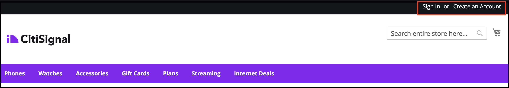
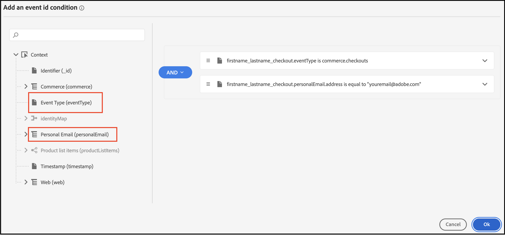

# Adobe Journey Optimizer을 사용하여 포기한 장바구니 이메일 보내기

장바구니 또는 브라우저 세션이 중단된 경우 개인화된 재참여 이메일 또는 알림을 전달하는 방법을 알아봅니다. 이 문서에서는 여러 제품 및 카테고리를 보거나, 제품에 참여하거나, 페이지에서 시간을 보낸 고객으로부터 생성된 데이터를 사용합니다.

## 어떤 데이터를 사용해야 합니까?

상점 및 백오피스 이벤트의 데이터를 사용하여 포기한 장바구니를 작성하고, 이메일을 검색하거나, 알림을 보냅니다.

| 데이터 유형 | Storefront 데이터(행동 이벤트) | 백오피스 데이터(서버측 이벤트) |
|---|---|---|
| **정의** | 고객이 사이트에서 수행하는 클릭 또는 작업입니다. | 각 주문(과거 및 현재)의 라이프사이클 및 세부 정보에 대한 정보. |
| **Adobe Commerce에서 캡처한 이벤트** | [페이지 보기](https://experienceleague.adobe.com/ko/docs/commerce/data-connection/event-forwarding/events#pageview)<br>[제품 페이지 보기](https://experienceleague.adobe.com/ko/docs/commerce/data-connection/event-forwarding/events)<br>[장바구니에 추가](https://experienceleague.adobe.com/ko/docs/commerce/data-connection/event-forwarding/events#addtocart)<br>[장바구니 열기](https://experienceleague.adobe.com/ko/docs/commerce/data-connection/event-forwarding/events#opencart)<br>[시작 체크아웃](https://experienceleague.adobe.com/ko/docs/commerce/data-connection/event-forwarding/events#startcheckout)<br>[완료 체크아웃](https://experienceleague.adobe.com/ko/docs/commerce/data-connection/event-forwarding/events#completecheckout) | [orderPlaced](https://experienceleague.adobe.com/ko/docs/commerce/data-connection/event-forwarding/events-backoffice#orderplaced)<br>[주문 내역](https://experienceleague.adobe.com/ko/docs/commerce/data-connection/fundamentals/connect-data#send-historical-order-data) |

### 다른 고객들은 어떤 성과를 얻었습니까?

Adobe [!DNL Commerce] 고객은 Adobe [!DNL Commerce], Adobe [!DNL Journey Optimizer] 및 Adobe [!DNL Real-Time CDP]을(를) 사용하여 개인화된 포기 캠페인을 구현함으로써 중요한 비즈니스 영향을 받았습니다.

글로벌 다중 브랜드 의류 소매업체:

- 새 캠페인에서 클릭 시 1.9배 전환
- 옴니채널 포기 여정으로 인한 매출 57% 증가
- 재참여 캠페인의 전환율 41% 증가
- 주당 1,000명 이상의 신규 고객 참여

한 세계적인 음료 회사는 다음을 달성했습니다.

- 재참여 이메일 열람률 36%
- 클릭스루 비율 21% 향상
- 전환율 8.5% 상승
- 89%의 재계약 포기 자가 전환됨

## 시작하겠습니다.

이 특정 사용 사례에서는 [!DNL Commerce] 인스턴스의 데이터를 사용하여 포기한 장바구니 전자 메일을 만들고 이를 Adobe [!DNL Journey Optimizer]&#x200B;(으)로 보내는 데 중점을 둡니다.

### Adobe Journey Optimizer란?

[Adobe Journey Optimizer](https://experienceleague.adobe.com/docs/journey-optimizer/using/get-started/get-started.html?lang=ko)은(는) 쇼핑객을 위한 상거래 환경을 개인화하는 데 도움이 됩니다. 예를 들어, Journey Optimizer을 사용하여 소매 스토어에 대한 주별 판촉 행사 등 예약된 마케팅 캠페인을 만들고 게재하거나, 고객이 장바구니에 제품을 추가했지만 체크아웃 프로세스를 완료하지 않은 경우 포기한 장바구니 이메일을 생성할 수 있습니다.

이 항목에서는 [!DNL Commerce] 인스턴스에서 생성된 `checkout` 이벤트를 수신하고 Journey Optimizer에서 해당 이벤트에 응답함으로써 포기한 장바구니 이메일을 작성하는 방법을 배웁니다.

>[!IMPORTANT]
>
>데모용으로 [!DNL Commerce] 샌드박스 환경을 사용하면 프로덕션 이벤트 데이터를 Experience Platform으로 보내는 상점 및 백 오피스 이벤트 데이터로 희석하지 않습니다.

### 전제 조건

이 단계를 시작하기 전에 다음을 확인하십시오.

- Adobe [!DNL Journey Optimizer]을(를) 사용하도록 프로비저닝되었습니다. 확실하지 않은 경우 프로젝트 및 환경을 관리하는 시스템 통합자나 개발 팀에 문의하십시오.
- [!DNL Commerce]에서 [!DNL Data Connection] 확장을 [설치](install.md) 및 [구성](connect-data.md)했습니다.
- [!DNL Commerce] 이벤트 데이터가 Experience Platform Edge에 도착하는 것을 [확인](connect-data.md#confirm-that-event-data-is-collected)했습니다.

## 1단계: [!DNL Commerce] 샌드박스 환경에서 사용자 만들기

샌드박스 환경에서 사용자를 만들고 사용자 계정 정보가 Experience Platform에 표시되는지 확인합니다. 지정한 이메일이 이 섹션의 뒷부분에서 포기한 장바구니 이메일을 보내는 데 사용된 이메일과 같이 유효한지 확인합니다.

1. [!DNL Commerce] 샌드박스 환경에서 로그인하거나 계정을 만드십시오.

   {width="700" zoomable="yes"}

   [!DNL Data Connection] 확장이 설치 및 구성된 경우 이 계정 정보는 프로필로 Experience Platform에 전송됩니다.

1. 사용자 계정 정보가 Experience Platform의 **[!UICONTROL Profile]** 섹션에 표시되는지 확인하십시오.

   Adobe Experience Platform의 **[!UICONTROL Profiles]**(으)로 이동합니다. 만든 프로필을 보려면 프로필에서 **[!UICONTROL Detail]**&#x200B;을(를) 클릭합니다.

   {width="700" zoomable="yes"}

## 2단계: Journey Optimizer에서 이벤트 보기

[!DNL Commerce] 샌드박스 환경에서 제품 페이지를 보고, 장바구니에 항목을 추가하고, 쇼핑객이 수행할 다양한 다른 활동을 완료하여 상점 전면에서 이벤트를 트리거합니다. 그런 다음 이러한 이벤트가 Journey Optimizer으로 전달되는지 확인합니다.

1. [Adobe Journey Optimizer](https://experienceleague.adobe.com/docs/journey-optimizer/using/get-started/user-interface.html?lang=ko)을(를) 시작합니다.
1. **[!UICONTROL Profiles]**&#x200B;을(를) 선택합니다.
1. **[!UICONTROL Identity namespace]**&#x200B;을(를) `Email`(으)로 설정합니다.
1. **[!UICONTROL Identity value]**&#x200B;을(를) 전자 메일 주소로 설정합니다.
1. 프로필을 선택한 다음 **[!UICONTROL Events]** 탭을 선택합니다.

   {width="700" zoomable="yes"}

   `commerce.checkouts` 이벤트를 찾아 이벤트 페이로드를 검사합니다.

   ```json
   "personID": "84281643067178465783746543501073369488", 
   "eventType": "commerce.checkouts", 
   "_id": "4b41703f-e42e-485b-8d63-7001e3580856-0", 
   "commerce": { 
       "cart": {}, 
       "checkouts": { 
           "value": 1 
       } 
   ```

   알 수 있듯이 전체 이벤트 페이로드에는 풍부한 이벤트 데이터가 포함되어 있습니다. 다음 섹션에서는 [!DNL Commerce] 상점 첫 화면에서 생성된 `commerce.checkouts` 이벤트를 수신하고 응답하도록 Journey Optimizer에서 이벤트를 구성합니다.

## 3단계: Journey Optimizer에서 이벤트 구성

Journey Optimizer에서 두 개의 이벤트를 구성합니다. 한 이벤트는 Commerce에서 `commerce.checkouts` 이벤트를 수신하고, 다른 이벤트는 포기한 장바구니 이메일을 트리거하기 전에 특정 시간이 경과할 때까지 기다리는 기본 시간 초과 이벤트입니다.

### 리스너 이벤트 만들기

1. [Adobe Journey Optimizer](https://experienceleague.adobe.com/docs/journey-optimizer/using/get-started/user-interface.html?lang=ko)을(를) 시작합니다.

1. 왼쪽 창의 **[!UICONTROL Administration]** 섹션 아래에서 **[!UICONTROL Configurations]**&#x200B;을(를) 클릭합니다.

1. **[!UICONTROL Events]** 타일에서 **[!UICONTROL Manage]**&#x200B;을(를) 클릭합니다.

   {width="700" zoomable="yes"}

1. **[!UICONTROL Events]** 페이지에서 **[!UICONTROL Create Event]**&#x200B;을(를) 클릭합니다.

1. 오른쪽 탐색에서 다음과 같이 이벤트를 설정합니다.

   1. **[!UICONTROL Name]**&#x200B;을(를) `firstname_lastname_checkout`(으)로 설정합니다.
   1. **[!UICONTROL Type]**&#x200B;을(를) **[!UICONTROL Unitary]**(으)로 설정합니다.
   1. **[!UICONTROL Event id typ]e**&#x200B;을(를) **[!UICONTROL Rule based]**(으)로 설정합니다.
   1. **[!UICONTROL Schema]**&#x200B;을(를) [!DNL Commerce] [스키마](update-xdm.md)(으)로 설정합니다.
   1. **[!UICONTROL Fields]** 페이지를 열려면 **[!UICONTROL Fields]**&#x200B;을(를) 선택하십시오. 그런 다음 이 이벤트에 유용한 필드를 선택합니다. 예를 들어 **[!UICONTROL Product list items]**, **[!UICONTROL Commerce]**, **[!UICONTROL eventType]** 및 **[!UICONTROL Web]** 아래의 모든 필드를 선택합니다.
   1. **[!UICONTROL OK]**&#x200B;을(를) 클릭하여 선택한 필드를 저장합니다.
   1. **[!UICONTROL Event id condition]** 필드 내부를 클릭합니다. 그러면 조건 만들기: `eventType`은(는) `commerce.checkouts`과(와) 같고 `personalEmail.address`은(는) 이전 섹션에서 프로필을 만들 때 사용한 이메일 주소와 같습니다.

      {width="700" zoomable="yes"}

   1. **[!UICONTROL OK]**&#x200B;을(를) 클릭합니다.
   1. 이벤트를 저장하려면 **[!UICONTROL Save]**&#x200B;을(를) 클릭합니다.

### 시간 초과 이벤트 만들기

1. 이전과 마찬가지로 Journey Optimizer에서 이벤트를 만듭니다.

1. 오른쪽 탐색에서 다음과 같이 이벤트를 설정합니다.

   1. **[!UICONTROL Name]**&#x200B;을(를) `firstname_lastname_timeout`(으)로 설정합니다.
   1. **[!UICONTROL Type]**&#x200B;을(를) **[!UICONTROL Unitary]**(으)로 설정합니다.
   1. **[!UICONTROL Event id type]**&#x200B;을(를) **[!UICONTROL Rule based]**(으)로 설정합니다.
   1. **[!UICONTROL Schema]**&#x200B;을(를) [!DNL Commerce] [스키마](update-xdm.md)(으)로 설정합니다.
   1. **[!UICONTROL Schema]**, **[!UICONTROL Fields]** 및 **[!UICONTROL Event id condition]**&#x200B;을(를) 위와 동일하게 설정합니다.
   1. 이벤트를 저장하려면 **[!UICONTROL Save]**&#x200B;을(를) 클릭합니다.

이 두 이벤트를 구성하여 포기한 장바구니 이메일을 보내는 여정을 만듭니다.

## 4단계: 체크아웃 여정 작성

`commerce.checkouts` 이벤트를 수신한 다음 지정된 시간이 지난 후 포기한 장바구니 이메일을 보내는 여정을 만듭니다.

1. Journey Optimizer에서 **J[!UICONTROL OURNEY MANAGEMENT]**&#x200B;의 **[!UICONTROL Journeys]**&#x200B;을(를) 선택합니다.
1. **[!UICONTROL Create Journey]**&#x200B;을(를) 클릭합니다.
1. 여정 이름을 지정합니다.
1. **[!UICONTROL OK]**&#x200B;을(를) 클릭하여 여정을 저장합니다.
1. **[!UICONTROL EVENTS]** 섹션 아래의 왼쪽 탐색에서 이전에 만든 체크아웃 이벤트 `firstname_lastname_checkout`을(를) 검색하고 캔버스에 끌어서 놓습니다.

   >[!TIP]
   >
   >이벤트를 두 번 클릭하면 캔버스에 자동으로 추가됩니다.

1. 시간 초과 이벤트를 검색하고 캔버스에 추가합니다.
1. 시간 초과 이벤트를 두 번 클릭합니다.

   1. **[!UICONTROL Timeout]** 섹션에서 **[!UICONTROL Define the event time]** 확인란을 선택합니다.
   1. **[!UICONTROL Wait for]** 필드에 `1` 및 `Minute`을(를) 입력합니다.
   1. **[!UICONTROL Set a timeout path]** 확인란을 선택합니다.

   이 시간 초과 구성을 사용하면 체크아웃을 수행하지만 1분 이내에 주문을 완료하지 않는 쇼퍼가 이 시간 초과 분기를 트리거합니다. 실제 프로덕션 환경에서는 이 값을 24시간과 같이 더 긴 기간 동안 설정합니다.

1. **[!UICONTROL ACTIONS]** 아래의 왼쪽 탐색에서 **[!UICONTROL Email]** 작업을 시간 제한 분기에 추가합니다. 여정은 다음과 같아야 합니다.

   {width="700" zoomable="yes"}

### 포기한 장바구니 이메일 만들기

포기한 장바구니가 감지될 때 전송되는 포기한 장바구니 이메일을 만듭니다.

1. 위에서 만든 여정에서 캔버스의 **[!UICONTROL Email]** 아이콘을 두 번 클릭합니다.

1. 포기한 장바구니 이메일을 만들려면 Journey Optimizer 안내서의 [단계](https://experienceleague.adobe.com/docs/journey-optimizer/using/content-management/personalization/personalization-use-cases/personalization-use-case-helper-functions.html?lang=ko#configure-email)를 따르십시오.

이제 Journey Optimizer에서 [!DNL Commerce] 스토어에서 `commerce.checkouts` 이벤트를 수신하는 여정과 일정 시간이 지난 후 전송되는 포기한 장바구니 전자 메일이 있습니다. 다음 섹션에서는 여정을 테스트하는 방법을 보여줍니다.

## 5단계: 실시간으로 체크아웃 이벤트 트리거

이 섹션에서는 이벤트를 실시간으로 테스트합니다.

1. Journey Optimizer에서 테스트 모드를 전환합니다.

   {width="700" zoomable="yes"}

1. 이 여정을 실시간으로 테스트하려면 다른 브라우저 탭을 열고 샌드박스 환경의 [!DNL Commerce] 웹 사이트로 이동합니다.

   1. 장바구니에 제품을 추가합니다.
   1. 체크아웃 페이지로 이동합니다.
   1. 체크아웃 페이지에서 기본 페이지로 돌아가거나 탭을 닫아 장바구니를 포기합니다.

      이제 여정이 트리거됩니다. 확인하려면 Journey Optimizer에서 여정이 있는 탭을 엽니다. 사용자가 이동한 경로를 표시하는 녹색 화살표가 표시됩니다.

1. 받은 편지함에서 이메일을 확인합니다.
