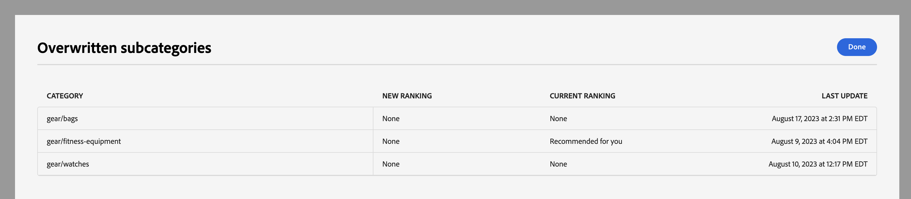

# 카테고리 머천다이징

카테고리 머천다이징을 사용하면 스토어 소유자가 [!DNL Live Search] 지능형 순위 [규칙](rules.md)을(를) 제품 카테고리 및 하위 카테고리에 적용할 수 있습니다.

이 비디오는 카테고리 머천다이징에 대해 소개합니다.

>[!VIDEO](https://video.tv.adobe.com/v/3424617)

이 기능은 **마케팅** > SEO 및 검색 > **[!DNL Live Search]** > **카테고리 머천다이징**&#x200B;의 관리자에서 액세스할 수 있습니다.

>[!NOTE]
>
>범주 머천다이징은 [!DNL Live Search] [3.0.0 이상](release-notes.md)에서 사용할 수 있습니다. 카테고리 머천다이징 작업 영역이 표시되지만 데이터로 채워지지 않으면 [!DNL Live Search] 모듈을 업데이트하십시오.

카테고리 머천다이징 보기에는 다음과 같은 열이 있는 정의된 카테고리 규칙이 표시됩니다.

* 범주
* 순위 전략
* 상속된 순위
* 마지막으로 업데이트됨
* 액션

범주별 검색 필드에서 범주나 하위 범주를 검색할 수 있습니다.

## 순위 전략

카테고리 머천다이징에서는 [개별 제품](rules-workspace.md)과(와) 동일한 순위 유형을 사용합니다.
등급에는 지능과 수동, 이렇게 두 가지 유형이 있습니다.

**지능형 등급**&#x200B;은(는) [Adobe AI](https://business.adobe.com/kr/ai.html)의 상점 행동 데이터 분석을 활용하여 특정 알고리즘을 통해 선택한 범주 내의 모든 제품을 정렬합니다. 지능형 등급을 선택하면 지속적으로 Adobe AI가 기본 데이터를 재분석하므로 시간이 지남에 따라 구체적인 제품 순서가 변경될 것으로 예상됩니다. 예를 들어 상위 트렌드 제품은 쇼퍼 환경 설정이 변경될 때 시간이 지남에 따라 자동으로 변경됩니다.
지능형 순위 방법은 다음과 같습니다.

* 가장 많이 구매함: 이전 7일 동안 쇼핑객이 구매한 빈도별로 제품을 평가합니다.
* 장바구니에 가장 많이 추가: 이전 7일 동안 쇼핑객이 장바구니에 추가한 빈도별로 제품을 분류합니다.
* 가장 많이 본 항목: 이전 7일 동안 쇼핑객이 본 빈도별로 제품을 평가합니다.
* 추천: 각 구매자의 이전 및 현재 현장 행동에 따라 구매자가 각 구매자와 상호 작용할 가능성에 따라 제품의 등급을 지정합니다.
* 트렌드: 조회수를 기준으로 최근 인기도 상승으로 제품의 등급을 지정합니다.
* 없음: 기본 주문에 따라 제품에 등급을 지정합니다.

**수동 순위**&#x200B;를 사용하면 수동 고정, 증폭, 저장 및 숨기기 규칙을 정의하여 자동 제품 정렬 순서를 재정의할 수 있습니다.

## 상속된 순위

머천다이저로서, &quot;트렌드&quot;별로 정렬할 모든 여성 의류 카테고리를 선택할 수 있습니다. 여기에는 하위 범주인 &#39;여성바지&#39;, &#39;여성셔츠&#39;, &#39;여성장신구&#39;가 포함된다. 남성의 범주는 영향을 받지 않아야 합니다. 상속된 등급을 사용하여 이를 달성할 수 있습니다.

하위 범주가 있는 범주 또는 하위 범주에 대한 지능형 순위 방법을 선택할 때 **하위 범주에 지능형 순위 적용** 옵션을 설정할 수 있습니다. 이렇게 하면 모든 하위 카테고리에 순위 방법이 적용됩니다.

이제 이러한 하위 범주는 상위 범주에서 해당 규칙을 상속합니다( 상속된 순위 열의 &quot;예&quot;). 작업 열에서 사용 가능한 옵션은 **규칙 편집** 및 **세부 정보 보기**&#x200B;뿐입니다. 하위 범주의 상속된 규칙에 대해 **삭제** 옵션을 사용할 수 없습니다. 하위 범주 상속을 삭제하려면 상위 범주에서 상속을 실행 취소해야 합니다.

모든 카테고리 또는 하위 카테고리는 한 번에 하나의 인텔리전트 순위만 적용할 수 있습니다. 수동 랭킹도 추가로 적용될 수 있습니다.

범주에 인텔리전트 등급을 적용하고 **하위 범주에 인텔리전트 등급 적용** 옵션을 켜면 하위 범주에 이미 적용된 모든 인텔리전트 등급을 덮어씁니다.

{width="700"}

**모두 보기**&#x200B;를 클릭하면 제안된 변경 사항에 대한 세부 정보가 포함된 대화 상자가 열립니다.

상속된 인텔리전트 순위가 있는 범주에 인텔리전트 등급을 직접 추가할 때 상속이 새 인텔리전트 순위에 의해 재정의됩니다.

카테고리에서 지능형 등급을 삭제하면 상속이 다시 설정됩니다.
두 시나리오 모두에서 수동 랭킹이 유지됩니다.

범주에서 지능형 등급을 제거하고 하위 범주 상속을 선택하면 상속된 지능형 순위만 하위 범주에서 제거됩니다. 수동 순위는 상속의 대상이 아니며 유지됩니다.

상위 수준 카테고리에 대한 변경 사항의 영향을 받는 상속된 하위 카테고리를 설명하는 대화 상자가 나타납니다.

{width="1200"}

## 범주 규칙 만들기

범주 규칙을 만들려면 다음을 수행하십시오.

1. **규칙 추가** 단추를 클릭합니다.
1. _범주 선택_ 보기에서 범주와 하위 범주를 차례로 클릭합니다.
1. 확인란을 선택하여 등급을 매길 범주를 선택합니다.
1. **적용**&#x200B;을 클릭합니다.

   

1. _범주 규칙 추가_ 보기에서 범주에 적용할 지능형 순위 방법을 선택합니다.
카테고리 미리보기 페이지에는 라이브 검색 데이터를 사용하여 선택한 순위의 실제 결과가 표시됩니다.
1. 규칙을 저장하려면 **저장 및 게시**&#x200B;를 클릭합니다.

[!DNL Live Search] 서비스가 규칙을 처리하고 완료되면 저장소에서 규칙을 활성화합니다.

## 범주 규칙 수정

기존 규칙을 수정하려면 다음을 수행합니다.

1. 작업 열에서 **..**&#x200B;을(를) 클릭하고 **편집**&#x200B;을(를) 선택합니다.
1. 범주 규칙 편집 보기에서 필요한 변경 내용을 적용하고 **저장 및 게시**&#x200B;를 클릭합니다.

[!DNL Live Search]에서 변경 내용을 처리하면 변경 내용이 저장소에 반영됩니다.

## 범주 규칙 삭제

범주 규칙을 삭제하려면

1. 작업 열에서 **..**&#x200B;을(를) 클릭하고 **삭제**&#x200B;를 선택합니다.
1. _규칙 삭제_ 모달에서 **삭제**&#x200B;를 선택하여 규칙을 제거하거나 **취소**&#x200B;를 선택하여 작업을 취소하십시오.

## 수동 순위

수동 등급을 사용하면 인텔리전트 등급 규칙(있는 경우)에 의해 결정된 제품 주문을 무시하고 결과 내에 제품이 표시되는 위치를 수동으로 제어할 수 있습니다.

이벤트는 정의된 조건이 충족될 때 검색 결과를 수정하는 작업입니다. 수동 순위에는 최대 25개의 이벤트가 포함될 수 있습니다.

* 부스트: 검색 결과에서 제품을 더 높게 이동합니다.
* Bury: 검색 결과에서 제품을 더 아래로 이동합니다.
* 제품 고정: 결과에서 제품을 특정 위치로 이동합니다.
* 제품 숨기기: 검색 결과에서 제품을 제외합니다.

수동 순위 만들기:

1. 위에서 설명한 대로 범주에 대한 지능형 순위 규칙을 설정합니다. 쿼리 결과가 카테고리 페이지 미리보기 보기에 나타납니다. 이렇게 하면 실제 라이브 검색 데이터를 사용하여 결과를 미리 볼 수 있습니다.

1. 카테고리 페이지 미리보기 보기에서 제품을 클릭하여 드래그합니다. 원하는 위치에 드래그하여 놓습니다. 제품 및 위치 필드는 이벤트 창에서 자동으로 채워집니다.

고정 아이콘을 클릭하여 제품을 현재 위치에 고정할 수도 있습니다. 줄임표 컨텍스트 메뉴를 사용하여 &quot;맨 위에 고정&quot; 또는 &quot;맨 아래에 고정&quot;을 수행합니다.

이벤트를 수동으로 추가하려면:

1. 수동 순위에서 **이벤트 선택** 메뉴를 클릭하고 관련 조건이 충족될 때 수행할 이벤트를 선택합니다.
1. 영향을 줄 제품의 이름을 입력합니다. 입력할 때 제품이 권장됩니다.
1. 여러 이벤트에 대해 조건이 충족될 때 트리거할 다른 이벤트를 선택합니다.

>[!NOTE]
>
>특정 카테고리가 상점 첫 화면에서 열리고 해당 카테고리에 대한 규칙이 있는 경우 규칙이 적용됩니다. 카테고리 머천다이징 규칙의 경우 기본 정렬 순서는 &quot;정렬 기준: 위치&quot;입니다. 쇼핑객이 정렬 순서를 변경하면 모든 숨겨진 제품, 고정된 제품 및 숨겨진 제품이 더 이상 정렬되지 않습니다.
