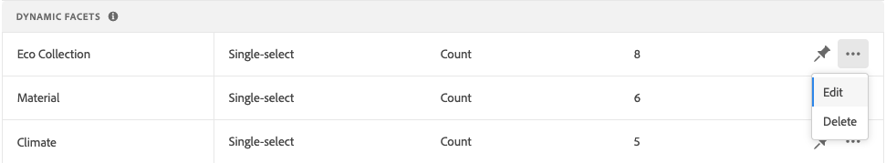

# Facet 관리

기존 패싯의 속성을 업데이트하거나 상점 앞에서 프레젠테이션을 변경하려면 다음 지침을 따르십시오.

## 가격 패싯 그룹화 구성

가격 결정 간격 및 그룹화를 구성하려면 [설정](settings.md)을 참조하세요.

## Facet 편집

1. 편집할 Facet을 찾습니다.
1. 목록에 패싯이 많으면 *필터링 기준*&#x200B;을(를) 다음 중 하나로 설정하십시오.

   * 고정됨
   * 동적

   자세한 내용을 보려면 [Facet Types](facets-type.md)(으)로 이동하십시오.

   

1. 패싯 속성을 편집하려면 **자세히**(...) 옵션을 클릭하세요.
1. **편집** 클릭

   

1. Facet 레이블을 편집하려면 다음 중 하나를 수행합니다.

   * [!DNL Commerce] 상점 첫 화면의 경우 [특성 레이블](https://experienceleague.adobe.com/docs/commerce-admin/catalog/product-attributes/product-attributes.html)을(를) 편집하십시오.
   * Headless 구현의 경우 첫 번째 열의 값을 클릭하고 필요에 따라 텍스트를 편집합니다.

   

1. (Headless만 해당) Facet 값을 정렬하는 데 사용되는 메서드를 변경하려면 *정렬 유형* 열의 값을 클릭하고 다음 중 하나를 선택하십시오.

   * 알파벳순
   * 계수

   

1. **Max Value** 열에서 Storefront에 표시할 Facet 필터 값의 최대 수(0 - 10)를 설정하십시오.
1. 완료되면 **저장**&#x200B;을 클릭하세요.

   변경 사항은 게시될 때까지 상점에 표시되지 않습니다.

## 패싯 고정/고정 해제

핀을 클릭하면 색상이 변경되고 패싯을 *고정 패싯* 또는 *동적 패싯* 섹션으로 이동하는 데 사용됩니다.

1. 패싯을 *필터* 목록의 맨 위에 고정하려면 *동적 패싯* 목록에서 패싯을 찾아 회색 핀()을 클릭하십시오.

   핀이 파란색으로 바뀌고 패싯이 *고정된 패싯* 섹션으로 이동합니다.

1. 패싯을 고정 해제하려면 *고정된 패싯* 목록에서 패싯을 찾은 다음 파란색 핀()을 클릭합니다.

   핀이 회색으로 바뀌고 패싯이 *동적 패싯* 섹션으로 이동합니다.

   

>[!NOTE]
>
>이름이 같은 레이블이 두 개 있는 경우 고정된 패싯 순서가 일치하지 않을 수 있습니다.

## 고정 패싯 이동

>[!NOTE]
>
>고정 패싯의 순서는 Headless 구현에서만 지원됩니다. 순서가 지정된 패싯이 필요한 경우 [!DNL Live Search] PLP 위젯을 사용합니다.

고정된 패싯의 순서는 행을 다른 위치로 이동하여 변경할 수 있습니다. 고정 패싯의 행 시작 부분에 *Move* 아이콘()이 있습니다. 고정 패싯과 달리 동적 패싯은 이동할 수 없습니다.

1. 목록의 *고정된 패싯* 섹션에서 패싯을 찾습니다.
1. **이동**() 아이콘을 사용하여 행을 *고정 패싯* 섹션의 새 위치로 끕니다.

   변경 사항이 게시되면 순서가 변경된 패싯이 상점 *필터* 목록에 나타납니다.

## Facet 삭제

1. 목록에서 패싯을 찾은 다음 **자세히**(...) 옵션을 클릭합니다.
1. **삭제**&#x200B;를 클릭합니다.
1. 확인 메시지가 표시되면 **패싯 삭제**&#x200B;를 클릭합니다.
Facet은 변경 사항이 게시된 후 상점 첫 화면에서 제거됩니다.

## 변경 사항 게시

1. 변경 내용으로 상점 전면을 업데이트하려면 **변경 내용 게시**&#x200B;를 클릭하세요.
1. 스토어에 업데이트가 나타날 때까지 15분 정도 기다립니다.
