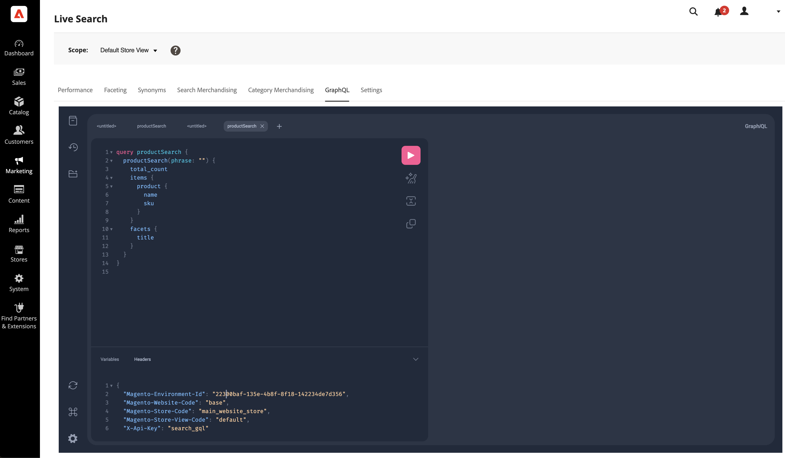

# GraphQL

*GraphQL* 작업 영역을 통해 관리자는 자신의 데이터를 사용하여 GraphQL 쿼리를 빌드하고 테스트할 수 있습니다.

이 작업 영역은 [`productSearch`](https://developer.adobe.com/commerce/webapi/graphql/schema/live-search/queries/product-search/) 및 [`attributeMetadata`](https://developer.adobe.com/commerce/webapi/graphql/schema/live-search/queries/attribute-metadata/) 쿼리를 지원합니다.



```graphql
query productSearch {
  productSearch(phrase: "a306") {
    total_count
    items {
      product {
        sku
        name
      }
    }
    facets {
      title
    }
  }
}
```

변수:

```json
{
  "Magento-Environment-Id": "xxxxxxxx-xxxx-xxxx-xxxx-xxxxxxxxxxxx",
  "Magento-Website-Code": "base",
  "Magento-Store-Code": "base",
  "Magento-Store-View-Code": "default",
  "X-Api-Key": "search_gql"
}
```
