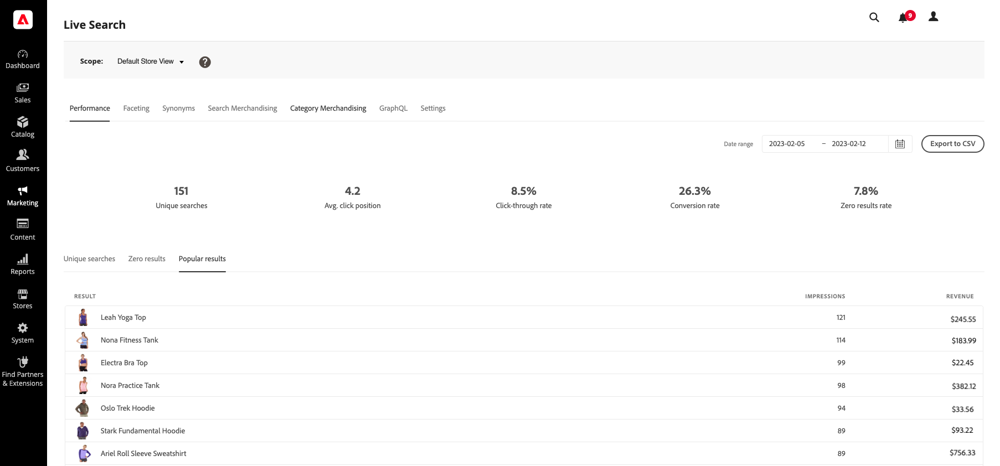

# 성능

*성능* 작업 영역에서는 쇼핑객이 사용하는 검색어에 insight을 제공합니다. 이 정보는 트렌드를 식별하고 클릭스루를 늘리고 전환율을 향상시키는 데 사용할 수 있습니다. 성능 작업 영역에서는 특정 날짜 범위에 대한 검색 지표 스냅숏을 제공하며 다음 보고서를 포함합니다.

* 고유 검색
* 결과 없음
* 인기 있는 결과

데이터 동기화에 대한 자세한 내용은 [데이터 관리 대시보드](https://experienceleague.adobe.com/docs/commerce-admin/systems/data-transfer/data-sync/data-dashboard.html?lang=ko)를 참조하십시오.

>[!NOTE]
>
>성능 작업 영역은 12시간마다 업데이트됩니다.

## 보고서 보기

1. **날짜 범위**&#x200B;를 입력하려면 일정()을 클릭하고 다음 중 하나를 실행하십시오.

   * 단일 날짜를 지정하려면 달력에서 날짜를 두 번 클릭합니다.
   * 날짜 범위를 지정하려면 달력에서 첫 번째 날짜와 마지막 날짜를 클릭합니다.

>[!NOTE]
>
>날짜 범위는 1년을 초과할 수 없습니다.

## 필드 설명

| 스냅샷 데이터 | 설명 | 계산 예 |
|--- |--- |--- |
| 고유 검색 | 지정된 날짜 범위에 대한 총 고유 검색 수입니다. 동일한 구매자가 동일한 쿼리에 대해 여러 검색을 수행하는 경우 한 시간 이상 간격으로 제출되면 고유하다고 간주됩니다. | **예:** &#x200B;검색: - 오전 10:00에 &quot;바지&quot; - 오전 10:30에 &quot;바지&quot;(1시간 이내→고유하지 않음) - 오후 12:00에 &quot;바지&quot;(1시간 후→고유함) - 오후 1:00에 &quot;셔츠&quot;  **총 고유 검색 = 3** |
| 클릭스루 비율 | 구매자가 제품을 클릭하는 것으로 끝나는 검색의 백분율입니다. 예를 들어, 쇼핑객이 &quot;바지&quot;와 &quot;셔츠&quot;를 검색한 다음 &quot;셔츠&quot; 검색에서 하나의 결과를 클릭하는 경우 클릭스루 비율은 50%입니다. | **수식:** &#x200B;클릭스루 비율 = ≥1 클릭으로 검색 횟수 ÷ 총 고유 검색 횟수&#x200B;  **예:** &#x200B;총 고유 검색 횟수 = 4 최소 한 번의 클릭으로 검색 횟수 = 2  CTR = 2 ÷ 4 = **50%** |
| 전환율 | 쇼핑객이 구매한 제품의 비율과 지정된 날짜 범위 동안 쇼핑객이 클릭한 제품 수입니다. 예를 들어, 쇼퍼가 팝오버에서 6개의 제품을 보고, 하나를 클릭한 다음, 구매를 수행하는 경우 상호 작용의 전환율은 100%입니다.   전환율은 특정 제품의 보기 수에 영향을 받지 않습니다. 예를 들어 전환율은 쇼핑객이 검색을 사용하지만 제품을 클릭하지 않는 경우 동일하게 유지됩니다. | **공식:** &#x200B;전환율 = 총 구매 제품 ÷ 총 제품 클릭&#x200B;  **예 1:** &#x200B;클릭한 제품 = 5 구매 제품 = 2  CVR = 2 ÷ 5 = **40%**  **예 2(5시간 집계):** &#x200B;시간별 클릭 수: 4, 5, 6, 10, 2 시간별 구매 횟수: 1, 3, 0, 4, 1  총 클릭 수 = 4 + 5 + 6 + 10 + 2 = 27 총 구매 = 1 + 3 + 0 + 4 + 1 = 9  CVR = 9 ÷ 27 = **3.33%** |
| 결과 없음 비율 | 지정된 날짜 범위에 대한 결과를 반환하지 않는 고유 검색의 백분율입니다. 예를 들어, 쇼핑객이 &quot;fjjjfjfjf&quot;를 두 번 검색(결과 없음)하고 &quot;바지&quot;를 한 번 검색(결과 있음)하는 경우 결과 없음 비율은 66.67%입니다. | **수식:**  0 검색 비율 = 결과가 0인 고유 검색 횟수 ÷ 총 고유 검색 횟수&#x200B;  **예:** &#x200B;총 고유 검색 횟수 = 3 결과가 0인 검색 횟수 = 2  0 검색 비율 = 2 ÷ 3 = **66.67%** |
| 평균 클릭 위치 | 지정된 날짜 범위에 대한 고유 검색에 따른 평균 클릭스루 비율의 상대적 위치입니다. | **수식:** &#x200B;평균 클릭 위치 = 클릭 위치 합계 ÷ 총 클릭 수&#x200B;  **예:** &#x200B;위치 클릭 수: 1, 3, 2  평균 클릭 위치 = (1 + 3 + 2) ÷ 3 = **2** |

| 보고서 | 설명 |
|--- |--- |
| 고유 검색 | 지정된 날짜 범위 동안 사용된 고유한 검색 쿼리를 나열합니다. 보고서 데이터는 고유 검색 스냅샷 데이터와 동일한 방식으로 계산됩니다. 쇼핑객이 동일한 검색 쿼리를 두 번 입력했지만 한 시간 이상 차이가 나는 경우 검색은 두 개의 고유한 검색으로 간주됩니다.  **보고서 제한:** CSV 파일을 생성할 때 상위 500개 용어. |
| 결과 없음 | 결과를 반환하지 않는 검색 쿼리와 지정된 날짜 범위 동안 사용한 횟수를 나열합니다.  **보고서 제한:** CSV 파일을 생성할 때 상위 500개 용어. |
| 인기 있는 결과 | 지정된 날짜 범위 동안 가장 많은 보기를 받은 제품의 이름을 나열합니다. 방문 빈도가 높은 결과는 노출 횟수만을 기반으로 계산되며 생성된 클릭 수 또는 매출의 영향을 받지 않습니다.  **보고서 제한:** CSV 파일을 생성할 때 상위 500개 용어. |
