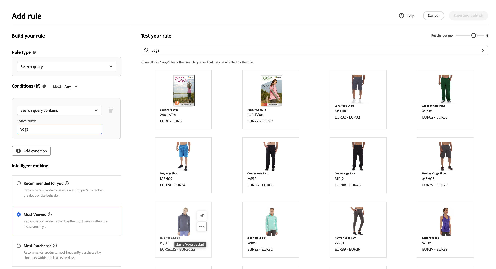

# 규칙 추가

규칙을 작성하기 위한 첫 번째 단계는 규칙 편집기를 사용하여 관련 이벤트를 트리거하는 구매자 쿼리 텍스트에 조건을 정의하는 것입니다. 그런 다음 규칙 세부 사항을 완료하고 결과를 테스트한 다음 규칙을 게시합니다.

## 규칙 추가

1. 관리자의 **마케팅** > SEO 및 검색 > **[!DNL Live Search]**(으)로 이동합니다.
1. 규칙이 적용되는 **스토어 보기**&#x200B;를 식별하도록 [범위](https://experienceleague.adobe.com/docs/commerce-admin/start/setup/websites-stores-views.html#scope-settings)를 설정하십시오.
1. **머천다이징 검색** 작업 영역을 클릭합니다.
1. **규칙 추가**&#x200B;를 클릭하여 규칙 편집기를 시작합니다.

## 규칙 유형

검색 쿼리는 특정 검색어, 조건 및 등급 유형을 정의하는 곳입니다.

특정 검색 쿼리가 정의되지 않은 경우 모든 쿼리에 적용되는 기본 규칙을 설정할 수 있습니다. 하나의 기본 규칙만 설정할 수 있고 조건을 포함할 수 없습니다. 기본값을 선택하면 조건 인터페이스가 표시되지 않습니다.
기본 지능형 순위 유형 및 모든 기본 검색에 적용할 수동 등급을 선택합니다. 수동 순위는 항상 적용됩니다.

## 조건

조건은 이벤트를 트리거하기 위한 요구 사항입니다. 규칙에는 최대 10개의 조건과 25개의 이벤트가 있을 수 있습니다. 기본 규칙에는 조건이 있을 수 없습니다.

>[!NOTE]
>
>현재는 특정 고객 그룹에 규칙을 타깃팅할 수 없습니다.

### 단일 조건

1. *규칙 만들기*&#x200B;에서 충족될 **조건**&#x200B;을 선택하고 지침에 따라 명령문을 완료합니다.

   * 검색 쿼리에 다음이 포함됨 - 쇼핑객 쿼리에 있어야 하는 텍스트 문자열을 입력합니다. 일치 설정은 쇼핑객 쿼리가 카탈로그와 일치하는 정도를 결정합니다. 옵션:  모두 - 구매자의 쿼리 텍스트 중 어떤 부분이든 조건과 일치할 수 있습니다. 모두 - 구매자의 모든 쿼리가 조건과 일치해야 합니다.
   * 검색 쿼리 - 쇼핑객 쿼리와 정확히 일치하는 텍스트 문자열을 입력합니다. 예를 들어, &quot;요가 바지&quot;. `Search query is`과(와) 일치 `All`이(가) 있는 규칙에는 조건이 하나만 있을 수 있습니다.
   * 검색 쿼리가 다음으로 시작 - 구매자 쿼리의 시작 부분에 있어야 하는 텍스트 문자 또는 문자열을 입력합니다.
   * 검색 쿼리가 다음으로 끝남 - 구매자 쿼리의 끝에 있어야 하는 문자 또는 텍스트 문자열을 입력합니다.

   결과는 *규칙 테스트* 창에 바로 표시되며 우선 순위별로 번호가 매겨집니다. 상단의 *행당 결과* 슬라이더를 사용할 수 있습니다.    각 행의 제품 수를 변경할 수 있는 권한.

   

1. 다른 쿼리를 테스트하려면 *규칙 테스트* 검색 상자에서 쿼리 텍스트를 변경하고 **반환**&#x200B;을 누르십시오.
처음에 테스트 창은 조건 검색 상자에서 쿼리를 렌더링합니다. 하지만 이제 테스트 쿼리 상자에서 쿼리를 렌더링하고 있습니다. 테스트 창은 한 번에 하나의 쿼리만 렌더링합니다.
1. 결과가 마음에 들면 *조건* 검색 상자의 텍스트를 업데이트하세요. 그런 다음 페이지의 아무 곳이나 클릭하여 테스트 창의 결과를 업데이트합니다.
1. 하나의 조건으로 간단한 규칙을 만들려면 3단계: [이벤트 추가](#events)(으)로 이동합니다.

### 여러 조건

1. 여러 조건을 사용하여 규칙을 작성하려면 **조건 추가**&#x200B;를 클릭하십시오.
규칙에는 최대 10개의 조건이 있을 수 있습니다. 두 조건을 결합하는 논리 연산자는 현재 *일치* 설정을 기반으로 합니다. 기본적으로 *일치*&#x200B;은(는) `All`이고 논리 연산자는 `AND`입니다.

1. 두 번째 조건을 선택하고 필요한 쿼리 텍스트를 입력합니다.

1. 규칙 논리를 변경하려면 **일치** 설정을 변경하여 구매자의 검색 기준이 쿼리 조건과 얼마나 가깝게 일치해야 하는지 확인하십시오. **Match**&#x200B;을(를) 다음 중 하나로 설정합니다.

   * 임의 - (기본값) 규칙의 모든 논리 연산자가 `OR`(으)로 설정되고 결과가 테스트 창에 나타납니다.
   * 모두 - 규칙의 모든 논리 연산자가 `AND`(으)로 설정되고 결과가 테스트 창에 나타납니다.

   *Match* 값은 여러 조건을 조인하는 데 사용되는 논리 연산자를 결정합니다. *일치* 설정을 변경하면 규칙의 모든 논리 연산자가 변경됩니다. `AND`과(와) `OR`을(를) 동일한 규칙으로 결합할 수 없습니다.

   이 예제에서는 &#39;요가 바지&#39;를 검색하기보다는 &#39;요가&#39; 또는 &#39;바지&#39;를 검색하는 두 개의 별도 쿼리가 있습니다. 이 규칙은 구체적이지 않으며 다른 규칙보다 상점 앞에서 더 자주 트리거됩니다.

   

1. 다른 조건을 추가하려면 **조건 추가**&#x200B;를 클릭하고 프로세스를 반복합니다.

## 인텔리전트 등급

지능형 순위는 사용자 행동과 사이트 통계를 결합하여 제품 순위를 결정합니다.
점주는 다음과 같은 유형의 순위 전략을 설정할 수 있습니다.

* 가장 많이 구매함: 이전 7일 동안의 SKU당 총 구매 횟수로 제품 순위를 지정합니다.
* 장바구니에 가장 많이 추가됨 - 이전 7일 동안의 총 &quot;장바구니에 추가&quot; 활동 순서로 순위가 매겨집니다.
* 가장 많이 본 항목: 이전 7일 동안의 SKU당 총 보기 수를 표시합니다.
* 추천 - `viewed-viewed` 데이터 포인트를 사용 - 이 SKU를 본 구매자는 다른 SKU도 살펴보았습니다.
* 트렌드: 배경 이벤트의 경우 72시간, 전경 이벤트의 경우 24시간 동안 페이지 보기 이벤트를 되돌아봅니다.
* 없음: 관련성을 기준으로 제품이 주문됩니다.

규칙에 대한 전략 유형을 선택합니다. **규칙 테스트** 창에 예상 결과가 표시됩니다.

### 지능적인 순위 점수 책정 방식

지능형 순위는 두 가지 주요 요소인 **텍스트 관련성** 및 **동작 신호**&#x200B;를 결합하여 최종 제품 순서를 결정합니다. 이러한 요인이 상호 작용하는 방식을 이해하면 검색 결과에 대한 현실적인 기대를 설정하는 데 도움이 됩니다.

**채점 구성 요소:**

* **텍스트 관련성**: 채점의 주요 요소입니다. 이렇게 하면 제품의 이름, 설명 및 속성이 검색 쿼리와 얼마나 잘 일치하는지 측정합니다. 텍스트 관련성 점수는 제한되지 않으며(특정 상한이 없음) 다음과 같은 요인의 영향을 받습니다.

   * 일치하는 단어의 발생 빈도입니다.
   * 제품 이름/설명의 길이(단어)입니다.

* **동작 신호**: 텍스트 관련성 점수 위에 적용된 경계 부스트. &quot;가장 많이 본 항목&quot; 또는 &quot;가장 많이 구매한 항목&quot;과 같은 지능형 순위 전략을 선택하면 더 높은 동작 신호가 있는 제품의 점수에 대한 고정된 상향 조정이 제공됩니다. 그러나 이 부스트에는 정의된 제한이 있습니다.

**가장 많이 본 제품이 먼저 나타나지 않는 이유:**

텍스트 관련성은 일반적으로 점수가 제한되지 않는 반면 동작 향상은 고정되어 있기 때문에 순위를 압도합니다. 그 결과 강한 텍스트 일치 기능이 있는 제품이 참여 신호가 높은 제품을 능가하는 경우가 많습니다. 행동 향상만으로는 텍스트 관련성의 큰 차이를 보상할 수 없습니다. 지능적인 순위는 일치 품질과 쇼핑객 상호 작용을 모두 인수분해함으로써 이를 해결하여 전반적인 관련성을 향상시킵니다. 그러나 텍스트 일치 품질은 순위 결정의 주요 드라이버로 남아 있습니다.

**예:**

판매자는 &quot;가장 많이 본&quot; 지능형 순위 전략을 사용하고 &quot;캔들&quot;을 검색합니다. 제품 SKU YAN-K-E-512가 가장 높은 보기 수를 가지므로 결과 상단에 표시될 것으로 예상됩니다. 그러나 다른 제품은 더 높은 순위를 갖습니다.

* **Texas Candle**(첫 번째 위치): 텍스트 관련성 점수가 매우 높은 더 짧고 깔끔한 제품 이름이 있습니다. YAN-K-E-512보다 조회 수가 적지만 우수한 텍스트 일치율이 동작 증폭을 능가합니다.

* **YAN-K-E-512**(하단 위치): &quot;가장 많이 본&quot; 동작 데이터에서 보기 백분위수가 가장 높음에도 불구하고 복잡한 SKU 기반 이름은 더 낮은 텍스트 관련성 점수를 생성합니다. 고정된 행동 부스트로는 이러한 텍스트 관련성 격차를 극복하기에는 충분하지 않다.

규칙을 사용하여 제품 검색 기능을 향상시키는 방법을 알아보려면 [검색 규칙](./best-practice.md#search-rules)을 참조하세요.

### 주의 사항

* 쿼리에서 아포스트로피와 인용 부호를 사용하면 일부 언어에서 순위 및 관련성과 관련된 사소한 문제가 발생할 수 있습니다.
* 지능형 순위가 올바르게 작동하도록 하려면 검색 또는 필터링(패싯)에 사용되는 제품 특성에 대한 **검색 가중치**&#x200B;가 `5` 이하인지 확인하십시오. [!DNL Commerce] 관리자에서 이 설정을 찾으려면:

   1. **스토어** > _특성_ > **제품**&#x200B;을 선택합니다.
   1. &quot;name&quot;과 같은 속성을 검색합니다.
   1. **특성 정보** > **Storefront 속성** 페이지에서 검색 가중치를 `5` 이하로 설정하십시오.

      

>[!NOTE]
>
>Storefront 검색 경험은 패싯, 동의어, 검색/카테고리 머천다이징 규칙 등 함께 작동하는 여러 구성의 영향을 받아 관리자의 개별 구성을 테스트할 때 표시되는 결과와 다를 수 있습니다. 관리자 테스트는 특정 구성 영역을 격리하지만 스토어프런트는 모든 관련 구성을 함께 적용하여 더욱 복잡하고 사실적인 검색 결과를 생성합니다.

## 수동 순위

수동 순위(이전의 이벤트)는 정의된 조건이 충족될 때 검색 결과를 수정하는 작업입니다. 단일 규칙에는 최대 25개의 이벤트가 포함될 수 있습니다.

* 증폭 - 검색 결과에서 제품을 더 위로 이동합니다.
* Bury - 검색 결과에서 SKU를 더 낮게 이동합니다.
* 제품 고정 - 페이지에서 선택한 &quot;위치&quot;에 제품이 표시됩니다.
* 제품 숨기기 - 검색 결과에서 SKU를 제외합니다.

제품을 고정하는 가장 쉬운 방법은 드래그 앤 드롭입니다.

1. 테스트 창에서 제품을 클릭하여 드래그합니다. 원하는 위치에 드래그하여 놓습니다. 제품 및 위치 필드는 이벤트 창에서 자동으로 채워집니다.

   

고정 아이콘을 클릭하여 제품을 현재 위치에 고정할 수도 있습니다. 줄임표 컨텍스트 메뉴를 사용하여 &quot;맨 위에 고정&quot; 또는 &quot;맨 아래에 고정&quot;을 수행합니다.

>[!NOTE]
>
>쿼리에서 반환된 제품만 고정할 수 있습니다.

또는 이벤트를 수동으로 설정할 수 있습니다.

1. *이벤트*&#x200B;에서 연결된 조건이 충족될 때 수행할 **이벤트**&#x200B;을(를) 선택하십시오.

   예를 들어 `Hide a product`을(를) 선택합니다. 그런 다음 숨길 제품의 이름을 입력합니다. 입력할 때 제품이 권장됩니다.

1. 여러 이벤트에 대해 조건이 충족될 때 트리거할 다른 이벤트를 선택합니다.

## 추가 세부 정보

여기에 입력한 정보는 [규칙 세부 정보](rules-workspace.md) 패널에 표시됩니다.

1. *세부 정보*&#x200B;에서 규칙의 **이름**&#x200B;을(를) 입력하십시오. 모든 규칙 이름은 고유해야 합니다.
1. 규칙의 간단한 **설명**&#x200B;을(를) 입력하십시오.
1. 규칙을 활성화하려면 **시작 날짜** 및 **종료 날짜**&#x200B;를 입력하거나 달력에서 날짜를 선택하십시오.

   날짜 범위를 선택하려면 첫 번째 날짜를 클릭하고 드래그하여 범위를 선택합니다.

   

## 규칙 마무리 중

1. 테스트 창에서 규칙 결과를 검사합니다.
1. 규칙에 여러 쿼리가 있는 경우 규칙의 영향을 받을 수 있는 각 쿼리를 테스트합니다.
1. 완료되면 **저장 및 게시**&#x200B;를 클릭합니다.

   규칙이 *규칙* 작업 영역의 목록에 추가됩니다.

1. 활성 규칙이 즉시 적용되지만, 상점 첫 화면의 캐시된 쿼리 결과가 새로 고쳐질 때까지 최대 15분 정도 기다려야 할 수 있습니다.

>[!NOTE]
>
>기본 정렬 순서 &quot;정렬 기준: 가장 관련성&quot;을 선택하면 규칙 및 수동 등급 제품이 검색 결과에 적용됩니다. 쇼핑객이 정렬 순서를 이름별 또는 가격별 정렬과 같이 변경하는 경우, 규칙 및 수동 순위는 더 이상 적용되지 않습니다.

## 필드 설명

### 조건(if)

| 조건 | 설명 |
|--- |--- |
| 검색 쿼리에 포함된 글자 수는 | 구매자 쿼리에 포함된 텍스트 문자 또는 문자열입니다. 이 조건을 충족하려면 구매자의 쿼리가 단일 문자만 일치하면 됩니다. |
| 검색 쿼리: | 쇼핑객 쿼리와 정확히 일치하는 문자 또는 텍스트 문자열입니다. 이 조건을 사용하면 조건이 여러 개인 복잡한 쿼리를 작성할 수 없습니다. |
| 검색 쿼리 시작 문자 | 구매자의 쿼리는 이 문자 또는 텍스트 문자열로 시작됩니다. |
| 검색 쿼리가 다음으로 끝남 | 구매자의 쿼리는 이 문자 또는 텍스트 문자열로 끝납니다. |

### 논리 연산자

| 연산자 | 설명 |
|--- |--- |
| 또는 | (기본값) 논리 연산자 `OR`은(는) 두 조건을 비교하고 하나 이상의 조건이 true인 경우 이벤트를 트리거하기 위한 요구 사항을 충족합니다. |
| 및 | 논리 연산자 `AND`은(는) 두 조건을 비교하고 두 조건이 모두 true인 경우 이벤트를 트리거하기 위한 요구 사항을 충족합니다. |

### 일치 연산자

| 연산자 | 설명 |
|--- |--- |
| 임의 | 규칙의 모든 논리 연산자를 `OR`(으)로 변경하고 일치하는 제품 집합을 반환합니다. |
| 모두 | 규칙의 모든 논리 연산자를 `AND`(으)로 변경하고 일치하는 제품 집합을 반환합니다. |

### 수동 순위

| 이벤트 | 설명 |
|--- |--- |
| 증폭 | 검색 결과에서 SKU 또는 SKU 범위를 더 높게 이동합니다. 각각은 테스트 검색 결과에 &quot;부스트&quot; 미리보기 배지로 표시됩니다. |
| 버리 | 검색 결과에서 더 낮은 SKU 또는 SKU 범위를 이동합니다. 각각은 테스트 검색 결과에 &quot;숨겨진&quot; 미리보기 배지로 표시됩니다. |
| 제품 고정 | 단일 SKU를 검색 결과의 특정 위치에 연결합니다. 제품이 테스트 검색 결과에서 &quot;고정된&quot; 미리보기 배지로 표시됩니다. |
| 제품 숨기기 | 검색 결과에서 SKU 또는 SKU 범위를 제외합니다. |

### 세부 사항

| 필드 | 설명 |
|--- |--- |
| 이름 | 규칙의 이름입니다. 규칙 이름은 고유해야 합니다. |
| 규칙 유형 | 기본값 또는 쿼리 더 구체적인 쿼리 규칙이 정의되지 않은 경우 기본값은 모든 규칙에 적용됩니다. |
| 시작 일자 | 규칙 시작 일자(예약된 경우). |
| 종료 일자 | 규칙의 종료 날짜(예약된 경우). |
| 설명 | 규칙에 대한 간단한 설명. |
