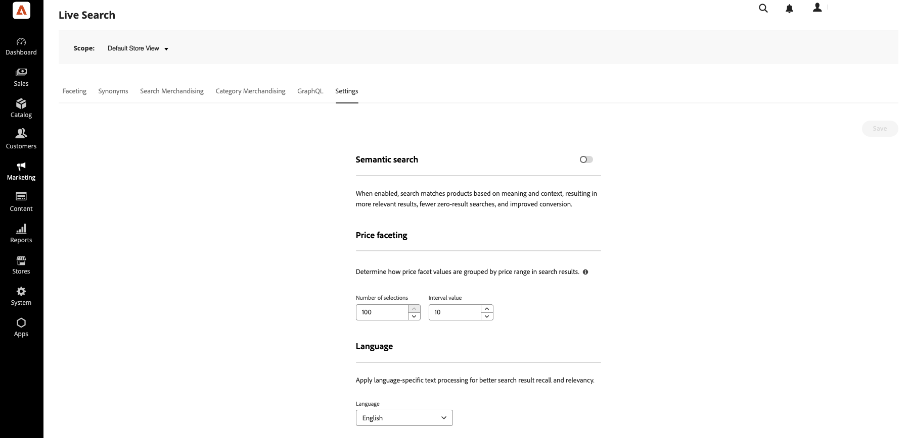

# 설정

**설정** 작업 영역을 사용하여 의미 체계 검색, 가격 패싯 범위 및 간격, 인덱스의 기본 언어를 구성하십시오.

## 의미 체계 검색 {#semantic-search}

시맨틱 검색은 정확한 키워드뿐만 아니라 의미와 맥락에 따라 제품을 매칭하기 위해 AI를 사용한다. **[!UICONTROL Semantic search]**&#x200B;이(가) 활성화되면 카탈로그 버텀과 일치하지 않는 자연어 또는 단어를 사용하는 쇼핑객이 여전히 관련 제품을 찾을 수 있습니다. [!DNL Live Search]은(는) 상점 첫 화면에서 하나의 통합 검색 환경에서 키워드 및 의미 체계 일치를 제공합니다. 의미 체계 검색은 기존 구성과 함께 작동합니다. [검색 규칙](rules.md), [동의어](synonyms.md), [패싯](facets.md), 부스트 및 [카테고리 머천다이징](category-merch.md)이 계속 적용됩니다.

**의미 체계 검색(PaaS만 사용)을 사용하려면:**

1. 관리자의 **마케팅** > *SEO 및 검색* > **[!DNL Live Search]**(으)로 이동합니다.
1. **설정** 작업 영역에서 **[!UICONTROL Semantic search]**&#x200B;을(를) 사용하도록 설정하십시오.

   활성화되면 검색은 의미와 컨텍스트에 따라 제품과 일치하므로 더 연관성 있는 결과가 나오고 결과가 없는 검색이 줄어들고 전환이 개선됩니다.

1. **[!UICONTROL Save]**&#x200B;을(를) 클릭합니다.

   색인화가 완료된 후 검색 결과가 업데이트됩니다. 중간 크기의 카탈로그의 경우 색인화는 최대 30분이 소요될 수 있습니다. 수백만 개의 제품이 포함된 대규모 카탈로그의 경우 몇 시간이 걸릴 수 있습니다.

>[!NOTE]
>
> 의미 체계 검색은 **영어** 카탈로그에서만 사용할 수 있습니다. **언어**&#x200B;을(를) 영어가 아닌 카탈로그로 설정하는 경우([언어](#language) 참조) **[!UICONTROL Semantic search]**&#x200B;은(는) 자동으로 비활성화됩니다.

이점, 유효성 검사 지침, 모범 사례, 문제 해결 및 제한 사항에 대해서는 [의미 체계 검색](semantic-search.md)을 참조하세요.

### 필드 설명

| 필드 | 설명 |
| --- | --- |
| 의미 체계 검색 | 활성화하면 [!DNL Live Search]에서 키워드 일치와 함께 의미와 컨텍스트를 사용합니다. 사전 정의된 카탈로그 속성은 자동으로 사용됩니다. 관리자에서 속성을 설정할 필요가 없습니다. [!DNL Adobe Commerce as a Cloud Service]에 대해 기본적으로 활성화되어 있으며 PaaS 판매자는 수동으로 활성화합니다. |

## 가격 결정 {#price-faceting}

가격 범위 그룹의 수와 가격 값이 이들 그룹 간에 분배되는 방법을 지정할 수 있습니다. 각 가격대는 이전 그룹과 하나씩 겹칩니다. 예를 들어 간격이 20인 5개의 그룹은 0-20, 20-40, 40-60, 60-80 및 >80의 가격 범위를 생성합니다. 카탈로그에 정의된 모든 범위를 채울 제품이 충분하지 않은 경우 사용 가능한 그룹의 표시가 적절하게 조정됩니다. 예: 0-20, 60-80, >80.

**가격 팩터링을 구성하려면:**

1. 관리자의 **마케팅** > *SEO 및 검색* > **[!DNL Live Search]**(으)로 이동합니다.
1. *가격 결정*&#x200B;의 **설정** 작업 영역에서 다음을 수행합니다.
   * 사용할 수 있는 **선택 항목 수** 또는 가격 그룹화를 입력하십시오. [!DNL Live Search] 4.4.0을 사용하면 최대 100개의 가격 그룹화를 정의할 수 있습니다. 이전 버전에서는 50개의 가격 그룹화가 허용되었습니다.
   * **간격 값** 또는 각 그룹의 가격 범위를 입력하십시오. 최대값은 40,000,000입니다.
1. **[!UICONTROL Save]**&#x200B;을(를) 클릭합니다.

   상점에서 업데이트된 설정을 사용할 수 있기까지는 약 15분이 소요됩니다.

### 필드 설명

| 필드 | 설명 |
|--- |--- |
| 선택 항목 수 | 상점 첫 화면에서 검색 필터로 사용할 수 있는 가격 범위 그룹화 수를 지정합니다. 기본값: 8, 최대값: 100([!DNL Live Search] 4.4.0 기준) |
| 간격 값 | 각 그룹의 가격 범위 간격을 지정합니다. 예를 들어 간격 값이 20인 5개의 선택 항목을 선택하면 0-20, 20-40, 40-60, 60-80 및 >80의 5개 그룹이 생성됩니다. 기본값: 5, 최대값: 40,000,000 |

## 언어 {#language}

언어 설정은 카탈로그를 읽고 색인을 작성할 때 예상할 언어를 [!DNL Live Search]에 알려줍니다.

언어에는 문법에 대한 다양한 규칙 세트, 예를 들어 단어 분리 방법, 동사 문장 및 단어 형태가 있습니다.
언어 설정을 사용하면 색인화 메커니즘에 올바른 규칙 집합이 적용됩니다.

언어 설정을 카탈로그의 기본 언어로 설정합니다. 색인의 언어를 변경할 때 카탈로그의 크기와 복잡성에 따라 상점 변경 사항을 반영하는 데 5분에서 60분이 걸릴 수 있습니다.

| 언어 | 코드 |
|----|----|
| 아랍어 | ar |
| 아르메니아어 | hy |
| 바스크어 | eu |
| 벵골어 | bn |
| 브라질어 | pt-br |
| 불가리아어 | bg |
| 카탈로니아어 | ca |
| 중국어(간체) | zh-cn |
| 중국어(번체) | zh-tw |
| 체코어 | cs |
| 덴마크어 | da |
| 네덜란드어 | nl |
| 영어 | en |
| 에스토니아어 | et |
| 핀란드어 | fi |
| 프랑스어 | fr |
| 갈리시아어 | gl |
| 독일어 | de |
| 그리스어 | el |
| 힌디어 | 안녕하세요 |
| 헝가리어 | hu |
| 인도네시아어 | id |
| 아일랜드어 | ga |
| 이탈리아어 | it |
| 일본어(가타카나) | ja |
| 한국어 | ko |
| 라트비아어 | lv |
| 리투아니아어 | lt |
| 노르웨이어 | 아니요 |
| 페르시아어 | fa |
| 포르투갈어 | pt |
| 루마니아어 | ro |
| 러시아어 | ru |
| 소라니 | ku |
| 스페인어 | es |
| 스웨덴어 | sv |
| 터키어 | tr |
| 태국인 | 번째 |
