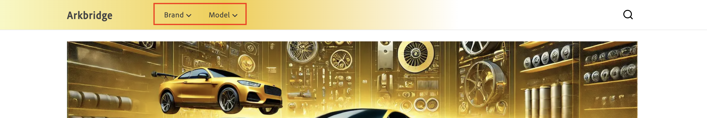

# 정책

>[!NOTE]
>
>이 설명서는 초기 액세스 개발 상태의 제품에 대해 설명하고 일반 가용성을 위한 모든 기능을 반영하지는 않습니다.

정책은 각 채널에 전달되는 데이터를 세분화하는 채널 내에 포함된 데이터 액세스 필터입니다. 정책은 올바른 콘텐츠를 올바른 대상으로 전송하도록 합니다. 예를 들어 실제 매장, 마켓플레이스, 광고 파이프라인(Google, Facebook, Instagram)이 판매됩니다.

정책은 브랜드, 모델 또는 부품 카테고리와 같은 제품 속성을 기반으로 하며 특정 비즈니스 요구 사항을 충족하도록 카탈로그 데이터를 맞춤화하는 데 사용됩니다. &#x200B;

## 필터

필터는 카탈로그 세그먼테이션을 적용하는 정책 내의 메커니즘입니다. 필터를 통해 기업은 운영 요구 사항에 따라 특정 제품 세트에 맞게 상점 및 채널을 조정할 수 있습니다. 제품 속성, 연산자 및 값과 같은 기준을 사용하여 채널 또는 상점 첫 화면에서 포함 또는 제외되는 제품을 나타내는 규칙이나 조건을 정의할 수 있습니다.

### 필터의 일부

필터는 다음 부품으로 구성됩니다.

| 부분 | 설명 | 예 |
|---|---|---|
| **특성** | 필터링에 사용되는 제품 속성입니다. | `part_category` |
| **연산자** | 속성에 적용되는 조건입니다. | `IN`, `EQUALS`, `CONTAINS` |
| **값 원본** | 값이 `STATIC`인지 `TRIGGER`인지를 지정합니다. | `STATIC` |
| **값** | 조건을 충족하는 특정 값. | `brakes, suspension` |

### 예

특성 `part_category`, 연산자 `IN` 및 값 `brakes, suspension`이(가) 포함된 필터를 사용하면 브레이크 및 일시 중단으로 분류된 제품만 정책에 포함됩니다.

### 값 소스 유형

값 원본에는 두 가지 유형이 있습니다. **STATIC** 및 **TRIGGER**.

**STATIC**&#x200B;의 **값 원본**&#x200B;이(가) 있는 정책은 유니버설 정책으로 간주됩니다. 보편적 정책은 웹 사이트 전체의 경험을 정의합니다. 즉, 채널은 항상 해당 정책을 실행합니다. 즉, 해당 정책의 실행은 상점에서의 사용자 상호 작용에 기반하지 않는다.

**TRIGGER**&#x200B;의 **값 원본**&#x200B;이(가) 있는 정책을 제외 정책이라고 합니다. 즉, 트리거가 API 호출의 헤더에 지정된 경우에만 채널이 해당 정책을 실행합니다. 상점에서는 쇼핑객이 선택한 내용에 따라 정보가 표시됨을 의미합니다. 예를 들어, 다음 이미지에는 두 개의 드롭다운 메뉴가 있습니다. **브랜드** 및 **모델**.

**브랜드** 및 **모델**&#x200B;은(는) 트리거로 정의되어 있습니다.

- `AC-Policy-Brand`
- `AC-Policy-Model`

쇼핑객이 **브랜드** 드롭다운을 클릭하면 API 호출의 헤더에 `AC-Policy-Brand` 정책과 관련된 제품만 표시하도록 구성된 `AC-Policy-Brand`이(가) 포함됩니다.

## 정책 만들기

이 섹션에서는 새 정책을 만듭니다. 정책은 **STATIC** 또는 **TRIGGER**&#x200B;입니다.

### 정적 정책 만들기

1. 왼쪽 메뉴에서 **[!UICONTROL Catalog]** 섹션을 열고 **[!UICONTROL Policies]**&#x200B;을(를) 클릭합니다.

1. **[!UICONTROL Add Policy]** 단추를 클릭합니다.

   정책 세부 정보를 입력할 수 있는 새 페이지가 열립니다. &#x200B;

1. 정책의 이름을 입력합니다(예: &quot;Celport 부품 범주&quot;).

1. **[!UICONTROL Add Filter]** 단추를 클릭합니다.

   필터 세부 정보를 추가할 수 있는 대화 상자가 열립니다.

1. 필터 세부 사항을 추가합니다. For example:

   1. **특성** - 카탈로그의 특성을 입력합니다. 예: &quot;part_category&quot;. 이 이름은 카탈로그의 속성 이름과 정확히 일치해야 합니다.
   1. **연산자** - 연산자를 선택합니다. 예: **IN**&#x200B;.
   1. **값 Source** - **정적**&#x200B;을 선택합니다&#x200B;.
   1. **값** - 이전에 지정한 특성 내에 값을 입력하십시오. 예를 들어 &quot;브레이크, 서스펜션&quot;입니다. &#x200B;이러한 이름은 이전에 지정한 속성에 대한 값의 이름과 정확히 일치해야 합니다.

1. 필터 세부 정보 대화 상자에서 **[!UICONTROL Save]** 단추를 클릭합니다. &#x200B;

1. 만든 필터 옆에 있는 작업 점(...)을 클릭하고 **사용**&#x200B;을 선택합니다. 여기에서 필터를 **편집**, **비활성화** 또는 **삭제**&#x200B;할 수도 있습니다.

   **상태** 열에 녹색 아이콘과 &quot;사용&quot;이라는 단어가 표시됩니다.

1. **[!UICONTROL Save]** 단추를 클릭하여 새 정책을 저장합니다&#x200B;. 단추가 활성화되지 않은 경우 **새 정책** 옆에 있는 연필 아이콘을 클릭하여 정책 이름이 추가되었는지 확인하십시오.

1. 새 정책을 확인하려면 뒤로 화살표를 클릭하여 정책 목록으로 돌아갑니다. &#x200B;새 정책이 나열됩니다.

### 트리거 정책 만들기

1. 왼쪽 메뉴에서 **[!UICONTROL Catalog]** 섹션을 열고 **[!UICONTROL Policies]**&#x200B;을(를) 클릭합니다.

1. **[!UICONTROL Add Policy]** 단추를 클릭합니다.

   정책 세부 정보를 입력할 수 있는 새 페이지가 열립니다. &#x200B;

1. 정책의 이름을 입력합니다(예: &quot;Celport 부품 범주&quot;).

1. **[!UICONTROL Add Trigger]** 단추를 클릭합니다.

   **트리거 세부 정보** 대화 상자가 나타납니다.

1. **AC-Policy-Brand**&#x200B;과(와) 같이 트리거의 이름을 입력하십시오.

1. **전송 형식**&#x200B;을(를) 선택하십시오. **HTTP_HEADER**&#x200B;은(는) 현재 지원되는 유일한 형식입니다.

1. **[!UICONTROL Save]** 단추를 클릭하여 트리거를 저장합니다.

1. **[!UICONTROL Add Filter]** 단추를 클릭합니다.

   필터 세부 정보를 추가할 수 있는 대화 상자가 열립니다.

1. 필터 세부 사항을 추가합니다. For example:

   1. **특성** - 카탈로그의 특성을 입력합니다. 예: &quot;part_category&quot;. 이 이름은 카탈로그의 속성 이름과 정확히 일치해야 합니다.
   1. **연산자** - 연산자를 선택합니다. 예: **IN**&#x200B;.
   1. **값 Source** - **트리거**&#x200B;를 선택합니다&#x200B;.
   1. **값** - 이전에 만든 트리거 이름을 입력하십시오(**AC-Policy-Brand**).

1. 필터 세부 정보 대화 상자에서 **[!UICONTROL Save]** 단추를 클릭합니다. &#x200B;

1. 만든 필터 옆에 있는 작업 점(...)을 클릭하고 **사용**&#x200B;을 선택합니다. 여기에서 필터를 **편집**, **비활성화** 또는 **삭제**&#x200B;할 수도 있습니다.

   **상태** 열에 녹색 아이콘과 &quot;사용&quot;이라는 단어가 표시됩니다.

1. **[!UICONTROL Save]** 단추를 클릭하여 새 정책을 저장합니다&#x200B;. 단추가 활성화되지 않은 경우 **새 정책** 옆에 있는 연필 아이콘을 클릭하여 정책 이름이 추가되었는지 확인하십시오.

1. 새 정책을 확인하려면 뒤로 화살표를 클릭하여 정책 목록으로 돌아갑니다. &#x200B;새 정책이 나열됩니다.

이러한 단계를 수행하면 정책이 만들어지고 제품 가시성을 제어하기 위해 채널에 연결할 준비가 됩니다.
