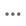

# 권장 사항 성능

권장 사항 성과 페이지에는 구성된 권장 사항 목록과 함께 주요 지표가 표시되어 효과를 평가할 수 있습니다. 지난 일, 주 또는 월에 대한 지표를 표시하도록 보기를 구성할 수 있습니다. 이러한 통찰력은 각 권장 사항 단위를 보거나 클릭하는 빈도를 보여주므로 성능을 평가하고 최적화할 기회를 식별하는 데 도움이 됩니다.

>[!INFO]
>
>추천 단위는 추천 제품 _items_&#x200B;이(가) 포함된 위젯입니다.

{zoomable="yes"}

## **카탈로그 보기** 선택

권장 사항이 적용되는 [카탈로그 보기](../setup/catalog-view.md)를 선택하십시오.

## 보고서 보기

**[!UICONTROL Date Range]**&#x200B;을(를) 클릭하고 다음 범위 중 하나를 선택합니다.

권장 사항 테이블이 업데이트되어 해당 날짜 범위에 대한 지표를 표시합니다.

## 표 맞춤화

1. 왼쪽 상단 모서리에서  아이콘을 클릭하여 표를 사용자 지정합니다.

   표시되는 열에는 확인 표시가 있습니다.

1. 메뉴에서 다음 중 하나를 수행합니다.

   - 숨겨진 열을 표시하려면 확인 표시 없이 열 이름을 클릭합니다.
   - 표시되는 열을 숨기려면 확인 표시가 있는 열 이름을 클릭합니다.

   선택한 열만 포함하도록 테이블이 새로 고쳐집니다.

## 필터 설정

필터 아이콘을 클릭하여 권장 사항 성능 작업 영역에서 지표를 필터링합니다.

각 필터에 대해 여러 값을 구성할 수 있습니다. 각 필터에 대한 설명은 아래 [표](#column-descriptions)을 참조하세요.

## 세부 정보 보기

1. 표에서 검사할 권장 사항 옆에 있는 () 아이콘을 클릭합니다.

1. 권장 사항의 상태를 변경하려면 **활성화** 또는 **비활성화**&#x200B;를 클릭하십시오.

## 권장 사항 만들기 또는 관리

[새로 만들거나 기존](../merchandising/recommendations/create.md) 권장 사항을 관리하는 방법을 알아봅니다.

## Workspace 컨트롤

| 제어 | 설명 |
|---|---|
|  | 지표 계산에 사용되는 시간 범위를 결정합니다. |
|  | 권장 사항 테이블에 나타나는 열을 결정합니다. |
| 추천 만들기 | [새 권장 사항 만들기](../merchandising/recommendations/create.md) 페이지를 엽니다. |

## 열 설명

| 열 | 설명 |
|---|---|
| 이름 | 권장 사항의 이름입니다. |
| 페이지 | 권장 사항이 나타나는 페이지입니다. |
| 유형 | 권장 사항 유형. |
| 상태 | 권장 사항 상태. 옵션: 비활성/활성/초안 |
| 생성됨 | 권장 사항이 생성된 날짜입니다. |
| 마지막으로 편집됨 | 권장 사항이 마지막으로 편집된 날짜입니다. |
| 노출 횟수 | 페이지에서 추천 단위가 로드되고 렌더링되는 횟수입니다. 브라우저의 뷰포트 폴드 아래에 있는 권장 사항 단위는 쇼핑객이 보지 않더라도 페이지에서 렌더링됩니다. 이 경우 렌더링된 단위는 임프레션으로 계산되지만, 보기는 쇼핑객이 단위를 스크롤하여 보기로 이동하는 경우에만 계산됩니다. |
| 노출 횟수 | (볼 수 있는 노출 횟수) 하나 이상의 보기를 등록하는 추천 단위 수입니다. 예를 들어, 추천 단위에 두 개의 라인이 있고 각각 두 개의 제품이 있고 마지막 두 제품이 쇼핑객에게 보이지 않지만 첫 두 제품이 있는 경우 활동은 여전히 인상으로 계산됩니다. |
| 보기 | 쇼핑객 브라우저의 뷰포트에 나타나는 추천 단위 수입니다. 쇼핑객이 페이지를 위 또는 아래로 여러 번 스크롤하는 경우 유닛이 표시될 때마다 이벤트가 여러 번 실행됩니다. |
| 클릭수 | 쇼핑객이 추천 단위에서 항목을 클릭한 횟수와 쇼핑객이 추천 단위에서 **장바구니에 추가** 단추를 클릭한 횟수의 합계입니다. |
| 매출 | 현재 시간 범위에 대한 권장 사항에 의해 유도된 매출입니다. |
| Lt 수익 | (라이프타임 수익) 추천에 의해 유도된 라이프타임 수익. |
| 가시성 | 보기에 등록하는 추천 단위의 백분율입니다. |
| CTR | (클릭스루 비율) 클릭을 등록하는 추천에 대한 단위 노출 횟수의 백분율입니다. CTR은 장치가 쇼핑객 보기에 들어오지 않더라도 모든 노출을 계산합니다. 추천 단위를 보지 않으면 클릭되지 않을 가능성이 높습니다. 그러나 보이지 않는 노출은 CTR 점수로 계산되어 전체 CTR 비율을 감소시킵니다. |
| vCTR | (조회 클릭스루 비율) 조회 가능한 노출 횟수(쇼핑객 화면에 실제로 표시된 권장 사항)에만 기반한 클릭 수를 측정하므로 쇼핑객 참여를 보다 정확하게 측정할 수 있습니다. |
