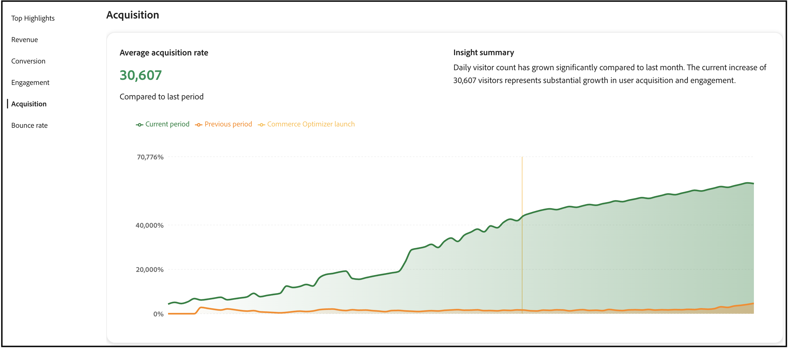

# 성공 지표

이 페이지에서는 [!DNL Adobe Commerce Optimizer] 저장소의 주요 성능 지표에 대한 개요를 제공합니다. 목표는 [!DNL Adobe Commerce Optimizer]을(를) 구현한 결과를 빠르게 이해한 다음 본인과 팀이 성장 기회를 식별하고 최적화할 영역을 강조 표시하는 것입니다.

보고서의 지표는 상점 이벤트 데이터에서 가져옵니다. 수집된 이벤트 데이터에 대해 [자세히 알아보기](../setup/events/overview.md).

## 지표 이해

성공 지표 보고서는 비즈니스 결과에 직접적인 영향을 미치는 5가지 주요 성능 영역에 대해 실행 가능한 통찰력을 제공합니다. 각 지표는 영업 기회를 포착하고 문제를 해결하는 데 도움이 되는 고객 행동 및 스토어 성능의 패턴을 보여줍니다. 이러한 통찰력을 활용하여 보다 현명한 결정을 내리고 상거래 경험을 최적화할 수 있습니다.

**주요 특징**&#x200B;은(는) 각 성능 영역의 주요 지표를 요약합니다. 이 섹션을 사용하여 개선의 가장 큰 기회를 신속하게 식별합니다.

주요 성과 지표는 다음과 같습니다.

- **매출**—총 판매 성과를 보여 주는 기본 재무 지표입니다.
- **전환**—구매를 완료한 방문자의 비율입니다.
- **참여**—사용자가 사이트와 활발하게 상호 작용하는 방법.
- **획득** - 고객 확보 노력의 효과.
- **바운스 비율**—한 페이지만 보고 나간 방문자의 비율입니다.

## 보고서 생성

1. 왼쪽 레일에서 **성공 지표**&#x200B;를 선택합니다.
1. **보고서 구성**&#x200B;에서 로케일 설정에 따라 **날짜 범위**, **카탈로그 원본** 및 **통화**&#x200B;를 지정하십시오.
1. **[!UICONTROL Apply]**&#x200B;을(를) 클릭합니다.

   **주요 특징**, **매출**, **전환**, **참여**, **획득** 및 **바운스 비율**&#x200B;은 모두 보고서 구성에 따라 업데이트됩니다.

1. 보고서를 PDF으로 저장하려면 **[!UICONTROL Export]**&#x200B;을(를) 클릭합니다.

## 다음 단계 및 최적화 전략

성공 지표 데이터를 사용하여 개선 기회를 식별하고 타기팅된 최적화 전략을 구현합니다. 다음 섹션에서는 각 지표 영역에 대해 실행 가능한 구체적인 지침을 제공합니다.

### 수익 최적화

매출의 경우 총 매출과 평균 주문 가격을 높이는 것이 목표입니다.

#### 전략

- **AI 기반 권장 사항 구현**: 최적기의 권장 사항 엔진을 사용하여 전환율이 높은 관련 제품을 표시합니다. *이 항목을 본 고객이*&#x200B;을(를) 열람하고 *이 항목을 구입하고 해당 항목을 구입했습니다* 추천 유형을 배포하여 교차 판매 기회를 늘리십시오.

- **머천다이징 규칙을 만듭니다**: [머천다이징 규칙](../merchandising/rules/overview.md)을 사용하여 검색 결과에 높은 이윤의 제품을 추가하십시오. 트래픽이 많은 쿼리에 대해 검색 결과 맨 위에 베스트셀러 항목을 고정합니다.

- **제품 검색 최적화**: [지능형 패싯](../merchandising/facets/overview.md)을 사용하여 고객이 제품을 보다 효율적으로 찾을 수 있도록 지원하면 전환율이 높아지고 매출도 증가합니다.

- **계절별 영업 기회 활용**: 시간 기반 머천다이징 규칙을 만들어 최대 쇼핑 기간 동안 계절별 또는 프로모션 항목을 홍보합니다.

### 전환율 개선

전환율을 향상시키기 위해 더 많은 방문자를 고객으로 변환하는 것이 목표입니다.

#### 전략

- **검색 관련성 최적화**: [동의어](../merchandising/synonyms/overview.md)를 구현하여 고객이 다른 검색어를 사용하더라도 원하는 항목을 찾을 수 있도록 합니다. 동적 팩터링을 사용하여 관련 필터링 옵션을 제공합니다.

- **전략 추천 배치**: 제품 세부 정보 페이지 및 범주 페이지와 같이 트래픽이 많은 페이지에 추천 단위를 배포합니다. *가장 많이 본 항목* 및 *가장 많이 구매한 항목* 권장 사항을 사용하여 신뢰와 긴급성을 구축하십시오.

- **제품 가시성 향상**: 머천다이징 규칙을 사용하여 베스트셀러 및 고전환 제품이 검색 결과에 두드러지게 표시되도록 하십시오.

- **A/B 테스트 추천 유형**: 다양한 추천 유형 및 배치를 실험하여 대상에 가장 적합한 추천 유형을 찾습니다.

### 참여 개선

참여를 높이기 위해 고객의 상호 작용과 현장 방문 시간을 늘리는 것이 목표입니다.

#### 전략

- **권장 사항 유형 분산**: 동일한 권장 사항을 반복적으로 표시하지 않도록 합니다. *추천*, *트렌드* 및 *최근에 본 항목*&#x200B;을 혼합하여 콘텐츠를 최신 상태로 유지하세요.

- **지능형 검색 구현**: AI 기반의 동적 팩팅 및 결과 재순위를 사용하여 쇼핑객 행동을 기반으로 검색 결과를 실시간으로 조정합니다.

- **개인화된 환경 만들기**: 홈페이지 및 고객 여정 전체에 &quot;추천&quot; 단위를 배포하여 개인화된 제품 제안을 제공합니다.

- **검색 환경 최적화**: 동의어를 사용하여 검색 관련성을 개선하고 고객이 원하는 항목을 빠르게 찾을 수 있도록 합니다.

### 고객 확보 증가

더 많은 성장을 얻기 위해서는 더 많은 신규 고객을 유치하고 획득 효율성을 향상시키는 것이 목표입니다.

#### 전략

- **검색 성능 데이터 활용**: [검색 성능](../manage-results/search-performance.md) 보고서를 사용하여 트렌드 제품 및 인기 검색어를 식별하십시오. 머천다이징 규칙을 만들어 이러한 항목을 강조 표시합니다.

- **추천 성능 최적화**: [추천 성능](../manage-results/recommendation-performance.md) 지표를 모니터링하여 가장 많은 트래픽과 전환을 유도하는 추천 유형을 식별합니다.

- **새 제품 및 판촉 항목 강조**: 머천다이징 규칙을 사용하여 검색 결과에 새 제품 또는 판촉 항목을 추가하여 새 방문자의 관심을 유도합니다.

- **트래픽 소스 추적**: 이벤트 데이터를 사용하여 가장 중요한 트래픽을 발생시키는 채널을 파악하고 그에 따라 마케팅 활동을 최적화합니다.

### 바운스 비율 감소

바운스 비율을 줄이기 위해 방문자의 참여를 유지하고 단일 페이지 방문을 줄이는 것이 목표입니다.

#### 전략

- **검색 관련성 개선**: 동의어와 지능적인 요소를 사용하여 고객이 관련 제품을 빠르게 찾을 수 있도록 하십시오. 검색 결과가 좋지 않은 것이 높은 바운스 비율의 주요 원인입니다.

- **추천 단위 구현**: 카테고리 및 검색 결과 페이지에 추천 단위를 배포하여 추가 제품 옵션을 제공하고 방문자의 참여를 유지합니다.

- **제품 검색 최적화**: 머천다이징 규칙을 사용하여 가장 관련성이 높고 인기 있는 제품이 검색 결과에 먼저 표시되도록 하십시오.

- **흥미로운 홈 페이지 경험 만들기**: 홈 페이지의 &quot;추천&quot; 및 &quot;트렌드&quot; 추천 유형을 사용하여 방문자에게 즉시 관련 콘텐츠를 제공할 수 있습니다.

## 문제 해결 및 최적화

### 지표가 거부되는 경우

**매출 감소**:

- 권장 사항 단위가 여전히 활성 상태이고 성능이 좋은지 확인하십시오.
- 머천다이징 규칙을 검토하여 높은 이윤의 제품이 홍보되고 있는지 확인하십시오
- 검색 성과를 분석하여 인기 있는 제품이 여전히 순위 정상에 있는지 확인합니다.

**전환율 하락**:

- 검색 관련성이 유지되는지 확인합니다(동의어 및 패싯 확인).
- 추천 단위가 올바르게 표시되는지 확인
- 충돌 또는 문제에 대한 머천다이징 규칙 검토

**높은 바운스 비율**:

- 검색 결과 관련성을 확인하고 필요한 경우 동의어를 구현합니다.
- 권장 사항 단위가 제대로 로드되는지 확인하십시오.
- 제품 데이터 품질 및 가용성 검토

**낮은 참여**:

- 고객 피로를 방지하기 위해 추천 유형 다양화
- 보다 개인화된 추천 전략 구현
- 더 나은 패싯 및 동의어로 검색 경험 최적화

## 필드 설명

### 보고서 구성

| 필드 | 설명 |
|---|---|
| 날짜 범위 | 옵션에는 **지난 3개월**, **지난 7일**, **지난 30일**, **지난 6개월**, **지난 12개월** 및 **연간 누계**&#x200B;가 있습니다. 즉각적인 최적화 통찰력을 위해 더 짧은 범위를 사용하고 트렌드 분석을 위해 더 긴 범위를 사용합니다. |
| 국가 | [카탈로그 보기](../setup/catalog-view.md)에 지정된 카탈로그 원본을 기반으로 합니다. 정확한 성능 분석을 위해 적합한 시장을 선택합니다. |
| 통화 | 카탈로그 보기에 지정된 통화입니다. 정확한 매출 보고를 위해 목표 시장과 일치하는지 확인하십시오. |
| 내보내기 | 관련자와 공유하거나 오프라인 분석을 위해 보고서를 PDF으로 저장합니다. |

## 다음과 같음

- [검색 성능](../manage-results/search-performance.md) - 검색어를 분석하고 검색 관련성을 최적화합니다.
- [권장 사항 성능](../manage-results/recommendation-performance.md) - 권장 사항 효율성 모니터링 및 최적화
- [권장 사항 개요](../merchandising/recommendations/overview.md) - AI 기반 제품 권장 사항에 대해 알아보기
- [머천다이징 규칙](../merchandising/rules/overview.md) - 검색 결과에서 제품을 증폭, 저장, 고정 또는 숨깁니다.
- [패싯](../merchandising/facets/overview.md) - 지능적인 필터링으로 검색 기능 향상
- [동의어](../merchandising/synonyms/overview.md) - 검색 관련성 및 고객 경험 개선
- [이벤트 개요](../setup/events/overview.md) - 지표를 지원하는 데이터를 이해합니다.
