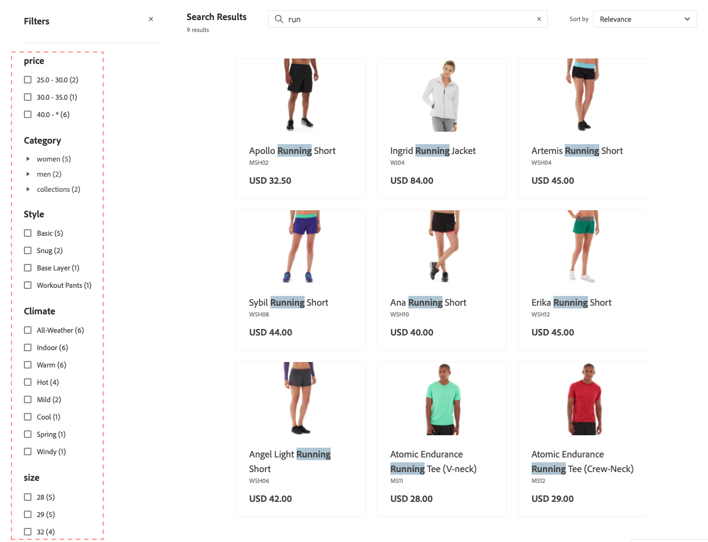

# 패싯

패싯은 속성 값의 여러 차원을 검색 기준으로 사용하는 고성능 필터링 방법입니다.

패싯 내에서 쇼핑객은 &quot;스타일&quot; 아래에 &quot;기본&quot; 및 &quot;청결&quot;과 같은 여러 옵션을 선택할 수 있고 검색 결과가 업데이트되어 해당 스타일만 표시됩니다. 마찬가지로, 쇼핑객이 &quot;스타일&quot; 아래에 &quot;기본&quot;을 선택하고 &quot;기후&quot; 아래에 &quot;실내&quot;를 선택하는 경우 검색 결과가 업데이트되어 선택한 스타일과 선택한 기후를 표시합니다.

정의된 패싯을 URL 매개 변수로 사용할 수 있으며 매개 변수 값 `http://yourstore.com?brand=acme&color=red`을(를) 기준으로 결과가 필터링됩니다.

## Facet 집계

Facet 집계는 다음과 같이 수행됩니다. 상점 앞에 세 패싯(카테고리, 색상 및 가격)이 있고 쇼핑객 필터가 세 패싯 모두에 있는 경우(색상 = 파랑, 가격은 $10.00-50.00, 카테고리 = `promotions`).

- `categories` 집계 - `categories`을(를) 집계한 다음 `color` 및 `price` 필터를 적용하지만 `categories` 필터는 적용하지 않습니다.
- `color` 집계 - `color`을(를) 집계한 다음 `price` 및 `categories` 필터를 적용하지만 `color` 필터는 적용하지 않습니다.
- `price` 집계 - `price`을(를) 집계한 다음 `color` 및 `categories` 필터를 적용하지만 `price` 필터는 적용하지 않습니다.

## 기본 속성 값

다음 제품 특성은 [!DNL Adobe Commerce Optimizer]에서 사용되며 기본적으로 활성화되어 있습니다.

| 속성 | 설명 | 속성 |
|---|---|---|
| 정렬 가능 | 제품 목록에서 정렬에 사용됨 | `price` |
| 검색 가능 | 검색에 사용 | `price`  `sku` `name` |

제품 특성 및 해당 속성에 대한 자세한 내용은 [데이터 수집 메타데이터 API](https://developer.adobe.com/commerce/services/optimizer/data-ingestion/#metadata)를 참조하세요.

## 계층화된 검색 및 검색 유형 확장

계층화된 검색 또는 검색 내 검색은 추가 검색 매개 변수를 포함하도록 기존 검색 기능을 확장하는 속성 기반 필터링 시스템입니다. 이러한 추가 검색 매개 변수를 사용하면 보다 정확하고 유연한 제품 검색을 수행할 수 있습니다.

계층화된 검색을 사용하여 다음과 같은 작업을 수행할 수 있습니다.

- 쇼핑객이 검색 결과 내에서 검색할 수 있도록 활성화합니다.
- 계층화된 검색의 두 번째 레이어에서 `startsWith` 및 `contains` 검색 색인을 사용하여 결과를 세분화합니다.

고급 검색 기능은 특정 연산자를 사용하여 `filter` 쿼리[`productSearch`의 &#x200B;](https://developer.adobe.com/commerce/webapi/graphql/schema/live-search/queries/product-search/) 매개 변수를 통해 구현됩니다.

- **계층화된 검색** - 다른 검색 컨텍스트에서 검색 - 이 기능을 사용하면 검색 쿼리에 대해 최대 두 개의 계층을 검색할 수 있습니다. For example:

   - **계층 1 검색** - `product_attribute_1`에서 &quot;모터&quot;를 검색합니다.
   - **계층 2 검색** - `product_attribute_2`에서 &quot;부품 번호 123&quot;을 검색합니다. 이 예제에서는 결과 내에서 &quot;motor&quot;에 대해 &quot;part number 123&quot;을 검색합니다.

  아래에 설명된 대로 계층화된 검색의 두 번째 계층에서 `startsWith` 검색 인덱싱과 `contains` 검색 인덱싱을 모두 사용할 수 있습니다.

- **검색 인덱싱으로 시작** - `startsWith` 인덱싱을 사용하여 검색 이 기능을 통해 다음과 같은 작업을 수행할 수 있습니다.

   - 속성 값이 지정된 문자열로 시작하는 제품을 검색합니다.
   - 구매자가 속성 값이 특정 문자열로 끝나는 제품을 검색할 수 있도록 &quot;다음으로 끝남&quot; 검색을 구성합니다.
      - &quot;다음으로 끝남&quot; 검색을 활성화하려면 제품 속성을 역순으로 수집해야 하며 API 호출도 역순 문자열이어야 합니다. 예를 들어 &quot;pants&quot;로 끝나는 제품 이름을 검색하려면 이 이름을 &quot;stnap&quot;으로 보내야 합니다.

- **검색 인덱싱을 포함** - 포함 인덱싱을 사용하여 특성을 검색합니다. 이 새로운 기능을 통해 다음과 같은 작업을 수행할 수 있습니다.

   - 더 큰 문자열 내에서 쿼리를 검색하고 있습니다. 예를 들어 구매자가 문자열 &quot;HAPE-123&quot;에서 제품 번호 &quot;PE-123&quot;을 검색하는 경우,

      - 참고: 이 검색 유형은 자동 완성 검색을 수행하는 기존 [구 검색](https://developer.adobe.com/commerce/webapi/graphql/schema/live-search/queries/product-search/#phrase)과(와) 다릅니다. 예를 들어 제품 속성 값이 &quot;outdoor pants&quot;인 경우 구문 검색은 &quot;out pan&quot;에 대한 응답을 반환하지만 &quot;or ants&quot;에 대한 응답은 반환하지 않습니다. 그러나 에는 검색이 포함되어 있으며 &quot;or ants&quot;에 대한 응답을 반환합니다.

이러한 새 조건은 검색 결과를 구체화하기 위한 검색 쿼리 필터링 메커니즘을 향상시킵니다. 이러한 새 조건은 기본 검색 쿼리에 영향을 주지 않습니다.

### 구현

1. [검색 가능한 특성을 설정합니다](https://developer.adobe.com/commerce/services/reference/rest/#tag/Metadata).

1. **포함**(기본값) 또는 **다음으로 시작**&#x200B;과 같이 해당 특성에 대한 검색 기능을 지정하십시오. **포함**&#x200B;에 대해 최대 6개의 특성을 지정하고 **다음으로 시작**&#x200B;에 대해 최대 6개의 특성을 지정할 수 있습니다. 또한 **Contains** 인덱싱의 경우 문자열 길이는 50자 이하로 제한됩니다.

1. 새로운 [&#x200B; 및 &#x200B;](https://developer.adobe.com/commerce/webapi/graphql/schema/live-search/queries/product-search/#filtering-using-search-capability) 검색 기능을 사용하여 [!DNL Commerce Optimizer] API 호출을 업데이트하는 방법에 대한 예는 `contains`개발자 설명서`startsWith`를 참조하십시오.

   검색 결과 페이지에서 이러한 새 조건을 구현할 수 있습니다. 예를 들어, 쇼핑객이 검색 결과를 더 구체화할 수 있는 페이지에 새 섹션을 추가할 수 있습니다. 구매자가 &quot;제조업체&quot;, &quot;부품 번호&quot; 및 &quot;설명&quot;과 같은 특정 제품 속성을 선택할 수 있도록 할 수 있습니다. 여기에서 `contains` 또는 `startsWith` 조건을 사용하여 해당 특성 내에서 검색합니다.

### 패싯이 아닌 계층화된 검색을 사용해야 하는 경우

계층화된 검색 및 패싯은 제품 검색에서 서로 다른 용도로 사용되며, 둘 중 선택은 특정 사용 사례에 따라 다릅니다.

**계층화된 검색을 사용하여 다음을 수행할 수 있습니다.**

- 여러 기준을 사용하여 검색 결과 내에서 검색
- 사용자가 부분 정보를 알고 있는 부품 번호, SKU 또는 기술 사양으로 작업
- 쇼핑객이 중첩된 기준으로 단계별 결과 범위를 좁힐 수 있도록 허용합니다.
- 단일 쿼리에서 여러 검색 기준을 결합하여 API 호출 수 감소
- 표준 패싯형 탐색을 넘어서는 비즈니스별 검색 패턴 구현

**패싯을 사용하여 다음을 수행할 수 있습니다.**

- 일반적인 카테고리, 가격, 브랜드 및 속성 필터링 제공
- 사용자가 쉽게 이해하고 선택할 수 있는 직관적인 필터 옵션을 제공합니다
- 현재 검색 결과에 따라 사용 가능한 옵션 표시
- 사용자가 사용 가능한 옵션을 이해하는 데 도움이 되는 필터 수 및 범위 표시
- 색상, 크기, 재질 등과 같은 일반적인 제품 특성을 사용하여 작업

**모범 사례:** 사용자가 특정 기준을 가지고 있는 복잡한 기술 검색에 대해 계층화된 검색을 사용하고, 사용자가 시각적으로 옵션을 탐색하고 세분화하려는 표준 전자 상거래 필터링에 패싯을 사용합니다.
