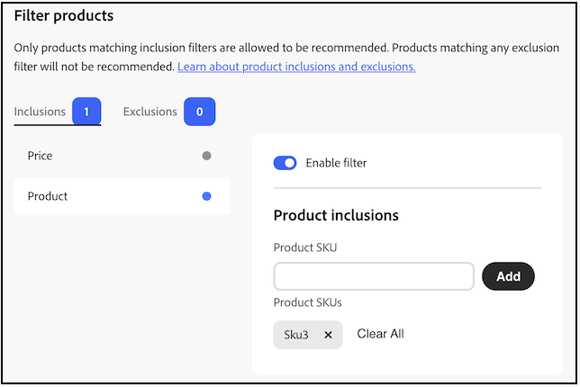

# 제품 필터링

[!DNL Adobe Commerce Optimizer]은(는) 구성 불가능한 기본 필터를 권장 사항 단위에 자동으로 적용합니다. 페이지에 여러 개의 추천 단위가 배포되어 있는 경우 [!DNL Adobe Commerce Optimizer]은(는) 해당 단위로 반복되는 모든 제품을 필터링합니다. 다른 제품을 추천할 수 있는 공간을 만들기 위해 반복 제품에 대한 첫 번째 참조만 사용됩니다. [!DNL Adobe Commerce Optimizer]은(는) 이전에 구매한 제품과 장바구니에 있는 제품도 필터링합니다.

권장 사항 단위를 [만들기](create.md)할 때 권장 사항에 표시할 수 있는 제품을 제어하는 필터를 정의할 수 있습니다. 이러한 필터는 사용자가 정의하는 포함 또는 제외 조건 집합을 기반으로 합니다. 모든 포함 조건과 일치하는 제품만 권장 사항에 표시됩니다. 제외 조건과 일치하는 제품은 권장하지 않습니다.

각 필터 페이지에서 토글을 선택하여 여러 필터를 구성하고 원하는 필터만 활성화할 수 있습니다. 나중에 사용할 수 있도록 필터의 초안을 만들 수 있습니다. 각 탭에 활성화된 필터의 수가 표시됩니다.

## 조건

조건은 정적이거나 동적일 수 있습니다.

- 정적 조건은 기존 제품 속성을 사용하여 단위에 나타날 수 있는 제품을 결정합니다. 예를 들어 가격이 $25보다 큰 재고 제품만 단위에 나타나도록 지정할 수 있습니다.

- 동적 조건은 현재 표시된 카테고리 또는 제품과 같은 구매자의 현재 컨텍스트를 기반으로 합니다. 예를 들어 제품 세부 사항 페이지에 배포할 제품 권장 사항을 생성할 때 현재 표시된 제품의 상대 가격 범위 내에 있는 제품만 추천하는 조건을 생성할 수 있습니다.

### 논리 연산자

논리 연산자 `AND` 및 `OR`을(를) 사용하여 여러 조건을 연결합니다. 포함 필터와 제외 필터를 모두 사용하는 경우, 먼저 포함을 평가하여 추천할 수 있는 모든 가능한 제품을 결정한 다음 제외 필터와 일치하는 제품은 목록에서 제거됩니다.

- `AND` - 두 개의 포함 필터링 조건 조인
- `OR` - 두 개의 제외 필터링 조건에 조인

## 필터 유형

각 필터 유형은 제품 및 가격과 같은 카탈로그의 다양한 측면을 타깃팅하므로 단위에 적합한 제품을 좁히거나 넓힐 수 있습니다. 머천다이징 목표와 일치하는 유형을 선택한 다음 필요에 따라 포함 및 제외 조건을 결합합니다. 아래 하위 섹션에서는 각 유형의 작동 방식과 [!DNL Adobe Commerce Optimizer]이(가) 해당 유형을 적용하는 방법을 설명합니다.

>[!NOTE]
>
>**포함** 필터와 일치하는 제품만 추천할 수 있으며 **제외** 필터와 일치하는 제품은 모두 제거됩니다.

### 가격

>[!IMPORTANT]
>
>다음 기능은 Beta 버전입니다.

가격 필터링은 권장 단위가 렌더링되는 상점 앞에 할당된 상점 **활성 가격 책**&#x200B;에 대해 각 제품의 **최종 계산된 가격**&#x200B;을 사용합니다. 이 값은 장부 가격에만 적용되는 것이 아니라 해당 가격 장부에 정의된 할인, 프로모션 및 특별 가격을 반영합니다. 평가는 해당 점포의 가격대만을 사용하며, 다른 점포나 가격대에는 적용되지 않습니다. 카탈로그와 [가격 장부](../../setup/pricebooks.md) 설정을 사용하여 가격 장부가 상점 앞에 매핑되는 방식을 구성합니다.

#### 포함 및 제외 규칙의 가격 사용 방법

- **포함 규칙** - 최종 가격 **정의된 포함 조건 모두와 일치**&#x200B;하는 제품만 사용할 수 있습니다. 여기에는 활성화된 모든 포함 필터(예: 가격 범위와 기타 포함 규칙)가 포함됩니다.
- **제외 규칙** - 최종 가격 **정의된** 제외 조건과 일치하는 제품은 추천에서 제거됩니다.

**표시된 가격** - 추천 단위 내 제품에 표시된 가격은 해당 상점의 가격책과 동일한 **최종 가격**&#x200B;이므로 쇼핑객이 보는 가격은 필터링에 사용된 값과 일치합니다.

#### 가격 필터 설정

1. 추천 단위를 [만들거나 편집](create.md)하는 동안 **[!UICONTROL Filter products]**&#x200B;을(를) 엽니다(또는 단위 워크플로에서 _필터_ 단계로 이동).
1. 가격 범위의 제품만 허용할지 또는 범위 내의 제품을 차단할지 여부에 따라 **[!UICONTROL Inclusions]** 또는 **[!UICONTROL Exclusions]** 탭을 선택합니다. 각 탭의 배지는 활성화된 해당 유형의 필터 수를 보여줍니다.
1. 왼쪽 목록에서 **[!UICONTROL Price]**&#x200B;을(를) 선택합니다.
1. **[!UICONTROL Enable filter]**&#x200B;을(를) 켭니다.

   가격 값은 페이지에 표시된 대로 **웹 사이트의 기본 통화**&#x200B;를 사용합니다.

1. **[!UICONTROL Include products based on]** 탭에서 **[!UICONTROL Inclusions]** 또는 **[!UICONTROL Exclusions]** 탭에서 이와 동등한 컨트롤을 열고 **[!UICONTROL Set price range]**&#x200B;을(를) 선택합니다.
1. 통화 기호 옆에 있는 필드를 사용하여 선택적 **[!UICONTROL Min price]** 및/또는 **[!UICONTROL Max price]**&#x200B;을(를) 설정합니다. 금액을 입력하거나 **-** 및 **+** 컨트롤을 사용하여 값을 조정할 수 있습니다. 최소값 또는 최대값이 필요하지 않으면 바인드를 비워 둡니다. 범위는 상점의 활성 가격 장부에 대한 각 제품의 최종 계산된 가격과 비교됩니다.
1. 권장 사항 단위 구성을 완료하고 일반적인 방법으로 저장하거나 게시하여 필터가 적용됩니다.

### 제품

제품 필터는 **SKU**&#x200B;별로 개별 카탈로그 항목을 타깃팅합니다. 하나 이상의 SKU를 추가하여 해당 제품(**포함**)만 허용하거나 차단(**제외**)합니다. **[!UICONTROL Filter products]**&#x200B;가격 필터[와 동일한 ](#price) 페이지를 사용합니다. 비활성화된 제품 또는 추천 단위에서 개별적으로 보이지 않는 제품은 표시해서는 안 됩니다. 이러한 제품은 필터에 관계없이 상점 앞에 표시되지 않습니다.

#### 제품 필터 설정

1. 추천 단위를 [만들거나 편집](create.md)하는 동안 **[!UICONTROL Filter products]**&#x200B;을(를) 엽니다(또는 단위 워크플로에서 _필터_ 단계로 이동).
1. **[!UICONTROL Inclusions]** 또는 **[!UICONTROL Exclusions]** 탭을 선택합니다. 각 탭의 배지는 활성화된 해당 유형의 필터 수를 보여줍니다.
1. 왼쪽 목록에서 **[!UICONTROL Product]**&#x200B;을(를) 선택합니다.
1. **[!UICONTROL Enable filter]**&#x200B;을(를) 켭니다.

   오른쪽 패널 머리글은 탭(예: **[!UICONTROL Product inclusions]** 또는 제외에 해당)을 반영합니다.

1. **[!UICONTROL Product SKU]**&#x200B;에서 SKU를 입력하고 **[!UICONTROL Add]**&#x200B;을(를) 클릭합니다. 을 반복하여 SKU를 더 추가합니다.

   **[!UICONTROL Product SKUs]**&#x200B;에서 각 SKU는 이동식 태그로 표시됩니다. 태그에서 **X**&#x200B;을(를) 클릭하여 해당 SKU를 제거하거나 **[!UICONTROL Clear All]**&#x200B;을(를) 클릭하여 목록에서 모든 SKU를 제거합니다.

1. 권장 사항 단위 구성을 완료하고 일반적인 방법으로 저장하거나 게시하여 필터가 적용됩니다.

**포함**&#x200B;의 경우 SKU가 나열된(그리고 다른 활성화된 포함 필터를 충족하는) 제품만 추천할 수 있습니다. **제외**&#x200B;의 경우, SKU가 나열되어 있는 제품은 그렇지 않더라도 권장되지 않습니다.

>[!NOTE]
>
>구성 가능한 제품의 하위 제품은 _개별적으로 표시되지 않음_&#x200B;의 가시성을 가지므로 추천 단위에 표시되지 않습니다.

<!--### Attribute

You can filter products based on attribute criteria, including attribute values. Selected values use OR logic to either include or exclude products when any of the specified values are found.-->
