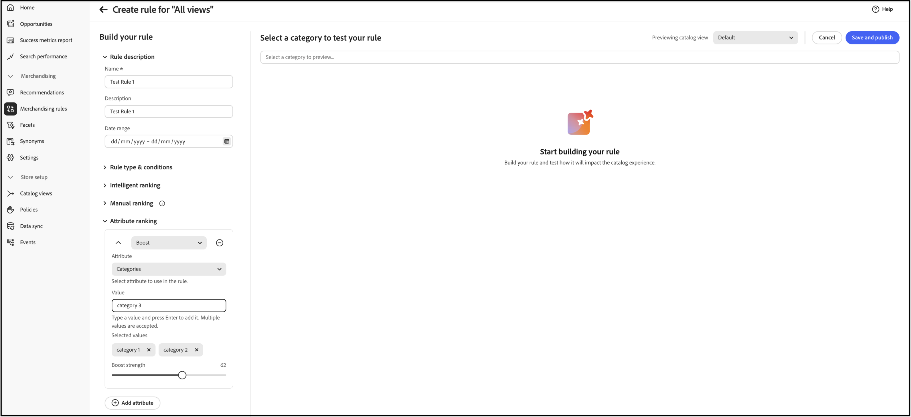

# 규칙 만들기 및 관리

규칙을 빌드하고 게시하려면 다음을 수행하십시오.

1. Optimizer Studio에서 규칙 편집기를 열고 **규칙 유형**(검색 조건, 기본 목록, 범주 페이지 또는 제품 특성)을 선택한 다음 조건 및 적용 등급을 정의합니다.
1. 결과를 테스트합니다.
1. 규칙을 게시합니다.

## 규칙 만들기 {#create-a-rule}

1. 왼쪽 레일에서 _머천다이징_ > **머천다이징 규칙**(으)로 이동합니다.
1. (선택 사항) **카탈로그 보기** 드롭다운을 사용하여 규칙을 적용할 카탈로그 보기를 선택합니다. 만든 규칙의 범위가 선택한 보기(**모든 보기**&#x200B;를 선택한 경우 모든 카탈로그 보기)로 설정되어 있습니다. 카탈로그 보기 범위 지정 작동 방법은 [카탈로그 보기 선택](workspace.md#select-catalog-view)을 참조하세요.

1. **[!UICONTROL Create rule]**&#x200B;을(를) 클릭하여 규칙 편집기를 시작합니다.

### 규칙 유형

각 규칙 유형에는 편집기에 간단한 설명과 함께 정보 아이콘이 있습니다. 구매자가 머천다이징 논리를 확인해야 하는 위치에 일치하는 유형을 사용합니다.

| 규칙 유형 | 목적 |
| --- | --- |
| **모든 제품 목록** | 더 이상 특정 검색 또는 범주 규칙이 적용되지 않을 때 제품 목록 전반에서 기본 순위 및 머천다이징. 이러한 규칙은 하나만 만들 수 있으며 조건을 포함할 수 없습니다. |
| **범주 규칙** | 하나 이상의 선택한 범주에 머천다이징 및 순위를 적용하여 해당 범주 페이지의 제품 순서를 제어합니다. |
| **검색 규칙** | 쇼핑객이 규칙의 쿼리 조건과 일치하는 검색을 실행할 때 머천다이징 및 순위를 적용합니다. |

**규칙 만들기** 섹션에서 규칙 이름, 일정, 규칙이 모든 목록에 적용되는지 또는 특정 검색 조건에 적용되는지 여부, 등급 유형을 정의합니다.

1. **[!UICONTROL Name]** 필드에 규칙 이름을 입력합니다. 모든 규칙 이름은 고유해야 합니다.
1. **[!UICONTROL Description]** 필드에 규칙에 대한 설명을 입력합니다.
1. **[!UICONTROL Date range]** 필드에서 규칙을 활성화할 날짜 또는 날짜 범위를 지정합니다.
1. **[!UICONTROL Rule applies to]** 섹션에서 사용할 [규칙 유형](#rule-types)을(를) 선택합니다.

>[!BEGINTABS]

>[!TAB 검색 규칙]

검색 규칙은 쇼핑객이 정의된 조건과 일치하는 검색을 수행할 때 머천다이징 및 등급 로직을 적용합니다.

조건은 이벤트를 트리거하기 위한 요구 사항입니다. 규칙에는 최대 10개의 조건과 25개의 이벤트가 있을 수 있습니다. 기본 규칙에는 조건이 있을 수 없습니다.

**단일 조건**

1. *규칙 만들기*&#x200B;에서 충족될 **조건**&#x200B;을 선택하고 지침에 따라 명령문을 완료합니다.

   - 검색 쿼리에 다음이 포함됨 - 쇼핑객 쿼리에 있어야 하는 텍스트 문자열을 입력합니다. 일치 설정은 쇼핑객 쿼리가 카탈로그와 일치하는 정도를 결정합니다. 옵션:  모두 - 구매자의 쿼리 텍스트 중 어떤 부분이든 조건과 일치할 수 있습니다. 모두 - 구매자의 모든 쿼리가 조건과 일치해야 합니다.
   - 검색 쿼리 - 쇼핑객 쿼리와 정확히 일치하는 텍스트 문자열을 입력합니다. 예를 들어, &quot;요가 바지&quot;. `Search query is`과(와) 일치 `All`이(가) 있는 규칙에는 조건이 하나만 있을 수 있습니다.
   - 검색 쿼리가 다음으로 시작 - 구매자 쿼리의 시작 부분에 있어야 하는 텍스트 문자 또는 문자열을 입력합니다.
   - 검색 쿼리가 다음으로 끝남 - 구매자 쿼리의 끝에 있어야 하는 문자 또는 텍스트 문자열을 입력합니다.

   결과는 *규칙 테스트* 창에 바로 표시되며 우선 순위별로 번호가 매겨집니다. 오른쪽 상단의 *행당 결과* 슬라이더를 사용하여 각 행의 제품 수를 변경할 수 있습니다.

1. 다른 쿼리를 테스트하려면 *규칙 테스트* 검색 상자에서 쿼리 텍스트를 변경하고 **반환**&#x200B;을 누르십시오.
처음에 테스트 창은 조건 검색 상자에서 쿼리를 렌더링합니다. 하지만 이제 테스트 쿼리 상자에서 쿼리를 렌더링하고 있습니다. 테스트 창은 한 번에 하나의 쿼리만 렌더링합니다.
1. 결과가 마음에 들면 *조건* 검색 상자의 텍스트를 업데이트하세요. 그런 다음 페이지의 아무 곳이나 클릭하여 테스트 창의 결과를 업데이트합니다.
1. 필요한 경우 다음 섹션에 설명된 대로 [지능형 순위](#intelligent-ranking), [수동 순위](#manual-ranking) 또는 [특성 순위](#attribute-ranking)를 설정하십시오. 호출된 차이점이 있는 카테고리 페이지에도 동일한 컨트롤이 적용됩니다.

**여러 조건**

1. 여러 조건을 사용하여 규칙을 작성하려면 **조건 추가**&#x200B;를 클릭하십시오.
규칙에는 최대 10개의 조건이 있을 수 있습니다. 두 조건을 결합하는 논리 연산자는 현재 *일치* 설정을 기반으로 합니다. 기본적으로 *일치*&#x200B;은(는) `All`이고 논리 연산자는 `AND`입니다.

1. 두 번째 조건을 선택하고 필요한 쿼리 텍스트를 입력합니다.

1. 규칙 논리를 변경하려면 **일치** 설정을 변경하여 구매자의 검색 기준이 쿼리 조건과 얼마나 가깝게 일치해야 하는지 확인하십시오. **Match**&#x200B;을(를) 다음 중 하나로 설정합니다.

   - 임의 - (기본값) 규칙의 모든 논리 연산자가 `OR`(으)로 설정되고 결과가 테스트 창에 나타납니다.
   - 모두 - 규칙의 모든 논리 연산자가 `AND`(으)로 설정되고 결과가 테스트 창에 나타납니다.

   *Match* 값은 여러 조건을 조인하는 데 사용되는 논리 연산자를 결정합니다. *일치* 설정을 변경하면 규칙의 모든 논리 연산자가 변경됩니다. `AND`과(와) `OR`을(를) 동일한 규칙으로 결합할 수 없습니다.

   이 예제에서는 &#39;요가 바지&#39;를 검색하기보다는 &#39;요가&#39; 또는 &#39;바지&#39;를 검색하는 두 개의 별도 쿼리가 있습니다. 이 규칙은 구체적이지 않으며 다른 규칙보다 상점 앞에서 더 자주 트리거됩니다.

1. 다른 조건을 추가하려면 **조건 추가**&#x200B;를 클릭하고 프로세스를 반복합니다.
1. 필요한 경우 다음 섹션에 설명된 대로 [지능형 순위](#intelligent-ranking), [수동 순위](#manual-ranking) 또는 [특성 순위](#attribute-ranking)를 설정하십시오. 호출된 차이점이 있는 카테고리 페이지에도 동일한 컨트롤이 적용됩니다.

>[!TAB 범주 규칙]

범주 규칙은 **범주 페이지**&#x200B;에서 제품의 순서를 제어합니다. **카테고리 규칙**&#x200B;을(를) **지능적인 순위**(AI 기반 신호 포함)와 **수동** 작업(고정, 증폭, 매기)과 결합하여 외부 도구에 의존하지 않고 검색을 조정하고, 프로모션을 실행하고, 전략에 맞게 카테고리 페이지를 조정할 수 있습니다.

**범주 선택**

**범주**&#x200B;에서 규칙을 적용할 하나 이상의 범주를 선택합니다. 선택한 범주가 컨트롤 아래에 표시되어 범위를 확인할 수 있습니다. 다음 방법 중 하나로 범주를 선택합니다.

- **범주 트리 찾아보기** - 범주를 확장하여 바로 아래 하위 범주를 로드합니다. 더 깊은 수준으로 이동하려면 하위 범주를 확장합니다. 트리는 한 번에 한 수준씩 로드됩니다.
- **범주 이름으로 검색** - **범주 검색 및 선택** 필드에 범주 이름을 입력합니다. 검색 결과에는 현재 확장된 분기 외부의 범주를 포함하여 카탈로그 전체에서 일치하는 범주 이름이 포함됩니다. 검색이 범주 경로 텍스트와 일치하지 않습니다.

여러 범주의 이름이 비슷한 경우 각 결과와 함께 표시되는 범주 경로(예: `brakes/aurora`)를 사용하여 올바른 범주를 선택합니다.

>[!NOTE]
>
>카테고리를 확장하면 검색할 하위 카테고리만 로드됩니다. 범주를 선택하거나 해당 하위 범주에 규칙을 적용하지 않습니다. 규칙에 추가할 카테고리를 선택합니다. 범주의 하위 범주에 규칙을 적용하려면 아래에 설명된 범주의 작업 메뉴에서 **하위 범주에 적용**&#x200B;을 사용합니다.

>[!TIP]
>
>하위 범주가 표시되지 않으면 상위 범주를 확장하여 다음 수준을 로드합니다. 범주 이름을 알고 있는 경우 트리를 탐색하지 않고 검색 필드를 사용하십시오. 범주 수준은 수요에 따라 로드되므로 큰 카탈로그에 유용합니다.

1. 선택한 카테고리 목록에서 카테고리 옆에 있는 세 점을 클릭하고 다음을 선택합니다.

   - **삭제** - 규칙에서 범주를 제거합니다.
   - **하위 범주에 적용** - 아직 활성 머천다이징 규칙이 정의되지 않은 하위 범주에 규칙을 적용합니다.
   - **미리 보기** - 상점 앞에 범주 페이지가 표시되는 방식을 표시합니다.

1. 필요한 경우 다음 섹션에 설명된 대로 [지능형 순위](#intelligent-ranking), [수동 순위](#manual-ranking) 또는 [특성 순위](#attribute-ranking)를 설정하십시오. 호출된 차이점이 있는 검색 규칙에도 동일한 컨트롤이 적용됩니다.

   

>[!ENDTABS]

### 인텔리전트 등급 {#intelligent-ranking}

인텔리전트 등급은 **동작 신호** 및 해당되는 경우 AI를 사용하여 제품을 주문합니다. **검색 규칙**, **모든 제품 목록**(기본 규칙) 및 **범주 규칙**(범주 페이지)에 적용됩니다. 쇼핑객 **검색**&#x200B;의 경우 순위도 쿼리에 대한 **텍스트 관련성**&#x200B;을 가중합니다. **카테고리 페이지**&#x200B;에서는 쿼리 텍스트를 동일한 방식으로 사용하지 않습니다. 편집자는 행동 전략에 중점을 둡니다.

점주들은 다음과 같은 전략을 세울 수 있다. 정확한 레이블 및 시간 창은 규칙 편집기와 일치하며 규칙 유형에 따라 약간 다를 수 있습니다.

- **가장 많이 구입함** / **가장 많이 구입함** — 최근 기간(예: 검색 컨텍스트의 경우 이전 7일)에 SKU당 구매 빈도별로 순위를 매깁니다.
- **장바구니에 가장 많이 추가됨** - 최근 기간(예: 검색 컨텍스트의 경우 이전 7일)에 총 장바구니 추가 활동별로 순위를 지정합니다.
- **가장 많이 본 항목** - 최근 기간(예: 검색 컨텍스트의 경우 이전 7일)에 SKU별 보기로 등급을 지정합니다.
- **추천** — `viewed-viewed` 신호를 사용합니다. 이 SKU를 본 구매자는 다른 SKU도 본 적이 있으며, 가능한 경우 범주 페이지에서 개인화된 주문을 지원합니다.
- **트렌드** — 최근 인기(검색의 경우, 백그라운드 이벤트의 경우 지난 72시간 동안의 페이지 보기, 전경 이벤트의 경우 24시간 동안의 페이지 보기)를 강조합니다.
- **없음** — 검색 및 기본 목록의 경우 **관련성**&#x200B;을 기준으로 제품이 주문됩니다. **범주 규칙**&#x200B;의 경우 다른 지능형 전략을 선택하지 않으면 는 범주에 대한 기본 머천다이징 순서를 사용합니다.

규칙에 대한 전략을 선택합니다. **[!UICONTROL Test your rule]** 창에는 검색 지향 규칙에 대한 예상 결과가 표시됩니다. **범주 규칙**&#x200B;은(는) 범주 미리 보기를 사용합니다.

#### 구성 가능한 제품 및 변형에 대한 동작 신호 {#behavioral-signals-variants}

지능형 순위는 쇼핑객이 상호 작용하는 특정 제품에 대해 보기, 장바구니에 추가 이벤트 및 구매 등의 행동 신호를 수집합니다. 구성 가능한 제품의 경우, 이는 신호가 구성 가능한 상위 제품에 대해 기록되지 않고 **variant**(단순 제품) 수준에서 기록됨을 의미합니다.

구성 가능한 제품의 등급을 지정할 때 지능형 순위는 모든 해당 변형에서 수집된 동작 신호를 집계하여 구성 가능한 상위 항목으로 롤업합니다. 구성 가능한 제품의 등급 점수는 한 가지가 아닌 모든 변형의 결합된 신호를 반영합니다.

이 집계는 검색되는 범주 범위 내에서 발생합니다. 변형은 해당 **variant**&#x200B;이(가) 할당된 범주에 대한 구성 가능한 상위 항목의 순위 점수에 동작 신호만 기여합니다. 범주에서 변형이 누락된 경우 구성 가능한 상위 항목 자체가 해당 범주에 할당된 경우에도 해당 신호가 해당 범주의 상위 항목 순위에 계산되지 않습니다.

**모범 사례:** 모든 제품 변형, 특히 크기, 색상 또는 기타 변형별 범주 구조를 사용하는 카탈로그의 범주 할당을 검토하여 모든 변형이 표시되고 순위에 영향을 줄 것으로 예상되는 각 범주에 할당되었는지 확인합니다.

**예:**

머천다이저는 카탈로그를 **200g** 및 **500g**&#x200B;과 같은 크기별 하위 범주로 구성합니다. 구성 가능한 제품에는 각 크기에 대해 하나씩, 두 개의 변형이 있습니다. 200g 카테고리에 200g 변형만 할당된 경우 500g 변형의 구매 및 보기는 해당 페이지에서 구성 가능한 제품의 등급 점수에 기여하지 않습니다. 이는 500g 변형이 다른 곳에서 잘 팔린다고 해도 마찬가지입니다. 그런 다음 구성 가능한 제품의 등급을 200g 카테고리 페이지에서 예상보다 낮게 매기거나 실제 판매 실적과 다르게 매길 수 있습니다. 두 변형을 각각의 카테고리에 할당하면 불일치가 해결됩니다.

#### 지능형 순위 상승 {#intelligent-ranking-boost}

**추천**, **가장 많이 본 항목**, **가장 많이 구매한 항목**, **장바구니에 가장 많이 추가한 항목** 및 **트렌드**&#x200B;의 경우, 편집기에는 **[!UICONTROL Intelligent Ranking Boost]**(부스트 요소)이 표시됩니다. **없음**&#x200B;을 선택하면 사용되지 않습니다.

이 컨트롤을 사용하면 검색 시 **텍스트 관련성**&#x200B;과 관련된 순서 지정에 **동작 신호**&#x200B;와 **범주 페이지** 및 **기본 목록**&#x200B;의 다른 순위 신호와 관련된 순서 지정에 영향을 주는 정도를 조정할 수 있습니다. **검색 규칙**, **모든 제품 규칙** 및 **범주 규칙**&#x200B;에 대해 증폭을 사용할 수 있습니다. 각 규칙은 고유한 값을 저장합니다.

| 비헤이비어 | 세부 사항 |
| --- | --- |
| 기본값 | `5`(이전의 고정된 동작 승수에 해당). |
| 범위 | `1`부터 `100`까지(더 부드러운 동작 영향). 상한은 향후 릴리스에서 변경될 수 있습니다. |
| 범위 | 규칙이 타겟팅하는 쿼리 또는 목록에만 적용됩니다. 다른 규칙은 고유한 부스트 값을 유지합니다. |
| 미리보기 | 규칙 미리 보기는 해당 규칙에 대해 라이브 결과와 동일한 증폭을 사용합니다. |
| 색인화 | **쿼리 시간**&#x200B;에 적용됩니다. 이 설정을 변경했기 때문에 카탈로그를 다시 동기화하거나 전체 인덱스를 다시 만들 필요가 없습니다. |

**증폭을 늘리거나 줄이는 시기**

- **가장 많이 본 항목**&#x200B;과 같은 전략에서 모든 슬롯을 수동으로 고정하지 않고 모호하거나 광범위한 쿼리에 대해 더 적극적으로 참여도가 높은 SKU를 표시해야 하는 경우 **증폭을 늘립니다**.
- 텍스트 일치 품질을 보다 엄격하게 유지하고 동작 데이터를 약간 이동하기만 하면 목록이 흔들릴 때 **증폭을 줄입니다**.

**수동 등급을 대신 사용해야 하는 경우**

특정 제품을 정확한 위치에 배치해야 하거나 카탈로그 전체 신호에 관계없이 가시성이 보장되어야 하는 경우 **pin**, **boost** 또는 **bury**&#x200B;를 사용하십시오. **[!UICONTROL Intelligent Ranking Boost]**&#x200B;이(가) 해당 규칙에 대한 **전역** 동작 가중치를 조정하며 SKU 수준 제어를 대체하지 않습니다.

>[!NOTE]
>
> 같은 제품에서 높은 **[!UICONTROL Intelligent Ranking Boost]**&#x200B;이(가) **수동 증폭**&#x200B;보다 클 수 있습니다. 부스트된 SKU가 규칙 미리 보기 또는 상점 첫 화면에서 예상한 것보다 낮은 순위를 갖는 경우 제품을 특정 위치로 **[!UICONTROL Intelligent Ranking Boost]** 또는 **핀** 낮춥니다. 둘 중 하나를 변경하면 수동으로 순위가 매겨진 제품이 목록에서 더 높게 이동합니다.

#### 지능적인 순위 점수 책정 방식(검색)

**검색 결과**(및 규칙 편집기의 테스트 쿼리)의 경우 지능형 등급은 두 가지 주요 요소인 **텍스트 관련성** 및 **동작 신호**&#x200B;를 결합하여 최종 제품 순서를 결정합니다. 이러한 요인이 상호 작용하는 방식을 이해하면 검색 결과에 대한 현실적인 기대를 설정하는 데 도움이 됩니다.

**채점 구성 요소:**

- **텍스트 관련성**: 채점의 주요 요소입니다. 이렇게 하면 제품의 이름, 설명 및 속성이 검색 쿼리와 얼마나 잘 일치하는지 측정합니다. 텍스트 관련성 점수는 제한되지 않으며(특정 상한이 없음) 다음과 같은 요인의 영향을 받습니다.

  - 일치하는 단어의 발생 빈도입니다.
  - 제품 이름/설명의 길이(단어)입니다.

- **동작 신호**: 텍스트 관련성 점수 위에 적용된 경계 부스트. &quot;가장 많이 본 항목&quot; 또는 &quot;가장 많이 구매한 항목&quot;과 같은 지능형 순위 전략을 선택하면 더 높은 동작 신호를 갖는 제품에 더 큰 상대 가중치가 부여됩니다. 해당 가중치의 강도는 **[!UICONTROL Intelligent Ranking Boost]**&#x200B;에 의해 제어됩니다([지능형 순위 상승](#intelligent-ranking-boost) 참조). 상승도는 제한되어 있지만 순서를 변경하는 정도를 늘릴 수 있습니다.

**가장 많이 본 제품이 먼저 나타나지 않는 이유:**

텍스트 관련성은 점수가 제한되지 않기 때문에 종종 순위를 지배하는 반면, 행동 영향은 부스트 모델에 의해 제한됩니다. 매우 강력한 텍스트 일치 항목이 있는 제품은 해당 규칙에 대해 **[!UICONTROL Intelligent Ranking Boost]**&#x200B;을(를) 제기하지 않는 한 참여도가 더 높은 SKU를 초과할 수 있습니다. 더 높은 부스트 값에서도 텍스트 관련성 격차가 목록을 완전히 반전하지 않을 수 있습니다. 텍스트 일치 품질은 주요 드라이버로 유지됩니다. 항상 **[!UICONTROL Test your rule]**&#x200B;에서 관심 있는 쿼리를 확인하십시오.

**예:**

판매자는 &quot;가장 많이 본&quot; 지능형 순위 전략을 사용하고 **원통형**&#x200B;을 검색합니다. 제품 SKU YAN-K-E-512가 가장 높은 보기 수를 가지므로 결과 상단에 표시될 것으로 예상됩니다. 그러나 다른 제품은 더 높은 순위를 갖습니다.

- **Texas Candle**(첫 번째 위치): 텍스트 관련성 점수가 매우 높은 더 짧고 깔끔한 제품 이름이 있습니다. **YAN-K-E-512**&#x200B;보다 보기 수가 적지만 우수한 텍스트가 동작 증폭보다 큽니다.

- **YAN-K-E-512**(하단 위치): &quot;가장 많이 본&quot; 동작 데이터에서 보기 백분위수가 가장 높음에도 불구하고 복잡한 SKU 기반 이름은 더 낮은 텍스트 관련성 점수를 생성합니다. 기본값 **[!UICONTROL Intelligent Ranking Boost]**(`5`)에서 동작 영향은 해당 텍스트 간격을 극복하기에 충분하지 않을 수 있습니다. 증폭을 늘리면 쿼리와 이미 일치하는 제품 중 **YAN-K-E-512**&#x200B;이(가) 더 높게 이동할 수 있습니다. **YAN-K-E-512**&#x200B;도 쿼리와 일치해야 합니다. 해당 SKU에 대한 검색 가능한 특성 중 하나 이상은 **candle**&#x200B;을(를) 포함해야 합니다. 그렇지 않으면 결과에 표시되지 않고 증폭이 적용될 수 없습니다.

**예제(broad query):**

**wood**&#x200B;와 같은 쿼리의 경우 보기 수가 다른 동안 여러 제품이 유사한 텍스트 관련성을 공유할 수 있습니다. **가장 많이 본 항목**&#x200B;을 선택한 상태에서 **[!UICONTROL Intelligent Ranking Boost]**&#x200B;을(를) 늘리면 이전에 가장 많이 본 관련 SKU가 더 가벼운 일치 항목보다 높게 표시될 수 있습니다. 증폭을 낮추면 결과는 순수 텍스트 순서에 더 가깝게 유지됩니다.

규칙을 사용하여 제품 검색 기능을 향상시키는 방법을 알아보려면 [검색 규칙](./best-practice.md#tips-to-optimize-search-rules)을 참조하세요.

#### 주의 사항

- 쿼리에서 아포스트로피와 인용 부호를 사용하면 일부 언어에서 순위 및 관련성과 관련된 사소한 문제가 발생할 수 있습니다.
- 인텔리전트 등급 결과가 실제 판매 또는 조회 실적과 연관되지 않는 경우 모든 관련 제품 변형이 검토 중인 범주에 지정되었는지 확인합니다. 변형 범주 할당 누락은 예기치 않은 순위 동작의 일반적이고 쉽게 간과되는 원인입니다. 구성 가능한 제품 및 변형에 대한 [동작 신호](#behavioral-signals-variants)를 참조하세요.
- **search**&#x200B;에 대해 지능적인 순위가 올바르게 작동하도록 하려면 검색 또는 필터링(패싯)에 사용되는 특성의 **Search Weight**&#x200B;이(가) `5` 이하인지 확인하십시오. (이 지침은 카테고리 전용 머천다이징 흐름이 아닌 검색 색인화에 적용됩니다.)

검색 가중치 설정에 대한 자세한 내용은 [메타데이터 API](https://developer.adobe.com/commerce/services/reference/rest/)를 참조하십시오.

### 수동 순위 {#manual-ranking}

**수동 순위** 이벤트는 규칙 조건이 충족되는 경우 **검색 결과**, **기본 제품 목록**, **범주 페이지** 목록에 대한 제품 순서를 조정합니다. 단일 규칙에는 최대 25개의 이벤트가 포함될 수 있습니다.

- **[!UICONTROL Boost]** — 목록에서 SKU를 위로 이동합니다.
- **[!UICONTROL Bury]** — 목록에서 더 낮은 SKU로 이동합니다.
- **[!UICONTROL Pin a product]** — 목록에서 선택한 위치에서 SKU를 수정합니다.
- **[!UICONTROL Hide a product]** — 결과에서 SKU를 제외합니다(검색 지향, 편집기에서 범주 규칙에 대한 동작 확인).

제품을 고정하는 가장 쉬운 방법은 드래그 앤 드롭입니다.

1. 테스트 창에서 제품을 클릭하여 드래그합니다. 원하는 위치에 드래그하여 놓습니다. 제품 및 위치 필드는 이벤트 창에서 자동으로 채워집니다.

고정 아이콘을 클릭하여 제품을 현재 위치에 고정할 수도 있습니다. 줄임표 컨텍스트 메뉴를 사용하여 &quot;맨 위에 고정&quot; 또는 &quot;맨 아래에 고정&quot;을 수행합니다.

>[!NOTE]
>
>**검색 규칙** — 구성된 쿼리 및 규칙 조건에 대한 검색 결과에 나타나는 제품만 고정할 수 있습니다. 제품은 색인화되고, 표시되며, 재고에 있어야 하며, 고정하는 데 적합한 모든 규칙 필터를 충족해야 합니다. 제품이 미리보기 또는 규칙에 대한 결과에 표시되지 않는 경우 고정해도 효과가 없습니다.
>
>**기본 정렬** — 구매자가 기본 정렬을 사용할 때 수동 위치가 적용됩니다. **정렬 기준: 가장 관련성** 또는 범주 목록의 **관련성** / **위치**. 쇼핑객이 이름 등으로 정렬을 변경하면, 고정된 동작, 부스팅된 동작, 묻힌 동작 또는 숨겨진 동작이 더 이상 미리보기와 일치하지 않을 수 있습니다.

또는 이벤트를 수동으로 설정할 수 있습니다.

1. *이벤트*&#x200B;에서 연결된 조건이 충족될 때 수행할 **이벤트**&#x200B;을(를) 선택하십시오.

   예를 들어 **[!UICONTROL Hide a product]**&#x200B;을(를) 선택합니다. 그런 다음 숨기려는 제품의 일부 또는 전체 이름 또는 SKU와 일치하는 구문을 입력합니다.

1. 여러 이벤트에 대해 조건이 충족될 때 트리거할 다른 이벤트를 선택합니다.

### 속성 등급 {#attribute-ranking}

>[!AVAILABILITY]
>
>이 기능은 [베타](https://experienceleague.adobe.com/ko/docs/commerce-operations/release/beta#attribute-ranking-public-beta)에 있습니다.

**특성 순위**&#x200B;은(는) 개별 SKU를 선택하지 않아도 하나 이상의 특성 조건에 일치하는 모든 제품에 **[!UICONTROL Boost]**, **[!UICONTROL Bury]** 또는 **[!UICONTROL Hide]** 동작을 자동으로 적용합니다. 속성 등급은 규칙 편집기에 [인텔리전트 등급](#intelligent-ranking) 및 [수동 등급](#manual-ranking)과 함께 표시되며 **모든 제품 규칙**, **검색 규칙** 및 **범주 규칙**&#x200B;에 사용할 수 있습니다. 예를 들어 특정 브랜드의 모든 제품을 부스팅하거나 모든 제품을 단종된 색상으로 매립하는 등 대규모 카탈로그에 머천다이징을 확장할 수 있습니다.

1. 규칙 편집기에서 **[!UICONTROL Attribute ranking]**&#x200B;을(를) 확장합니다.
1. 특성 조건을 추가하려면 **[!UICONTROL Add attribute]**&#x200B;을(를) 클릭하십시오.
1. 조건 상단의 드롭다운에서 일치하는 제품에 적용할 작업을 선택합니다. **[!UICONTROL Boost]**, **[!UICONTROL Bury]** 또는 **[!UICONTROL Hide]**.
1. **[!UICONTROL Attribute]**&#x200B;에서 일치시킬 제품 특성(예: **Brand**, **Category**, **Country**, **Manufacturer** 또는 **Model**)을 선택하십시오. 필터링 가능한 텍스트 기반 속성만 사용할 수 있습니다.
1. **[!UICONTROL Value]**&#x200B;에서 값을 입력하고 **Return**&#x200B;을 눌러 추가합니다. 를 반복하여 값을 더 추가합니다. 각 값은 **[!UICONTROL Selected values]**&#x200B;에서 제거 가능한 태그로 표시됩니다. 나열된 값 중 하나가 있는 경우 제품은 조건에 일치합니다.

   >[!NOTE]
   >
   >**[!UICONTROL Value]** 필드는 자유 텍스트를 허용하며 대/소문자를 구분합니다. 값을 추가한 후 테스트 창에서 예상한 제품과 일치하는지 확인합니다.

1. **[!UICONTROL Boost]** 및 **[!UICONTROL Bury]**&#x200B;의 경우 **[!UICONTROL Boost strength]** 슬라이더를 드래그하여 작업이 일치하는 제품을 이동하는 강도를 설정합니다.
1. 다른 조건을 추가하려면 **[!UICONTROL Add attribute]**&#x200B;을(를) 클릭하고 이전 단계를 반복합니다.

고정은 한 제품을 하나의 정확한 위치에 할당하지만 속성 조건은 한 번에 많은 제품을 일치시킬 수 있으므로 속성 등급에서 고정을 사용할 수 없습니다. 특정 제품을 고정하려면 해당 SKU에서 직접 [수동 순위](#manual-ranking)를 사용하십시오.

#### 속성 등급이 지능형 등급과 상호 작용하는 방법

규칙이 지능형 순위 전략을 하나 이상의 속성 조건과 결합하는 경우 속성 작업은 일치하는 제품에 대해 우선 순위를 갖습니다. 인텔리전트 랭킹은 일치하지 않는 나머지 제품들을 계속 주문합니다.

#### 속성 조건이 서로 충돌하는 경우

단일 제품은 동일한 규칙 내에서 또는 다른 규칙 간에 두 개 이상의 속성 조건을 일치시킬 수 있습니다. 일치하는 조건이 동일한 제품에 대해 충돌하는 작업을 지정할 때 **[!UICONTROL Hide]**&#x200B;이(가) **[!UICONTROL Boost]** 및 **[!UICONTROL Bury]**&#x200B;보다 우선합니다.

예를 들어 한 조건은 `season = Christmas`을(를) 사용하는 모든 제품을 상승시키고 다른 조건은 `brand = Nike`을(를) 사용하는 모든 제품을 숨깁니다. **[!UICONTROL Hide]**&#x200B;이(가) **[!UICONTROL Boost]**&#x200B;보다 우선하므로 `season = Christmas` 및 `brand = Nike`이(가) 있는 제품이 숨겨져 있습니다.

#### 제한

단일 규칙은 수동 순위 이벤트와 동일한 제한인 최대 25개의 속성 조건을 가질 수 있습니다.

### 규칙 마무리 중 {#finalizing-the-rule}

1. 테스트 창에서 규칙 결과를 검사합니다.
1. 규칙에 여러 쿼리가 있는 경우 규칙의 영향을 받을 수 있는 각 쿼리를 테스트합니다.
1. 완료되면 **저장 및 게시**&#x200B;를 클릭합니다.

   규칙이 *규칙* 작업 영역의 목록에 추가됩니다.

1. 활성 규칙이 즉시 적용되지만, 상점 첫 화면의 캐시된 쿼리 결과가 새로 고쳐질 때까지 최대 15분 정도 기다려야 할 수 있습니다.

>[!NOTE]
>
>기본 정렬 순서 &quot;정렬 기준: 가장 관련성&quot;을 선택하면 규칙 및 수동 등급 제품이 **검색** 결과에 적용됩니다. 쇼핑객이 정렬 순서를 이름별 정렬과 같은 것으로 변경하면 규칙 및 수동 순위는 더 이상 적용되지 않습니다. **category** 목록의 경우 기본 정렬 동작은 [수동 순위](#manual-ranking)에 설명되어 있습니다.

## 규칙 편집, 보기 및 삭제 {#edit-view-and-delete-rules}

다음 지침에 따라 기존 규칙의 속성을 업데이트합니다. 규칙을 만든 후에는 규칙의 카탈로그 보기(범위)를 변경할 수 없습니다. 범위는 규칙을 만들 때 설정됩니다. [카탈로그 보기 선택](workspace.md#select-catalog-view)을 참조하세요.

### 규칙 편집

1. *머천다이징 규칙* 작업 영역에서 편집할 규칙을 그리드에서 찾아 **자세히**(...)을 클릭합니다. 옵션.
1. 규칙 편집기에 액세스하려면 **편집**&#x200B;을 클릭합니다.
1. 필요에 따라 조건, 연산자 및 이벤트를 업데이트합니다.
1. 필요에 따라 이름, 시작 및 종료 날짜 및 설명 필드를 업데이트합니다. 모든 규칙 이름은 고유해야 합니다.
1. 규칙 테스트.
1. 변경 사항을 게시합니다.
규칙이 *규칙* 작업 영역의 목록에 추가됩니다. 활성 규칙은 즉시 적용되지만, 상점 첫 화면에서 캐시된 쿼리 결과를 새로 고치는 데 최대 15분이 걸릴 수 있습니다.

### 세부 정보 보기

이 옵션을 사용하면 *규칙* 표에 있는 동안 모든 규칙 매개 변수를 빠르게 확인할 수 있습니다.

1. *머천다이징 규칙* 작업 영역에서 편집할 규칙을 그리드에서 찾아 **자세히**(...)을 클릭합니다. 옵션.
1. 규칙 매개 변수를 보려면 **세부 정보 보기**&#x200B;를 클릭하십시오.
1. **편집** 또는 **삭제**&#x200B;를 선택하거나 X를 클릭하여 패널을 닫습니다.

### 규칙 삭제

1. *규칙* 작업 영역에서 편집할 규칙을 그리드에서 찾아 **자세히**(...)을 클릭합니다. 옵션.
1. **삭제**&#x200B;를 클릭합니다.

## 필드 설명 {#field-descriptions}

### 조건(if)

| 조건 | 설명 |
| --- | --- |
| 검색 쿼리에 포함된 글자 수는 | 구매자 쿼리에 포함된 텍스트 문자 또는 문자열입니다. 이 조건을 충족하려면 구매자의 쿼리가 단일 문자만 일치하면 됩니다. |
| 검색 쿼리: | 쇼핑객 쿼리와 정확히 일치하는 문자 또는 텍스트 문자열입니다. 이 조건을 사용하면 조건이 여러 개인 복잡한 쿼리를 작성할 수 없습니다. |
| 검색 쿼리 시작 문자 | 구매자의 쿼리는 이 문자 또는 텍스트 문자열로 시작됩니다. |
| 검색 쿼리가 다음으로 끝남 | 구매자의 쿼리는 이 문자 또는 텍스트 문자열로 끝납니다. |

### 논리 연산자

| 연산자 | 설명 |
| --- | --- |
| 또는 | (기본값) 논리 연산자 `OR`은(는) 두 조건을 비교하고 하나 이상의 조건이 true인 경우 이벤트를 트리거하기 위한 요구 사항을 충족합니다. |
| 및 | 논리 연산자 `AND`은(는) 두 조건을 비교하고 두 조건이 모두 true인 경우 이벤트를 트리거하기 위한 요구 사항을 충족합니다. |

### 일치 연산자

| 연산자 | 설명 |
| --- | --- |
| 임의 | 규칙의 모든 논리 연산자를 `OR`(으)로 변경하고 일치하는 제품 집합을 반환합니다. |
| 모두 | 규칙의 모든 논리 연산자를 `AND`(으)로 변경하고 일치하는 제품 집합을 반환합니다. |

### 수동 순위 이벤트

| 이벤트 | 설명 |
| --- | --- |
| [!UICONTROL Boost] | SKU 또는 SKU 범위를 목록(검색 또는 카테고리)에서 더 높게 이동합니다. 각 테스트 결과에는 &quot;업그레이드된&quot; 미리보기 배지가 표시됩니다. |
| [!UICONTROL Bury] | 목록에서 더 낮은 SKU 또는 SKU 범위를 이동합니다. 각 테스트에는 &quot;숨겨진&quot; 미리보기 배지가 표시됩니다. |
| [!UICONTROL Pin a product] | 단일 SKU를 목록의 특정 위치에 연결합니다. 제품이 테스트 결과에서 &quot;고정된&quot; 미리보기 배지로 표시됩니다. |
| [!UICONTROL Hide a product] | 결과에서 SKU 또는 SKU 범위를 제외합니다(검색 지향, 편집기에서 범주 규칙 확인). |

### 속성 등급 조건

| 필드 | 설명 |
| --- | --- |
| 액션 | 조건이 일치하는 모든 제품에 적용된 작업: **[!UICONTROL Boost]**, **[!UICONTROL Bury]** 또는 **[!UICONTROL Hide]**. |
| [!UICONTROL Attribute] | 조건 대상인 **브랜드**, **범주**, **국가**, **제조업체** 또는 **모델**&#x200B;과 같은 필터링 가능한 텍스트 기반 제품 특성입니다. |
| [!UICONTROL Value] | 제품과 조건이 일치해야 하는 하나 이상의 속성 값. 값을 입력하고 Return 키를 눌러 태그로 추가합니다. 나열된 값 중 하나가 제품에 해당됩니다. |
| [!UICONTROL Boost strength] | **[!UICONTROL Boost]** 및 **[!UICONTROL Bury]**&#x200B;의 경우 액션이 일치하는 제품을 이동하는 정도를 제어하는 슬라이더입니다. **[!UICONTROL Hide]**&#x200B;이(가) 아닌 **[!UICONTROL Boost]** 및 **[!UICONTROL Bury]**&#x200B;에 대해서만 표시됩니다. |

### 지능형 순위 제어

| 필드 | 설명 |
| --- | --- |
| [!UICONTROL Intelligent Ranking Boost] | **없음** 이외의 지능형 전략을 선택할 때 이 설정은 동작 신호가 해당 규칙의 순위에 얼마나 강하게 영향을 주는지를 제어합니다. 기본 `5`, 허용 범위 `1`-`100`. 쿼리 시간에 적용됨. 규칙 미리보기가 구성된 규칙의 라이브 동작과 일치합니다. |

### 세부 사항

| 필드 | 설명 |
| --- | --- |
| 이름 | 규칙의 이름입니다. 규칙 이름은 고유해야 합니다. |
| 규칙 유형 | **규칙이**&#x200B;에 적용됨에 따라 **기본**(모든 제품 목록), **쿼리**(특정 검색 조건) 또는 **범주**(범주 페이지). |
| 시작 일자 | 규칙 시작 일자(예약된 경우). |
| 종료 일자 | 규칙의 종료 날짜(예약된 경우). |
| 설명 | 규칙에 대한 간단한 설명. |
