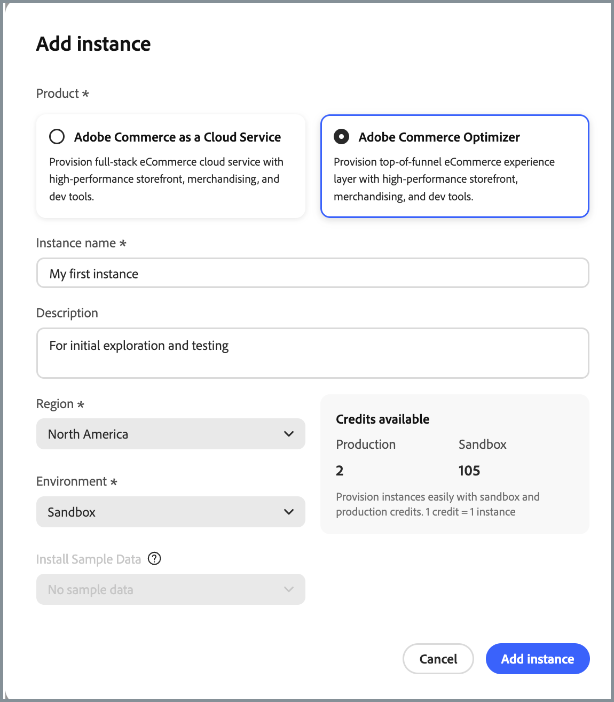

# 릴리스 정보

다음 릴리스 노트에는 [!DNL Adobe Commerce Optimizer]에 대한 업데이트가 포함되어 있습니다.

## 2026년 4월

**릴리스 날짜**: 2026년 4월 7일

>[!BEGINSHADEBOX]

### 카탈로그 규칙(베타)

이제 머천다이징 규칙에 [카테고리 규칙](./merchandising/rules/add.md)이 포함되어 있으므로, 검색에 대해 동일한 지능형 순위 및 수동 작업(고정, 증폭, 매몰)을 사용하여 하나 이상의 카테고리를 타깃팅하고 카테고리 페이지의 제품 순서를 제어할 수 있습니다.

### 가격 필터(베타)

권장 사항 필터는 이제 제품의 최소 및 최대 가격 범위를 설정하는 데 사용할 수 있는 [가격 필터](./merchandising/recommendations/filters.md#price)를 지원합니다.

{{aco-release}}

>[!ENDSHADEBOX]

## 2026년 2월

**릴리스 날짜**: 2026년 2월 19일

>[!BEGINSHADEBOX]

### 머천다이징 규칙 및 권장 사항에 대한 카탈로그 보기(베타)

[추천 단위를 만들기](./merchandising/recommendations/create.md) 또는 [머천다이징 규칙](./merchandising/rules/add.md)할 때 카탈로그 보기를 지정하는 기능이 추가되었습니다.

{{aco-release}}

>[!ENDSHADEBOX]

## 2025년 12월

**릴리스 날짜**: 2025년 12월 10일

>[!BEGINSHADEBOX]

### 영업 기회

이제 [Adobe Sites Optimizer 통합](./manage-results/opportunities.md)을 통해 AI 기반 사이트 최적화 권장 사항을 사용할 수 있습니다. 이 기능은 머천다이저가 자동 감지 및 지능형 권장 사항을 통해 상거래 사이트 성능에 영향을 주는 문제를 식별하고 해결하는 데 도움이 됩니다.

### 카탈로그 레이어

레이어 우선 순위 관리 및 Adobe Sites Optimizer 자동 수정 기능과의 통합을 포함하여 소스 데이터를 변경하지 않고 제품 데이터를 수정할 수 있도록 [카탈로그 레이어](./setup/catalog-layer.md)가 추가되었습니다.

{{aco-release}}

>[!ENDSHADEBOX]

## 2025년 10월

**릴리스 날짜**: 2025년 10월 14일

>[!BEGINSHADEBOX]

### Commerce Optimizer Salesforce Commerce 커넥터

[!DNL Commerce Optimizer Salesforce Commerce Connector]은(는) Commerce 관리자 및 개발자가 Salesforce B2C Commerce 카탈로그 데이터를 [!DNL Commerce Optimizer]과(와) 원활하게 연결할 수 있는 새로운 App Builder 통합 시작 키트입니다.<!--COMOPT-536-->

**관리자용:**

* Salesforce의 카탈로그 업데이트(제품, 가격, 메타데이터, 가격 장부)는 Commerce Optimizer과 자동으로 동기화되므로 번거로운 수작업이 필요하지 않습니다.
* 이 통합은 Adobe Commerce과 독립적으로 작동하므로 복잡성과 잠재적 장애 지점이 줄어듭니다.
* 관리자는 예약된 정기 예약 업데이트를 사용하여 Commerce Optimizer 내에서 정확한 카탈로그 데이터를 보장함으로써 머천다이징 및 제품 권장 사항을 향상시킬 수 있습니다.

**개발자용:**

* 시작 키트는 Salesforce 카탈로그 데이터를 SaaS 머천다이징 서비스로 수집하기 위한 효율적이고 확장 가능한 프레임워크를 제공합니다.
* 참조 구현, 디자인 설명서 및 코드 샘플을 사용하여 사용자 지정 통합 또는 문제 해결을 가속화할 수 있습니다.<!--COMOPT-536-->

### 계층화된 검색

* 고급 검색 기능인 `startsWith` 및 `contains`을(를) 사용한 계층화된 검색에 대한 GA 릴리스입니다. [자세히 알아보기](https://developer.adobe.com/commerce/webapi/graphql/schema/live-search/queries/product-search/#layered-search-and-expansion-of-search-types)

### 범주 API

이제 새로운 카테고리 REST API를 사용할 수 있으므로 관리자와 개발자는 탐색과 제품 그룹화를 위해 여러 카테고리 트리를 프로그래밍 방식으로 만들고, 업데이트하고, 관리할 수 있습니다. API는 글로벌 및 채널별 구성을 모두 지원하며 최대 10,000개의 카테고리 트리와 트리당 500개의 카테고리를 지원하는 높은 확장성을 위해 설계되었습니다. 자세한 내용은 [머천다이징 서비스 개발자 안내서](https://developer.adobe.com/commerce/services/optimizer/data-ingestion/#categories)의 _범주_&#x200B;을 참조하십시오.<!--DCAT-2649-->

{{aco-release}}

>[!ENDSHADEBOX]

## 2025년 8월

**릴리스 날짜**: 2025년 8월 28일

>[!BEGINSHADEBOX]

### 현재 사용 가능한 EU 지역

고객 IMS 조직에 대한 유럽 연합 지역(eu1) 지원을 이제 사용할 수 있습니다. 이제 Cloud Manager에서 **Commerce Optimizer 인스턴스를 추가**&#x200B;할 때 **유럽 연합**&#x200B;을 [지역](./get-started.md#step-1-create-an-instance)(으)로 선택할 수 있습니다. 유럽 연합(EU) 지역은 프로덕션 환경에만 사용할 수 있습니다.

유럽 연합 지역의 기본 프로덕션 URL은 다음과 같습니다.

* 책임자: `https://eu1.admin.commerce.adobe.com`
* REST 및 GraphQL: `https://eu1.api.commerce.adobe.com`

{width="600" align="center" zoomable="yes"}

{{aco-release}}

>[!ENDSHADEBOX]
