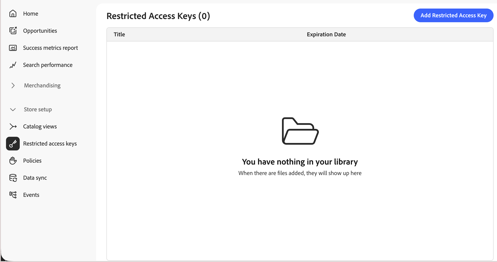

# 제한된 액세스 키

제한된 액세스 키를 사용하면 권한 있는 클라이언트 응용 프로그램에서 [개인 카탈로그 보기](catalog-view.md)에 액세스할 수 있습니다. 할당된 키에서 올바른 서명된 토큰을 포함하는 요청만 카탈로그 데이터를 검색할 수 있습니다. 익명 쇼핑객, 이 카탈로그 보기에 대한 액세스 권한이 명시적으로 부여되지 않은 쇼핑객, API를 조사하는 스크립트의 요청을 포함한 다른 모든 요청은 거부됩니다.

## 제한된 액세스 키 사용 사례

[!DNL Adobe Commerce Optimizer]에서 **[!UICONTROL Price Book ID]**&#x200B;은(는) 요청이 볼 수 있는 가격을 결정합니다. 가격에는 제한이 있지만 요청을 할 수 있는 사람은 없습니다. 카탈로그 보기의 ID 및 가격 장부 ID를 알고 있는 모든 클라이언트는 머천다이징 API를 통해 해당 데이터를 검색할 수 있습니다. 제한된 액세스 키는 별도의 보완 제어를 추가합니다. 이들은 적용되는 가격 장부에 관계없이 카탈로그 보기에 액세스할 수 있는 사용자의 범위를 지정합니다.

제한된 액세스 키는 일반적으로 다음에 사용됩니다.

- **계약 기반 B2B 가격 책정**—협상된 가격 장부에 연결된 카탈로그 보기를 제한하여 구매자만 이를 쿼리할 수 있도록 합니다. 다른 구매 조직과 대중은 할 수 없습니다.
- **파트너 및 리셀러 포털** - 머천다이징 API와 직접 통합하는 승인된 파트너로 카탈로그 하위 집합을 제한합니다.
- **프리릴리스 미리 보기** - 신뢰할 수 있는 내부 또는 파트너 시스템에서 예정된 제품을 공개하기 전에 미리 볼 수 있습니다.

>[!IMPORTANT]
>
>키 생성, 토큰 서명 및 순환은 현재 구매자를 인증하는 백엔드 클라이언트 애플리케이션에서 완전히 관리됩니다. [!DNL Adobe Commerce Optimizer]이(가) 사용자를 대신하여 이 키를 생성하거나 회전하지 않습니다.

## 제한된 액세스 키 작동 방식

제한된 액세스 키는 RSA 키 쌍의 공개 구성 요소입니다. 클라이언트 애플리케이션은 이 키를 생성하여 사용하여 개인 카탈로그 보기를 읽을 수 있는 권한을 부여합니다. 이 컨텍스트에서 &quot;클라이언트 애플리케이션&quot;은 상점 프론트엔드 자체가 아닌 쇼핑객(예: [!DNL Adobe Commerce]의 사용자 지정 논리 또는 타사 백엔드)을 인증하는 백엔드 시스템을 의미합니다.

다음 단계에서는 키 쌍과 서명된 토큰이 작성에서 유효성 검사로 이동하는 방법을 설명합니다.

1. 클라이언트 애플리케이션은 RSA 키 쌍을 생성하고 개인 키를 유지합니다.
1. [!DNL Commerce Optimizer]의 **public** 키를 제한된 액세스 키로 등록했습니다.
1. 클라이언트 애플리케이션은 개인 키로 JSON 웹 토큰(JWT)에 서명하고 개인 카탈로그 보기에 대한 각 요청과 함께 이 토큰을 포함합니다.
1. [!DNL Commerce Optimizer]이(가) 등록된 공개 키에 대해 토큰 서명을 확인하고, 유효한 경우 요청된 카탈로그 데이터를 반환합니다.

## 제한된 액세스 키 만들기

개인 카탈로그 보기의 초기 테스트를 수행하려면 [!DNL OpenSSL]과(와) 같은 도구를 사용하여 키 쌍을 생성하십시오. 개인 키 비밀 유지 — 공개 키만 [!DNL Commerce Optimizer]에 업로드됩니다.

```bash
openssl genrsa -out private-key.pem 2048
openssl rsa -in private-key.pem -pubout -out public-key.pem
```

키 크기는 2048비트와 8192비트 사이여야 합니다. `public-key.pem`에 아래 **[!UICONTROL Public key]** 필드에 붙여 넣은 값이 있습니다.

## [!DNL Commerce Optimizer]에 제한된 액세스 키 추가

1. [!DNL Adobe Commerce Optimizer Studio]의 왼쪽 메뉴에서 **[!UICONTROL Store setup]**(으)로 이동한 다음 **[!UICONTROL Restricted access keys]**&#x200B;을(를) 클릭합니다.

   {width="70%" zoomable="yes"}

1. **[!UICONTROL Add Restricted Access Key]**&#x200B;을(를) 클릭합니다.

1. 주요 세부 정보 입력:

   {width="70%" zoomable="yes"}

   - **[!UICONTROL Title]** - 키 목록 및 카탈로그 보기 키 선택기에 표시되는 키를 식별하는 레이블입니다(예: `ACME Corp wholesale portal — Tier 1 pricing`).
   - **[!UICONTROL Expiration date]**—아직 만료되지 않은 토큰의 경우에도 키 사용이 중지되는 날짜 및 시간(UTC).
   - **[!UICONTROL Public key]** - `-----BEGIN PUBLIC KEY-----` 및 `-----END PUBLIC KEY-----` 마커를 포함하여 SPKI(주체 공개 키 정보) 형식의 PEM 인코딩 RSA 공개 키입니다. 환경 전체에서 고유해야 합니다.

1. **[!UICONTROL Save]**&#x200B;을(를) 클릭합니다.

키를 만든 후에는 변경할 수 없습니다. 값을 변경하려면 키를 삭제하고 새 값을 만듭니다. 액세스 중단 없이 이 작업을 수행하려면 [키 회전](#rotate-a-key)을 참조하십시오.

## 카탈로그 보기에 키 할당

제한된 액세스 키는 **[!UICONTROL Catalog Protection]**&#x200B;이(가) 활성화된 카탈로그 보기에 할당된 후에만 액세스를 제한합니다. 설치 단계는 [카탈로그 보기 보호](private-catalog-view.md#protect-a-catalog-view)를 참조하십시오.

## 키 삭제

1. **[!UICONTROL Restricted access keys]** 페이지에서 제거할 키를 찾아 **[!UICONTROL Delete]**&#x200B;을(를) 클릭합니다.

   하나 이상의 카탈로그 보기에 키를 할당하면 해당 키를 사용하는 클라이언트 응용 프로그램에 대한 액세스 권한이 상실된다는 경고가 표시됩니다. 카탈로그 뷰 자체는 보호되어 있으므로 공개적으로 액세스할 수 없습니다.

1. 삭제를 확인합니다.

## 키 회전

액세스 중단 없이 키를 회전하려면 카탈로그 보기에서 최대 3개의 키를 한 번에 할당할 수 있습니다.

1. 새 키 쌍을 생성하고 새 공개 키를 새 제한된 액세스 키로 추가합니다.
1. 기존 키와 함께 새 키를 카탈로그 보기에 할당합니다.
1. 새 개인 키로 새 토큰에 서명을 시작하여 키 롤오버를 완료합니다.
1. 새 키에서 모든 클라이언트 응용 프로그램이 확인되면 이전 키를 제거하고 삭제합니다.

## 제한

[카탈로그 보기 및 정책 제한](../boundaries-limits.md#catalog-views-and-policies)을 참조하세요.

## 다음과 같음

- [비공개 카탈로그 보기](private-catalog-view.md)—제한된 액세스 키로 카탈로그 보기를 보호하는 방법에 대해 알아봅니다.

