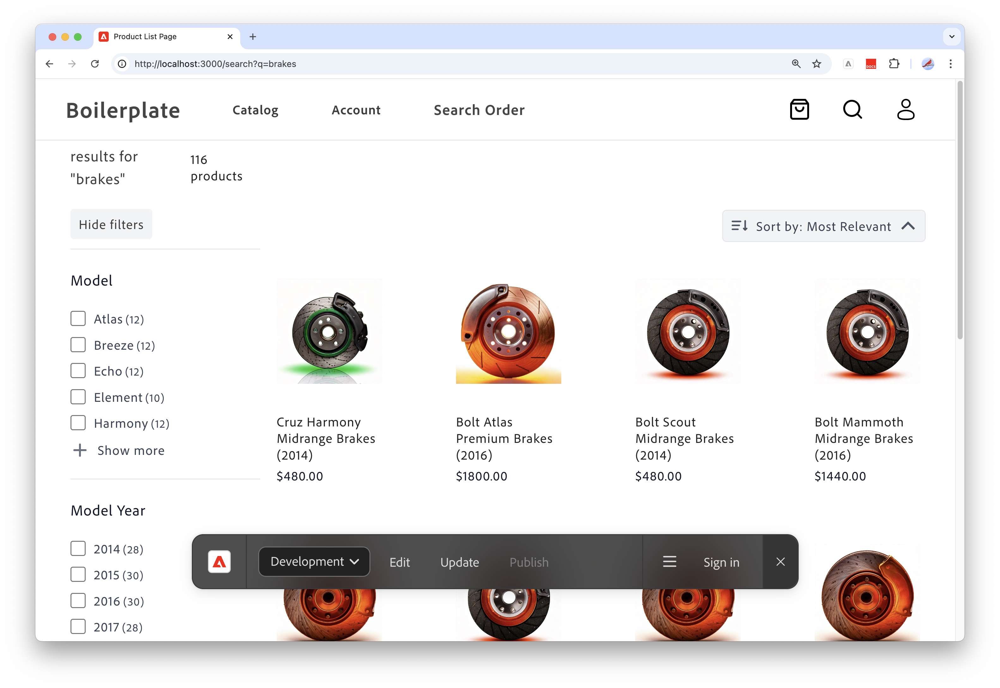

# Carvelo 사용 사례

>[!NOTE]
>
>이 설명서는 초기 액세스 개발 상태의 제품에 대해 설명하고 일반 가용성을 위한 모든 기능을 반영하지는 않습니다.

다음 사용 사례에서는 [!DNL Adobe Commerce Optimizer]을(를) 사용하여 단일 기본 카탈로그를 사용하는 소매 작업에 맞게 카탈로그를 구성하는 방법을 보여 줍니다. 또한 Edge Delivery Services에서 제공하는 상점을 설정하는 방법도 보여 줍니다.

## 전제 조건

이 사용 사례를 살펴보기 전에 [상점을 설정](../storefront.md)했는지 확인하세요.

## 시작하겠습니다.

이 사용 사례에서는 다음 작업을 수행합니다.

1. [!DNL Adobe Commerce Optimizer] UI - 복잡한 카탈로그 작동 설정을 관리하는 데 필요한 채널 및 정책을 설정합니다.

1. Commerce Storefront - [!DNL Adobe Commerce Optimizer] UI 및 Commerce Storefront 구성 파일 `fstab.yaml` 및 `config.json`에 설정된 카탈로그 데이터로 Storefront를 렌더링합니다.

### 주요 ‌ 사항

이 문서의 마지막 부분에서 다음을 수행합니다.

- 성능이 뛰어나고 확장 가능한 고유한 카탈로그 데이터 모델로 [!DNL Adobe Commerce Optimizer]의 기본 사항에 대해 알아봅니다.
- 카탈로그 데이터 모델이 Adobe에서 구축한 플랫폼과 관계없는 상점 구성 요소와 원활하게 결합하는 방법에 대해 알아봅니다.
- Adobe Commerce Optimizer 채널 및 정책을 사용하여 사용자 지정 카탈로그 보기 및 데이터 액세스 필터를 만들고 데이터를 Edge Delivery에서 제공하는 Adobe Commerce 스토어프론트로 보내는 방법에 대해 알아봅니다.

## 비즈니스 시나리오 - 카벨로 자동차

Carvelo Automobile은 복잡한 운영 체제를 갖춘 가상 자동차 대기업입니다.


이 도표에서 Carvelo가 세 가지 브랜드의 자동차 제품을 판매한다는 것을 볼 수 있습니다. 각 브랜드는 서로 다른 하위 회사입니다.

- 오로라(전기자동차)
- 볼트(SUV)
- 크루즈(하이브리드)

EMC 는 세 곳의 딜러를 통해 이러한 브랜드를 판매합니다.

- 아크브리지
- 킹스블러프
- 셀포트

이 딜러들은 두 개의 서로 다른 모회사 대리점에 소속되어 있습니다.

- 웨스트 코스트 주식회사 (아크브리지)
- East Coast Inc.(Kingsbluff, Celport)

각 회사에는 서로 다른 쇼핑객(기반, VIP)을 위해 특정 가격으로 제품을 판매하는 데 사용되는 두 개의 가격표가 있습니다.

- `west_coast_inc` 및 `vip_west_coast_inc`
- `east_coast_inc` 및 `vip_east_coast_inc`

보시다시피 매우 복잡한 비즈니스 사용 사례입니다. [!DNL Adobe Commerce Optimizer]을(를) 사용하면 판매자는 단일 기본 카탈로그를 사용하여 카탈로그 중복 없이 데이터를 신디케이트하고, 가격 장부(30k+ 가격 장부)를 평가하고, 이 모든 데이터를 Edge Delivery Services 상점 앞으로 배달할 수 있는 복잡한 비즈니스 구조를 지원할 수 있습니다.

비즈니스 사용 사례에 대한 개요를 살펴보았으므로, 이 자습서를 통해 작업할 때 다음과 같은 목표를 갖습니다.

>[!BEGINSHADEBOX]

Carvelo는 서로 다른 대리점(Akbridge, Kingsbluff 및 Celport)을 통해 세 브랜드(Aurora, Bolt 및 Cruz)에 걸쳐 부품을 판매하려고 합니다. Carvelo는 대리점이 각 라이센스 계약에 따라 올바른 부품과 가격만 액세스할 수 있도록 하고자 합니다.

궁극적으로 Carvelo는 두 가지 주요 목표를 가지고 있습니다.

1. 세 브랜드 모두에 걸쳐 모든 SKU를 포함하는 &quot;글로벌&quot; 웹 사이트를 유지하십시오.
1. 대리점이 각 대리점의 고유 SKU 가시성 및 각 SKU에 대한 가격을 기반으로 자체 상점 전면을 설정할 수 있는 경로를 제공합니다.

>[!ENDSHADEBOX]

이제 [!DNL Adobe Commerce Optimizer] 인스턴스에 액세스하십시오.

## 1. [!DNL Adobe Commerce Optimizer] 인스턴스에 액세스

조기 액세스 프로그램에 온보딩하면 Adobe에서 제공된 l[!DNL Adobe Commerce Optimizer] 인스턴스에 액세스할 수 있는 URL을 제공하는 이메일을 보냅니다. 이 인스턴스는 Carvelo 자동차 사용 사례를 지원하는 카탈로그 데이터를 포함하여 이 자습서에 설명된 단계를 성공적으로 완료하는 데 필요한 모든 내용으로 사전 구성됩니다.

[!DNL Adobe Commerce Optimizer]을(를) 실행하면 다음이 표시됩니다.

![[!DNL Adobe Commerce Optimizer] UI](../assets/user-interface.png)

>[!NOTE]
>
>[!DNL Adobe Commerce Optimizer] UI를 구성하는 다양한 부분에 대한 자세한 내용은 [개요](../overview.md) 문서를 참조하십시오.

왼쪽 탐색에서 **[!UICONTROL Catalog]** 섹션을 확장하고 **[!UICONTROL Channels]**&#x200B;을(를) 클릭합니다. Arkbridge 및 Kingsbluff 대리점에는 이미 채널이 생성되었습니다.


>[!NOTE]
>
>지금은 **전역** 채널을 무시할 수 있습니다.

채널 세부 사항을 검토하려면 정보 아이콘을 클릭하십시오.

Arkbridge에는 다음 정책이 있습니다.

- 브랜드
- 모델
- 웨스트코스트 의 브랜드
- Arkbridge 부품 카테고리

Kingsbluff에는 다음 정책이 있습니다.

- 브랜드
- 모델
- 이스트코스트 의 브랜드
- 킹스블러프 파트 카테고리

다음 섹션에서는 Celport 대리점을 위한 채널과 정책을 만듭니다.

## 2. 정책 및 채널 만들기

Carvelo의 상거래 관리자는 *East Coast Inc* 회사에 속하는 *Celport*(이)라는 딜러를 위해 새 상점을 설정해야 합니다. 셀포트는 볼트와 크루즈 브랜드에 대한 브레이크와 출장 정지를 판매할 것이다.


상거래 관리자는 [!DNL Adobe Commerce Optimizer]을(를) 사용하여 다음을 수행합니다.

1. Celport에서 브레이크 및 일시 중단 부품만 판매하도록 *Celport 부품 범주*&#x200B;라는 새 정책을 만듭니다.
1. Celport 상점을 위한 새 채널을 만듭니다.

   이 채널은 새로 만든 정책 *Celport 일부 범주* 및 기존 *East Coast Inc 브랜드*&#x200B;를 사용하여 Celport가 East Coast Inc와의 계약의 일부로 볼트와 크루즈 브랜드만 판매할 수 있도록 합니다. Celport 채널은 `east_coast_inc` 가격 설명서를 사용하여 브랜드 라이선스 계약에 맞는 제품 가격 책정 일정을 지원합니다.
1. 생성한 Celport 채널의 데이터를 사용하도록 commerce storefront 구성을 업데이트합니다.

이 섹션이 끝나면 Celport가 가동되어 Carvelo의 제품을 판매할 준비를 갖추게 됩니다.

### 정책 만들기

Celport 판매자가 판매하는 SKU(브레이크 및 서스펜션 부품 포함)를 필터링하기 위해 *Celport 부품 카테고리*&#x200B;라는 새 정책을 만들어 보겠습니다.

1. 왼쪽 탐색에서 **[!UICONTROL Catalog]** 섹션을 확장하고 **[!UICONTROL Policies]**&#x200B;을(를) 클릭합니다.

1. **[!UICONTROL Add Policy]**&#x200B;을(를) 클릭합니다.

   정책 세부 사항을 추가하는 새 페이지가 표시됩니다.

1. 필요한 세부 정보를 추가합니다.

   **이름** = *Celport 부분 범주*

1. **[!UICONTROL Add Filter]**&#x200B;을(를) 클릭합니다.

   필터 세부 정보를 추가하는 대화 상자가 표시됩니다.

1. 필터 세부 사항을 추가합니다.

   - **특성** = *part_category*
   - **연산자** = **IN**
   - **값 Source** = **정적**
   - **값** = *브레이크*, *일시 중단*

   >[!IMPORTANT]
   >
   >지정한 속성 이름이 카탈로그의 SKU 속성 이름과 정확히 일치하는지 확인합니다.

   STATIC과 TRIGGER 값 원본의 차이에 대한 자세한 내용은 [값 원본 형식](../catalog/policies.md#value-source-types)을 참조하세요.

1. **[!UICONTROL Filter details]** 대화 상자에서 **[!UICONTROL Save]**&#x200B;을(를) 클릭합니다.

1. 방금 만든 필터를 활성화하려면 동작 점(...)을 클릭하고 **활성화**&#x200B;를 선택합니다.

1. **[!UICONTROL Save]**&#x200B;을(를) 클릭합니다.

   >[!NOTE]
   >
   >**[!UICONTROL Save]** 단추가 활성 상태(파란색)가 아니면 정책 이름이 없을 수 있습니다. *새 정책* 옆에 있는 연필 아이콘을 클릭하여 추가합니다.

1. 뒤로 화살표를 클릭하여 정책 목록으로 돌아갑니다.

   새 *보고서 파트 범주* 정책이 목록에 나타납니다.

### 채널 만들기

*Celport* 딜러에 대한 새 채널을 만들고 다음 정책을 연결합니다. *East Coast Inc 브랜드* 및 *Celport 부품 범주*.

1. 왼쪽 탐색에서 **[!UICONTROL Catalog]** 섹션을 확장하고 **[!UICONTROL Channels]**&#x200B;을(를) 클릭합니다.

   

   기존 채널에 주목하십시오. *Arkbridge*, *Kingsbluff* 및 *Global*.

   

1. **[!UICONTROL Add Channel]**&#x200B;을(를) 클릭합니다.

1. 채널 세부 정보 입력:

   - **이름** = *Celport*
   - **범위** = *en-US*(hit enter)
   - **정책**(드롭다운 사용) = *East Coast Inc 브랜드*; *Celport 일부 범주*; *브랜드*; *모델*                          

1. 채널을 만들려면 **[!UICONTROL Add]**&#x200B;을(를) 클릭하십시오.

   채널 페이지가 업데이트되어 새 채널이 표시됩니다.

   

   >[!NOTE]
   >
   >**[!UICONTROL Add]** 단추가 파란색이 아니면 커서를 **[!UICONTROL Scopes]** 섹션에 놓고 **enter**&#x200B;를 눌러 범위를 선택했는지 확인하십시오.

1. Celport 채널 ID를 가져옵니다.

   **채널** 페이지에서 Celport 채널에 대한 정보 아이콘을 클릭합니다.

   

   채널 ID를 복사하여 저장합니다. 새 Celport 카탈로그에 데이터를 전달하기 위해 Storefront 구성을 업데이트할 때 이 ID가 필요합니다.

Celport 채널 및 관련 정책을 만든 후 다음 단계는 새 Celport 카탈로그를 만들도록 상점 전면을 구성하는 것입니다.

## 3. 상점 업데이트

이 자습서의 마지막 부분에는 새 Celport 카탈로그에 데이터를 전달하기 위해 [이미 만든](#prerequisite)의 상점 전면을 업데이트하는 작업이 포함됩니다. 이 섹션에서는 storefront 구성 파일의 채널 ID를 Celport용 채널 ID로 바꿉니다.

1. 로컬 개발 환경에서 Storefront 보일러플레이트 구성 파일로 GitHub 리포지토리를 복제한 폴더를 엽니다.

1. 폴더의 루트 디렉터리에서 `config.json` 파일을 엽니다.

   +++config.json 코드

   ```json
   {
    "public": {
      "default": {
      "commerce-core-endpoint": "https://www.aemshop.net/graphql",
      "commerce-endpoint": "https://na1-sandbox.api.commerce.adobe.com/Fwus6kdpvYCmeEdcCX7PZg/graphql",
      "headers": {
         "cs": {
            "ac-channel-id": "9ced53d7-35a6-40c5-830e-8288c00985ad",
            "ac-environment-id": "Fwus6kdpvYCmeEdcCX7PZg",
            "ac-price-book-id": "west_coast_inc",
            "ac-scope-locale": "en-US"
           }
         },
         "analytics": {
            "base-currency-code": "USD",
            "environment": "Production",
            "store-id": 1,
            "store-name": "ACO Demo",
            "store-url": "https://www.aemshop.net",
            "store-view-id": 1,
            "store-view-name": "Default Store View",
            "website-id": 1,
            "website-name": "Main Website"
          }
       }
      }
   }
   ```

   채널 헤더에는 다음 행이 포함됩니다.

   - `ac-channel-id`:`"9ced53d7-35a6-40c5-830e-8288c00985ad"`
   - `ac-environment-id`: `"Fwus6kdpvYCmeEdcCX7PZg"`
   - `ac-price-book-id`: `"west_coast_inc"`

+++

1. `ac-channel-id` 값을 이전에 복사한 Celport 채널 ID로 바꿉니다.
1. 필요한 경우 `ac-environment-id` 값을 [!DNL Adobe Commerce Optimizer] 인스턴스의 테넌트 ID로 바꾸십시오. ID는 조기 액세스 프로그램에 대한 온보딩 이메일이나 Adobe 계정 담당자에게 문의하여 찾을 수 있습니다.

   `commerce-endpoint` 값이 [!DNL Adobe Commerce Optimizer] 인스턴스에 대한 GraphQL 끝점과 일치하는지 확인하십시오.

1. `ac-price-book-id` 값을 `"east_coast_inc"`(으)로 바꿉니다.
1. 파일을 저장합니다.

변경 사항을 저장하면 브레이크 및 서스펜션 부품만 판매하도록 구성된 카벨로 채널을 사용하도록 카탈로그 구성을 업데이트합니다.

1. Storefront를 실행하여 Storefront 구성으로 생성된 Celport 전용 카탈로그 경험을 확인하십시오.

   1. IDE의 터미널 창에서 로컬 상점 미리 보기를 시작합니다.

      ```shell
      npm start
      ```

   브라우저가 `http://localhost:3000`에 로컬 개발 미리 보기로 열립니다.

   명령이 실패하거나 브라우저가 열리지 않으면 Storefront 설정 항목에서 [로컬 개발에 대한 지침](../storefront.md)을 검토하십시오.

   1. 브라우저에서 `brakes`을(를) 검색하고 **Enter**&#x200B;를 누릅니다.

      상점이 업데이트되어 브레이크 부품을 표시하는 제품 목록 페이지가 표시됩니다.

   

   가격 정보로 제품 상세내역을 조회하고 제품 가격 정보를 확인하려면 브레이크 부품 이미지를 누릅니다.

1. 이제 [!DNL Adobe Commerce Optimizer] 인스턴스의 사용 사례 데이터에서 사용할 수 있는 또 다른 파트 카테고리인 `tires`을(를) 검색합니다.

   

   결과가 반환되지 않습니다. 셀포트 채널이 브레이크와 서스펜션 부품만 판매하도록 구성됐기 때문이다.

1. Storefront 구성 파일(`config.json`)을 업데이트해 보십시오.

   1. `ac-channel-id` 및 `ac-price-book` 값을 변경합니다.

      예를 들어 채널 ID를 Kingsbluff 채널로 변경하고 요금서 ID를 `east_coast_inc`(으)로 변경할 수 있습니다. *Kingsbluff 부품 범주* 정책을 검토하여 Kingsbluff에 사용할 수 있는 부품 범주를 확인할 수 있습니다.

   1. 파일을 저장합니다.

      파일을 저장하면 로컬 상점 미리 보기가 자동으로 업데이트됩니다.

   1. 검색 기능을 사용하여 타이어 부품을 찾아 브라우저의 변경 사항을 미리 봅니다 .

      사용 가능한 다양한 부품 유형을 확인하고 Kingsbluff 채널에 할당된 가격을 확인합니다.

      Storefront 구성 파일에서 헤더 값을 변경하고 업데이트된 Storefront를 살펴봄으로써 카탈로그 보기 및 데이터 필터를 업데이트하여 Storefront 경험을 사용자 정의하는 것이 얼마나 쉬운지 알 수 있습니다.

## 다 됐습니다!

이 자습서에서는 [!DNL Adobe Commerce Optimizer]이(가) 단일 기본 카탈로그를 사용하여 소매 작업에 맞게 카탈로그를 구성하는 데 어떻게 도움이 되는지에 대해 배웠습니다. 또한 Edge Delivery Services에서 제공하는 상점을 설치하는 방법에 대해 알아보았습니다.

## 여기서 어디로 가야 합니까

제품 검색 및 권장 사항을 사용하여 고객을 위한 쇼핑 환경을 개인화하는 방법에 대해 알아보려면 [머천다이징 개요](../merchandising/overview.md)를 참조하세요.
