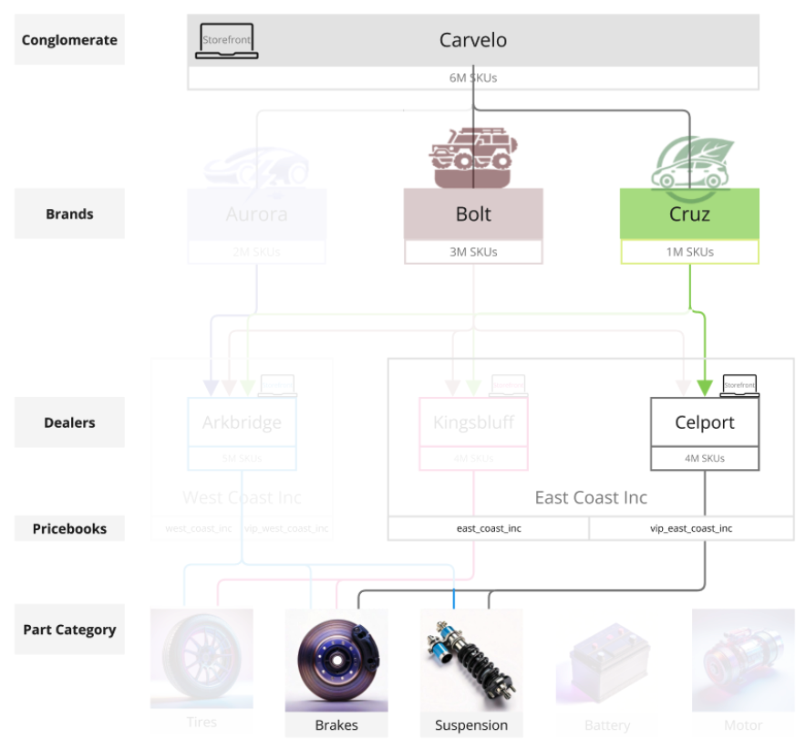

# Storefront 및 Catalog 관리자 엔드 투 엔드 활용 사례

이 사용 사례는 복잡한 운영 환경을 갖춘 Carvelo Automobile이라는 가상의 자동차 대기업을 기반으로 합니다. 사용자 지정된 상점 경험을 제공하면서 [!DNL Adobe Commerce Optimizer]을(를) 사용하여 여러 브랜드, 대리점 및 가격 책자를 지원하는 카탈로그를 관리하는 방법을 보여 줍니다.

## 사전 요구 사항

이 사용 사례는 [!DNL Adobe Commerce Optimizer]을(를) 사용하여 Storefront를 설정하고 카탈로그를 관리하는 방법에 대해 알아보려는 관리자 및 개발자를 위해 설계되었습니다. [!DNL Adobe Commerce Optimizer] 및 해당 기능에 대한 기본 지식이 있다고 가정합니다.

**완료 예상 시간:** 45-60분

### 필수 설정

이 자습서를 시작하기 전에 다음 사전 요구 사항이 있는지 확인하십시오.

- **Adobe Commerce Optimizer 인스턴스**
   - Cloud Manager의 테스트 인스턴스에 액세스
   - 설치 지침은 [시작하기](../get-started.md)를 참조하세요.

- **사용자 권한**
   - Adobe Admin Console에 대한 관리자 액세스
   - 계정 설정에 대해서는 [사용자 관리](../user-management.md)를 참조하십시오.
   - 액세스 권한이 없는 경우 Adobe 계정 담당자에게 문의하십시오.

- **샘플 데이터**
   - 인스턴스에 로드된 Carvelo 자동차 카탈로그 데이터
   - [샘플 카탈로그 데이터 수집 저장소](https://github.com/adobe-commerce/aco-sample-catalog-data-ingestion)의 지침을 따르십시오.
   - 포함된 `reset.js` 스크립트를 사용하여 완료 후 샘플 데이터를 삭제할 수 있습니다.

- **Storefront 환경**
   - Node.js가 있는 로컬 개발 환경
   - Storefront 보일러플레이트 프로젝트 복제 및 구성
   - 자세한 지침은 [상점 설치](../storefront.md)를 참조하세요.

## 시작하겠습니다.

이 사용 사례에서는 다음을 사용하여 작업합니다.

1. [!DNL Adobe Commerce Optimizer] UI - 카탈로그 보기 및 정책을 설정하여 Carvelo 사용 사례에 대한 복잡한 카탈로그 작동 설정을 관리합니다.

1. Commerce Storefront - [!DNL Adobe Commerce Optimizer] 인스턴스와 Commerce Storefront 구성 파일 `fstab.yaml` 및 `config.json`에 로드된 샘플 카탈로그 데이터를 사용하여 Storefront를 렌더링합니다.

>[!NOTE]
>
> Adobe Commerce Storefront 설명서의 [보일러플레이트 살펴보기](https://experienceleague.adobe.com/developer/commerce/storefront/get-started/boilerplate-project/?lang=ko) 항목을 검토하여 Storefront 구성 파일에 대해 알아봅니다.

### 주요 ‌ 사항

이 문서의 마지막 부분에서 다음을 수행합니다.

- 성능이 뛰어나고 확장 가능한 카탈로그 데이터 모델로 [!DNL Adobe Commerce Optimizer]의 기본 사항에 대해 알아봅니다.
- 카탈로그 데이터 모델이 Adobe에서 빌드한 플랫폼과 관계없는 상점 구성 요소와 어떻게 통합되는지 알아봅니다.
- Adobe Commerce Optimizer 카탈로그 보기 및 정책을 사용하여 사용자 지정 카탈로그 보기 및 데이터 액세스 필터를 만들고 데이터를 Edge Delivery에서 제공하는 Adobe Commerce 스토어프론트로 보내는 방법에 대해 알아봅니다.

## 비즈니스 시나리오 - 카벨로 자동차

Carvelo Automobile은 복잡한 운영 체제를 갖춘 가상 자동차 대기업입니다.


이 도표에서 Carvelo가 세 가지 브랜드의 자동차 제품을 판매한다는 것을 볼 수 있습니다. 각 브랜드는 서로 다른 하위 회사입니다.

- 오로라(전기자동차)
- 볼트(SUV)
- 크루즈(하이브리드)

EMC 는 세 곳의 딜러를 통해 이러한 브랜드를 판매합니다.

- 아크브리지
- 킹스블러프
- 셀포트

이 딜러들은 두 개의 서로 다른 모회사 대리점에 소속되어 있습니다.

- 웨스트 코스트 주식회사 (아크브리지)
- East Coast Inc.(Kingsbluff, Celport)

각 회사에는 서로 다른 쇼핑객(기반, VIP)을 위해 특정 가격으로 제품을 판매하는 데 사용되는 두 개의 가격표가 있습니다.

- `west_coast_inc` 및 `vip_west_coast_inc`
- `east_coast_inc` 및 `vip_east_coast_inc`

보시다시피 매우 복잡한 비즈니스 사용 사례입니다. [!DNL Adobe Commerce Optimizer]을(를) 사용하면 판매자는 단일 기본 카탈로그를 사용하여 카탈로그 중복 없이 데이터를 신디케이트하고, 가격 장부(30k+ 가격 장부)를 평가하고, 이 모든 데이터를 Edge Delivery Services 상점 앞으로 배달할 수 있는 복잡한 비즈니스 구조를 지원할 수 있습니다.

비즈니스 사용 사례에 대한 개요를 살펴보았으므로, 이 자습서를 통해 작업할 때 다음과 같은 목표를 갖습니다.

>[!BEGINSHADEBOX]

Carvelo는 서로 다른 대리점(Arkbridge, Kingsbluff 및 Celport)을 통해 세 브랜드(Aurora, Bolt 및 Cruz)에 걸쳐 부품을 판매하려고 합니다. Carvelo는 대리점이 각 라이센스 계약에 따라 올바른 부품과 가격만 액세스할 수 있도록 하고자 합니다.

궁극적으로 Carvelo는 두 가지 주요 목표를 가지고 있습니다.

1. 세 브랜드 모두에 걸쳐 모든 SKU를 포함하는 &quot;글로벌&quot; 웹 사이트를 유지하십시오.
1. 대리점이 각 대리점의 고유 SKU 가시성 및 각 SKU에 대한 가격을 기반으로 자체 상점 전면을 설정할 수 있는 경로를 제공합니다. 모두 단일 기본 카탈로그를 사용하는 동안 카탈로그 중복을 제거합니다.

>[!ENDSHADEBOX]

## &#x200B;1. [!DNL Adobe Commerce Optimizer] 인스턴스에 액세스

샘플 데이터로 사전 구성된 Commerce Optimizer 애플리케이션의 URL로 이동합니다. Commerce Cloud Manager에서 Commerce Optimizer 프로젝트에 대한 인스턴스 세부 정보에서 URL을 찾거나 시스템 관리자로부터 얻을 수 있습니다. ([인스턴스 액세스](../get-started.md#access-an-instance)를 참조하십시오.)

[!DNL Adobe Commerce Optimizer]을(를) 실행하면 다음이 표시됩니다.

![[!DNL Adobe Commerce Optimizer] UI](../assets/user-interface.png)

>[!NOTE]
>
>[&#x200B; UI의 주요 구성 요소에 대한 자세한 내용은 &#x200B;](../overview.md)개요[!DNL Adobe Commerce Optimizer] 문서를 참조하세요.

왼쪽 탐색에서 _스토어 설정_ 섹션을 확장하고 **[!UICONTROL Catalog views]**&#x200B;을(를) 클릭합니다. Arkbridge 및 Kingsbluff 대리점에는 이미 카탈로그 보기가 생성되었습니다.


>[!NOTE]
>
>지금은 **전역** 카탈로그 보기를 무시할 수 있습니다.

정보 아이콘을 클릭하여 카탈로그 보기 세부 사항을 검토합니다.

Arkbridge에는 다음 정책이 있습니다.

- 브랜드
- 모델
- 웨스트코스트 의 브랜드
- Arkbridge 부품 카테고리

Kingsbluff에는 다음 정책이 있습니다.

- 브랜드
- 모델
- 이스트코스트 의 브랜드
- 킹스블러프 파트 카테고리

다음 섹션에서는 Celport 대리점에 대한 카탈로그 보기 및 정책을 만듭니다.

## &#x200B;2. 정책 및 카탈로그 보기 만들기

Carvelo의 상거래 관리자는 *East Coast Inc* 회사에 속하는 *Celport*(이)라는 딜러를 위해 새 상점을 설정해야 합니다. 셀포트는 볼트와 크루즈 브랜드에 대한 브레이크와 출장 정지를 판매할 것이다.



상거래 관리자는 [!DNL Adobe Commerce Optimizer]을(를) 사용하여 다음을 수행합니다.

1. Celport에서 브레이크 및 일시 중단 부품만 판매하도록 *Celport 부품 범주*&#x200B;라는 새 정책을 만듭니다.
1. Celport 상점에 대한 새 카탈로그 보기를 만듭니다.

   이 카탈로그 보기는 새로 만든 정책 *Celport 부품 범주* 및 기존 *East Coast Inc 브랜드*&#x200B;를 사용하여 Celport가 East Coast Inc와의 계약의 일부로 Bolt 및 Cruz 브랜드만 판매할 수 있도록 합니다. Celport 카탈로그 보기는 `east_coast_inc` 가격표를 사용하여 브랜드 라이선스 계약에 맞는 제품 가격 책정 일정을 지원합니다.
1. 만든 Celport 카탈로그 보기의 데이터를 사용하도록 commerce storefront 구성을 업데이트합니다.

이 섹션이 끝나면 Celport가 가동되어 Carvelo의 제품을 판매할 준비를 갖추게 됩니다.

### 정책 만들기

Celport 판매자가 판매하는 SKU(브레이크 및 서스펜션 부품 포함)를 필터링하기 위해 *Celport 부품 카테고리*&#x200B;라는 새 정책을 만들어 보겠습니다.

1. 왼쪽 레일에서 _스토어 설정_ 섹션을 확장하고 **[!UICONTROL Policies]**&#x200B;을(를) 클릭합니다.

1. **[!UICONTROL Create Policy]**&#x200B;을(를) 클릭합니다.

   정책 세부 사항을 추가하는 새 페이지가 표시됩니다.

1. 필요한 세부 정보를 추가합니다.

   **이름** = *Celport 부분 범주*

1. **[!UICONTROL Add Filter]**&#x200B;을(를) 클릭합니다.

   필터 세부 정보를 추가하는 대화 상자가 표시됩니다.

1. 필터 세부 사항을 추가합니다.

   - **특성** = *part_category*
   - **연산자** = **IN**
   - **값 Source** = **정적**
   - **값** = *브레이크*
   - **값** = *일시 중단*

   >[!IMPORTANT]
   >
   >각 속성 값을 별도로 입력해야 합니다. 값을 입력한 후 **Enter**&#x200B;를 눌러 필터 구성에 추가합니다. 그런 다음 다음 다음 값을 입력합니다. 모든 값은 카탈로그의 SKU 속성 이름과 정확히 일치해야 합니다.

   STATIC과 TRIGGER 값 원본의 차이에 대한 자세한 내용은 [값 원본 형식](../setup/policies.md#value-source-types)을 참조하세요.

1. **[!UICONTROL Filter details]** 대화 상자에서 **[!UICONTROL Save]**&#x200B;을(를) 클릭합니다.

1. 방금 만든 필터를 활성화하려면 동작 점(...)을 클릭하고 **활성화**&#x200B;를 선택합니다.

1. **[!UICONTROL Save]**&#x200B;을(를) 클릭합니다.

   >[!NOTE]
   >
   >**[!UICONTROL Save]** 단추가 활성 상태(파란색)가 아니면 정책 이름이 없을 수 있습니다. *새 정책* 옆에 있는 연필 아이콘을 클릭하여 추가합니다.

1. 뒤로 화살표를 클릭하여 정책 목록으로 돌아갑니다.

   새 *보고서 파트 범주* 정책이 목록에 나타납니다.

**이 단계가 올바르게 완료되었는지 확인하려면:**

- 정책이 정책 목록에 표시됨
- 정책 상태가 활성화됨으로 표시됨(녹색 표시기)
- 필터 세부 사항에 &quot;part_category IN(브레이크, 서스펜션)&quot;이 표시됨
- 정책 이름은 &quot;Celport Part Categories&quot;입니다.

### 카탈로그 보기 만들기

*Celport* 딜러에 대한 새 카탈로그 보기를 만들고 다음 정책을 연결합니다. *East Coast Inc 브랜드* 및 *Celport 부품 범주*.

1. 왼쪽 레일에서 _스토어 설정_ 섹션을 확장하고 **[!UICONTROL Catalog views]**&#x200B;을(를) 클릭합니다.

   기존 카탈로그 보기 개수: *Arkbridge*, *Kingsbluff* 및 *Global*.

   

1. **[!UICONTROL Add catalog view]**&#x200B;을(를) 클릭합니다.

1. 카탈로그 보기 세부 정보 입력:

   - **이름** = *Celport*
   - **카탈로그 원본** = *en-US*
   - **정책**(드롭다운 사용) = *East Coast Inc 브랜드*; *Celport 일부 범주*; *브랜드*; *모델*
                         
1. 카탈로그 보기를 만들려면 **[!UICONTROL Add]**&#x200B;을(를) 클릭합니다.

   카탈로그 보기 페이지가 업데이트되어 새 카탈로그 보기가 표시됩니다.

   

1. Celport 카탈로그 보기 ID를 가져옵니다.

   **카탈로그 보기** 페이지에서 Celport 카탈로그 보기에 대한 정보 아이콘을 클릭합니다.

   

   카탈로그 보기 ID를 복사하여 저장합니다. 새 Celport 카탈로그에 데이터를 전달하기 위해 Storefront 구성을 업데이트할 때 이 ID가 필요합니다.

   **이 단계가 올바르게 완료되었는지 확인하려면:**
   - 카탈로그 보기 이름이 &quot;Celport&quot;입니다.
   - 카탈로그 보기에 4개의 연결된 정책이 표시됨
   - 카탈로그 보기 ID가 표시되고 복사할 수 있습니다.
   - 카탈로그 소스에 &quot;en-US&quot; 표시

Celport 카탈로그 보기 및 관련 정책을 만든 후 다음 단계는 새 Celport 카탈로그를 사용하도록 상점 전면을 구성하는 것입니다.

## &#x200B;3. 상점 업데이트

이 자습서의 마지막 부분에는 새 Celport 카탈로그에 데이터를 전달하기 위해 [이미 만든](#prerequisite)의 상점 전면을 업데이트하는 작업이 포함됩니다. 이 섹션에서는 storefront 구성 파일의 카탈로그 보기 ID를 Celport용 카탈로그 보기 ID로 바꿉니다.

1. 로컬 개발 환경에서 Storefront 보일러플레이트 구성 파일로 GitHub 리포지토리를 복제한 폴더를 엽니다.

1. 폴더의 루트 디렉터리에서 `config.json` 파일을 엽니다.

   +++config.json 코드

   ```json
   {
    "public": {
      "default": {
      "commerce-core-endpoint": "https://www.aemshop.net/graphql",
      "commerce-endpoint": "https://na1-sandbox.api.commerce.adobe.com/Fwus6kdpvYCmeEdcCX7PZg/graphql",
      "headers": {
         "cs": {
            "ac-view-id": "9ced53d7-35a6-40c5-830e-8288c00985ad",
            "ac-price-book-id": "west_coast_inc",
            "ac-source-locale": "en-US"
           }
         },
         "analytics": {
            "base-currency-code": "USD",
            "environment": "Production",
            "store-id": 1,
            "store-name": "ACO Demo",
            "store-url": "https://www.aemshop.net",
            "store-view-id": 1,
            "store-view-name": "Default Store View",
            "website-id": 1,
            "website-name": "Main Website"
          }
       }
      }
   }
   ```

   카탈로그 보기 헤더에 다음 값이 포함됩니다.

   - `commerce-endpoint`: `"https://na1-sandbox.api.commerce.adobe.com/Fwus6kdpvYCmeEdcCX7PZg/graphql"`
   - `ac-view-id`:`"9ced53d7-35a6-40c5-830e-8288c00985ad"`
   - `ac-price-book-id`: `"west_coast_inc"`
   - `ac-source-locale`: `"en-US"`

1. `commerce-endpoint` 값에서 URL의 테넌트 ID를 [!DNL Adobe Commerce Optimizer] 인스턴스의 URL로 바꿉니다.

   Commerce Optimizer UI의 URL에서 테넌트 ID를 찾을 수 있습니다. 예를 들어 다음 URL에서 테넌트 ID는 `XDevkG9W6UbwgQmPn995r3`입니다.

   ```text
   https://experience.adobe.com/#/@commerceprojectbeacon/in:XDevkG9W6UbwgQmPn995r3/commerce-optimizer-studio/catalog
   ```

1. `ac-view-id` 값을 이전에 복사한 Celport 카탈로그 보기 ID로 바꾸십시오.

1. `ac-price-book-id` 값을 `"east_coast_inc"`(으)로 바꿉니다.

   이러한 변경 작업을 수행하면 `config.json` 파일이 다음과 비슷해지며 `ACO-tenant-id` 및 `celport-catalog-view-id` 자리 표시자가 값으로 대체됩니다.

   ```json
   {
     "public": {
        "default": {
        "commerce-core-endpoint": "https://www.aemshop.net/graphql",
        "commerce-endpoint": "https://na1-sandbox.api.commerce.adobe.com/{{ACO-tenant-id}}/graphql",
        "headers": {
            "cs": {
                "ac-view-id": "{{celport-catalog-view-id}}",
                "ac-price-book-id": "east_coast_inc",
                "ac-source-locale": "en-US"
              }
            },
            "analytics": {
                "base-currency-code": "USD",
                "environment": "Production",
                "store-id": 1,
                "store-name": "ACO Demo",
                "store-url": "https://www.aemshop.net",
                "store-view-id": 1,
                "store-view-name": "Default Store View",
                "website-id": 1,
                "website-name": "Main Website"
             }
         }
     }
   }
   ```

1. 파일을 저장합니다.

   변경 사항을 저장할 때 브레이크 및 서스펜션 부품만 판매하도록 구성된 Carvelo 카탈로그 뷰를 사용하도록 카탈로그 구성을 업데이트합니다.

## &#x200B;4. 상점 첫 화면 미리보기

Celport 카탈로그 보기를 사용하도록 Storefront 구성을 업데이트했으므로 이제 Storefront를 미리 보고 카탈로그 데이터를 렌더링하는 방법을 확인할 수 있습니다.

1. Storefront를 실행하여 Storefront 구성으로 생성된 Celport 전용 카탈로그 경험을 확인하십시오.

   1. IDE의 터미널 창에서 로컬 상점 미리 보기를 시작합니다.

      ```shell
      npm start
      ```

      브라우저가 `http://localhost:3000`에 로컬 개발 미리 보기로 열립니다.

      명령이 실패하거나 브라우저가 열리지 않으면 Storefront 설정 항목에서 [로컬 개발에 대한 지침](../storefront.md)을 검토하십시오.

1. 브라우저에서 `brakes`을(를) 검색하고 **Enter**&#x200B;를 누릅니다.

   상점이 업데이트되어 브레이크 부품을 표시하는 제품 목록 페이지가 표시됩니다.

   

   가격 정보로 제품 세부 사항을 보고 제품 가격 정보를 확인하려면 브레이크 부품 이미지를 클릭하십시오.

1. `tires` 인스턴스의 사용 사례 데이터에서 사용할 수 있는 또 다른 파트 카테고리인 [!DNL Adobe Commerce Optimizer]을(를) 검색합니다.

   

   결과가 반환되지 않습니다. 셀포트 카탈로그 뷰가 브레이크와 서스펜션 부품만 판매하도록 구성됐기 때문이다.

1. Storefront 구성 파일(`config.json`)을 업데이트해 보십시오.

   1. `ac-view-id` 및 `ac-price-book` 값을 변경합니다.

   예를 들어, 카탈로그 보기 ID를 Kingsbluff 카탈로그 보기로 변경하고 가격 장부 ID를 `east_coast_inc`(으)로 변경할 수 있습니다. *Kingsbluff 부품 범주* 정책을 검토하여 Kingsbluff에 사용할 수 있는 부품 범주를 확인할 수 있습니다.

   1. 파일을 저장합니다.

      파일을 저장하면 로컬 상점 미리 보기가 자동으로 업데이트됩니다.

   1. 검색 기능을 사용하여 타이어 부품을 찾아 브라우저의 변경 사항을 미리 봅니다.

      사용 가능한 다양한 부품 유형을 확인하고 Kingsbluff 카탈로그 보기에 지정된 가격을 확인합니다.

   이러한 실험은 Adobe Commerce Optimizer의 유연성을 보여 줍니다. 카탈로그 데이터를 복제하지 않고도 다양한 카탈로그 보기와 가격 책자 간을 빠르게 전환하여 다양한 대상자를 위한 맞춤형 쇼핑 경험을 만들 수 있습니다.

## 문제 해결

이 자습서에서 문제가 발생하면 다음 해결 방법을 시도해 보십시오.

### 정책 생성 문제

**문제:** 저장 단추가 활성화되지 않음

- **해결 방법:** 정책 이름을 입력하고 모든 필수 필드를 완료했는지 확인하십시오.

**문제:** 필터가 예상대로 작동하지 않음

- **솔루션:** 특성 이름이 카탈로그의 SKU 특성과 정확히 일치하는지 확인하십시오

### 카탈로그 보기 문제

**문제:** 카탈로그 보기가 목록에 표시되지 않음

- **해결 방법:** 연결된 모든 정책이 사용하도록 설정되어 있고 올바르게 구성되어 있는지 확인하십시오.

### Storefront 구성 문제

**문제:** Storefront가 로드되지 않음

- **솔루션:** 테넌트 ID와 카탈로그 보기 ID가 config.json 파일에 올바르게 입력되었는지 확인하십시오.

**문제:** 표시되는 제품 없음

- **해결 방법:** 가격 장부 ID가 Adobe Commerce Optimizer 인스턴스에서 사용할 수 있는 ID와 일치하는지 확인하십시오

**문제:** 검색 결과 없음

- **해결 방법:** 카탈로그 보기 정책에서 검색된 제품 범주를 허용하는지 확인합니다.

추가 도움말은 [Adobe Commerce Optimizer 설명서](../overview.md)를 참조하거나 Adobe 지원에 문의하십시오.

## 요약

이 자습서에서는 다음 작업을 성공적으로 수행했습니다.

- Celport 대리점의 제품 범주를 필터링하는 새 정책을 만들었습니다.
- 제품 가시성을 제어하기 위해 여러 정책을 사용하여 카탈로그 보기 설정
- 새 카탈로그 보기를 사용하도록 상점 구성
- 제품 가시성 및 가격 테스트를 통해 구성 확인

## 다음 단계

Adobe Commerce Optimizer에 대해 계속 배우려면:

- 쇼핑 경험을 개인화하려면 [머천다이징 기능](../merchandising/overview.md)을 살펴보세요.
- [고급 정책 구성](../setup/policies.md)에 대해 알아보기
- 다른 대리점에 대해 [추가 카탈로그 보기](../setup/catalog-view.md)를 설정합니다.
- 프로그래밍 방식 카탈로그 관리에 대한 [API 설명서](https://developer.adobe.com/commerce/services/optimizer/)를 검토하십시오.
- Edge Delivery Services Storefront의 드롭인 구성 요소를 구성하여 제품 검색, 권장 사항 및 기타 Storefront 기능을 위한 맞춤형 Storefront 경험을 만드는 방법에 대해 알아봅니다. [Storefront 설명서](https://experienceleague.adobe.com/developer/commerce/storefront/dropins/all/introduction/?lang=ko) 보기
