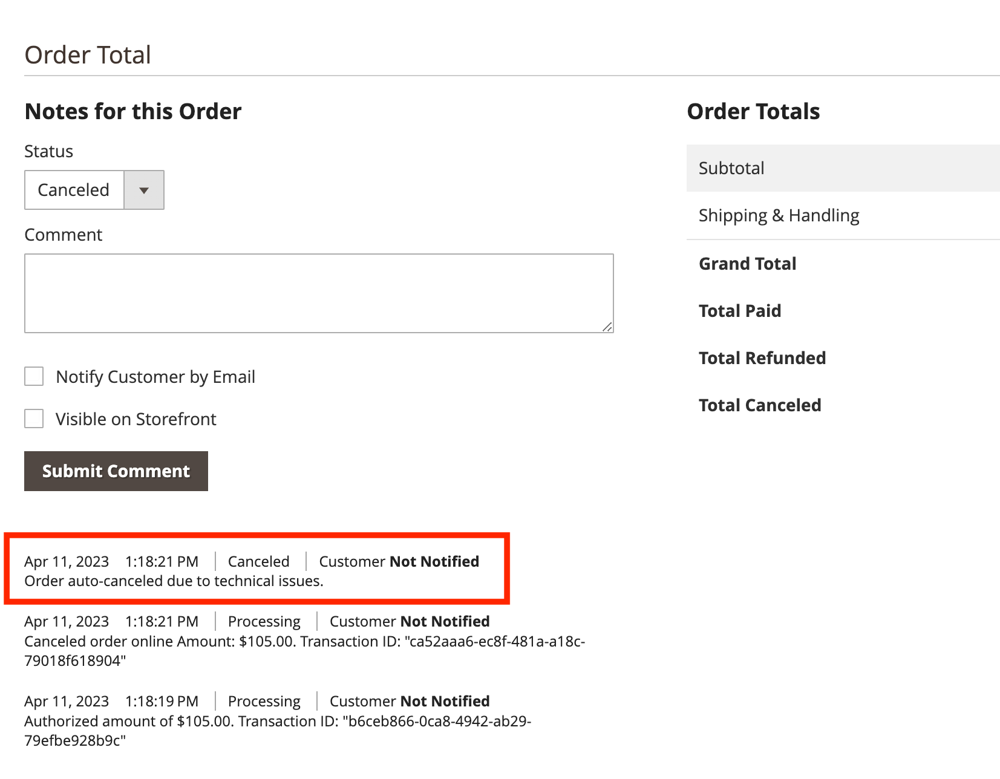

# [!DNL Payment Services]에서 체크아웃

쇼핑객에게 가장 적합한 Adobe Commerce [!DNL Payment Services]에 대한 체크아웃을 구성할 수 있습니다. [주문 자동 무효화](#order-auto-voided-if-error) 및 [신용 카드 보관](#credit-card-vaulting)과 같은 기능을 통해 쇼핑객이 원활한 사용자 경험을 할 수 있습니다.

## 오류 발생 시 자동 무효화된 주문

체크아웃 중에 오류가 발생하면 [!DNL Payment Services]에서 자동으로 주문을 보이드/취소합니다.

구매자의 체크아웃 페이지에 오류 메시지가 표시됩니다. 메시지는 다를 수 있습니다.

{width="600" zoomable="yes"}

취소된 주문과 관련된 댓글도 특정 [주문](https://experienceleague.adobe.com/docs/commerce-admin/stores-sales/order-management/orders/orders.html?lang=ko)의 관리자에 표시됩니다.

{width="600" zoomable="yes"}

구매자가 주문에 대한 인증을 받았지만 주문이 만들어지지 않고 `Capture`(으)로 변환된 경우 주문이 자동 무효화됩니다. 이 프로세스는 구매자의 신용 카드에 크레딧이 예약되지 않도록 하며 표준 29일 기간이 끝날 때 승인이 무효화될 때 발생하는 결제 제공업체 수수료를 방지합니다.

>[!NOTE]
>
>주문 자동 무효화는 고객이 `Authorize and Capture` 모드가 아닌 `Authorize` 모드로 설정된 결제 방법을 사용하는 경우에만 발생합니다.

## 제품 페이지에서 체크아웃

고객이 제품 페이지에서 직접 체크아웃할 때 PayPal 또는 [!DNL Pay Later] 단추를 사용하면 현재 제품 페이지에 표시된 항목만 구입됩니다. 고객의 장바구니에 이미 있는 항목은 체크아웃 플로우에 추가되지 않으며 구매되지 않습니다.

이 기능을 사용하면 고객은 이전에 장바구니에 추가한 항목을 그대로 유지하면서 현재 보고 있는 항목을 빠르게 구매할 수 있습니다.
고객이 주문을 취소하면 현재 제품 페이지의 항목이 고객의 장바구니에 추가됩니다.

고객이 제품 페이지에서 체크아웃 플로우를 입력하면 체크아웃 페이지가 간소화되며 보기에는 주문 관련 데이터와 옵션만 표시됩니다.

## 신용 카드 보관

구매자는 웹 사이트 수준(동일한 가맹점 계정 내 모든 매장)에서 향후 구매를 위해 신용 카드 정보를 저장(저장)할 수 있습니다.

자세한 내용은 [신용 카드 보관](vaulting.md)을 참조하세요.
