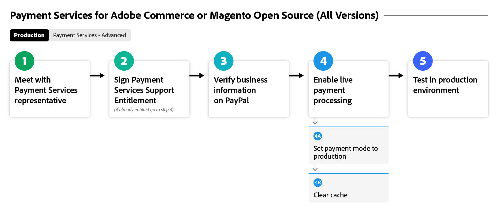

# [!DNL Payment Services] 흐름 온보딩

[!DNL Payment Services] 사용을 시작하려면 몇 가지 온보딩 단계를 완료해야 합니다. 정확한 지침을 위해 조직의 인스턴스 및 버전에 가장 적합한 아래 Adobe Commerce 옵션을 선택하십시오.

이 흐름 다이어그램은 모든 버전에서 [!DNL Payment Services] 온보딩에 대한 일반 프로세스를 보여 줍니다.

{width="700" zoomable="yes"}

[!DNL Payment Services]을(를) 사용하여 온보딩할 특정 Adobe Commerce 버전에 대해서는 아래를 참조하십시오.

## 내 인스턴스 및 버전 찾기 지원

### Adobe Commerce 또는 Magento Open Source | v2.4.7+

이 흐름 다이어그램은 v2.4.7 이상의 Adobe Commerce 또는 Magento Open Source을 사용하여 [!DNL Payment Services]을(를) 온보딩하는 일반적인 프로세스를 보여 줍니다.

>[!BEGINTABS]

>[!TAB 샌드박스]

이 흐름 다이어그램은 v2.4.7보다 최신 Adobe Commerce 또는 Magento Open Source을 사용한 온보딩 샌드박스 프로세스를 보여 줍니다. 여기서 [!DNL Payment Services]은(는) Adobe Commerce을 사용하여 즉시 사용할 수 있습니다.

{width="700" zoomable="yes"}

**버전 v2.4.7에 대한 온보딩 단계+ 1부: 샌드박스**

1. Commerce 서비스에 [인스턴스 연결](connect.md#configure-commerce-services). 이 연결은 Commerce 인스턴스당 한 번만 완료되어야 합니다. [!BADGE PaaS만]{type=Informative tooltip="Adobe Commerce on Cloud 프로젝트에만 적용됩니다(Adobe 관리 PaaS 인프라)."}
1. [PayPal 결제 처리 계정을 사용하여 샌드박스 서비스를 설정](sandbox.md#enable-sandbox-testing)(또는 다른 환경에서 기능을 테스트한 경우 [실시간 결제 활성화](sandbox.md#enable-live-payments))합니다.
1. [샌드박스](sandbox.md#test-in-sandbox-environment) 환경에서 결제를 테스트합니다.

>[!TAB 프로덕션]

이 흐름 다이어그램은 [!DNL Payment Services]을(를) 사용하도록 설정하는 데 필요한 프로덕션 단계를 보여 줍니다.

{width="700" zoomable="yes"}

**버전 v2.4.7에 대한 온보딩 단계+ 2부: 프로덕션**

1. 샌드박스 모드에서 테스트 결제 처리를 시작하려면 [결제 방법으로  [!DNL Payment Services] 설정](production.md#set-payment-services-as-payment-method)합니다.
1. [결제 권한을 요청](production.md#request-payments-entitlement-from-adobe)하여 실시간 온보딩을 사용하도록 설정하십시오.
1. [판매자 온보딩 완료](production.md#complete-merchant-onboarding)를 통해 Commerce 웹 사이트에 대한 실시간 결제를 사용할 수 있습니다.
1. [판매자 ID를  [!DNL Payment Services] 받은 후](production.md#configure-pricing-tier)영업팀에 제출하여 올바른 가격 책정 계층을 구성하세요.
1. [실시간 결제 처리를 시작하려면 [!DNL Payment Services] 실시간 모드에서 사용](production.md#enable-live-payments)하세요.
1. [샌드박스](sandbox.md#test-in-sandbox-environment) 및 [프로덕션](production.md#test-in-production) 환경 모두에서 결제를 테스트합니다.

>[!ENDTABS]

### Adobe Commerce 또는 Magento Open Source | v2.4.0-2.4.6 [!BADGE PaaS만 해당]{type=Informative tooltip="Adobe Commerce on Cloud 프로젝트에만 적용됩니다(Adobe 관리 PaaS 인프라)."}

이 흐름 다이어그램은 Adobe Commerce 또는 Magento Open Source 버전 2.4.0에서 2.4.6으로 [!DNL Payment Services]을(를) 온보딩하는 일반 프로세스를 보여 줍니다. 온보딩을 시작하려면 [!DNL Payment Services]을(를) 다운로드하여 설치해야 합니다.

>[!BEGINTABS]

>[!TAB 샌드박스]

이 흐름 다이어그램은 Adobe Commerce 또는 Magento Open Source 버전 2.4.0에서 2.4.6으로 [!DNL Payment Services]을(를) 온보딩하는 데 필요한 샌드박스 단계를 보여 줍니다.

{width="700" zoomable="yes"}

**버전 v2.4.0-2.4.6의 온보딩 단계 1부: 샌드박스**

1. 필요한 경우 [확장 [!DNL Payment Services] 설치](install.md#get-payment-services)하세요.
1. [API 자격 증명 가져오기](connect.md#obtain-api-credentials).
1. Commerce 서비스에 [인스턴스 연결](connect.md#configure-commerce-services). 이 연결은 Commerce 인스턴스당 한 번만 완료되어야 합니다.
1. [PayPal 결제 처리 계정을 사용하여 샌드박스 서비스를 설정](sandbox.md#enable-sandbox-testing)(또는 다른 환경에서 기능을 테스트한 경우 [실시간 결제 활성화](sandbox.md#enable-live-payments))합니다.
1. [샌드박스](sandbox.md#test-in-sandbox-environment) 환경에서 결제를 테스트합니다.

>[!TAB 프로덕션]

이 흐름 다이어그램은 Adobe Commerce 또는 Magento Open Source 버전 2.4.0부터 2.4.6까지의 프로덕션 환경에서 [!DNL Payment Services]을(를) 활성화하는 일반적인 프로세스를 보여 줍니다.

{width="700" zoomable="yes"}

**버전 v2.4.0-2.4.6의 온보딩 단계 2부: 프로덕션**

1. 샌드박스 모드에서 테스트 결제 처리를 시작하려면 [결제 방법으로  [!DNL Payment Services] 설정](production.md#set-payment-services-as-payment-method)합니다.
1. [결제 권한을 요청](production.md#request-payments-entitlement-from-adobe)하여 실시간 온보딩을 사용하도록 설정하십시오.
1. [판매자 온보딩 완료](production.md#complete-merchant-onboarding)를 통해 Commerce 웹 사이트에 대한 실시간 결제를 사용할 수 있습니다.
1. [판매자 ID를  [!DNL Payment Services] 받은 후](production.md#configure-pricing-tier)영업팀에 제출하여 올바른 가격 책정 계층을 구성하세요.
1. [실시간 결제 처리를 시작하려면 [!DNL Payment Services] 실시간 모드에서 사용](production.md#enable-live-payments)하세요.
1. [샌드박스](sandbox.md#test-in-sandbox-environment) 및 [프로덕션](production.md#test-in-production) 환경 모두에서 결제를 테스트합니다.

>[!ENDTABS]

>[!NOTE]
>
>관리자(1부)에서 Commerce 서비스를 구성하지 않으면 샌드박스 또는 라이브 결제를 설정할 수 없습니다.

>[!MORELIKETHIS]
>
> * [문제 해결 [!DNL Payment Services] 설치](https://experienceleague.adobe.com/docs/commerce-knowledge-base/kb/troubleshooting/payments/payservices-install.html?lang=ko)
> * [PayPal 샌드박스 계정이 확인되지 않음](https://experienceleague.adobe.com/docs/commerce-knowledge-base/kb/troubleshooting/payments/payservices-paypal-acct.html?lang=ko)
> * [지연 [!DNL Payment Services] 보고서 데이터](https://experienceleague.adobe.com/docs/commerce-knowledge-base/kb/troubleshooting/payments/payservices-report-info-delayed.html?lang=ko)
> * [샌드박스 환경에서 결제를 처리할 때 PayPal로 신용 카드 테스트 실패](https://experienceleague.adobe.com/docs/commerce-knowledge-base/kb/troubleshooting/payments/payservices-cc-sandbox-failure.html?lang=ko)