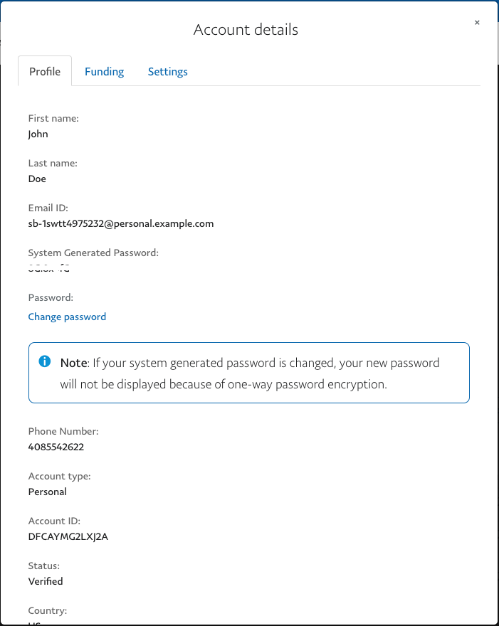
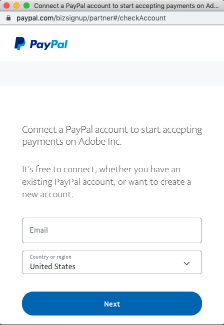

# 테스트 샌드박스 설정

샌드박스 온보딩을 시작하기 전에 무료 PayPal 개발자 계정에 등록하고 판매자(온보딩에 사용) 및 구매자 계정(체크아웃 테스트에 사용)을 모두 만들어야 합니다. 원하는 경우 여러 개발자 계정을 만들 수 있습니다.

PayPal 샌드박스 계정을 사용하면 테스트 모드에서 [!DNL Payment Services]을(를) 사용할 수 있습니다. PayPal을 사용하려면 샌드박스 온보딩을 위해 PayPal 개발자 포털에서 생성한 Business 샌드박스 테스트 계정, 이메일 및 암호를 사용해야 합니다. *샌드박스 온보딩 프로세스 중에 다른 계정을 만들지 마십시오.*

## 샌드박스 온보딩

샌드박스 온보딩을 완료하려면

1. [PayPal 개발자 계정 페이지](https://developer.paypal.com/developer/accounts/)&#x200B;(으)로 이동합니다.
1. **[!UICONTROL Log in to Dashboard]**&#x200B;을(를) 클릭하고 기존 PayPal 개발자 포털에서 생성한 Business 샌드박스 테스트 계정으로 로그인하거나 **등록**&#x200B;을 클릭하여 계정을 만듭니다.
1. PayPal 샌드박스 계정을 만듭니다.
   1. _[!UICONTROL Testing Tools]_>**[!UICONTROL Sandbox Accounts]**(으)로 이동합니다.
   1. **[!UICONTROL Create account]**&#x200B;을(를) 클릭합니다.

      샌드박스 PayPal 온보딩 프로세스 중에 PayPal 샌드박스 계정을 만든 경우 [온보딩 샌드박스를 재설정](#reset-your-sandbox-account)해야 합니다. 그렇지 않으면 이메일을 확인할 수 없습니다.

   1. **[!UICONTROL Business]**&#x200B;을(를) 계정 유형으로 선택하고 **[!UICONTROL Create]**&#x200B;을(를) 클릭합니다.
   1. _[!UICONTROL Sandbox Accounts]_&#x200B;섹션에서 만든 샌드박스 계정에 대한&#x200B;_[!UICONTROL Manage accounts]_ 열의 세 점을 클릭합니다.
   1. **[!UICONTROL View/edit account]**&#x200B;을(를) 클릭합니다.

      {width="300" zoomable="yes"}

   1. 나중에 사용할 수 있도록 이메일 ID 및 시스템 생성 암호를 복사하여 저장합니다.

1. _관리자_ 사이드바에서 **[!UICONTROL Sales]** > **[!UICONTROL Payment Services]**(으)로 이동합니다.
1. **[!UICONTROL Sandbox onboarding]**&#x200B;을(를) 클릭합니다.

   [!DNL Payment Services]에 대한 샌드박스 온보딩을 아직 완료하지 않은 경우 이 옵션이 표시됩니다.

   샌드박스 판매자 ID가 자동으로 생성되고 [설정](configure-admin.md)에 채워집니다. 이 ID를 변경하거나 변경하지 마십시오.

   결제 수락을 시작하기 위해 PayPal 계정을 연결할 수 있는 PayPal 창이 나타납니다.

1. 3단계에서 생성한 PayPal 샌드박스 계정의 이메일 및 암호(PayPal 비즈니스 계정 정보가 아님)와 국가 또는 지역을 입력합니다.
1. **[!UICONTROL Next]**&#x200B;을(를) 클릭합니다.

   {width="300" zoomable="yes"}

1. 이전에 저장한 샌드박스 계정 자격 증명을 사용하여 PayPal 흐름을 계속 따릅니다.
1. _관리자_ 사이드바에서 **[!UICONTROL Sales]** > **[!UICONTROL Payment Services]**(으)로 이동합니다.

   **[!UICONTROL Sandbox onboarding]** 단추가 더 이상 표시되지 않고 &quot;샌드박스 결제 보류 중&quot; 텍스트가 표시됩니다.

PayPal 샌드박스 온보딩이 승인되면 결제 시스템이 현재 샌드박스 모드이고 라이브 결제를 처리하지 않는다는 알림이 표시됩니다.

>[!IMPORTANT]
>
>[!DNL Payment Services] 및 [!DNL Adobe Commerce]에 대한 [!DNL Magento Open Source]&#x200B;(PayPal 계정 설정에서) 결제 처리에 대한 동의를 취소하는 경우 [!DNL Payment Services]이(가) 스토어의 주문을 처리할 수 없습니다. 결제 서비스 홈에서 해지된 동의에 대한 경고가 나타납니다. 경고를 무시하려면 **[!UICONTROL Do not show again]**&#x200B;을(를) 클릭하십시오.

### 샌드박스 계정 재설정

샌드박스 PayPal 온보딩 프로세스 중에 PayPal 샌드박스 계정을 만든 경우, 이메일을 확인할 수 없거나 이메일을 확인할 수 없기 때문에 온보딩 샌드박스를 재설정해야 합니다.

샌드박스 계정을 재설정하려면:

1. **[!UICONTROL Reset sandbox]**&#x200B;을(를) 클릭합니다. [PayPal 비즈니스 샌드박스 계정을 만듭니다](https://developer.paypal.com/docs/api-basics/sandbox/accounts/#create-a-business-sandbox-account).
1. **[!UICONTROL Sandbox onboarding]**&#x200B;을(를) 클릭하고 다음 단계 집합을 완료합니다.

## 연락처 전화 번호 사용

연락처 전화 번호를 사용하면 PayPal이 고객으로부터 수집하는 연락처 전화 번호를 얻을 수 있습니다. PayPal은 항상 PayPal 계정 소유자로부터 연락처 전화 번호를 수집하여 ID를 확인하고 연락하여 계정의 문제를 해결하거나 이행 프로세스를 완료합니다. 하지만 페이팔은 매출에 부정적인 영향을 미칠 수 있기 때문에 가맹점에서 직접 연락처 전화번호를 사용하는 것을 권장하지 않습니다. 자세한 내용은 [PayPal 연락처 전화 번호 가져오기](https://www.sandbox.paypal.com/businessmanage/preferences/website) 설명서를 참조하십시오.

이 기능은 기본적으로 `off`입니다. 이 기능을 활성화하면 고객이 체크아웃 페이지 외부에서 브랜드 체크아웃 플로우를 완료하면 스토어 관리자가 전화번호를 볼 수 있습니다.

>[!IMPORTANT]
>
>이 설정은 다른 체크아웃 플로우에는 적용되지 않습니다.

## 구매자 국가

프로덕션에서 PayPal은 구매자의 지리적 위치를 사용하여 체크아웃 및 익스프레스 플로우에서 사용할 수 있는 결제 방법을 결정합니다. 샌드박스 모드는 지리적 위치를 지원하지 않으므로 **구매자 국가** 구성을 사용하여 구매자의 위치를 시뮬레이션하고 렌더링되는 결제 방법을 제어합니다.

이 설정은 VPN 없이도 Venmo(미국만 해당), Pay Later(미국 및 영국) 또는 [로컬 결제 방법](payments-options.md#local-payment-methods)(유럽)과 같은 지역별 결제 방법을 테스트하는 데 유용합니다.

구매자 국가를 구성하려면

1. _관리자_ 사이드바에서 **[!UICONTROL Stores]** > _[!UICONTROL Settings]_>**[!UICONTROL Configuration]**(으)로 이동합니다.

1. 왼쪽 패널에서 **[!UICONTROL Sales]**&#x200B;을(를) 확장하고 **[!UICONTROL Payment Methods]**&#x200B;을(를) 선택합니다.

1. _[!UICONTROL FEATURED ADOBE PAYMENT SOLUTION]_&#x200B;섹션을 확장합니다.

1. _[!UICONTROL Payment Services]_&#x200B;섹션에서&#x200B;_[!UICONTROL General Configuration]_ 섹션을 확장합니다.

1. **[!UICONTROL Method]**&#x200B;을(를) `Sandbox`(으)로 설정합니다.

1. **[!UICONTROL Buyer's country]** 드롭다운에서 원하는 국가를 선택합니다.

1. 변경 내용을 저장하려면 **[!UICONTROL Save Config]**&#x200B;을(를) 클릭합니다.

>[!NOTE]
>
>**[!UICONTROL Buyer's country]** 설정은 메서드가 `Sandbox`(으)로 설정된 경우에만 나타납니다. 프로덕션 환경에는 영향을 주지 않습니다.

## 샌드박스 환경에서 테스트

이 기능을 쇼핑객에게 노출하기 전에 통합 및 스테이징 환경을 위해 테스트 데이터 소스를 사용하고 실제 신용 카드 및 은행과 함께 프로덕션에서 결제를 테스트하는 것이 좋습니다.

자세한 내용은 [테스트 및 유효성 검사](test-validate.md)를 참조하십시오.
