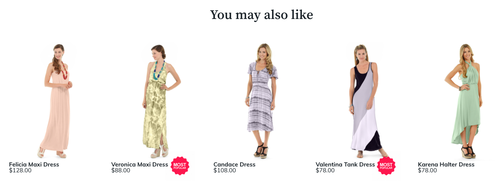

# 사용자 지정

제품 권장 사항 모듈을 설치하면 Adobe Commerce에서 `ProductRecommendationsLayout` 디렉터리를 만듭니다. 이 디렉터리에는 권장 사항이 상점 앞에 표시되는 방식을 변경하기 위해 사용자 지정할 수 있는 템플릿 파일이 포함되어 있습니다. 특히 다음 템플릿을 수정하거나 재정의할 수 있습니다.

`<your theme>/Magento_ProductRecommendationsLayout/web/template/recommendations.html`

템플릿 파일 수정에 대한 자세한 내용은 프론트엔드 개발자 가이드의 [템플릿 사용자 지정](https://developer.adobe.com/commerce/frontend-core/guide/templates/walkthrough/)을 참조하세요.

`recommendations.html` 파일을 수정하는 경우 Adobe Commerce이 상점에서 권장 사항 지표를 수집할 수 있도록 파일에 다음 태그를 유지해야 합니다.

| 태그 | 사용 |
|---|---|
| `<div data-bind="attr : {'data-unit-id' : unitId }"...</div>` | 보기 이벤트를 수집합니다. |
| `<a data-bind="attr : {'data-sku' : sku, 'data-unit-id'}"...</a>` | 클릭 이벤트를 수집합니다. <br/>**참고:** 앵커 태그를 추가하는 경우 이러한 특성을 포함해야 합니다. |

`recommendations.html` 파일 외에 `ProductRecommendationsLayout` 디렉터리에는 다음 하위 디렉터리가 있습니다.

| 디렉토리 | 목적 |
|---|---|
| `layout` | 각 페이지 유형에 대해 `*.xml`개의 파일을 포함합니다. |
| `templates` | 가져오기 및 렌더링 스크립트를 호출하는 파일을 포함합니다. |
| `web/js` | 저장소에 대한 권장 사항을 가져오고 렌더링하는 JavaScript 파일을 포함합니다. |
| `web/template` | `magento/product-recommendations` 모듈에 대한 템플릿을 포함합니다. |

## 추천 단위 위치 지정

권장 사항을 [만들기](create.md)할 때 페이지에 표시되는 [위치](placement.md)를 지정합니다. 추천 단위는 기본 콘텐츠 컨테이너의 상단 또는 하단에 배치할 수 있습니다. 그러나 이 배치를 사용자정의할 수 있습니다. Page Builder 권장 사항 콘텐츠 유형을 만드는 경우, Page Builder 도구를 사용하여 페이지에 권장 사항 단위를 배치합니다. 다른 모든 페이지 유형의 경우 권장 사항을 만들 때 생성된 `*.xml` 파일을 편집하십시오.

1. `layout` 디렉터리로 변경합니다.

   ```bash
   cd `<your theme>/Magento_ProductRecommendationsLayout/layout`
   ```

   다음 표에는 이 디렉토리에 있는 XML 파일이 나열되어 있습니다.

   | 파일 이름 | 페이지 |
   |---|---|
   | `catalog_category_view.xml` | 범주 |
   | `catalog_product_view.xml` | 제품 세부 사항 |
   | `checkout_cart_index.xml` | 장바구니 |
   | `checkout_onepage_success.xml` | 체크아웃 |
   | `cms_index_index.xml` | 홈 |

   >[!NOTE]
   >
   >저장소에서 타사 확장을 사용하는 경우 `layout` 디렉터리의 파일 이름이 다를 수 있습니다.

1. 제품 세부 정보 페이지의 제품 이미지 뒤에 추천 단위가 나타나도록 `catalog_product_view.xml` 파일을 수정하십시오. 이 XML 파일을 사용자 정의하기 전에 파일을 살펴보고 수정해야 하는 섹션을 이해합니다.

   ```xml
   <?xml version="1.0"?>
   <page xmlns:xsi="http://www.w3.org/2001/XMLSchema-instance" xsi:noNamespaceSchemaLocation="urn:magento:framework:View/Layout/etc/page_configuration.xsd">
       <referenceBlock name="page.wrapper">
           <block class="Magento\Framework\View\Element\Template" before="-" name="product_recommendations_fetcher" template="Magento_ProductRecommendationsStorefront::fetcher.phtml" />
       </referenceBlock>
       <body>
           <referenceBlock name="main.content">
               <block class="Magento\ProductRecommendationsStorefront\Block\Renderer" after="-" name="product_recommendations_product_below_content" template="Magento_ProductRecommendationsStorefront::renderer.phtml">
                   <arguments>
                       <argument name="pagePlacement" xsi:type="string">below-main-content</argument>
                   </arguments>
               </block>
           </referenceBlock>
       </body>
   </page>
   ```

   위의 코드 조각에서 `main.content` 참조 블록은 권장 사항 단위가 해당 요소에 상대적인 어딘가에 배치됨을 나타냅니다. 해당 `block` 요소에 기본 콘텐츠 블록 뒤에 페이지에 권장 사항 단위가 표시되도록 지정하는 `after="-"` 특성이 포함되어 있습니다.

1. 다른 콘텐츠 블록을 지정하여 이 파일을 수정하겠습니다.

   참조 블록 `name`을(를) `main.content`에서 `product.info.media`(으)로 변경합니다.

   ```xml
   <?xml version="1.0"?>
   <page xmlns:xsi="http://www.w3.org/2001/XMLSchema-instance" xsi:noNamespaceSchemaLocation="urn:magento:framework:View/Layout/etc/page_configuration.xsd">
       <referenceBlock name="page.wrapper">
           <block class="Magento\Framework\View\Element\Template" before="-" name="product_recommendations_fetcher" template="Magento_ProductRecommendationsStorefront::fetcher.phtml" />
       </referenceBlock>
       <body>
           <referenceBlock name="product.info.media">
               <block class="Magento\ProductRecommendationsStorefront\Block\Renderer" after="-" name="product_recommendations_product_below_content" template="Magento_ProductRecommendationsStorefront::renderer.phtml">
                   <arguments>
                       <argument name="pagePlacement" xsi:type="string">below-main-content</argument>
                   </arguments>
               </block>
           </referenceBlock>
       </body>
   </page>
   ```

   이렇게 변경하면 제품 세부 사항 페이지의 제품 이미지 뒤에 추천 단위가 표시됩니다. 권장 사항 단위를 `product.info.media` 앞에 표시하려면 `after="-"` 특성을 `before="-"`(으)로 변경하십시오. `pagePlacement` 인수는 수정해서는 안 되는 내부 인수입니다.

페이지의 블록 유형에 대한 자세한 내용은 [레이아웃 개요](https://developer.adobe.com/commerce/frontend-core/guide/layouts/)를 참조하세요.

## 사용자 정의 제품 속성

개발자는 종종 이러한 속성에 따라 제품에 시각적 처리를 추가할 수 있도록 상점 첫 화면의 권장 사항 단위에 있는 사용자 지정 제품 속성 값에 액세스해야 합니다.

예를 들어 스토어에서 일부 유기농 제품을 판매하는 경우 해당 제품에 대해 사용자 지정 특성을 `Organic = Yes`(으)로 지정할 수 있습니다. 이러한 제품이 Recommendations에 표시될 때 특별한 시각적 처리를 제공할 수 있도록 상점 첫 화면에서 이 속성 값에 액세스해야 할 수 있습니다. 마찬가지로 이러한 사용자 지정 제품 속성 값에 액세스하면 제품을 배지하거나 사이트의 프레젠테이션 레이어에서 사용자 지정 로직을 실행할 수 있습니다.



페이지에서 권장 사항 단위를 렌더링할 때 사용자 지정 제품 특성을 사용할 수 있도록 하려면 관리자의 [제품 특성](https://experienceleague.adobe.com/docs/commerce-admin/catalog/product-attributes/create/attribute-product-create.html) 페이지에서 `Used in Product Listing` 속성을 `Yes`(으)로 설정하십시오.

이 속성이 설정되면 JSON 페이로드에는 속성 코드와 값의 배열이 포함된 `attributes` 개체가 포함됩니다. 그런 다음 앞에서 언급한 대로 특수 시각적 처리 또는 배지 추가와 같은 이러한 속성 값을 기반으로 사용자 지정 storefront 스타일을 적용할 수 있습니다.

>[!NOTE]
>
>제품 속성 변경 사항이 JSON 페이로드에 표시되는 데 최대 1시간이 걸릴 수 있습니다.
