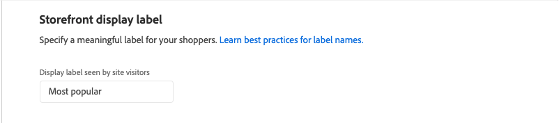

# 권장 사항 편집

권장 사항 편집 페이지에서는 권장 사항을 구성하는 개별 설정을 조정할 수 있습니다. 페이지 유형 및 권장 사항 유형을 제외한 모든 설정을 편집할 수 있습니다. 다음 설정을 편집할 수 있습니다.

- [권장 사항 이름](#name)
- [Storefront 레이블](#label)
- [제품 수](#number)
- [배치 및 위치](#placement)
- [제품 필터링](#filters)

페이지 오른쪽의 미리 보기는 현재 설정을 사용하는 권장 사항이 상점 첫 화면에 표시되는 방식을 보여 줍니다. _권장 제품 미리 보기_&#x200B;는 페이지를 아래로 스크롤할 때 참조할 수 있도록 계속 표시됩니다. 미리 보기에는 반환된 각 제품에 대한 썸네일 제품 이미지, 제품 이름, SKU, 가격 및 결과 유형이 표시됩니다. 결과 유형은 권장 사항을 생성하기에 주 동작 데이터가 충분한지 또는 백업 동작 데이터를 사용하고 있는지 여부를 나타냅니다.

## 권장 사항 편집

1. _관리자_ 사이드바에서 **마케팅** > _프로모션_ > **제품 추천**(으)로 이동합니다.

1. 편집할 권장 사항을 선택합니다.

1. **편집**&#x200B;을 클릭합니다. 그런 다음 아래 지침에 따라 필요한 변경 사항을 적용하십시오.

1. 완료되면 **변경 내용 저장**&#x200B;을 클릭하세요.

### 권장 사항 이름 {#name}

권장 사항의 목적을 나타내는 수사적 이름을 선택합니다. 이 이름은 내부 참조를 위한 것이며 상점 앞에는 나타나지 않습니다.

### Storefront 레이블 {#label}

상점 첫 화면에서 추천 단위에 대한 레이블로 사용할 텍스트를 입력합니다.

### 제품 수 {#number}

슬라이더를 조정하여 권장 사항 단위에 최대 20개의 제품을 표시합니다.

### 배치 및 위치 {#placement}

1. 상점 첫 화면에서 추천 단위가 나타날 페이지 위치를 선택합니다.

   - 기본 컨텐츠 하단
   - 기본 컨텐츠 상단

   

1. 장치에 포함된 권장 사항의 순서를 변경하려면 **이동**  컨트롤을 사용하여 권장 사항을 위치로 끕니다.

   

### 제품 필터링 {#filters}

제품 [필터](filters.md)에 대한 모든 변경 내용은 _권장 제품 미리 보기_&#x200B;에 반영됩니다. 포함 필터와 일치하는 제품만 추천할 수 있습니다. 제외 필터와 일치하는 제품은 사용하지 않는 것이 좋습니다.

_포함_ 및 _제외_ 탭에는 각 유형의 사용 가능한 필터가 나열됩니다. 목록에서 각 활성 필터는 파란색 점으로 표시됩니다.

- 각 필터에 대한 세부 정보를 표시하려면 필터 이름을 클릭합니다.
- 필터 상태를 변경하려면 **필터 사용** 토글을 `on` 또는 `off` 위치로 설정합니다.

필터 설정은 추천 단위에 포함하거나 제외할 제품에 대해 설명합니다. 예를 들어 _범주_ 필터 포함 설정은 선택한 범주의 제품만 포함하도록 시스템에 지시합니다.

